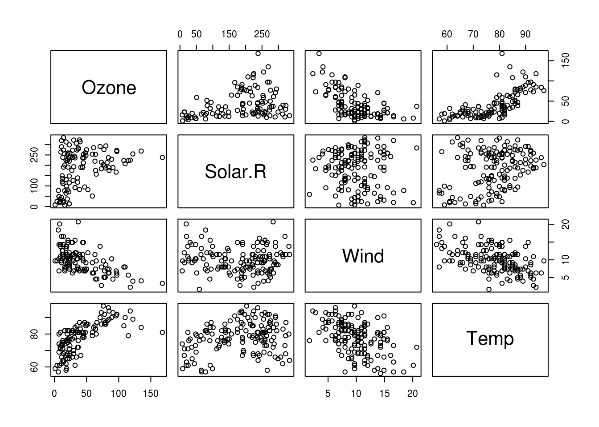
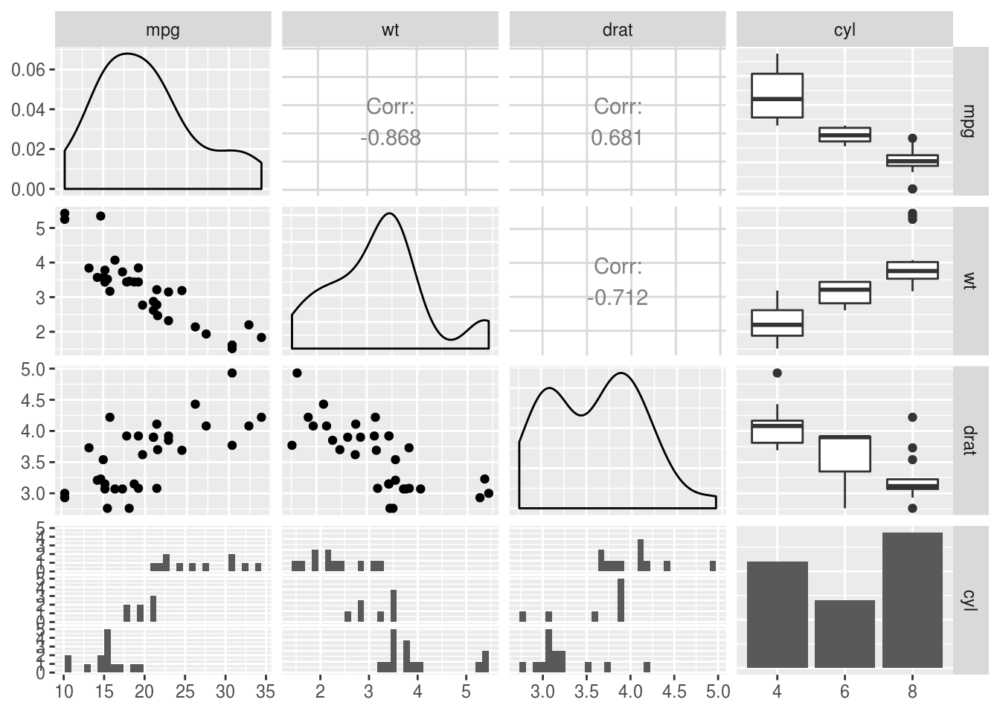

---
title: 'Correlations'
---


## Correlations {- #correlations}

The base R `cor()` function provides a simple way to get Pearson correlations,
but to get a correlation matrix as you might expect from SPSS or Stata it's best
to use the `corr.test()` function in the `psych` package.

Before you start though, plotting the correlations might be the best way of
getting to grips with the patterns of relationship in your data. A pairs plot is
a nice way of doing this:


```r
airquality %>%
  select(-Month, -Day) %>%
  pairs
```



If we were satisfied the relationships were (reasonably) linear, we could also
visualise correlations themselves with a 'corrgram', using the `corrgram`
library:


```r
library("corrgram")
Registered S3 method overwritten by 'seriation':
  method         from 
  reorder.hclust gclus
airquality %>%
  select(-Month, -Day) %>%
  corrgram(lower.panel=corrgram::panel.ellipse,
         upper.panel=panel.cor,
         diag.panel=panel.density)
```

<div class="figure">

<p class="caption">(\#fig:unnamed-chunk-4)A corrgram, showing pearson correlations (above the diagonal), variable distributions (on the diagonal) and ellipses and smoothed lines of best fit (below the diagnonal). Long, narrow ellipses denote large correlations; circular ellipses indicate small correlations.</p>
</div>

The ggpairs function from the `GGally` package is also a nice way of plotting
relationships between a combination of categorical and continuous data - it
packs a lot of information into a limited space:


```r
mtcars %>%
  mutate(cyl = factor(cyl)) %>%
  select(mpg, wt, drat, cyl) %>%
  GGally::ggpairs()
```



### Creating a correlation matrix {- #correlation-matrix}

The `psych::corr.test()` function is a quick way to obtain a pairwise
correlation matrix for an entire dataset, along with p values and confidence
intervals which the base R `cor()` function will not provide:


```r
mycorrelations <- psych::corr.test(airquality)
mycorrelations
Call:psych::corr.test(x = airquality)
Correlation matrix 
        Ozone Solar.R  Wind  Temp Month   Day
Ozone    1.00    0.35 -0.60  0.70  0.16 -0.01
Solar.R  0.35    1.00 -0.06  0.28 -0.08 -0.15
Wind    -0.60   -0.06  1.00 -0.46 -0.18  0.03
Temp     0.70    0.28 -0.46  1.00  0.42 -0.13
Month    0.16   -0.08 -0.18  0.42  1.00 -0.01
Day     -0.01   -0.15  0.03 -0.13 -0.01  1.00
Sample Size 
        Ozone Solar.R Wind Temp Month Day
Ozone     116     111  116  116   116 116
Solar.R   111     146  146  146   146 146
Wind      116     146  153  153   153 153
Temp      116     146  153  153   153 153
Month     116     146  153  153   153 153
Day       116     146  153  153   153 153
Probability values (Entries above the diagonal are adjusted for multiple tests.) 
        Ozone Solar.R Wind Temp Month  Day
Ozone    0.00    0.00 0.00 0.00  0.56 1.00
Solar.R  0.00    0.00 1.00 0.01  1.00 0.56
Wind     0.00    0.50 0.00 0.00  0.25 1.00
Temp     0.00    0.00 0.00 0.00  0.00 0.65
Month    0.08    0.37 0.03 0.00  0.00 1.00
Day      0.89    0.07 0.74 0.11  0.92 0.00

 To see confidence intervals of the correlations, print with the short=FALSE option
```

One thing to be aware of is that by default `corr.test()` produces p values that
are adjusted for multiple comparisons in the top right hand triangle (i.e. above
the diagonal). If you want the uncorrected values use the values below the
diagonal (or pass `adjust=FALSE` when calling the function).

### Working with correlation matrices {-}

It's important to realise that, as with all R objects, we can work with
correlation matrices to continue our data ananalyses.

For example, as part of exploring your data, you might want to know whether
correlations you observe in one sample are similar to those from another sample,
when using the same questions. For example, let's say we ran a survey measuring
variables from the theory of planned behaviour first in students, and later in
older adults:


We could run correlations for each sample separately:


```r
corr.students <- cor(students)
corr.public <- cor(public)
```

And we could 'eyeball' both of these correlation matrices and try and spot
patterns or differences between them, but this is quite hard:


```r
corr.students %>%
  pander()
```


----------------------------------------------------------------------------
     &nbsp;        behaviour   intention   control   social.norm   attitude 
----------------- ----------- ----------- --------- ------------- ----------
  **behaviour**      1.000       0.55       0.648       0.072       0.132   

  **intention**      0.551       1.00       0.394       0.298       0.438   

   **control**       0.648       0.39       1.000       0.017       0.014   

 **social.norm**     0.072       0.30       0.017       1.000       -0.011  

  **attitude**       0.132       0.44       0.014      -0.011       1.000   
----------------------------------------------------------------------------


```r
corr.public %>%
  pander
```


----------------------------------------------------------------------------
     &nbsp;        behaviour   intention   social.norm   attitude   control 
----------------- ----------- ----------- ------------- ---------- ---------
  **behaviour**      1.00        0.54         0.287       0.143      0.23   

  **intention**      0.54        1.00         0.361       0.290      0.37   

 **social.norm**     0.29        0.36         1.000       0.019      -0.08  

  **attitude**       0.14        0.29         0.019       1.000      0.04   

   **control**       0.23        0.37        -0.080       0.040      1.00   
----------------------------------------------------------------------------

But we could also simply _subtract_ one matrix from the other to show the
difference directly:


```r
(corr.students - corr.public) %>%
  pander()
```


----------------------------------------------------------------------------
     &nbsp;        behaviour   intention   control   social.norm   attitude 
----------------- ----------- ----------- --------- ------------- ----------
  **behaviour**      0.000       0.013      0.361      -0.071       -0.093  

  **intention**      0.013       0.000      0.033       0.008       0.067   

   **control**       0.361       0.033      0.000      -0.002       0.093   

 **social.norm**    -0.071       0.008     -0.002       0.000       -0.050  

  **attitude**      -0.093       0.067      0.093      -0.050       0.000   
----------------------------------------------------------------------------

Now it's much more obvious that the behaviour/control correlation differs
between the samples (it's higher in the students).

The point here is not that this is an analysis you are likely to actually report
--- although you might find it useful when exploring the data and interpreting
your findings.

But rather this show that a correlation matrix, in common with the results of
all the statistical tests we run, are themselves _just data points_. We can do
whatever we like with our results — storing them in data frames to display
later, or process as we need.

In reality, if you wanted to test the difference in correlations (slopes) in two
groups for one outcome variable you probably want to use
[multiple regression](#regression), and if you wanted to test a complex model
like the theory of planned behaviour, you might consider [CFA](#cfa) and/or
[SEM](#sem)).

### Tables for publication {- #correlation-tables-for-publication}

#### Using `apaTables` {-}

If you want to produce nice correlation tables for publication the `apaTables`
package might be useful. This block saves an APA formatted correlation table to
an [external Word document like this](Table1_APA.doc).

Note though, that the APA table format does encourage 'star gazing' to some
degree. Try to avoid interpreting correlation tables solely based on the
significance (or not) of the _r_ values. The `pairs` or `corrgram` plots shown
above are a much better summary of the data, and are can be just as compact.


```r
library(apaTables)
apa.cor.table(airquality, filename="Table1_APA.doc", show.conf.interval=F)
The ability to suppress reporting of reporting confidence intervals has been deprecated in this version.
The function argument show.conf.interval will be removed in a later version.


Means, standard deviations, and correlations with confidence intervals
 

  Variable   M      SD    1            2           3           
  1. Ozone   42.13  32.99                                      
                                                               
  2. Solar.R 185.93 90.06 .35**                                
                          [.17, .50]                           
                                                               
  3. Wind    9.96   3.52  -.60**       -.06                    
                          [-.71, -.47] [-.22, .11]             
                                                               
  4. Temp    77.88  9.47  .70**        .28**       -.46**      
                          [.59, .78]   [.12, .42]  [-.57, -.32]
                                                               
  5. Month   6.99   1.42  .16          -.08        -.18*       
                          [-.02, .34]  [-.23, .09] [-.33, -.02]
                                                               
  6. Day     15.80  8.86  -.01         -.15        .03         
                          [-.20, .17]  [-.31, .01] [-.13, .19] 
                                                               
  4           5          
                         
                         
                         
                         
                         
                         
                         
                         
                         
                         
                         
  .42**                  
  [.28, .54]             
                         
  -.13        -.01       
  [-.28, .03] [-.17, .15]
                         

Note. M and SD are used to represent mean and standard deviation, respectively.
Values in square brackets indicate the 95% confidence interval.
The confidence interval is a plausible range of population correlations 
that could have caused the sample correlation (Cumming, 2014).
* indicates p < .05. ** indicates p < .01.
 
```

#### By hand {-}

If you're not bothered about strict APA format, you might still want to extract
_r_ and _p_ values as dataframes which can then be saved to a csv and opened in
Excel, or converted to a table some other way.

You can do this by storing the `corr.test` output in a variable, and the
accessing the `$r` and `$p` values within it.

First, we create the `corr.test` object:


```r
mycorrelations <- psych::corr.test(airquality)
```

Then extract the _r_ values as a table:


```r
mycorrelations$r %>%
  pander()
```


-------------------------------------------------------------------
   &nbsp;      Ozone    Solar.R    Wind    Temp    Month     Day   
------------- -------- --------- -------- ------- -------- --------
  **Ozone**    1.000     0.348    -0.602   0.70    0.165    -0.013 

 **Solar.R**   0.348     1.000    -0.057   0.28    -0.075   -0.150 

  **Wind**     -0.602   -0.057    1.000    -0.46   -0.178   0.027  

  **Temp**     0.698     0.276    -0.458   1.00    0.421    -0.131 

  **Month**    0.165    -0.075    -0.178   0.42    1.000    -0.008 

   **Day**     -0.013   -0.150    0.027    -0.13   -0.008   1.000  
-------------------------------------------------------------------

And we can also extract p values:


```r
mycorrelations$p %>%
  pander()
```


--------------------------------------------------------------
   &nbsp;      Ozone   Solar.R   Wind    Temp    Month   Day  
------------- ------- --------- ------- ------- ------- ------
  **Ozone**    0.000    0.002    0.000   0.000   0.56    1.00 

 **Solar.R**   0.000    0.000    1.000   0.008   1.00    0.56 

  **Wind**     0.000    0.496    0.000   0.000   0.25    1.00 

  **Temp**     0.000    0.001    0.000   0.000   0.00    0.65 

  **Month**    0.078    0.366    0.027   0.000   0.00    1.00 

   **Day**     0.888    0.070    0.739   0.108   0.92    0.00 
--------------------------------------------------------------

Saving as a .csv is the same as for other dataframes:


```r
write.csv(mycorrelations$r, file="airquality-r-values.csv")
```

And can also access the CI for each pariwise correlation as a table:


```r
mycorrelations$ci %>%
  head() %>%
  pander(caption="First 6 rows of the table of CI's for the correlation matrix.")
```


---------------------------------------------------
     &nbsp;        lower      r      upper     p   
----------------- -------- -------- ------- -------
 **Ozone-Slr.R**   0.173    0.348    0.50    0.000 

 **Ozone-Wind**    -0.706   -0.602   -0.47   0.000 

 **Ozone-Temp**    0.591    0.698    0.78    0.000 

 **Ozone-Month**   -0.018   0.165    0.34    0.078 

  **Ozone-Day**    -0.195   -0.013   0.17    0.888 

 **Slr.R-Wind**    -0.217   -0.057   0.11    0.496 
---------------------------------------------------

Table: First 6 rows of the table of CI's for the correlation matrix.

### Other methods for correlation {- #correlation-methods}

By default `corr.test` produces Pearson correlations, but You can pass the
`method` argument `psych::corr.test()`:


```r
psych::corr.test(airquality, method="spearman")
psych::corr.test(airquality, method="kendall")
```
