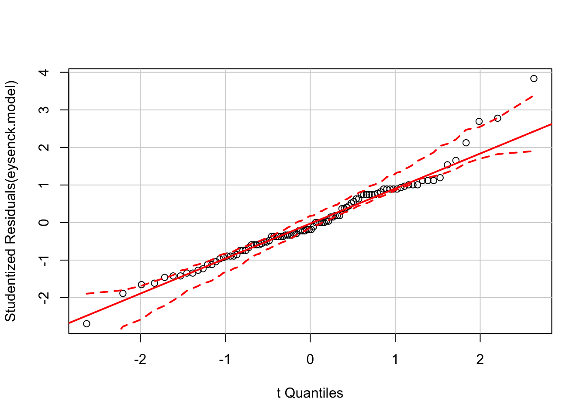

## Anova 'Cookbook' {- #anova-cookbook}

This section is intended as a shortcut to running Anova for a variety of common types of model. If you want to understand more about what you are doing, read the section on [principles of Anova in R](#anova).


### Between-subjects Anova {-}


#### Factorial anova, 2x2 {-}

TODO


#### Factorial anova, where one factor has > 2 levels {-}

We are using a dataset from Howell (REF), chapter 13 which recorded `Recall` among young v.s. older adults (`Age`) for each of 5 conditions.


This data would commonly be plotted something like this:


```r
eysenck <- readRDS("data/eysenck.Rdata")
eysenck %>% 
  ggplot(aes(Condition, Recall, group=Age, color=Age)) + 
  stat_summary(geom="pointrange", fun.data = mean_cl_boot) +
  ylab("Recall (95% CI)") + xlab("")
```


[Visual inspection of the data (see Figure X) suggested that older adults recalled more words than younger adults, and that this difference was greatest for the intention, imagery, and adjective conditions. Recall peformance was worst in the counting and rhyming conditions.]{.apa-example}


Or alternatively if we wanted to provde a better summary of the distribution of the raw data we could use a boxplot:


```r
eysenck %>% 
  ggplot(aes(Age, Recall)) + 
  geom_boxplot(width=.33) + facet_grid(~Condition) +
  ylab("Recall (95% CI)") + xlab("")
```

<div class="figure">

<p class="caption">(\#fig:unnamed-chunk-4)Boxplot for recall in older and young adults, by condition.</p>
</div>


We can run a linear model including the effect of `Age` and `Condition` and the interaction of these variables, and calculate the Anova:


```r
eysenck.model <- lm(Recall~Age*Condition, data=eysenck)
car::Anova(eysenck.model, type=3)
## Anova Table (Type III tests)
## 
## Response: Recall
##               Sum Sq Df F value    Pr(>F)    
## (Intercept)   490.00  1 61.0550  9.85e-12 ***
## Age             1.25  1  0.1558 0.6940313    
## Condition     351.52  4 10.9500  2.80e-07 ***
## Age:Condition 190.30  4  5.9279 0.0002793 ***
## Residuals     722.30 90                      
## ---
## Signif. codes:  0 '***' 0.001 '**' 0.01 '*' 0.05 '.' 0.1 ' ' 1
```


### Repeated measures or 'split plot' designs {-}

It might be controversial to say so, but the tools to run traditional repeat measures Anova in R are a pain to use. It's not easy to run repeated measures Anova models using base packages alone and, although there are numerous packages which do simplify this a little, their syntax can be obtuse or confusing, and the output sometimes cryptic. To make matters worse, various textbooks, online guides and the R help files themselves show many ways to achieve the same ends, and it can be difficult to follow the differences between the underlying models that are run.

At this point, given the [many other advantages of linear mixed models over traditional repeated measures Anova](http://jamanetwork.com/journals/jamapsychiatry/article-abstract/481967), and given that many researchers abuse traditional Anova in practice (e.g. using it for unbalanced data, or where some data are missing), the recommendation here is to simply give up and learn how to run linear mixed models. These can (very closely) replicate traditional Anova approaches, but also:

- Handle missing data or unbalanced designs gracefully and efficiently.

- Be expanded to include multiple levels of nesting. For example, allowing pupils to be nested within classes, within schools. Alternatively multiple measurements of individual patients might be clustered by hospital or therapist.

- Allow time to be treated as a continuous variable. For example, time can be modelled as a slope or some kind of curve, rather than a fixed set of observation-points. This can be more parsimonious, and more flexible when dealing with real-world data (e.g. from clinical trials).

It would be best at this point to [jump straight to the main section multilevel or mixed-effects models](#multilevel-models), but to give one brief example of mixed models in use:


The `sleepstudy` dataset in the `lme4` package provides reaction time data recorded from participants over a period of 10 days, during which time they were deprived of sleep.


```r
lme4::sleepstudy %>% head(12) %>% pandoc.table
## 
## ---------------------------
##  Reaction   Days   Subject 
## ---------- ------ ---------
##   249.6      0       308   
## 
##   258.7      1       308   
## 
##   250.8      2       308   
## 
##   321.4      3       308   
## 
##   356.9      4       308   
## 
##   414.7      5       308   
## 
##   382.2      6       308   
## 
##   290.1      7       308   
## 
##   430.6      8       308   
## 
##   466.4      9       308   
## 
##   222.7      0       309   
## 
##   205.3      1       309   
## ---------------------------
```

We can plot these data to show the increase in RT as sleep deprivation continues:


```r
lme4::sleepstudy %>% 
  ggplot(aes(factor(Days), Reaction)) + 
  geom_boxplot() + 
  xlab("Days") + ylab("RT (ms)") + 
  geom_label(aes(y=400, x=2, label="you start to\nfeel bad here"), color="red") + 
  geom_label(aes(y=450, x=9, label="imagine how bad\nyou feel by this point"), color="red") 
```


If we want to test whether there are significant differences in RTs between `Days`, we could fit something very similar to a traditional repeat measures Anova using the `lme4::lmer()` function, and obtain an Anova table for the model using the special `lmerTest::anova()` function:


```r
sleep.model <- lmer(Reaction ~ factor(Days) + (1 | Subject), data=lme4::sleepstudy)
lmerTest::anova(sleep.model)
## Analysis of Variance Table of type III  with  Satterthwaite 
## approximation for degrees of freedom
##              Sum Sq Mean Sq NumDF DenDF F.value    Pr(>F)    
## factor(Days) 166235   18471     9   153  18.703 < 2.2e-16 ***
## ---
## Signif. codes:  0 '***' 0.001 '**' 0.01 '*' 0.05 '.' 0.1 ' ' 1
```


If you had really wanted to fit the traditional repeated measures Anova, the closest equivalent would be:


```r
afex::aov_car(Reaction ~ Days + Error(Subject/(Days)), data=lme4::sleepstudy)
## Anova Table (Type 3 tests)
## 
## Response: Reaction
##   Effect          df     MSE         F ges p.value
## 1   Days 3.32, 56.46 2676.18 18.70 *** .29  <.0001
## ---
## Signif. codes:  0 '***' 0.001 '**' 0.01 '*' 0.05 '+' 0.1 ' ' 1
## 
## Sphericity correction method: GG
```

This gives almost-identical results. You may find that in other cases the `lmer` and traditional anova models diverge slightly, but this is likely to be caused by factors including imbalances in the data, partially missing data (only complete cases can be analyses by traditional anova) or other violations of the assumptions of one or both of the models. There is no clear steer in the literature as to which model is 'best' in the general sense, and it is likely that the linear model will be a better fit for a greater range of datasets.

See the [multilevel models section](#multilevel-models) for details of more interesting models using this dataset which:

- Fit a simple slope for `Days`
- Fit curves or other functions for `Days`
- Allow the effect of sleep deprivation to vary for different participants


## Checking assumptions {-}


If we want to check assumptions of the Anova are met, these tables and plots would be a reasonable place to start. First running Levene's test:


```r
car::leveneTest(eysenck.model) %>% 
  pandoc.table()
## 
## -----------------------------------
##   &nbsp;     Df   F value   Pr(>F) 
## ----------- ---- --------- --------
##  **group**   9     1.031    0.4217 
## 
##              90     NA        NA   
## -----------------------------------
```


Then a QQ-plot of the model residuals to assess normality:


```r
car::qqPlot(eysenck.model)
```

<div class="figure">

<p class="caption">(\#fig:unnamed-chunk-11)QQ plot to assess normality of model residuals</p>
</div>


And finally a residual-vs-fitted plot:


```r

data_frame(
  fitted = predict(eysenck.model), 
  residual = residuals(eysenck.model)) %>% 
  # and then plot points and a smoothed line
  ggplot(aes(fitted, residual)) + 
    geom_point() + 
    geom_smooth(se=F)
## `geom_smooth()` using method = 'loess'
```

<div class="figure">

<p class="caption">(\#fig:unnamed-chunk-12)Residual vs fitted (spread vs. level) plot to check homogeneity of variance.</p>
</div>


## Post hoc tests {-}

If we want to look at post-hoc pairwise tests we can use the the `lsmeans()` function from the `lsmeans::` package:


```r
lsmeans::lsmeans(eysenck.model, pairwise~Age:Condition)
## $lsmeans
##  Age   Condition lsmean        SE df  lower.CL  upper.CL
##  Young Counting     7.0 0.8958547 90  5.220228  8.779772
##  Older Counting     6.5 0.8958547 90  4.720228  8.279772
##  Young Rhyming      6.9 0.8958547 90  5.120228  8.679772
##  Older Rhyming      7.6 0.8958547 90  5.820228  9.379772
##  Young Adjective   11.0 0.8958547 90  9.220228 12.779772
##  Older Adjective   14.8 0.8958547 90 13.020228 16.579772
##  Young Imagery     13.4 0.8958547 90 11.620228 15.179772
##  Older Imagery     17.6 0.8958547 90 15.820228 19.379772
##  Young Intention   12.0 0.8958547 90 10.220228 13.779772
##  Older Intention   19.3 0.8958547 90 17.520228 21.079772
## 
## Confidence level used: 0.95 
## 
## $contrasts
##  contrast                          estimate      SE df t.ratio p.value
##  Young,Counting - Older,Counting        0.5 1.26693 90   0.395  1.0000
##  Young,Counting - Young,Rhyming         0.1 1.26693 90   0.079  1.0000
##  Young,Counting - Older,Rhyming        -0.6 1.26693 90  -0.474  1.0000
##  Young,Counting - Young,Adjective      -4.0 1.26693 90  -3.157  0.0633
##  Young,Counting - Older,Adjective      -7.8 1.26693 90  -6.157  <.0001
##  Young,Counting - Young,Imagery        -6.4 1.26693 90  -5.052  0.0001
##  Young,Counting - Older,Imagery       -10.6 1.26693 90  -8.367  <.0001
##  Young,Counting - Young,Intention      -5.0 1.26693 90  -3.947  0.0058
##  Young,Counting - Older,Intention     -12.3 1.26693 90  -9.709  <.0001
##  Older,Counting - Young,Rhyming        -0.4 1.26693 90  -0.316  1.0000
##  Older,Counting - Older,Rhyming        -1.1 1.26693 90  -0.868  0.9970
##  Older,Counting - Young,Adjective      -4.5 1.26693 90  -3.552  0.0205
##  Older,Counting - Older,Adjective      -8.3 1.26693 90  -6.551  <.0001
##  Older,Counting - Young,Imagery        -6.9 1.26693 90  -5.446  <.0001
##  Older,Counting - Older,Imagery       -11.1 1.26693 90  -8.761  <.0001
##  Older,Counting - Young,Intention      -5.5 1.26693 90  -4.341  0.0015
##  Older,Counting - Older,Intention     -12.8 1.26693 90 -10.103  <.0001
##  Young,Rhyming - Older,Rhyming         -0.7 1.26693 90  -0.553  0.9999
##  Young,Rhyming - Young,Adjective       -4.1 1.26693 90  -3.236  0.0511
##  Young,Rhyming - Older,Adjective       -7.9 1.26693 90  -6.236  <.0001
##  Young,Rhyming - Young,Imagery         -6.5 1.26693 90  -5.131  0.0001
##  Young,Rhyming - Older,Imagery        -10.7 1.26693 90  -8.446  <.0001
##  Young,Rhyming - Young,Intention       -5.1 1.26693 90  -4.025  0.0044
##  Young,Rhyming - Older,Intention      -12.4 1.26693 90  -9.787  <.0001
##  Older,Rhyming - Young,Adjective       -3.4 1.26693 90  -2.684  0.1963
##  Older,Rhyming - Older,Adjective       -7.2 1.26693 90  -5.683  <.0001
##  Older,Rhyming - Young,Imagery         -5.8 1.26693 90  -4.578  0.0006
##  Older,Rhyming - Older,Imagery        -10.0 1.26693 90  -7.893  <.0001
##  Older,Rhyming - Young,Intention       -4.4 1.26693 90  -3.473  0.0260
##  Older,Rhyming - Older,Intention      -11.7 1.26693 90  -9.235  <.0001
##  Young,Adjective - Older,Adjective     -3.8 1.26693 90  -2.999  0.0950
##  Young,Adjective - Young,Imagery       -2.4 1.26693 90  -1.894  0.6728
##  Young,Adjective - Older,Imagery       -6.6 1.26693 90  -5.209  0.0001
##  Young,Adjective - Young,Intention     -1.0 1.26693 90  -0.789  0.9986
##  Young,Adjective - Older,Intention     -8.3 1.26693 90  -6.551  <.0001
##  Older,Adjective - Young,Imagery        1.4 1.26693 90   1.105  0.9830
##  Older,Adjective - Older,Imagery       -2.8 1.26693 90  -2.210  0.4578
##  Older,Adjective - Young,Intention      2.8 1.26693 90   2.210  0.4578
##  Older,Adjective - Older,Intention     -4.5 1.26693 90  -3.552  0.0205
##  Young,Imagery - Older,Imagery         -4.2 1.26693 90  -3.315  0.0411
##  Young,Imagery - Young,Intention        1.4 1.26693 90   1.105  0.9830
##  Young,Imagery - Older,Intention       -5.9 1.26693 90  -4.657  0.0005
##  Older,Imagery - Young,Intention        5.6 1.26693 90   4.420  0.0011
##  Older,Imagery - Older,Intention       -1.7 1.26693 90  -1.342  0.9409
##  Young,Intention - Older,Intention     -7.3 1.26693 90  -5.762  <.0001
## 
## P value adjustment: tukey method for comparing a family of 10 estimates
```

By default Tukey correction is applied for multiple comparisons which is a reasonable default. If you want to use other methods (e.g. to use false discovery rate adjustment, see the section on [multiple comparisons](#multiple-comparisons)) you can use the `adjust` argument. 

In the code below we request FDR-adjusted p values, and then use the `broom::tidy()` function to convert the table into a dataframe, and then show only the first 6 rows as a table in RMarkdown: 


```r
# calculate pairwise contrasts
eysenck.fdr <- lsmeans::lsmeans(eysenck.model, pairwise~Age:Condition, adjust="fdr")

# show the first 6 rows from this long table
eysenck.fdr$contrasts %>% 
  broom::tidy() %>% 
  head(6) %>% 
  pandoc.table(caption="First 6 rows of the pairwise contrasts with FDR-adjusted p values")
## 
## --------------------------------------------------------------------------------
##     level1         level2       estimate   std.error   df   statistic   p.value 
## -------------- --------------- ---------- ----------- ---- ----------- ---------
## Young,Counting Older,Counting     0.5        1.267     90    0.3947     0.7263  
## 
## Young,Counting  Young,Rhyming     0.1        1.267     90    0.07893    0.9373  
## 
## Young,Counting  Older,Rhyming     -0.6       1.267     90    -0.4736    0.6824  
## 
## Young,Counting Young,Adjective     -4        1.267     90    -3.157    0.003251 
## 
## Young,Counting Older,Adjective    -7.8       1.267     90    -6.157    7.626e-08
## 
## Young,Counting  Young,Imagery     -6.4       1.267     90    -5.052    5.698e-06
## --------------------------------------------------------------------------------
## 
## Table: First 6 rows of the pairwise contrasts with FDR-adjusted p values
```


