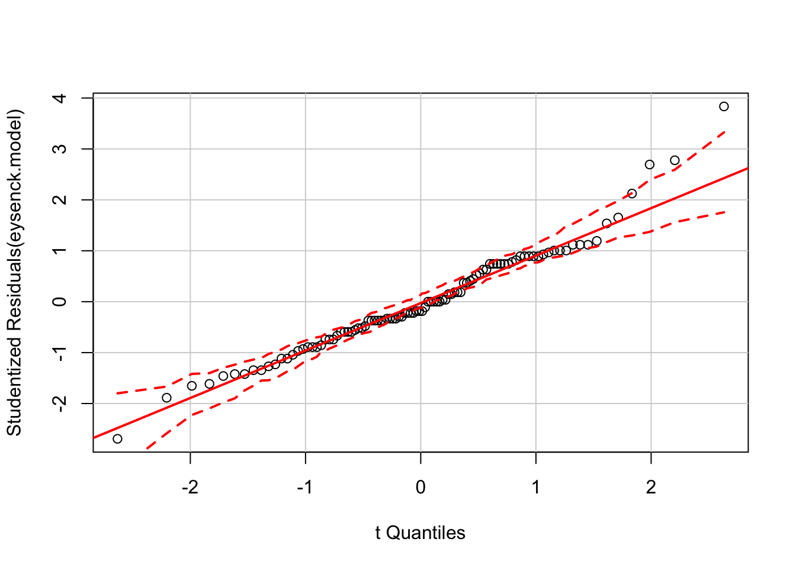

# Anova 

  


[Be sure to read the [section on linear models in R](#linear-models-simple) before you reading this section, and specifically the parts on [specifying models with formulae](#formulae).]{.admonition}

This section attempts to cover in a high level way how to specify anova models in R and some of the issues in interpreting the model output. If you need to revise the basic idea of an Anova, the Howell textbook [@howell2016fundamental]. For a very quick reminder, [this interactive/animated explanation of Anova is helpful](http://web.utah.edu/stat/introstats/anovaflash.html).


If you just want the 'answers' — i.e. the syntax to specify common Anova models -- you could skip to the next section: [Anova cookbook](#anova-cookbook)


There are 4 rules for doing Anova in R and not wanting to cry:

1. Keep your data in 'long' format.
2. Know the differences between character, factor and numeric variables
3. Do not use the `aov()` or `anova()` functions to get an Anova table unless you know what you are doing.
4. Learn about the types of sums of squares and always remember to specify `type=3`, unless you know better.


### Rules for using Anova in R {-}

#### Rule 1: Use long format data {-}

In R, data are almost always most useful a long format where:

- each row of the dataframe corresponds to a single measurement occasion
- each column corresponds to a variable which is measured


For example, in R we will have data like this:


```r
df %>% 
  head %>% 
  pander
```


-------------------------------------
 person   time   predictor   outcome 
-------- ------ ----------- ---------
   1       1         2          7    

   1       2         2         17    

   1       3         2          9    

   2       1         5         16    

   2       2         5          8    

   2       3         5          7    
-------------------------------------


Whereas in SPSS we might have the same data structured like this:


```r
df.wide %>% 
    head %>% 
    pander
```


-----------------------------------------------
 person   predictor   Time 1   Time 2   Time 3 
-------- ----------- -------- -------- --------
   1          2         7        17       9    

   2          5         16       8        7    

   3          6         7        10       7    

   4          4         8        6        9    

   5          2         9        8        12   

   6          3         12       9        13   
-----------------------------------------------


R always uses long form data when running an Anova, but one downside is that it therefore has no automatic to know which rows belong to which person (assuming individual people are the unit of error in your model). This means that for repeated measures designs you need to be careful to explicitly specify any repeated measures when specifying the model (see the section on repeated designs below).


#### Rule 2: Know your variables {-}

See [the section on dataframes](#datasets-dataframes) and be sure you can distinguish:

- Numeric variables
- Factors
- Character strings.


In Anova, you need to enter:

- Numeric variables as your outcome
- Factors or (preferably) character strings as predictors
- (If you want to run Ancova models, you can also add numeric predictors.)


#### Rule 3: Don't use `aov()` or `anova()` {-}

This is the most important rule of all.

The `aov` and `anova` functions have been around in R a long time. For various historical reasons the defaults for these functions won't do what you expect if you are used to SPSS, Stata, SAS, and most other stats packages. These differences are important and will be confusing and give you misleading results unless you understand them.

The recommendation here is:

- If you have a factorial experiment define your model using `lm()` and then use `car::Anova()` to calculate F tests.

- If you have repeated measures, your data are perfectly balanced, and you have no missing values then [use `afex::car_aov()`](#repeated-measures).

- If you want a repeated measures Anova but your data are not balanced, or you have missing data, use [linear mixed models](#multilevel-models) instead via the `lme4::` package.


#### But what about [insert favourite R package for Anova]? {- .explainer}

Lots of people like `ez::ezANOVA` and other similar packages. My problem with `ezANOVA` is that it doesn't use formulae to define the model and for this reason encourages people to think of Anova as something magical and separate from linear models and regression in general. 

This guide is called 'just enough R', so I've chosen to show only `car::Anova` because I find this the most transparent method to explain. Using formulae to specify the model reinforces a technique which is useful in many other contexts.


#### Rule 4: Use type 3 sums of squares (and learn why) {- #sums-squares}

You may be aware, but there are at least 3 different ways of calculating the sums of squares for each factor and interaction in an Anova. In short, 

- SPSS and most other packages use type 3 sums of squares.
- `aov` and `anova` use type 1.
- By default, `car::Anova` and `ez::ezANOVA` use type 2, but can use type 3 if you ask.


This means you must:

- Make sure you use type 3 sums of squares unless you have a reason not to.
- Always pass `type=3` as an argument when running an Anova.


##### {- .explainer}

A longer explanation of *why* you probably want type 3 sums of squares is given in this [online discussion on stats.stackechange.com]( https://stats.stackexchange.com/questions/60362/choice-between-type-i-type-ii-or-type-iii-anova) and practical implications are shown in [this worked example](http://dwoll.de/rexrepos/posts/anovaSStypes.html).

An even longer answer, including a much deeper exploration of the philosophical questions involved is given by @venables1998exegeses. 


### Recommendations for doing Anova {- #anova-recommendations}


1. Make sure to [Plot your raw data *first*](#graphics)

1. Where you have interactions, [be cautious in interpreting the main effects in your model, and always plot the model predictions](#understanding-interactions). 

1. If you find yourself aggregating (averaging) data before running your model, [think about using a mixed or multilevel model](#multilevel-models) instead.

1. If you are using repeated measures Anova, [check if you should should be using a mixed model](#multilevel-models) instead. If you have an unbalanced design or any missing data, you probably should use a mixed model.


## Anova 'Cookbook' {- #anova-cookbook}

This section is intended as a shortcut to running Anova for a variety of common types of model. If you want to understand more about what you are doing, read the section on [principles of Anova in R first](#anova), or consult an introductory text on Anova which covers Anova [e.g. @howell2012statistical].


### Between-subjects Anova {-}


#### Oneway Anova (> 2 groups) {- #oneway-anova}

If your design has more than 2 groups then you should use oneway Anova.

Let's say we asked people to taste 1 of 4 fruit juices, and rate how tasty it was on a scale from 0 to 10:


We can run a oneway Anova with [type 3 sums of squares](#sums-squares) using the `Anova` function from the `car::` package:


```r
juice.lm <- lm(tastiness ~ juice, data=tasty.juice)
juice.anova <- car::Anova(juice.lm, type=3)
juice.anova
## Anova Table (Type III tests)
## 
## Response: tastiness
##             Sum Sq Df  F value    Pr(>F)    
## (Intercept) 615.04  1 114.4793 < 2.2e-16 ***
## juice       128.83  3   7.9932 8.231e-05 ***
## Residuals   515.76 96                       
## ---
## Signif. codes:  0 '***' 0.001 '**' 0.01 '*' 0.05 '.' 0.1 ' ' 1
```

And we could [compute the contasts](#contrasts) for each fruit against the others (the grand mean):


```r
juice.lsm <- lsmeans::lsmeans(juice.lm, pairwise~juice, adjust="fdr")
juice.contrasts <- summary(lsmeans::contrast(juice.lsm, "eff"))
juice.contrasts
##  contrast      estimate        SE df t.ratio p.value
##  Mango effect      0.25 0.4014661 96   0.623  0.5349
##  Apple effect      1.01 0.4014661 96   2.516  0.0271
##  Orange effect     0.65 0.4014661 96   1.619  0.1450
##  Durian effect    -1.91 0.4014661 96  -4.758  <.0001
## 
## P value adjustment: fdr method for 4 tests
```


[We found a significant main effect of juice, _F_(3, 96) = 7.99, _p_ < .001. Followup tests (adjusted for false discovery rate) indicated that only Durian differed from the other juices, and was rated a significantly less tasty Mango, Apple, and Orange juice, _B_ = -1.91 (0.40), _t_ = -4.76, _p_ < .001]{.apa-example}


#### Factorial Anova {- #howell-factorial-example}

We are using a [dataset from Howell](http://www.uvm.edu/~dhowell/methods7/DataFiles/Tab13-2.dat) [@howell2012statistical, chapter 13]: an experiment which recorded `Recall` among young v.s. older adults (`Age`) for each of 5 conditions.


These data would commonly be plotted something like this:


```r
eysenck <- readRDS("data/eysenck.Rdata")
eysenck %>% 
  ggplot(aes(Condition, Recall, group=Age, color=Age)) + 
  stat_summary(geom="pointrange", fun.data = mean_cl_boot) +
  ylab("Recall (95% CI)") + 
  xlab("")
```


[Visual inspection of the data (see Figure X) suggested that older adults recalled more words than younger adults, and that this difference was greatest for the intention, imagery, and adjective conditions. Recall peformance was worst in the counting and rhyming conditions.]{.apa-example}


Or alternatively if we wanted to provde a better summary of the distribution of the raw data we could use a boxplot:


```r
eysenck %>% 
  ggplot(aes(Age, Recall)) + 
  geom_boxplot(width=.33) + 
  facet_grid(~Condition) +
  ylab("Recall (95% CI)") + 
  xlab("")
```

<div class="figure">

<p class="caption">(\#fig:unnamed-chunk-10)Boxplot for recall in older and young adults, by condition.</p>
</div>


We can run a linear model including the effect of `Age` and `Condition` and the interaction of these variables, and calculate the Anova:


```r
eysenck.model <- lm(Recall~Age*Condition, data=eysenck)
car::Anova(eysenck.model, type=3)
## Anova Table (Type III tests)
## 
## Response: Recall
##               Sum Sq Df F value    Pr(>F)    
## (Intercept)   490.00  1 61.0550  9.85e-12 ***
## Age             1.25  1  0.1558 0.6940313    
## Condition     351.52  4 10.9500  2.80e-07 ***
## Age:Condition 190.30  4  5.9279 0.0002793 ***
## Residuals     722.30 90                      
## ---
## Signif. codes:  0 '***' 0.001 '**' 0.01 '*' 0.05 '.' 0.1 ' ' 1
```


### Repeated measures or 'split plot' designs {- #repeated-measures}

It might be controversial to say so, but the tools to run traditional repeat measures Anova in R are a bit of a pain to use. Although there are numerous packages simplify the process a little, their syntax can be obtuse or confusing. To make matters worse, various textbooks, online guides and the R help files themselves show many ways to achieve the same ends, and it can be difficult to follow the differences between the underlying models that are run.

At this point, given the [many other advantages of linear mixed models over traditional repeated measures Anova](http://jamanetwork.com/journals/jamapsychiatry/article-abstract/481967), and given that many researchers abuse traditional Anova in practice (e.g. using it for unbalanced data, or where some data are missing), the recommendation here is to simply give up and learn how to run linear mixed models. These can (very closely) replicate traditional Anova approaches, but also:

- Handle missing data or unbalanced designs gracefully and efficiently.

- Be expanded to include multiple levels of nesting. For example, allowing pupils to be nested within classes, within schools. Alternatively multiple measurements of individual patients might be clustered by hospital or therapist.

- Allow time to be treated as a continuous variable. For example, time can be modelled as a slope or some kind of curve, rather than a fixed set of observation-points. This can be more parsimonious, and more flexible when dealing with real-world data (e.g. from clinical trials).

It would be best at this point to [jump straight to the main section multilevel or mixed-effects models](#multilevel-models), but to give one brief example of mixed models in use:


The `sleepstudy` dataset in the `lme4` package provides reaction time data recorded from participants over a period of 10 days, during which time they were deprived of sleep.


```r
lme4::sleepstudy %>% 
  head(12) %>% 
  pander
```


---------------------------
 Reaction   Days   Subject 
---------- ------ ---------
  249.6      0       308   

  258.7      1       308   

  250.8      2       308   

  321.4      3       308   

  356.9      4       308   

  414.7      5       308   

  382.2      6       308   

  290.1      7       308   

  430.6      8       308   

  466.4      9       308   

  222.7      0       309   

  205.3      1       309   
---------------------------

We can plot these data to show the increase in RT as sleep deprivation continues:


```r
lme4::sleepstudy %>% 
  ggplot(aes(factor(Days), Reaction)) + 
  geom_boxplot() + 
  xlab("Days") + ylab("RT (ms)") + 
  geom_label(aes(y=400, x=2, label="you start to\nfeel bad here"), color="red") + 
  geom_label(aes(y=450, x=9, label="imagine how bad\nyou feel by this point"), color="red") 
```


If we want to test whether there are significant differences in RTs between `Days`, we could fit something very similar to a traditional repeat measures Anova using the `lme4::lmer()` function, and obtain an Anova table for the model using the special `lmerTest::anova()` function:


```r
sleep.model <- lmer(Reaction ~ factor(Days) + (1 | Subject), data=lme4::sleepstudy)
lmerTest::anova(sleep.model)
## Analysis of Variance Table of type III  with  Satterthwaite 
## approximation for degrees of freedom
##              Sum Sq Mean Sq NumDF DenDF F.value    Pr(>F)    
## factor(Days) 166235   18471     9   153  18.703 < 2.2e-16 ***
## ---
## Signif. codes:  0 '***' 0.001 '**' 0.01 '*' 0.05 '.' 0.1 ' ' 1
```


### Traditional repeated measures Anova {- #trad-rm-anova}

If you really need to fit the traditional repeated measures Anova (e.g. your supervisor/reviewer has asked you to) then you should use either the `afex::` or `ez::` packages.


Let's say we have an experiment where we record reaction 25 times (`Trial`) before and after (`Time` = {1, 2}) one of 4 experimental manipulations (`Condition` = {1,2,3,4}). You have 12 participants in each condition and no missing data:


```r
expt.data %>% 
  ggplot(aes(Condition, RT)) + 
  geom_boxplot() + 
  facet_wrap(~paste("Time", time))
```


We want to use our repeated measurements before and after the experimental interventions to increase the precision of our estimate of the between-condition differences.

Our first step is to aggregate RTs for the multiple trials, taking the mean across all trials at a particular `time`:


```r
expt.data.agg <- expt.data %>% 
  group_by(Condition, person, time) %>% 
  summarise(RT=mean(RT))

head(expt.data.agg)
## Source: local data frame [6 x 4]
## Groups: Condition, person [3]
## 
##   Condition person   time       RT
##      <fctr> <fctr> <fctr>    <dbl>
## 1         1      1      1 260.8600
## 2         1      1      2 265.6524
## 3         1      2      1 279.1190
## 4         1      2      2 267.0095
## 5         1      3      1 254.3760
## 6         1      3      2 256.4459
```


Because our data are still in long form (we have two rows per person), we have to explicitly tell R that `time` is a within subject factor. Using the `afex::` package we would write:


```r
expt.afex <- afex::aov_car(RT ~ Condition * time + Error(person/time),
                           data=expt.data.agg)
expt.afex$anova_table %>% 
  pander(caption="`afex::aov_car` output.")
```


-------------------------------------------------------------------
       &nbsp;         num Df   den Df   MSE    F    ges    Pr(>F)  
-------------------- -------- -------- ----- ----- ------ ---------
   **Condition**        3        44    158.6 159.4 0.8504 1.193e-23

      **time**          1        44    144.6 11.87 0.114  0.001266 

 **Condition:time**     3        44    144.6 37.79 0.5513 3.073e-12
-------------------------------------------------------------------

Table: `afex::aov_car` output.

Using the `ez::` package we would write:


```r
expt.ez <- ez::ezANOVA(data=expt.data.agg, 
            dv = RT, 
            wid = person,
            within = time,
            between = Condition)

expt.ez$ANOVA %>% 
  pander(caption="`ez::ezANOVA` output.")
```


-----------------------------------------------------------------
&nbsp;      Effect      DFn   DFd    F       p      p<.05   ges  
------- -------------- ----- ----- ----- --------- ------- ------
 **2**    Condition      3    44   159.4 1.193e-23    *    0.8504

 **3**       time        1    44   11.87 0.001266     *    0.114 

 **4**  Condition:time   3    44   37.79 3.073e-12    *    0.5513
-----------------------------------------------------------------

Table: `ez::ezANOVA` output.


[These are the same models: any differences in the output are simply due to rounding.  You should use whichever of  `ez::` and `afex::` you find easiest to understand]{.admonition}

The `ges` column is the generalised eta squared effect-size measure, which is preferable to the partial eta-squared reported by SPSS [@bakeman2005recommended].


### Comparison with a multilevel model {-}

For reference, a broadly equivalent (although not identical) multilevel model would be:


```r
expt.mlm  <- lmer(RT ~ Condition * time + (1|person), 
    data=expt.data.agg) 

anova(expt.mlm) %>% 
    pander()
```


---------------------------------------------------------------------------
       &nbsp;         Sum Sq   Mean Sq   NumDF   DenDF   F.value   Pr(>F)  
-------------------- -------- --------- ------- ------- --------- ---------
   **Condition**      69154     23051      3      44      159.4       0    

      **time**         1716     1716       1      44      11.87   0.001266 

 **Condition:time**   16394     5465       3      44      37.79   3.073e-12
---------------------------------------------------------------------------

Table: Analysis of Variance Table of type III  with  Satterthwaite 

Although with a linear mixed model it would also be posible to analyse the trial-by-trial data.  Let's hypothesise, for example, that subjects in Conditions 2 and 4 experienced a 'practice effect', such that their RTs reduced over multiple trials. If we plot the data, we can see this suspicion may be supported (how conveninent!):


```r
ggplot(expt.data, 
  aes(trial, RT)) + 
  geom_smooth() + 
  facet_wrap(~paste("Condition", Condition))
```


If we wanted to replicate the aggregated RM Anova models shown above we could write:


```r
options(contrasts = c("contr.sum", "contr.poly"))
expt.mlm2 <- lmer(RT ~ Condition * time + (time|person), data=expt.data)
anova(expt.mlm2)
## Analysis of Variance Table of type III  with  Satterthwaite 
## approximation for degrees of freedom
##                 Sum Sq Mean Sq NumDF  DenDF F.value    Pr(>F)    
## Condition      1391631  463877     3 64.082 129.803 < 2.2e-16 ***
## time             32791   32791     1 71.596   9.176   0.00341 ** 
## Condition:time  313212  104404     3 71.596  29.215 1.911e-12 ***
## ---
## Signif. codes:  0 '***' 0.001 '**' 0.01 '*' 0.05 '.' 0.1 ' ' 1
```


But we can now add a continuous predictor for `trial`:


```r
expt.mlm.bytrial <- lmer(RT ~ Condition * time * trial + 
    (time|person), 
    data=expt.data)

anova(expt.mlm.bytrial)
## Analysis of Variance Table of type III  with  Satterthwaite 
## approximation for degrees of freedom
##                      Sum Sq Mean Sq NumDF   DenDF F.value    Pr(>F)    
## Condition            181589   60530     3  591.06 17.3653 8.114e-11 ***
## time                   7744    7744     1  670.24  2.2218   0.13655    
## trial                 81015   81015     1 2339.99 23.2424 1.520e-06 ***
## Condition:time        94032   31344     3  670.24  8.9923 7.612e-06 ***
## Condition:trial      126361   42120     3 2339.99 12.0839 7.557e-08 ***
## time:trial              109     109     1 2339.99  0.0314   0.85943    
## Condition:time:trial  27086    9029     3 2339.99  2.5902   0.05125 .  
## ---
## Signif. codes:  0 '***' 0.001 '**' 0.01 '*' 0.05 '.' 0.1 ' ' 1
```


The significant `Condition:trial` term indicates that there was a difference in the practice effects between the experimental conditions.


#### {- .apa-example}

We found a significant interaction between condition and the linear term for trial number, *F*(3, 2340.18) = 10.83, *p* < .001. We explored this effect by plotting model-estimated reaction times for each group for trials 1 through 25 (see Figure X): participants in condition 2 and 4 exprienced a greater reduction in RTs across trial, suggesting a larger practice effect for these conditions.


#### {-}

See the [multilevel models section](#multilevel-models) for more details, including analyses which allow the effects of interventions to vary between participants (i.e., relaxing the assumption that an intervention will be equally effective for all participants).


#### RM Anova v.s. multilevel models {- .explainer}

- The RM Anova is perhaps more familiar, and may be conventional in your field which can make peer review easier (although in other fields mixed models are now expected where the design warrants it).

- RM Anova requires complete data: any participant with any missing data will be dropped from the analysis. This is problematic where data are expensive to collect, and where data re unlikely to be missing at random, for example in a clinical trial. In these cases RM Anova may be less efficient and more biased than an equivalent multilevel model.

- There is no simple way of calculating effect size measures like eta^2^ from the `lmer` model. This may or may not be a bad thing. @baguley2009standardized, for example, recommends reporting simple (rather than standardised) effect size measures, and is [easily done by making predictions from the model](#predictions-and-margins).


## Checking assumptions {-}

If we want to check assumptions of our Anova models are met, these tables and plots would be a reasonable place to start. First running Levene's test:


```r
car::leveneTest(eysenck.model) %>% 
  pander()
```


-----------------------------------
  &nbsp;     Df   F value   Pr(>F) 
----------- ---- --------- --------
 **group**   9     1.031    0.4217 

             90     NA        NA   
-----------------------------------

Table: Levene's Test for Homogeneity of Variance (center = median)


Then a QQ-plot of the model residuals to assess normality:


```r
car::qqPlot(eysenck.model)
```

<div class="figure">

<p class="caption">(\#fig:unnamed-chunk-27)QQ plot to assess normality of model residuals</p>
</div>


And finally a residual-vs-fitted plot:


```r

data_frame(
  fitted = predict(eysenck.model), 
  residual = residuals(eysenck.model)) %>% 
  # and then plot points and a smoothed line
  ggplot(aes(fitted, residual)) + 
    geom_point() + 
    geom_smooth(se=F)
```

<div class="figure">

<p class="caption">(\#fig:unnamed-chunk-28)Residual vs fitted (spread vs. level) plot to check homogeneity of variance.</p>
</div>


## Followup tests {-}

If we want to look at post-hoc pairwise tests we can use the the `lsmeans()` function from the `lsmeans::` package. By default Tukey correction is applied for multiple comparisons, which is a reasonable default:


```r
lsmeans::lsmeans(eysenck.model, pairwise~Age:Condition)
## $lsmeans
##  Age   Condition lsmean        SE df  lower.CL  upper.CL
##  Young Counting     7.0 0.8958547 90  5.220228  8.779772
##  Older Counting     6.5 0.8958547 90  4.720228  8.279772
##  Young Rhyming      6.9 0.8958547 90  5.120228  8.679772
##  Older Rhyming      7.6 0.8958547 90  5.820228  9.379772
##  Young Adjective   11.0 0.8958547 90  9.220228 12.779772
##  Older Adjective   14.8 0.8958547 90 13.020228 16.579772
##  Young Imagery     13.4 0.8958547 90 11.620228 15.179772
##  Older Imagery     17.6 0.8958547 90 15.820228 19.379772
##  Young Intention   12.0 0.8958547 90 10.220228 13.779772
##  Older Intention   19.3 0.8958547 90 17.520228 21.079772
## 
## Confidence level used: 0.95 
## 
## $contrasts
##  contrast                          estimate      SE df t.ratio p.value
##  Young,Counting - Older,Counting        0.5 1.26693 90   0.395  1.0000
##  Young,Counting - Young,Rhyming         0.1 1.26693 90   0.079  1.0000
##  Young,Counting - Older,Rhyming        -0.6 1.26693 90  -0.474  1.0000
##  Young,Counting - Young,Adjective      -4.0 1.26693 90  -3.157  0.0633
##  Young,Counting - Older,Adjective      -7.8 1.26693 90  -6.157  <.0001
##  Young,Counting - Young,Imagery        -6.4 1.26693 90  -5.052  0.0001
##  Young,Counting - Older,Imagery       -10.6 1.26693 90  -8.367  <.0001
##  Young,Counting - Young,Intention      -5.0 1.26693 90  -3.947  0.0058
##  Young,Counting - Older,Intention     -12.3 1.26693 90  -9.709  <.0001
##  Older,Counting - Young,Rhyming        -0.4 1.26693 90  -0.316  1.0000
##  Older,Counting - Older,Rhyming        -1.1 1.26693 90  -0.868  0.9970
##  Older,Counting - Young,Adjective      -4.5 1.26693 90  -3.552  0.0205
##  Older,Counting - Older,Adjective      -8.3 1.26693 90  -6.551  <.0001
##  Older,Counting - Young,Imagery        -6.9 1.26693 90  -5.446  <.0001
##  Older,Counting - Older,Imagery       -11.1 1.26693 90  -8.761  <.0001
##  Older,Counting - Young,Intention      -5.5 1.26693 90  -4.341  0.0015
##  Older,Counting - Older,Intention     -12.8 1.26693 90 -10.103  <.0001
##  Young,Rhyming - Older,Rhyming         -0.7 1.26693 90  -0.553  0.9999
##  Young,Rhyming - Young,Adjective       -4.1 1.26693 90  -3.236  0.0511
##  Young,Rhyming - Older,Adjective       -7.9 1.26693 90  -6.236  <.0001
##  Young,Rhyming - Young,Imagery         -6.5 1.26693 90  -5.131  0.0001
##  Young,Rhyming - Older,Imagery        -10.7 1.26693 90  -8.446  <.0001
##  Young,Rhyming - Young,Intention       -5.1 1.26693 90  -4.025  0.0044
##  Young,Rhyming - Older,Intention      -12.4 1.26693 90  -9.787  <.0001
##  Older,Rhyming - Young,Adjective       -3.4 1.26693 90  -2.684  0.1963
##  Older,Rhyming - Older,Adjective       -7.2 1.26693 90  -5.683  <.0001
##  Older,Rhyming - Young,Imagery         -5.8 1.26693 90  -4.578  0.0006
##  Older,Rhyming - Older,Imagery        -10.0 1.26693 90  -7.893  <.0001
##  Older,Rhyming - Young,Intention       -4.4 1.26693 90  -3.473  0.0260
##  Older,Rhyming - Older,Intention      -11.7 1.26693 90  -9.235  <.0001
##  Young,Adjective - Older,Adjective     -3.8 1.26693 90  -2.999  0.0950
##  Young,Adjective - Young,Imagery       -2.4 1.26693 90  -1.894  0.6728
##  Young,Adjective - Older,Imagery       -6.6 1.26693 90  -5.209  0.0001
##  Young,Adjective - Young,Intention     -1.0 1.26693 90  -0.789  0.9986
##  Young,Adjective - Older,Intention     -8.3 1.26693 90  -6.551  <.0001
##  Older,Adjective - Young,Imagery        1.4 1.26693 90   1.105  0.9830
##  Older,Adjective - Older,Imagery       -2.8 1.26693 90  -2.210  0.4578
##  Older,Adjective - Young,Intention      2.8 1.26693 90   2.210  0.4578
##  Older,Adjective - Older,Intention     -4.5 1.26693 90  -3.552  0.0205
##  Young,Imagery - Older,Imagery         -4.2 1.26693 90  -3.315  0.0411
##  Young,Imagery - Young,Intention        1.4 1.26693 90   1.105  0.9830
##  Young,Imagery - Older,Intention       -5.9 1.26693 90  -4.657  0.0005
##  Older,Imagery - Young,Intention        5.6 1.26693 90   4.420  0.0011
##  Older,Imagery - Older,Intention       -1.7 1.26693 90  -1.342  0.9409
##  Young,Intention - Older,Intention     -7.3 1.26693 90  -5.762  <.0001
## 
## P value adjustment: tukey method for comparing a family of 10 estimates
```

Both cell means and pairwise contrasts are shown here. There is much more detail on computing pairwise comparisons and other types of contrasts in the section on [multiple comparisons](#multiple-comparisons), including ways to [extract](#extract-contrasts) and present your comparisons in APA format.


