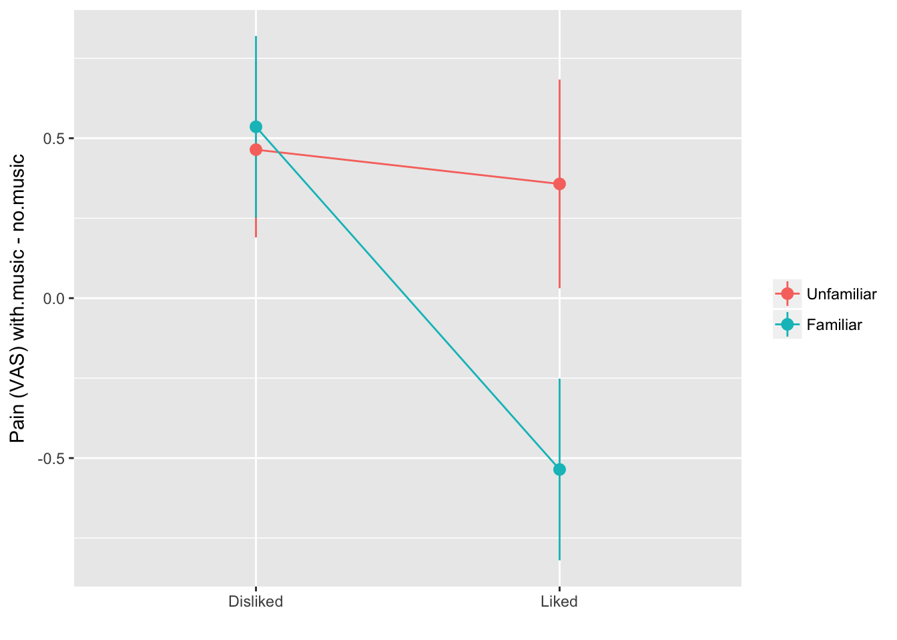
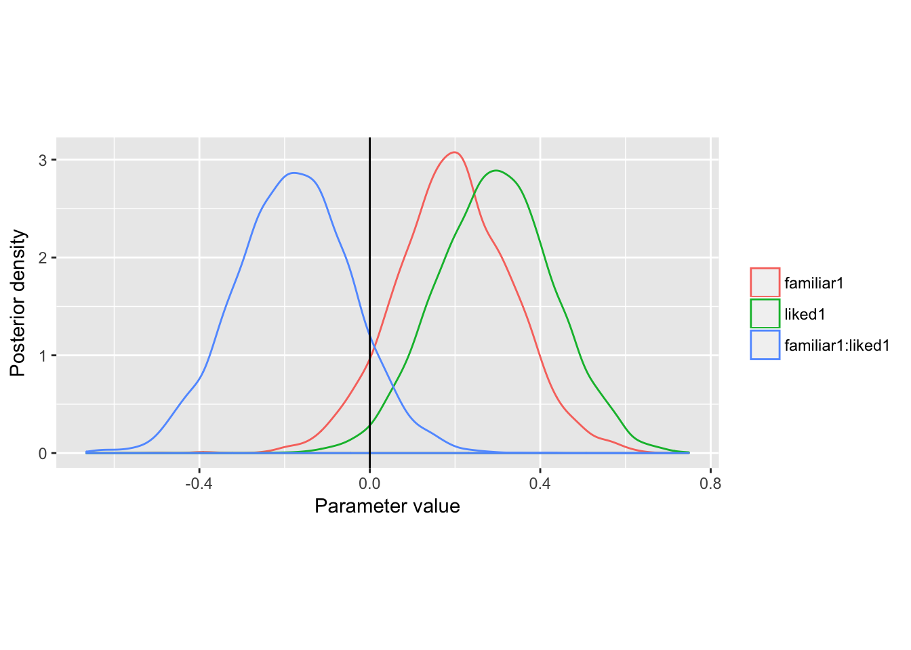

# Baysian linear model fitting with MCMC {#bayes-mcmc}


This is a minimal guide to fitting and interpreting regression and multilevel models via MCMC. For _much_ more detail, and a much more comprehensive introduction to modern Bayesian analysis see [Jon Kruschke's *Doing Bayesian Data Analysis*](http://www.indiana.edu/~kruschke/DoingBayesianDataAnalysis/).


Let's revisit our [previous example which investigated the effect of familiar and liked music on pain perception](#pain-music-data):


```r
painmusic <- readRDS('data/painmusic.RDS')
painmusic %>% 
  ggplot(aes(liked, with.music - no.music, 
             group=familiar, color=familiar)) + 
  stat_summary(geom="pointrange", fun.data=mean_se) + 
  stat_summary(geom="line",  fun.data=mean_se) +
  ylab("Pain (VAS) with.music - no.music") +
  scale_color_discrete(name="") + 
  xlab("") 
```




```r
# set sum contrasts
options(contrasts = c("contr.sum", "contr.poly"))

pain.model <- lm(with.music ~ no.music + familiar*liked , data=painmusic)
summary(pain.model)
## 
## Call:
## lm(formula = with.music ~ no.music + familiar * liked, data = painmusic)
## 
## Residuals:
##     Min      1Q  Median      3Q     Max 
## -3.5397 -1.0123 -0.0048  0.9673  4.8882 
## 
## Coefficients:
##                  Estimate Std. Error t value Pr(>|t|)    
## (Intercept)       1.55899    0.40126   3.885 0.000177 ***
## no.music          0.73588    0.07345  10.019  < 2e-16 ***
## familiar1         0.20536    0.13895   1.478 0.142354    
## liked1            0.30879    0.13900   2.222 0.028423 *  
## familiar1:liked1 -0.18447    0.13983  -1.319 0.189909    
## ---
## Signif. codes:  0 '***' 0.001 '**' 0.01 '*' 0.05 '.' 0.1 ' ' 1
## 
## Residual standard error: 1.47 on 107 degrees of freedom
## Multiple R-squared:  0.5043,	Adjusted R-squared:  0.4858 
## F-statistic: 27.22 on 4 and 107 DF,  p-value: 1.378e-15
```


```r
library(rstanarm)
## Loading required package: Rcpp
## rstanarm (Version 2.15.3, packaged: 2017-04-29 06:18:44 UTC)
## - Do not expect the default priors to remain the same in future rstanarm versions.
## Thus, R scripts should specify priors explicitly, even if they are just the defaults.
## - For execution on a local, multicore CPU with excess RAM we recommend calling
## options(mc.cores = parallel::detectCores())

options(contrasts = c("contr.sum", "contr.poly"))
pain.model.mcmc <- stan_lm(with.music ~ no.music + familiar*liked , data=painmusic, prior=NULL)
## 
## SAMPLING FOR MODEL 'lm' NOW (CHAIN 1).
## 
## Gradient evaluation took 4.9e-05 seconds
## 1000 transitions using 10 leapfrog steps per transition would take 0.49 seconds.
## Adjust your expectations accordingly!
## 
## 
## Iteration:    1 / 2000 [  0%]  (Warmup)
## Iteration:  200 / 2000 [ 10%]  (Warmup)
## Iteration:  400 / 2000 [ 20%]  (Warmup)
## Iteration:  600 / 2000 [ 30%]  (Warmup)
## Iteration:  800 / 2000 [ 40%]  (Warmup)
## Iteration: 1000 / 2000 [ 50%]  (Warmup)
## Iteration: 1001 / 2000 [ 50%]  (Sampling)
## Iteration: 1200 / 2000 [ 60%]  (Sampling)
## Iteration: 1400 / 2000 [ 70%]  (Sampling)
## Iteration: 1600 / 2000 [ 80%]  (Sampling)
## Iteration: 1800 / 2000 [ 90%]  (Sampling)
## Iteration: 2000 / 2000 [100%]  (Sampling)
## 
##  Elapsed Time: 0.177351 seconds (Warm-up)
##                0.193414 seconds (Sampling)
##                0.370765 seconds (Total)
## 
## 
## SAMPLING FOR MODEL 'lm' NOW (CHAIN 2).
## 
## Gradient evaluation took 1.4e-05 seconds
## 1000 transitions using 10 leapfrog steps per transition would take 0.14 seconds.
## Adjust your expectations accordingly!
## 
## 
## Iteration:    1 / 2000 [  0%]  (Warmup)
## Iteration:  200 / 2000 [ 10%]  (Warmup)
## Iteration:  400 / 2000 [ 20%]  (Warmup)
## Iteration:  600 / 2000 [ 30%]  (Warmup)
## Iteration:  800 / 2000 [ 40%]  (Warmup)
## Iteration: 1000 / 2000 [ 50%]  (Warmup)
## Iteration: 1001 / 2000 [ 50%]  (Sampling)
## Iteration: 1200 / 2000 [ 60%]  (Sampling)
## Iteration: 1400 / 2000 [ 70%]  (Sampling)
## Iteration: 1600 / 2000 [ 80%]  (Sampling)
## Iteration: 1800 / 2000 [ 90%]  (Sampling)
## Iteration: 2000 / 2000 [100%]  (Sampling)
## 
##  Elapsed Time: 0.223141 seconds (Warm-up)
##                0.190582 seconds (Sampling)
##                0.413723 seconds (Total)
## 
## 
## SAMPLING FOR MODEL 'lm' NOW (CHAIN 3).
## 
## Gradient evaluation took 1.2e-05 seconds
## 1000 transitions using 10 leapfrog steps per transition would take 0.12 seconds.
## Adjust your expectations accordingly!
## 
## 
## Iteration:    1 / 2000 [  0%]  (Warmup)
## Iteration:  200 / 2000 [ 10%]  (Warmup)
## Iteration:  400 / 2000 [ 20%]  (Warmup)
## Iteration:  600 / 2000 [ 30%]  (Warmup)
## Iteration:  800 / 2000 [ 40%]  (Warmup)
## Iteration: 1000 / 2000 [ 50%]  (Warmup)
## Iteration: 1001 / 2000 [ 50%]  (Sampling)
## Iteration: 1200 / 2000 [ 60%]  (Sampling)
## Iteration: 1400 / 2000 [ 70%]  (Sampling)
## Iteration: 1600 / 2000 [ 80%]  (Sampling)
## Iteration: 1800 / 2000 [ 90%]  (Sampling)
## Iteration: 2000 / 2000 [100%]  (Sampling)
## 
##  Elapsed Time: 0.169626 seconds (Warm-up)
##                0.171959 seconds (Sampling)
##                0.341585 seconds (Total)
## 
## 
## SAMPLING FOR MODEL 'lm' NOW (CHAIN 4).
## 
## Gradient evaluation took 1.3e-05 seconds
## 1000 transitions using 10 leapfrog steps per transition would take 0.13 seconds.
## Adjust your expectations accordingly!
## 
## 
## Iteration:    1 / 2000 [  0%]  (Warmup)
## Iteration:  200 / 2000 [ 10%]  (Warmup)
## Iteration:  400 / 2000 [ 20%]  (Warmup)
## Iteration:  600 / 2000 [ 30%]  (Warmup)
## Iteration:  800 / 2000 [ 40%]  (Warmup)
## Iteration: 1000 / 2000 [ 50%]  (Warmup)
## Iteration: 1001 / 2000 [ 50%]  (Sampling)
## Iteration: 1200 / 2000 [ 60%]  (Sampling)
## Iteration: 1400 / 2000 [ 70%]  (Sampling)
## Iteration: 1600 / 2000 [ 80%]  (Sampling)
## Iteration: 1800 / 2000 [ 90%]  (Sampling)
## Iteration: 2000 / 2000 [100%]  (Sampling)
## 
##  Elapsed Time: 0.190413 seconds (Warm-up)
##                0.187699 seconds (Sampling)
##                0.378112 seconds (Total)
## Warning: There were 3 divergent transitions after warmup. Increasing adapt_delta above 0.95 may help. See
## http://mc-stan.org/misc/warnings.html#divergent-transitions-after-warmup
## Warning: Examine the pairs() plot to diagnose sampling problems
summary(pain.model.mcmc)
## 
## Model Info:
## 
##  function:  stan_lm
##  family:    gaussian [identity]
##  formula:   with.music ~ no.music + familiar * liked
##  algorithm: sampling
##  priors:    see help('prior_summary')
##  sample:    4000 (posterior sample size)
##  num obs:   112
## 
## Estimates:
##                    mean   sd     2.5%   25%    50%    75%    97.5%
## (Intercept)         1.7    0.4    0.9    1.4    1.7    2.0    2.5 
## no.music            0.7    0.1    0.6    0.7    0.7    0.8    0.9 
## familiar1           0.2    0.1   -0.1    0.1    0.2    0.3    0.5 
## liked1              0.3    0.1    0.0    0.2    0.3    0.4    0.6 
## familiar1:liked1   -0.2    0.1   -0.4   -0.3   -0.2   -0.1    0.1 
## sigma               1.5    0.1    1.3    1.4    1.5    1.5    1.7 
## log-fit_ratio       0.0    0.1   -0.1    0.0    0.0    0.0    0.1 
## R2                  0.5    0.1    0.3    0.4    0.5    0.5    0.6 
## mean_PPD            5.3    0.2    4.9    5.2    5.3    5.5    5.7 
## log-posterior    -206.1    2.3 -211.6 -207.4 -205.7 -204.4 -202.6 
## 
## Diagnostics:
##                  mcse Rhat n_eff
## (Intercept)      0.0  1.0  1795 
## no.music         0.0  1.0  1779 
## familiar1        0.0  1.0  3875 
## liked1           0.0  1.0  4000 
## familiar1:liked1 0.0  1.0  3833 
## sigma            0.0  1.0  3480 
## log-fit_ratio    0.0  1.0  2236 
## R2               0.0  1.0  2103 
## mean_PPD         0.0  1.0  4000 
## log-posterior    0.1  1.0   942 
## 
## For each parameter, mcse is Monte Carlo standard error, n_eff is a crude measure of effective sample size, and Rhat is the potential scale reduction factor on split chains (at convergence Rhat=1).
```


### Posterior probabilities for parameters


```r
params.of.interest <- 
  pain.model.mcmc %>% 
  as.data.frame() %>%
  select(familiar1, liked1, `familiar1:liked1`) %>% 
  reshape2::melt() 
## No id variables; using all as measure variables

params.of.interest %>% 
    ggplot(aes(value, color=variable)) + 
    geom_density() + 
    geom_vline(xintercept = 0) +
    scale_color_discrete("") +
    xlab("Parameter value") + 
    ylab("Posterior density") + 
    theme(aspect.ratio = .5)
```




### Credible intervals


```r
get_HPDI <- function(l){
  ci = rethinking::HPDI(l, prob=.95)
  data_frame(median=median(l), lower=ci[1], upper=ci[2])
}


params.of.interest %>% 
  group_by(variable) %>% 
  do(., get_HPDI(.$value)) %>% 
  rename(Estimate=median) %>% 
  pander::pandoc.table(caption="Estimates and 95% credible intervals for the effect of group 2 at months 6 and 12")
## 
## --------------------------------------------------
##     variable      Estimate     lower      upper   
## ---------------- ---------- ----------- ----------
##    familiar1     0.1960585  -0.08546274 0.45610204
## 
##      liked1      0.2953212  0.02752668  0.55668637
## 
## familiar1:liked1 -0.1782482 -0.45246869 0.08223303
## --------------------------------------------------
## 
## Table: Estimates and 95% credible intervals for the effect of group 2 at months 6 and 12
```


### Bayesian 'p values' for parameters


```r
params.of.interest %>% 
  group_by(variable) %>% 
  summarise(`p (x<0)` = mean(value < 0))
## # A tibble: 3 × 2
##           variable `p (x<0)`
##             <fctr>     <dbl>
## 1        familiar1   0.07325
## 2           liked1   0.01550
## 3 familiar1:liked1   0.90500
```


## Bayesian analysis of RCT data {#region-of-practical-importance}

XXX TODO 

- Example from FIT RCT for weight and BMI
- Using and presenting the ROPE


