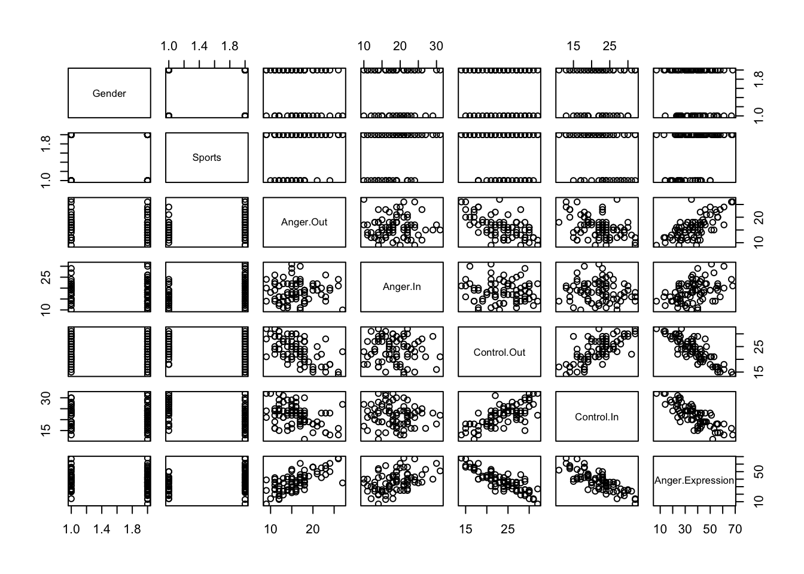

  


# (PART) Working with data {-}


# Datasets and dataframes {#datasets-dataframes}

A dataframe is an object which can store data as you might encounter it in SPSS, Stata, or other statistics packages. 

It's much like a spreadsheet, but with some constraints applied. 
'Constraints' sound bad, but are helpful here: they make dataframes more structured and predictable to work with:

- Each column is a [vector](#vectors-and-lists), and so can [only store one type of data](#vectors-and-lists)].

- Every column has to be the same length (although missing values are allowed).

- Each column should have a name.


Put another way, a dataframe behaves like a *list* of *vectors*, which means we can use a lot of the same rules to [access elements within them](#access-vector-elements) (more on this below).


#### Using 'built in' data {- #built-in-data}


The quickest way to see a dataframe in action is to use one that is [built in to R](https://stat.ethz.ch/R-manual/R-devel/library/datasets/html/00Index.html). For example:


```r
head(airquality)
##   Ozone Solar.R Wind Temp Month Day
## 1    41     190  7.4   67     5   1
## 2    36     118  8.0   72     5   2
## 3    12     149 12.6   74     5   3
## 4    18     313 11.5   62     5   4
## 5    NA      NA 14.3   56     5   5
## 6    28      NA 14.9   66     5   6
```

Or


```r
head(mtcars)
##                    mpg cyl disp  hp drat    wt  qsec vs am gear carb
## Mazda RX4         21.0   6  160 110 3.90 2.620 16.46  0  1    4    4
## Mazda RX4 Wag     21.0   6  160 110 3.90 2.875 17.02  0  1    4    4
## Datsun 710        22.8   4  108  93 3.85 2.320 18.61  1  1    4    1
## Hornet 4 Drive    21.4   6  258 110 3.08 3.215 19.44  1  0    3    1
## Hornet Sportabout 18.7   8  360 175 3.15 3.440 17.02  0  0    3    2
## Valiant           18.1   6  225 105 2.76 3.460 20.22  1  0    3    1
```

In both these examples the datasets (`airquality` and `mtcars`) are already loaded and available to be used in the `head()` function.

[To find a list of all the built in datasets you can type `help(datasets)` or see <https://stat.ethz.ch/R-manual/R-devel/library/datasets/html/00Index.html>. Familiarise yourself with some of the other included datasets, e.g. `datasets::attitude`. Watch out that not all the included datasets are *dataframes*: Some are just vectors of observations (e.g. the `airmiles` data) and some are 'time-series', (e.g. the `co2` data)]{.exercise}


## Looking at data {- #looking-at-data}

As we've already seen, using `print(df)` within an RMarkdown document creates a nice interactive table you can use to look at your data.

However you won't want to print your whole data file when you Knit your RMarkdown document. The `head` function can be useful if you just want to show a few rows:


```r
head(mtcars)
##                    mpg cyl disp  hp drat    wt  qsec vs am gear carb
## Mazda RX4         21.0   6  160 110 3.90 2.620 16.46  0  1    4    4
## Mazda RX4 Wag     21.0   6  160 110 3.90 2.875 17.02  0  1    4    4
## Datsun 710        22.8   4  108  93 3.85 2.320 18.61  1  1    4    1
## Hornet 4 Drive    21.4   6  258 110 3.08 3.215 19.44  1  0    3    1
## Hornet Sportabout 18.7   8  360 175 3.15 3.440 17.02  0  0    3    2
## Valiant           18.1   6  225 105 2.76 3.460 20.22  1  0    3    1
```


Or we can use `glimpse()` function from the `dplyr::` package (see the [section on loading and using packages](#packages)) for a different view of the first few rows of the `mtcars` data. This flips the dataframe so the variables are listed in the first column of the output:


```r
glimpse(mtcars)
## Observations: 32
## Variables: 11
## $ mpg  <dbl> 21.0, 21.0, 22.8, 21.4, 18.7, 18.1, 14.3, 24.4, 22.8, 19....
## $ cyl  <dbl> 6, 6, 4, 6, 8, 6, 8, 4, 4, 6, 6, 8, 8, 8, 8, 8, 8, 4, 4, ...
## $ disp <dbl> 160.0, 160.0, 108.0, 258.0, 360.0, 225.0, 360.0, 146.7, 1...
## $ hp   <dbl> 110, 110, 93, 110, 175, 105, 245, 62, 95, 123, 123, 180, ...
## $ drat <dbl> 3.90, 3.90, 3.85, 3.08, 3.15, 2.76, 3.21, 3.69, 3.92, 3.9...
## $ wt   <dbl> 2.620, 2.875, 2.320, 3.215, 3.440, 3.460, 3.570, 3.190, 3...
## $ qsec <dbl> 16.46, 17.02, 18.61, 19.44, 17.02, 20.22, 15.84, 20.00, 2...
## $ vs   <dbl> 0, 0, 1, 1, 0, 1, 0, 1, 1, 1, 1, 0, 0, 0, 0, 0, 0, 1, 1, ...
## $ am   <dbl> 1, 1, 1, 0, 0, 0, 0, 0, 0, 0, 0, 0, 0, 0, 0, 0, 0, 1, 1, ...
## $ gear <dbl> 4, 4, 4, 3, 3, 3, 3, 4, 4, 4, 4, 3, 3, 3, 3, 3, 3, 4, 4, ...
## $ carb <dbl> 4, 4, 1, 1, 2, 1, 4, 2, 2, 4, 4, 3, 3, 3, 4, 4, 4, 1, 2, ...
```


You can use the `pander()` function (from the `pander::` package) to format tables nicely, for when you Knit a document to HTML, Word or PDF. For example:


```r
library(pander)
pander(head(airquality), caption="Tables always need a caption.")
```


---------------------------------------------
 Ozone   Solar.R   Wind   Temp   Month   Day 
------- --------- ------ ------ ------- -----
  41       190     7.4     67      5      1  

  36       118      8      72      5      2  

  12       149     12.6    74      5      3  

  18       313     11.5    62      5      4  

  NA       NA      14.3    56      5      5  

  28       NA      14.9    66      5      6  
---------------------------------------------

Table: Tables always need a caption.


See the section on [sharing and publishing for more ways to format and present tables](#sharing-and-publication).


Other useful functions for looking at and exploring datasets include:


```r
summary(airquality)
##      Ozone           Solar.R           Wind             Temp      
##  Min.   :  1.00   Min.   :  7.0   Min.   : 1.700   Min.   :56.00  
##  1st Qu.: 18.00   1st Qu.:115.8   1st Qu.: 7.400   1st Qu.:72.00  
##  Median : 31.50   Median :205.0   Median : 9.700   Median :79.00  
##  Mean   : 42.13   Mean   :185.9   Mean   : 9.958   Mean   :77.88  
##  3rd Qu.: 63.25   3rd Qu.:258.8   3rd Qu.:11.500   3rd Qu.:85.00  
##  Max.   :168.00   Max.   :334.0   Max.   :20.700   Max.   :97.00  
##  NA's   :37       NA's   :7                                       
##      Month            Day      
##  Min.   :5.000   Min.   : 1.0  
##  1st Qu.:6.000   1st Qu.: 8.0  
##  Median :7.000   Median :16.0  
##  Mean   :6.993   Mean   :15.8  
##  3rd Qu.:8.000   3rd Qu.:23.0  
##  Max.   :9.000   Max.   :31.0  
## 
```


Or the more compact and useful output from `describe()` which is in the `pysch` package:


```r
# fast = T just skips some of the available stats (e.g. kurtosis)
psych::describe(airquality, fast = T) %>% 
  pander(caption="Summary statistics generated by the `psych::describe()` function.")
```


----------------------------------------------------------------
   &nbsp;      vars   n   mean   sd    min   max   range    se  
------------- ------ --- ------ ----- ----- ----- ------- ------
  **Ozone**     1    116 42.13  32.99   1    168    167   3.063 

 **Solar.R**    2    146 185.9  90.06   7    334    327   7.453 

  **Wind**      3    153 9.958  3.523  1.7  20.7    19    0.2848

  **Temp**      4    153 77.88  9.465  56    97     41    0.7652

  **Month**     5    153 6.993  1.417   5     9      4    0.1145

   **Day**      6    153  15.8  8.865   1    31     30    0.7167
----------------------------------------------------------------

Table: Summary statistics generated by the `psych::describe()` function.


There are also some helpful plotting functions which accept a whole dataframe:


```r
boxplot(airquality)
```

<div class="figure">

<p class="caption">(\#fig:unnamed-chunk-9)Box plot of all variables in a dataset.</p>
</div>


```r
psych::cor.plot(airquality)
```

<div class="figure">

<p class="caption">(\#fig:unnamed-chunk-10)Correlation heatmap of all variables in a dataset. Colours indicate size of the correlation between pairs of variables.</p>
</div>

These plots might not be worth including in a final write-up, but are very useful when exploring your data.


## Importing and exporting data {- #importing-data}

If you have data outside of R, *the simplest way to import it is to first save it as a comma or tab-separated text file*, normally with the file extension `.csv` or `.txt`^[This is easy to achieve in Excel and most other stats packages using the `Save As...` menu item].

Let's say we have file called `angry_moods.csv` in the same directory as our `.Rmd` file. We can read this data using the `read_csv()` function from the `readr` package[^readr]:


[^readr]:
  There are also standard functions built into R, such as `read.csv()` or `read.table()` for importing data. These are fine if you can't install the `readr` package for some reason, but they are quite old and the default behaviour is sometimes counterintuitive. I recommend using the `readr` equivalents: `readr::read_csv()` or `readr::read_tsv()`.


```r
angry.moods <- readr::read_csv('data/angry_moods.csv')
## Parsed with column specification:
## cols(
##   Gender = col_integer(),
##   Sports = col_integer(),
##   Anger.Out = col_integer(),
##   Anger.In = col_integer(),
##   Control.Out = col_integer(),
##   Control.In = col_integer(),
##   Anger.Expression = col_integer()
## )
head(angry.moods)
## # A tibble: 6 × 7
##   Gender Sports Anger.Out Anger.In Control.Out Control.In Anger.Expression
##    <int>  <int>     <int>    <int>       <int>      <int>            <int>
## 1      2      1        18       13          23         20               36
## 2      2      1        14       17          25         24               30
## 3      2      1        13       14          28         28               19
## 4      2      1        17       24          23         23               43
## 5      1      1        16       17          26         28               27
## 6      1      1        16       22          25         23               38
```


As you can see, when loading the `.csv` file the `read_csv()` makes some assumptions about the *type*  of data the file contains. In this case, all the columns contain integer values. It's worth checking this message to make sure that stray cells in the file you are importing don't cause problems when importing. Excel won't complain about this sort of thing, but R is more strict and won't mix text and numbers in the same column.

A common error is for stray notes or text values in a spreadsheet to cause a column which should be numeric to be converted to the `character` type.


Once it's loaded, you can use this new dataset like any other:


```r
pairs(angry.moods)
```




### Importing data over the web {- #importing-data-from-the-web}

One neat feature of the `readr` package is that you can import data from the web, using a URL rather than a filename on your local computer. This can be really helpful when sharing data and code with colleagues. For example, we can load the `angry_moods.csv` file from a URL:


```r
angry.moods.from.url <- readr::read_csv(
  "https://raw.githubusercontent.com/benwhalley/just-enough-r/master/angry_moods.csv")
head(angry.moods.from.url)
```


### Importing from SPSS and other packages {- #importing-proprietary-formats}

This is often more trouble than it's worth (just use a csv file!) but if you really must see <https://www.datacamp.com/community/tutorials/r-data-import-tutorial>.
