  


# Graphics {#graphics}


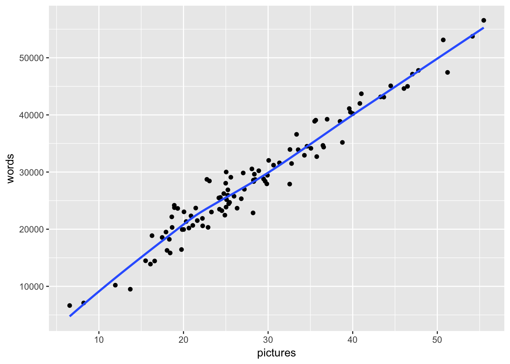


<!-- TODO ADD @matejka2017sameand dino plots -->


Graphics are the best thing about R. The base system alone provides lots of useful plotting functions, but the `ggplot2` package is exceptional in the consistent and powerful approach it takes to visualising data. This chapter focusses mostly on `ggplot`, but does include some pointers to other useful plotting functions.


It's also worth pointing out here that the O'Reilly [R Graphics cookbook is available as a pdf download](https://ase.tufts.edu/bugs/guide/assets/R%20Graphics%20Cookbook.pdf) and is a much more comprehensive source than this page. 

The examples below are more selective and show plots likely to be of particular use in reporting your studies.

The emphaisis on showing you how to make _good_ plots that help you explore data and communicate your findings, rather than simply reproduce the output of SPSS or Excel.


## Benefits of visualising data {- #graphics-benefits}


Scientists attempt to understanding natural processes, predict events in the observable world, and communicate this understanding to others. In each case, graphics are a powerful tool in their armoury.

The doctrine of null hypothesis testing which has infected psychology and many other fields has made some researchers nervous about the power of graphics to explore and find patterns in data: perhaps concerned with the accusation of undertaking a 'fishing trip' or capitalising on chance in ther analyses, too many scientists have eschewed graphical statistics and focussed instead on point estimates and *p* values from complex statistical models.

But as the complexity of theories group, the role of graphics becomes ever more important because the _right_ graphical presentations of our data are in many cases the only reliable way of checking the appropriateness of our models, and of communicating our findings efficiently.

David McCandless recently spoke at a TedX event about his work on data journalism, and makes a persuasive case for paying more attention to visualisations:

<iframe width="560" height="315" src="https://www.youtube-nocookie.com/embed/5Zg-C8AAIGg?rel=0" frameborder="0" allowfullscreen></iframe>


For a fascinating history and exploration of the good, the bad and the ugly in data visualisations you should also (at least) skim Edward Tufte's book [@edward2001visual].


## Which tool to use? {- #graphics-approaches}

Typically when setting out to plot data in R it pays to ask yourself whether you need:

1. A quick way to visualise something specific -- for example to check some feature of your data before you continue your analysis -- without worrying _too_ much about the detail of the graphic.

2. A plot that is specifically designed to communicate your data effectively, and where you do care about the details of the final output.
  
For the first case, where you already know what you want --- for example to visualise a distribution of a single variable or to check diagnostics from a linear model --- there are many useful built-in functions in base-R.

For the second case --- for example where you want to visualise the main outcomes of your study, or draw attention to specific aspects of your data --- there is `ggplot2`. We'll deal with the second case first, because using ggplot highlights many important aspects of plotting in general.


## Layered graphics with `ggplot` {- #layered-graphics}

If you've never given much thought to data visualisation before, you might be surprised at the sheer variety of graphs types available.

One way to cut through the multitude of options is to determine what the purpose of your plot is. Although not a complete list, it's likely your plot will show at least one of:


- Relationships
- Distributions
- Comparison
- Composition


The `ggplot` library makes it easy to produce high quality graphics which serve these ends, and to layer them to produce information-dense plots which are really effective forms of communication.


<div class="figure">

<p class="caption">(\#fig:unnamed-chunk-3)Examples of charts showing comaprisons, relationships, distribution and composition. The comparison, distribution and composition plots show 2 variables, but the relationship plot includes 3, increasing the density of the information displayed. </p>
</div>


### A thought on 'chart chooser' guides {- .explainer}

There are various simple chart selection guides available online, of which these are quite nice examples:

- [Chart selection guide (pdf)](http://extremepresentation.typepad.com/blog/2006/09/choosing_a_good.html)]
- ['Show me the numbers' chart guide (pdf)](https://www.perceptualedge.com/articles/misc/Graph_Selection_Matrix.pdf)


*However*, guides which attempt to be comprehensive and show you a full range of plot types are perhaps not as useful as those which reflect our knowledge of which plots are the most effective forms of communication.

For example, almost all guides to plotting, and especially R textbooks, will show you how to plot a simple bar graph. But bar graphs have numerous disadvantages over other plots which can show the same information. 

Specifically, they: 

- are low in information density (and so inefficient in use of space)

- make comparisons between multiple data series very difficult (for example in [interaction plots](#understanding-interactions)), and

- perhaps most importantly, even when they include error bars, readers consistently misinterpret the quantitative information in bar graphs (specifically, when bar graphs are used to display estimates which contain error, readers assume points above the bar are less likely than points within the bar, even though this is typically not the case).

You should be guided in choosing plots not by mechanical rules based on the number or type of variables you want to display. Instead, you should be guided by the evidence from basic studies of human perception, and applied data on how different types of infromation displays are really used by readers.

This guide is restricted to examples likely to be useful and effective for experiemental and applied psychologists.


### Thinking like `ggplot`  {-}

When using `ggplot` it helps to think of five separate steps to making a plot (2 are optional, but commonly used):

1. Choose the data you want to plot.

2. Map variables to axes or other features of the plot (e.g. sizes or colours).

3. (Optionally) use `ggplot` functions to summarise your data before the plot is drawn (e.g. to calulate means and standard errors for point-range plots).

4. Add visual display layers.

5. (Optionally) Split the plot up across multiple panels using groupings in the data.


You can then customise the plot labels and title, and tweak other presentation parameters, although this often isn't necessary unless sending a graphic for publication. You can also export graphics in multiple high quality formats.


The simplest way to demonstrate these steps is with an example, and we begin with a plot showing the relationship betwen variables:


### 'Relationships' {-}

Problem to be solved: *You want to check/show whether variables are related in a linear fashion, e.g. before running linear regression*

##### Step 1: Select data to plot {-}

Step 1 is to select our data. As is typical in R, `ggplot` works best with long-format data. In the examples below we will use the `mtcars` dataset for convenience, so our first line of code is to use the `dplyr` pipe symbol (operator) to send the `mtcars` dataset to the next line of code:


```r
mtcars %>% 
  ...
```

##### Step 2: Map variables to axes, colours, and other features {-}

Step 2 is to map the variables we want to axes or other features of the plot (e.g. the colours of points, or the linetypes used in line plots).

The specify these mappings we use the `aes()` function, which is slightly cryptic, but short for 'aesthetics mapping'. Depending on the plot type you will specify different aesthetics, and they can also have different effects depending on the plot type, but you will commonly specify:

- `x` the variable to use as the x axis
- `y` the variable to use as the y axis
- `colour`: the variable to use to colour points or lines

Here we tell `ggplot` to use `disp` (engine size) on the x axis, and `mpg` on the y axis. We also tell it to colour the points differently depending on the value of `hp` (engine horsepower). 

At this point `ggplot` will create and label the axes and plot area, but doesn't yet display any of our data. For this we need to add visual display layers (in the next step).
  

```r
mtcars %>% 
  ggplot(aes(x = disp, y = mpg, colour=hp))
```

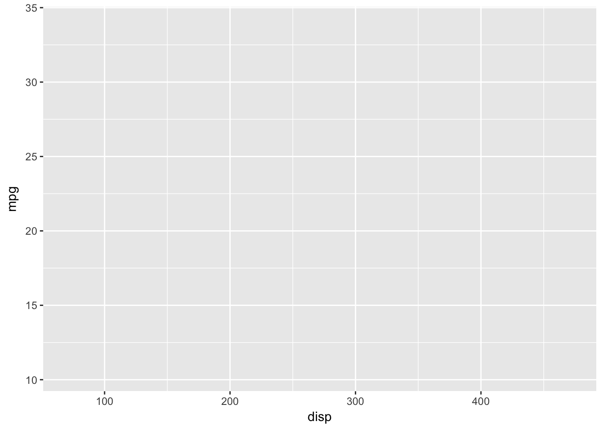


###### Other aesthetics {- #aesthetics .explainer}

There are many other aesthetics which can be specified. Some of the most useful are:

- `ymin` and `ymax`: for upper and lower bounds, e.g. on error bars
- `group`:which tells ggplot to group observations by some variable and, for example, plot a different line per-group)
- `fill`: like `colour` but for areas/shapes
- `alpha` and `size`: control the size and opacity of visual features (useful for de-emphasising some features of a plot to make others stand out)

See the ggplot documentation for more details: <http://ggplot2.tidyverse.org/reference/#section-aesthetics>


##### Step 3 {-}

We skip step 3 for this example (asking ggplot to automatically make summaries of our data before plotting), but will cover it below - see the `stat_summary()` function.


##### Step 4: Display data {-}

To display data, we have to add a visual layer to the plot. For example, let's say we want to make a scatter plot, and so draw points for each row of data:


```r
mtcars %>% 
  ggplot(aes(x = disp, y = mpg, colour=hp)) +
  geom_point()
```

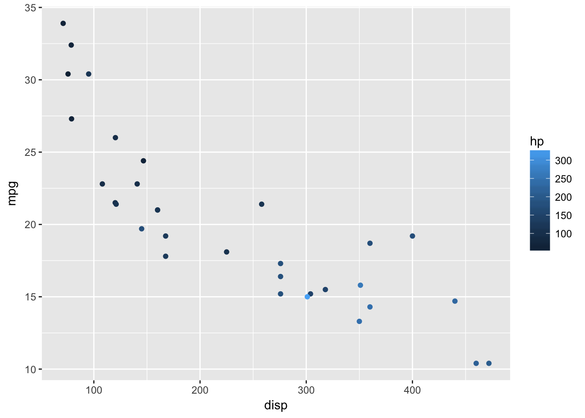


And we have a pretty slick graph: `ggplot` has now added points for each pair of `disp` and `mpg` values, and coloured them according to the value of `hp` (see [choosing colours below](#picking-colours)).

[Use the `airquality` dataset and create your own scatterplot and try to colour the points using the `Month` variable. Should `Month` be used as a factor or a numeric variable when colouring the points?]{.exercise}


What's even neater about `ggplot` though is how easy it is to *layer* different visualisations of the same data. These visual layers are called `geom`'s and the functions which add them are all prefixed with `geom_`, so `geom_point()` for scatter plots, or `geom_line()` for line plots, or `geom_smooth()` for a smoothed line plot. We can add this to the scatter plot like so:


```r
mtcars %>% 
  ggplot(aes(x = disp, y = mpg, colour=hp)) +
  geom_point(size=2) + 
  geom_smooth(se=F, colour="grey") 
```

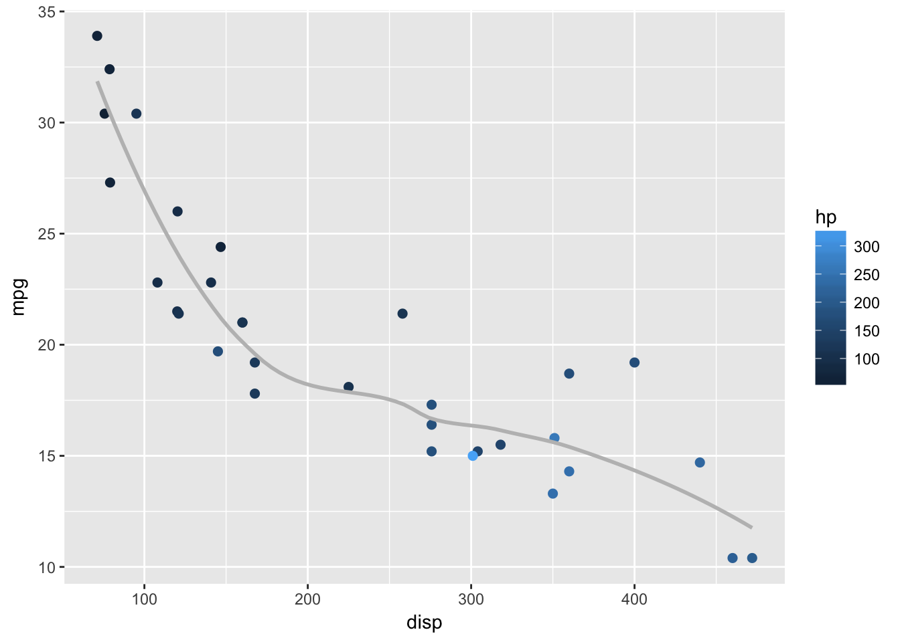


In the example above, I have also customised the smoothed line, making it grey to avoid over-intrusion into our perception of the points. Often less is more when plotting graphs: not everything can be emphasised at once, and *it's important to make decisions about what should be given visual priority*.


##### Step 5: 'Splitting up' or repeating the plot. {-}

Very often, you will have drawn plot and think things like *I wonder what that would look like if I drew it for men and women separately?*. In `ggplot` this is called facetting, and is easy to achieve, provided your data are in a long format. 

Using the same `mtcars` example, let's say we wanted separate panels for American vs. Foreign cars (information held in the `am` variable). We simply add the `facet_wrap()`, and specify the `"am"` variable:


```r
mtcars %>% 
  ggplot(aes(x = disp, y = mpg, colour=hp)) +
  geom_point(size=2) + 
  geom_smooth(se=F, colour="grey") +
  facet_wrap("am")
```


One trick is to make sure factors are labelled nicely, because these labels appear on the final plot. Here the `mutate()` call [relabels the factor](real-data.html#factors-and-numerics) which makes the plot easier to read:


```r
mtcars %>% 
  mutate(american = factor(am, labels=c("American", "Foreign"))) %>% 
  ggplot(aes(x = disp, y = mpg, colour=hp)) +
  geom_point(size=2) + 
  geom_smooth(se=F, colour="grey") +
  facet_wrap("american")
```

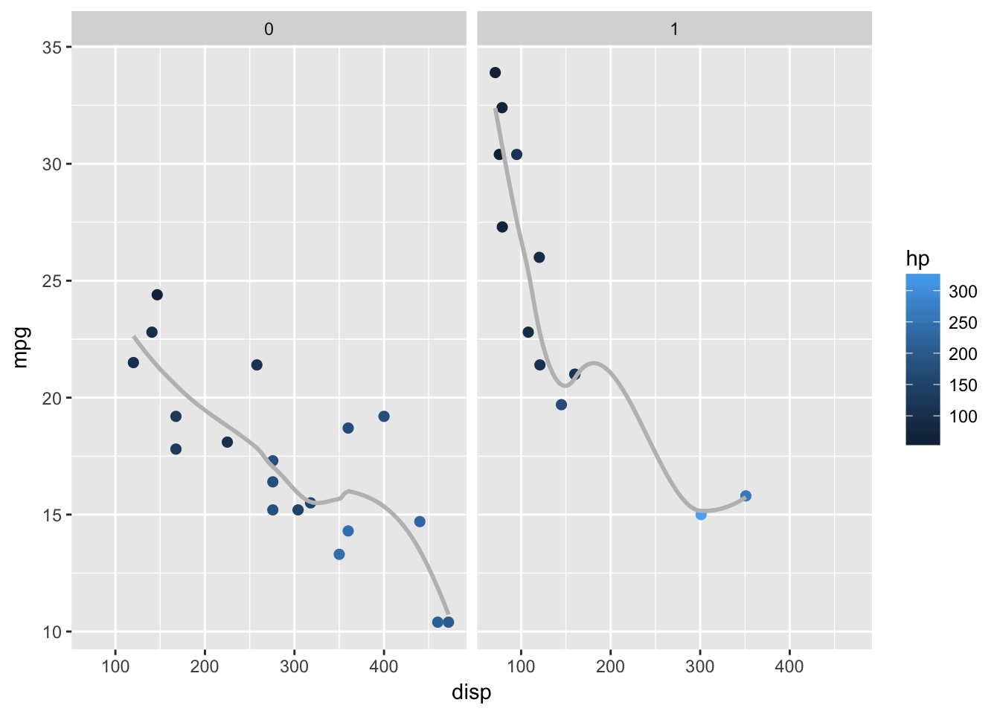


[See the ggplot documentation on facetting for more details](http://ggplot2.tidyverse.org/reference/#section-facetting).


### 'Distributions' {-}


```r
lme4::sleepstudy %>% 
  ggplot(aes(Reaction)) + geom_density()
```

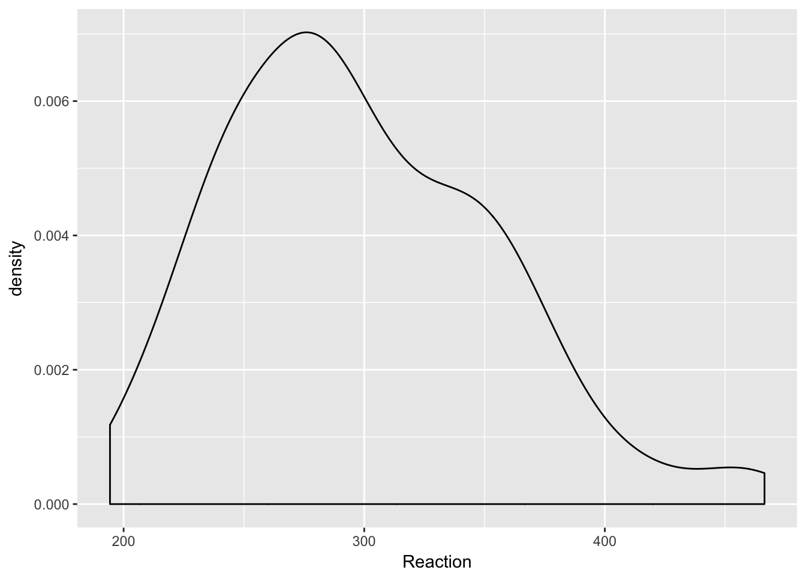

Imagine we wanted to compare distributions for individuals. Simply overlaying the lines is confusing:


```r
lme4::sleepstudy %>% 
  ggplot(aes(Reaction, group=Subject)) + geom_density()
```


Facetting produces a nicer result:


```r
lme4::sleepstudy %>% 
  ggplot(aes(Reaction)) + geom_density() + facet_wrap("Subject")
```

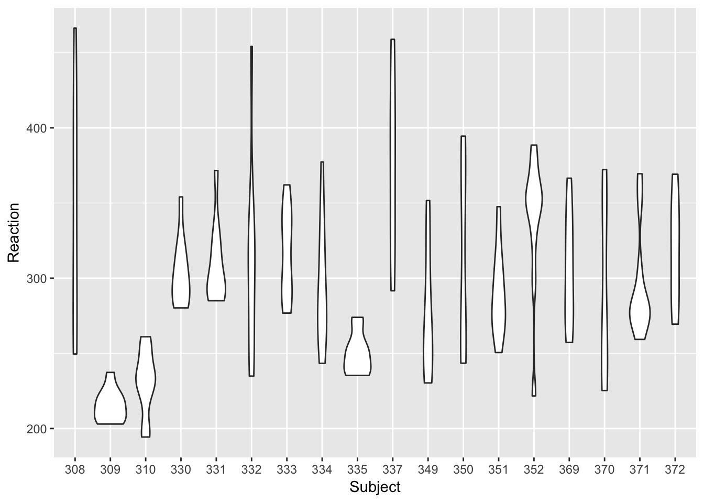


But we could present the same information more compactly, and with better facility to compare between subjects, if we use a bottleplot:


```r
lme4::sleepstudy %>% 
  ggplot(aes(Subject, Reaction)) + 
  geom_violin() 
```


We might want to plot our Subjects in order of their mean RT:


```r
mean.ranked.sleep <- lme4::sleepstudy %>% 
  group_by(Subject) %>% 
  # calculate mean RT
  mutate(RTm = mean(Reaction)) %>% 
  # sort by mean RT
  arrange(RTm, Days) %>% 
  ungroup() %>% 
  # create a rank score but conert to factor right away 
  mutate(SubjectRank = factor(dense_rank(RTm)))

mean.ranked.sleep %>% 
  ggplot(aes(SubjectRank, Reaction)) + 
  geom_violin() + 
  theme(aspect.ratio = .33)  # change the aspect ratio to make long and wide
```


Or we might want to compare individuals against the combined distribution:


```r
# duplicate all the data, assigning one-replication to a single subject, "All"
sleep.repeat <- bind_rows(lme4::sleepstudy,
                          lme4::sleepstudy %>% mutate(Subject="All"))
## Warning in bind_rows_(x, .id): binding factor and character vector,
## coercing into character vector
## Warning in bind_rows_(x, .id): binding character and factor vector,
## coercing into character vector

sleep.repeat %>% 
  mutate(all = Subject=="All") %>% 
  ggplot(aes(Subject, Reaction, color=all)) + 
  geom_violin() +
  guides(colour=FALSE) + # turn off he legend because we don't really need it
  theme(aspect.ratio = .25)  # change the aspect ratio to make long and wide
```

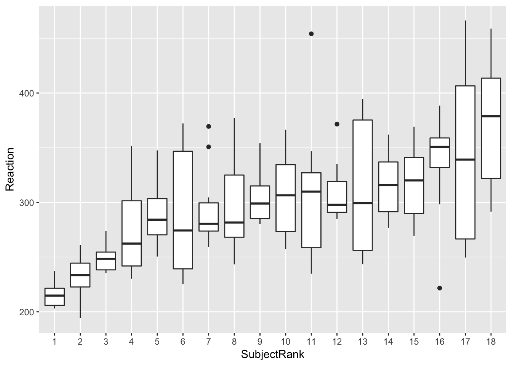


Boxplots can also work well to show distributions, and have the advantage of showing the median explicitly:


```r
mean.ranked.sleep %>% 
  ggplot(aes(SubjectRank, Reaction)) + 
  geom_boxplot() 
```

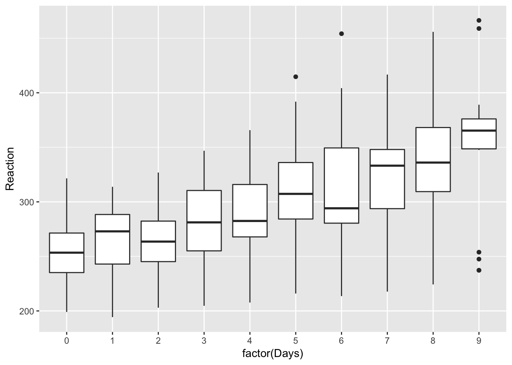


If we plot the same data by-day, we can clearly see the effect of sleep deprivation, and the increase in variability between subjects as sime goes on: the lack of sleeps seems to be affecting some subjects more than others


```r
lme4::sleepstudy %>% 
  ggplot(aes(factor(Days), Reaction)) + 
  geom_boxplot() 
```


### 'Comparisons' {-}


Imagine we have rainfall and temperature data for various regions, across months:


```r
DAAG::bomregions %>% 
  psych::describe(fast=T) %>% 
  pander
```


------------------------------------------------------------------------
    &nbsp;       vars   n    mean      sd    min    max   range    se   
--------------- ------ --- --------- ------ ------ ----- ------- -------
   **Year**       1    109   1954    31.61   1900  2008    108    3.028 

  **eastAVt**     2    99    20.43   0.4585 19.35  21.61  2.255  0.04608

   **seAVt**      3    99    14.59   0.4547 13.62  15.94  2.32   0.0457 

 **southAVt**     4    99    18.48   0.4584 17.43  19.53   2.1   0.04607

   **swAVt**      5    99    16.18   0.4734 15.08  17.05  1.97   0.04758

  **westAVt**     6    99    22.33   0.4548 21.22  23.39  2.165  0.04571

 **northAVt**     7    99    24.6    0.5042 23.57  25.94  2.365  0.05067

  **mdbAVt**      8    99    17.59   0.4958 16.36  18.79  2.425  0.04983

   **auAVt**      9    99    21.71   0.4429 20.67  22.87  2.195  0.04452

 **eastRain**     10   109   601.6   123.8  315.3  1030    715    11.85 

  **seRain**      11   109   598.1   104.6  354.9  900.6  545.7   10.02 

 **southRain**    12   109   381.7   68.63   236   618.2  382.1   6.574 

  **swRain**      13   109   657.8    103   420.5  988.8  568.4   9.861 

 **westRain**     14   109   352.2   84.55  173.5  646.5   473    8.098 

 **northRain**    15   109   520.7   110.2  312.8  946.9   634    10.55 

  **mdbRain**     16   109    476    110.9  255.8   821   565.2   10.62 

  **auRain**      17   109   457.1   82.55  317.2  785.3  468.1   7.906 

    **SOI**       18   109 -0.002676 6.845  -20.01 20.79  40.8   0.6556 

  **co2mlo**      19   50    345.6   21.01   316   385.4  69.47   2.972 

  **co2law**      20   79    310.4   9.586  295.8  333.7  37.9    1.078 

    **CO2**       21   109   324.3   24.59  296.3  385.4  89.19   2.355 

  **sunspot**     22   109   60.08   47.69   1.4   190.2  188.8   4.568 
------------------------------------------------------------------------


##### {- #extract-to-split-column-names}

Because these data are in wide format (multiple columns have contain the same type of data) we need to first convert to long format. This process has become known as [tidying](http://tidyr.tidyverse.org). 

The code below selects the columns related to rainfall and temperature and then 'melts' the data to long format: one row per observation. We then `extract` the region and the type of measurement from the `variable` column which is created by using a regular expression:


```r
weather.data.long <- DAAG::bomregions %>% 
  select(Year, ends_with('Rain'), ends_with('AVt')) %>% 
  reshape2::melt(id.var="Year") %>% 
  extract(variable, 
          into=c("Region", "variable"), 
          regex="(east|north|se|south|west|sw|au)(\\w+)") %>% 
  filter(!is.na(variable))

weather.data.long %>% head
##   Year Region variable  value
## 1 1900   east     Rain 429.98
## 2 1901   east     Rain 500.12
## 3 1902   east     Rain 315.33
## 4 1903   east     Rain 694.09
## 5 1904   east     Rain 564.86
## 6 1905   east     Rain 443.11
```


##### {.exercise}

Try stepping through the code above line by line and see what is produced at each step.


With our data in long form we can use `ggplot` to plot our data over time. In the plot below, we use `filter()` to select only the rainfall measurements:


```r
rain <- 
  weather.data.long %>% 
  filter(variable=='Rain')

rain %>% 
  ggplot(aes(Year, value)) +
  geom_point() + 
  ylab('Rainfall (mm)')
```

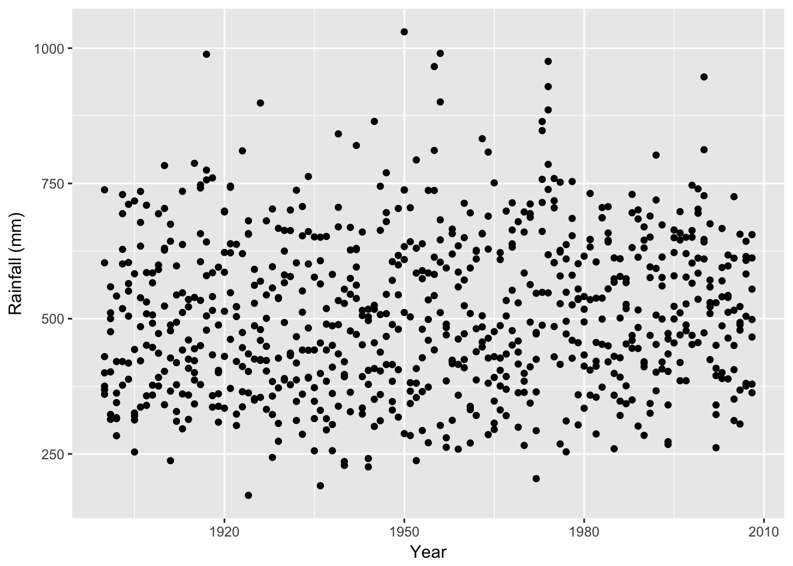


There are many ways to extract structure from these data, and make comparisons over time. One is to use colour:


```r
rain %>% 
  ggplot(aes(Year, value, color=Region)) +
  geom_point() +
  ylab('Rainfall (mm)')
```

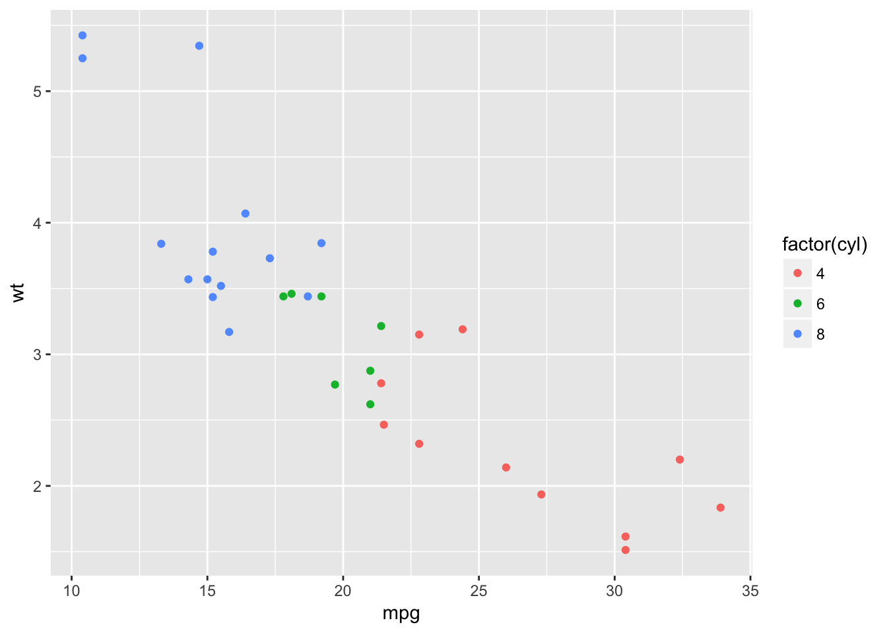


It's now easy to see the crude differences between the regions (west appears the driest, sw the wettest), but it's still hard to compare between regions, or over time.

For this we can use various forms of summaries, for example a smoothed line plot (the shaded area is the standard error), which clearly shows the relative changes in rainfall in each region over time:


```r
rain %>% 
  ggplot(aes(Year, value, color=Region)) +
  geom_smooth() +
  ylab('Rainfall (mm)')
```

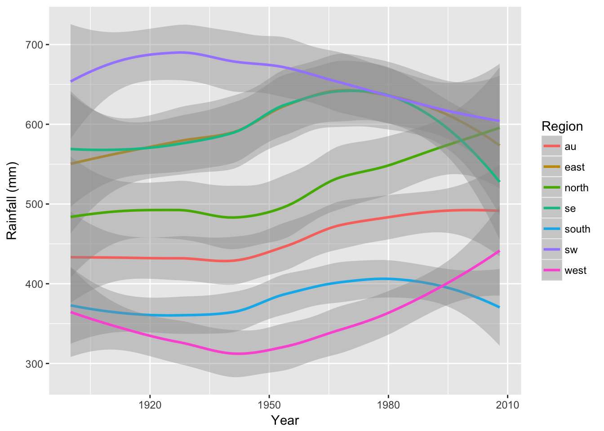


It can sometimes be desireable to include points to preserve the relationship between the summary and the raw data:


```r
rain %>% 
  filter(Region %in% c('west', 'se')) %>% 
  ggplot(aes(Year, value, color=Region)) +
  geom_point(alpha=.5, size=.5) +
  geom_smooth(se=F) +
  ylab('Rainfall (mm)')
```


If we weren't interested in the time series and just wanted to focus on the most recent year, we might take a different approach. Here a bar plot is used to compare between regions, with the national average (au) highlighted in blue:


```r
rain %>% 
  filter(Year == max(Year)) %>% 
  ggplot(aes(Region, value, fill=Region=="au")) +
  stat_summary(geom="bar") +
  ylab('Rainfall (mm)') + 
  guides(fill=F)
```

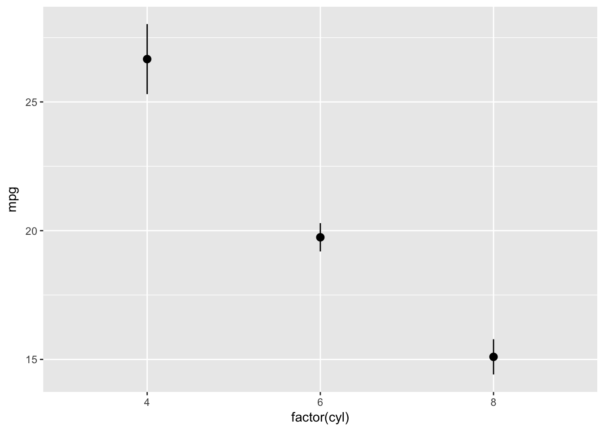


Finally, we shouldn't forget that this dataset included both rainfall and temperature data, and we can display these in different ways, depending on what our research question was.

In this case we can use facetting to display temperature and rainfall data side by side. Because AVt and Rain are on such different scales we need to allow the y axis to vary between variables:


```r
weather.data.long %>% 
  ggplot(aes(Year, value, color=Region)) + 
  geom_smooth() + 
  facet_wrap(~variable, scales="free")
## Warning: Removed 70 rows containing non-finite values (stat_smooth).
```

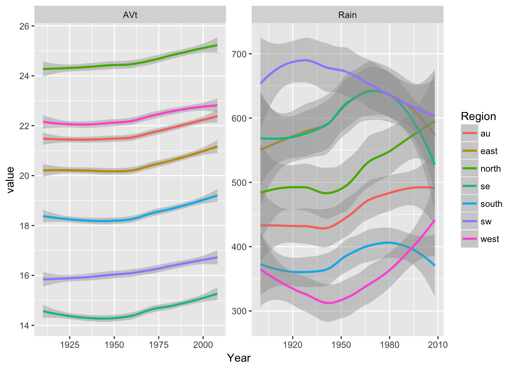


<!-- ```{r} -->
<!-- dataurl <- function(year, country){ -->
<!--   sprintf("https://www.census.gov/population/international/data/idb/region.php?N=Results&T=10&A=separate&RT=0&Y=%.0f&R=-1&C=%s", 2017, "UK") -->
<!-- } -->

<!-- df <- read.csv(dataurl(2017, 'UK')) -->
<!-- ``` -->


### 'Composition' {-}

#### Waffle plots or 'pictograms' {-}

Waffle plots are neat way of showing the relative frequency of different categories.

In applied settings it's well known that when considering the risks or benefits of interventions clinicans, patients and researchers benefit from statements made using 'natural frequencies' [@gigerenzer2003simple], and pictographs or 'waffle plots' have been shown to provide patients and their families with a better understanding of the risks of treatments [@tait2010presenting].

Waffle plots can be implemented in R via the `waffle::` package:


```r
outcomes <- c("gained weight"=13, 
              "no change"=27, 
              "lost 2kg or more" = 44, 
              "lost 5kg or more" = 16)

waffle::waffle(outcomes)
```

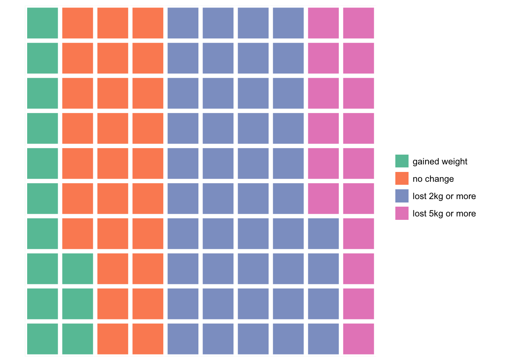


[Calculating these summary figures is left as an exercise to for the reader, but see the section on [summarising data with dplyr](#split-apply-combine).]{.tip}


This is one of those occasions where the default ggplot colours could probably be improved, and we can do this by passing the [names of the colours](#named-colours) we would like to use:


```r
weight.loss.colours <- c('firebrick2', 'darkgoldenrod1', 'palegreen3', 'palegreen4')
waffle::waffle(outcomes, colors = weight.loss.colours)
```


Selecting colours by hand isn't always the best way though: the [`colourbrewer` library provides some nice shortcuts](#color-brewer) for using palletes from the excellent [ColourBrewer website](http://colorbrewer2.org).


#### Stacked bars {- #stacked-bars}

The `reshape2` package includes data on tipping habits in restaurants for male and female bill-payers, and where the party was fo various `size`s:


```r
reshape2::tips %>% 
  head %>% 
  pander
```


------------------------------------------------------
 total_bill   tip   sex    smoker   day   time   size 
------------ ----- ------ -------- ----- ------ ------
   16.99     1.01  Female    No     Sun  Dinner   2   

   10.34     1.66   Male     No     Sun  Dinner   3   

   21.01      3.5   Male     No     Sun  Dinner   3   

   23.68     3.31   Male     No     Sun  Dinner   2   

   24.59     3.61  Female    No     Sun  Dinner   4   

   25.29     4.71   Male     No     Sun  Dinner   4   
------------------------------------------------------


To begin, we might like to plot tips by time of day:


```r
reshape2::tips %>% 
  ggplot(aes(time, tip)) + 
  stat_summary(geom="bar")
```

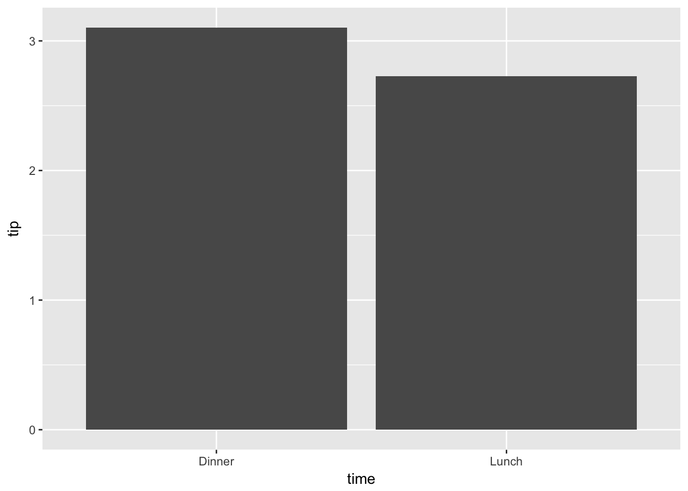


And to facilitate the comparison between men and women we could colour portions of the bars using `position_stack()`: 


```r
reshape2::tips %>% 
  ggplot(aes(time, tip, fill=sex)) + 
  stat_summary(geom="bar", position=position_stack()) +
  xlab("") + ylab("Tip ($)")
```

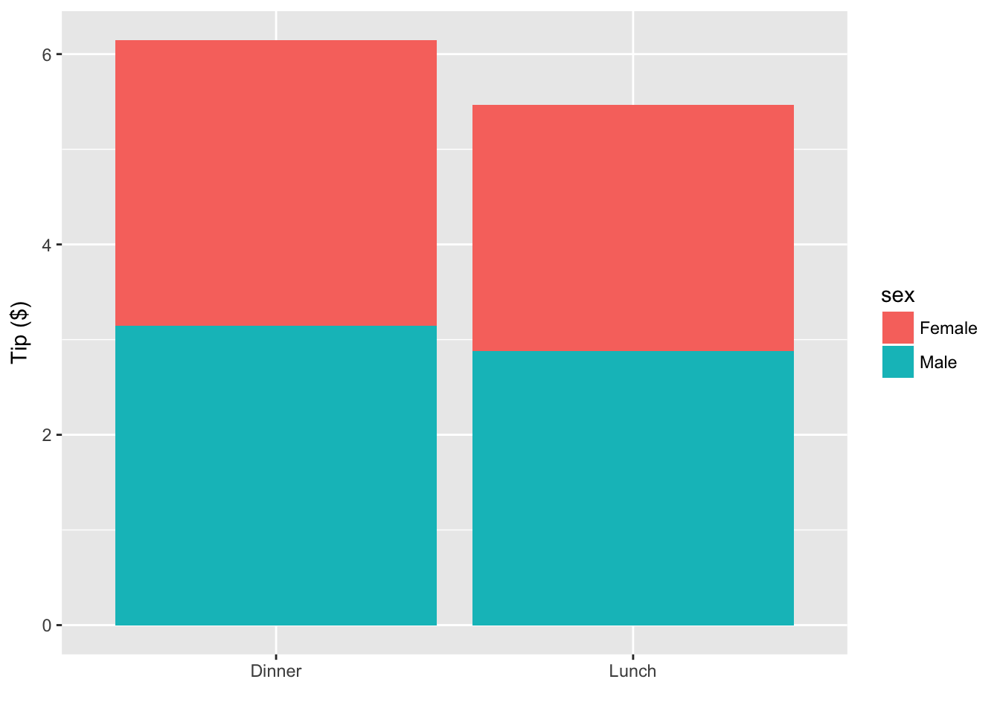


Or to reverse the comparisons:


```r
reshape2::tips %>% 
  ggplot(aes(sex, tip, fill=time)) + 
  stat_summary(geom="bar", position=position_stack()) +
  xlab("") + ylab("Tip ($)")
```


## 'Quick and dirty' (utility) plots {- #utility-plotting-functions}

When exploring a dataset, often useful to use built in functions or helpers from other libraries. These help you quickly visualise relationships, but aren't always *exactly* what you need and can be hard to customise.


### Distributions


```r
hist(mtcars$mpg)
```

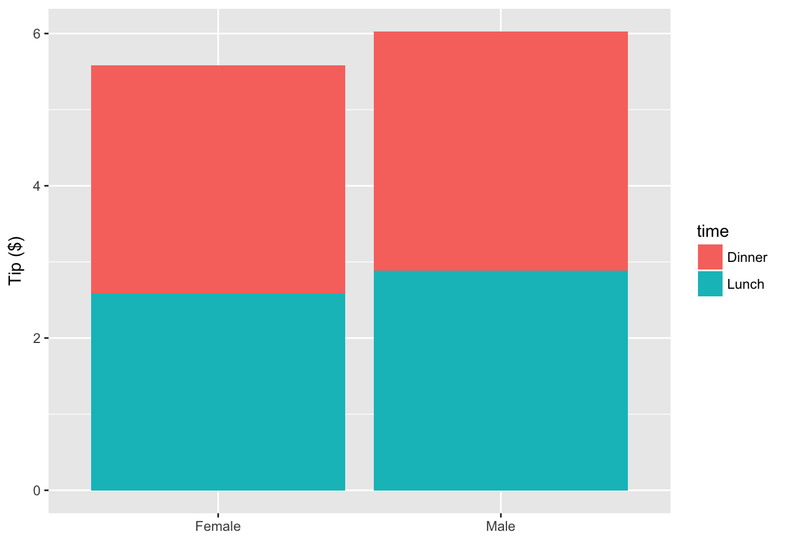

```r
plot(density(mtcars$mpg))
```


```r
boxplot(mpg~cyl, data=mtcars)
```


```r
Hmisc::hist.data.frame(mtcars)
```


Even for simple plots, ggplot has some useful helper functions though:


```r
qplot(mpg, data=mtcars, geom="density") + xlab("Miles per gallon")
```

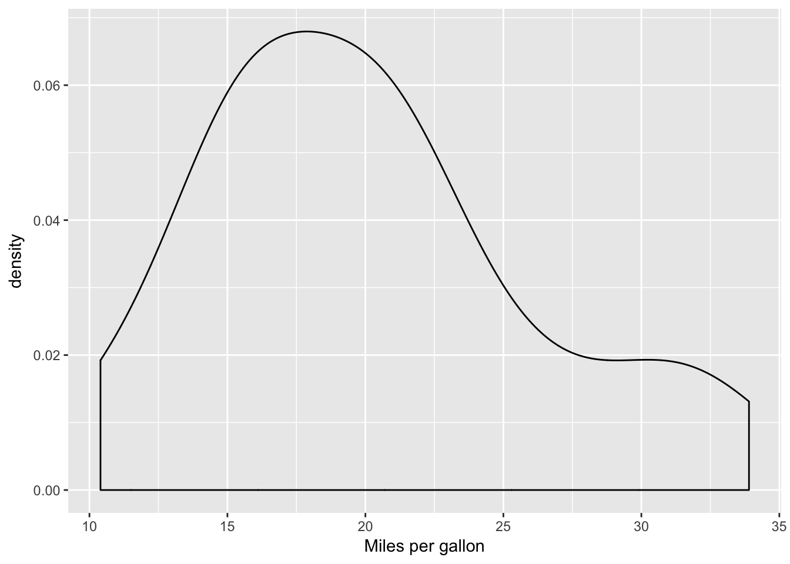

```r
qplot(x=factor(cyl), y=mpg, data=mtcars, geom="boxplot") 
```

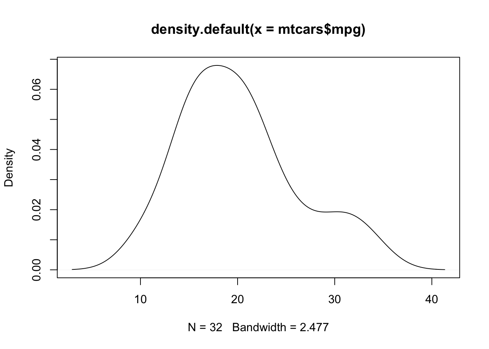


### Relationships


```r
with(mtcars, plot(mpg, wt))
```

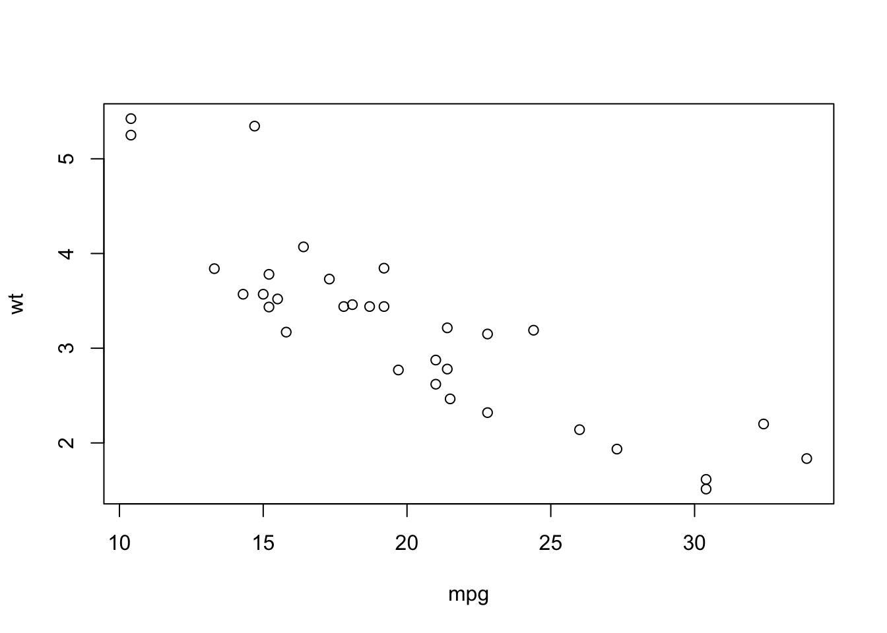

```r
pairs(select(mtcars, wt, disp, mpg))
```

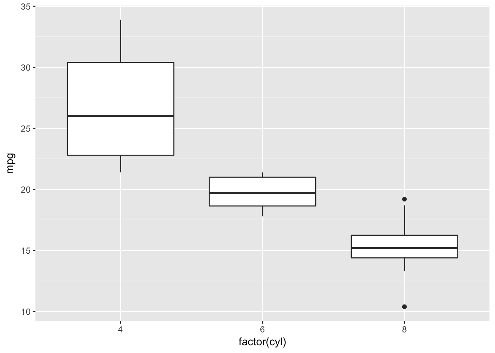


Again, for quick plots ggplot also has useful shortcut functions:


```r
qplot(mpg, wt, color=factor(cyl), data = mtcars)
```


### Quantities

I don't think the base R plots are that convenient here. `ggplot2::` and the `stat_summary()` function makes life much simpler:


```r
ggplot(mtcars, aes(factor(cyl), mpg)) + 
  stat_summary(geom="bar")
```

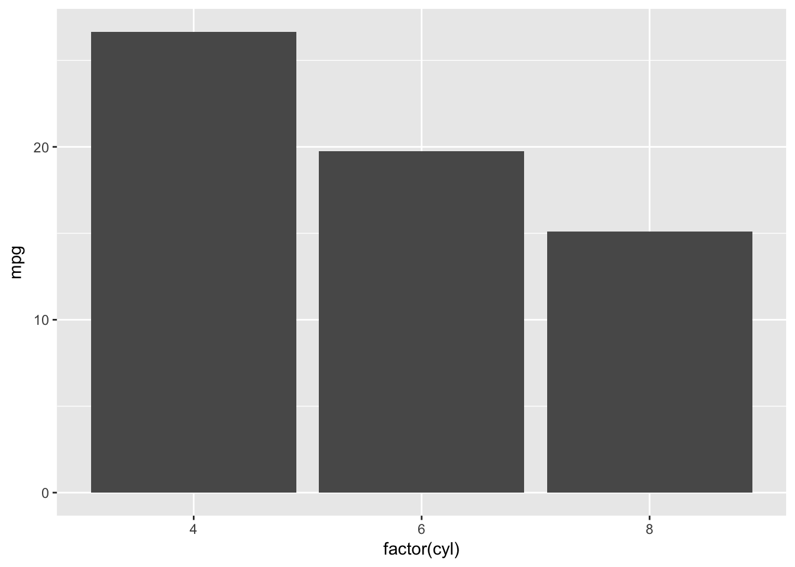


And if you are plotting quantities, as disussed above, showing a range is sensible (a boxplot would also fill both definitions):


```r
ggplot(mtcars, aes(factor(cyl), mpg)) + 
  stat_summary(geom="pointrange")
```


<!-- ## Tufte in R -->

<!-- tufte graphics in r http://motioninsocial.com/tufte/ -->


