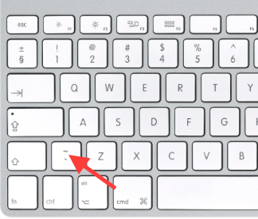

# Getting help {#getting-help}

If you don't know or can't remember what a function does, R provides help files which explain how they work.
To access a help file for a function, just type `?command` in the console, or run `?command` command within an R block. For example, running `?mean` would bring up the documentation for the `mean` function.

You can also type `CRTL-Shift-H` while your cursor is over any R function in the RStudio interface.

It's fair to say R documentation isn't always written for beginners. However the 'examples' sections are usually quite informative: you can normally see this by scrolling right to the end of the help file.


### Finding the backtick on your keyboard {- #backtick-location}


The backtick ``` symbol is unfamiliar to some readers. Here's where it is:



