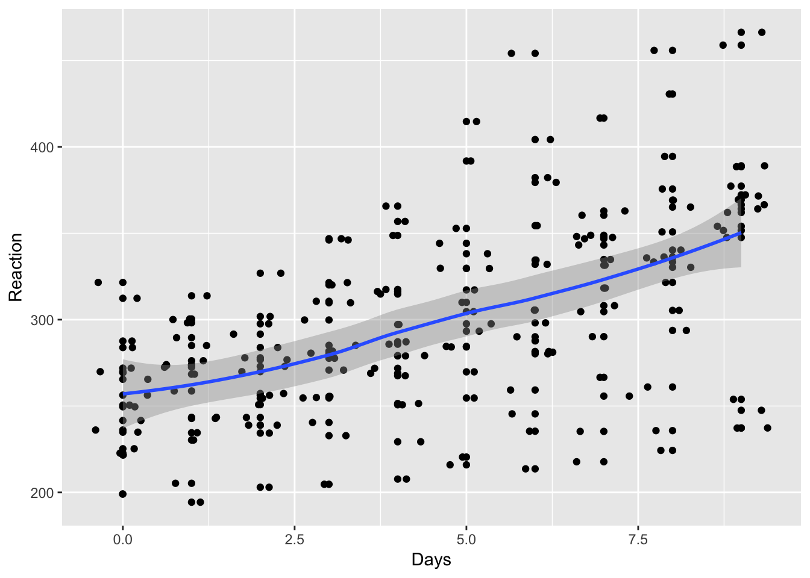
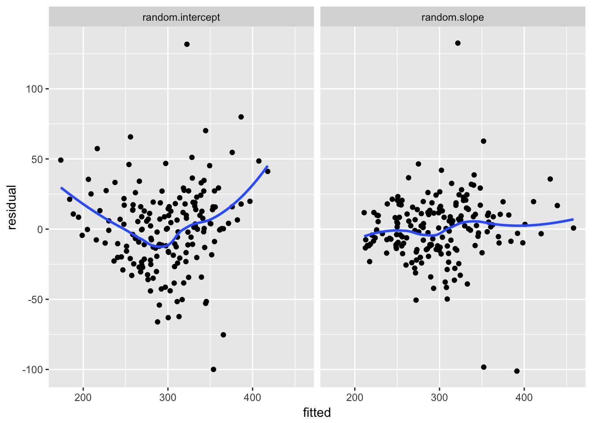

<!-- ADD?
Doug bates guide:
http://lme4.r-forge.r-project.org/lMMwR/lrgprt.pdf 

Predictive Margins and Marginal Effects in Stata
http://www.stata.com/meeting/germany13/abstracts/materials/de13_jann.pdf

-->


# Multilevel models {#multilevel-models}


Psychological data often contains natural *groupings*. In intervention research, multiple patients may be treated by individual therapists, or children taught within classes, which are further nested within schools; in experimental research participants may respond on multiple occasions to a variety of stimuli.

Although disparate in nature, these groupings share a common characteristic: they induce *dependency* between the observations we make. That is, our data points are *not independently sampled* from one another.

When data are clustered int his way then multilevel, sometimes called linear mixed models, serve two purposes:

1. They overcome limitations of conventional models which assume that data *are* independently sampled ([read a more detailed explanation of why handling non-independence properly matters](#clustering))

2. They allow us to answer substantive questions about *sources of variation* in our data.


###### Repeated measures Anova and beyond {-}

RM Anova is another technique which relaxes the assumption of independent sampling, and is widely used in psychology: it is common that participants make repeated responses which can be categorised by various experimental variables (e.g. time, condition).  

However RM Anova is just a special case of a much wider family of models: linear mixed models, but one which makes a number of restrictions which can be invonvenient, inefficient, or unreasonable. 


###### Substantive questions about variation {-}

Additionally, rather than simply 'managing' the non-independence of observations --- treating it is a kind of nuisance to be eliminated --- mixed models can allow researchers to focus on the sources of variation in their data directly. 

It can be of substantive interest to estimate [how much variation in the outcome is due to different levels of the nested structure](#icc-and-vpc). For example, in a clinical trial researchers might want to know how much influence therapists have on their clients' outcome: if patients are 'nested' within therapists then multilevel models can estimate the variation between therapists  (the 'therapist effect') and variation 'within' therapists (i.e. variation between clients).


## Fitting multilevel models in R {- #fitting-models}

### Use `lmer` and `glmer` {-}

Although there are mutiple R packages which can fit mixed-effects regression models, the `lmer` and `glmer` functions within the `lme4` package are the most frequently used, for good reason, and the examples below all use these two functions.


### *p* values in multilevel models {-}

For various philosophical and statistical reasons the author of lme4, Doug Bates, has always refused to display *p* values in the output from lmer (his reasoning [is explained here](https://stat.ethz.ch/pipermail/r-help/2006-May/094765.html)).

<!-- See also http://glmm.wikidot.com/faq#df ? But outdated in places-->

That notwithstanding, many people have wanted to use the various methods to calculate p values for parameters in mixed models, and calculate F tests for effects and interactions. Various methods have been developed over the years which address at least some of  Bates' concerns, and these techniques have been implemented in R in the `lmerTest::` package. In particular, `lmerTest` implements an `anova` function for `lmer` models, which is very helpful.


#####  {- .tip}

**Don't worry!** All you need to do is to load the `lmerTest` package rather than `lme4`. This loads updated versions of `lmer`, `glmer`, and extra functions for things like calculating *F* tests and the Anova table.


#### The `lmer` formula syntax {- #lmer-syntax}


Specifying `lmer` models is very similar to the [syntax for `lm`](#formulae). The 'fixed' part of the model is exactly the same, with additional parts used to specify [random intercepts](#random-intercepts), [random slopes](#random-slopes), and control the covariances of these random effects ([there's more on this in the troubleshooting section](#controlling-lmer-covariances)).


###### Random intercepts {- }

The simplest model which allows a ['random intercept'](#random-intercepts) for each level in the grouping looks like this:


```r
lmer(outcome ~ predictors + (1 | grouping), data=df)
```

Here the outcome and predictors are specified in a formula, just as we did when using `lm()`. The only difference is that we now add a 'random part' to the model, in this case: `(1|grouping)`. 

The `1` refers to an intercept, and so in English this part of the formula means 'add a random intercept for each level of grouping'.


###### Random slopes {- }

If we want to add a [random slope](#random-slopes-intercepts) to the model, we could adjust the random part like so:


```r
lmer(outcome ~ predictor + (predictor | grouping), data=df)
```

This implicitly adds a random intercept too, so in English this formula says something like: let `outcome` be predicted by `predictor`; let variation in outcome to vary between levels of `grouping`, and also allow the effect of `predictor` to vary between levels of `grouping`.


The `lmer` syntax for the random part is very powerful, and allows complex combinations of random intercepts and slopes and control over how these random effects are allowed to correlate with one another. For a detailed guide to fitting two and three level models, with various covariance structures, see: <http://rpsychologist.com/r-guide-longitudinal-lme-lmer>


#### Are my effects fixed or random? {- .tip}

If you're not sure which part of your model should be 'fixed' and which parts should be 'random' [theres a more detailed explanation in this section](#fixed-or-random).


## Extending traditional RM Anova {-}

As noted in the [Anova cookbook section](anova-cookbook.html), repeated measures anova can be approximated using linear mixed models.

For example, reprising the [`sleepstudy` example](#sleepstudy-rmanova), we can approximate a repeated measures Anova in which multiple measurements of `Reaction` time are taken on multiple `Days` for each `Subject`.


As we [saw before](#sleepstudy-rmanova), the traditional RM Anova model is:


```r
sleep.rmanova <- afex::aov_car(Reaction ~ Days + Error(Subject/(Days)), data=lme4::sleepstudy)
sleep.rmanova
## Anova Table (Type 3 tests)
## 
## Response: Reaction
##   Effect          df     MSE         F ges p.value
## 1   Days 3.32, 56.46 2676.18 18.70 *** .29  <.0001
## ---
## Signif. codes:  0 '***' 0.001 '**' 0.01 '*' 0.05 '+' 0.1 ' ' 1
## 
## Sphericity correction method: GG
```


The equivalent lmer model is:


```r
library(lmerTest)
sleep.lmer <- lmer(Reaction ~ factor(Days) + (1|Subject), data=lme4::sleepstudy)
anova(sleep.lmer)
## Analysis of Variance Table of type III  with  Satterthwaite 
## approximation for degrees of freedom
##              Sum Sq Mean Sq NumDF DenDF F.value    Pr(>F)    
## factor(Days) 166235   18471     9   153  18.703 < 2.2e-16 ***
## ---
## Signif. codes:  0 '***' 0.001 '**' 0.01 '*' 0.05 '.' 0.1 ' ' 1
```

<!-- 
This post by the author of afex confirms these models are equivalent to RM anova:
http://singmann.org/mixed-models-for-anova-designs-with-one-observation-per-unit-of-observation-and-cell-of-the-design/ 
-->


The following sections demonstrate just some of the extensions to RM Anova which are possible with mutlilevel models,


### Fit a simple slope for `Days` {-}


```r
lme4::sleepstudy %>% 
  ggplot(aes(Days, Reaction)) + 
  geom_point() + geom_jitter() +
  geom_smooth() 
## `geom_smooth()` using method = 'loess'
```




```r
slope.model <- lmer(Reaction ~ Days + (1|Subject),  data=lme4::sleepstudy)
lmerTest::anova(slope.model)
## Analysis of Variance Table of type III  with  Satterthwaite 
## approximation for degrees of freedom
##      Sum Sq Mean Sq NumDF DenDF F.value    Pr(>F)    
## Days 162703  162703     1   161   169.4 < 2.2e-16 ***
## ---
## Signif. codes:  0 '***' 0.001 '**' 0.01 '*' 0.05 '.' 0.1 ' ' 1
slope.model.summary <- summary(slope.model)
slope.model.summary$coefficients
##              Estimate Std. Error       df  t value Pr(>|t|)
## (Intercept) 251.40510  9.7467163  22.8102 25.79383        0
## Days         10.46729  0.8042214 161.0036 13.01543        0
```


### Allow the effect of sleep deprivation to vary for different participants {-}

If we plot the data, it looks like sleep deprivation hits some participants worse than others:


```r
set.seed(1234)
lme4::sleepstudy %>% 
  filter(Subject %in% sample(levels(Subject), 10)) %>% 
  ggplot(aes(Days, Reaction, group=Subject, color=Subject)) +
  geom_smooth(method="lm", se=F) + 
  geom_jitter(size=1) +
  theme_minimal()
```


If we wanted to test whether there was significant variation in the effects of sleep deprivation between subjects, by adding a [random slope](#random-slopes-intercepts) to the model. 

The random slope allows the effect of `Days` to vary between subjects. So we can think of an overall slope (i.e. RT goes up over the days), from which individuals deviate by some amount (e.g. a resiliant person will have a negative deviation or residual from the overall slope).

Adding the random slope doesn't change the *F* test for `Days` that much:


```r
random.slope.model <- lmer(Reaction ~ Days + (Days|Subject),  data=lme4::sleepstudy)
lmerTest::anova(random.slope.model)
## Analysis of Variance Table of type III  with  Satterthwaite 
## approximation for degrees of freedom
##      Sum Sq Mean Sq NumDF DenDF F.value    Pr(>F)    
## Days  30031   30031     1    17  45.853 3.264e-06 ***
## ---
## Signif. codes:  0 '***' 0.001 '**' 0.01 '*' 0.05 '.' 0.1 ' ' 1
```

Nor the overall slope coefficient:


```r
random.slope.model.summary <- summary(random.slope.model)
slope.model.summary$coefficients
##              Estimate Std. Error       df  t value Pr(>|t|)
## (Intercept) 251.40510  9.7467163  22.8102 25.79383        0
## Days         10.46729  0.8042214 161.0036 13.01543        0
```

But we can use the `lmerTest::rand()` function to show that there is statistically significant variation in slopes between individuals, using the likelihood ratio test:


```r
lmerTest::rand(random.slope.model)
## Analysis of Random effects Table:
##              Chi.sq Chi.DF p.value    
## Days:Subject   42.8      2   5e-10 ***
## ---
## Signif. codes:  0 '***' 0.001 '**' 0.01 '*' 0.05 '.' 0.1 ' ' 1
```


Because the random slope for `Days` is statistically significant, we know it improves the model.
One way to see that improvement is to plot residuals (unexplained error for each datapoint) against predicted values. To extract residual and fitted values we use the `residuals()` and `predict()` functions. These are then combined in a data_frame, to enable us to use ggplot for the subsequent figures.


```r
# create data frames containing residuals and fitted
# values for each model we ran above
a <-  data_frame(
    model = "random.slope",
    fitted = predict(random.slope.model), 
    residual = residuals(random.slope.model))
b <- data_frame(
    model = "random.intercept",
    fitted = predict(slope.model), 
    residual = residuals(slope.model)) 

# join the two data frames together
residual.fitted.data <- bind_rows(a,b)
```

We can see that the residuals from the random slope model are much more evenly distributed across the range of fitted values, which suggests that the assumption of homogeneity of variance is met in the random slope model:


```r
# plots residuals against fitted values for each model
residual.fitted.data %>%
  ggplot(aes(fitted, residual)) +
  geom_point() + 
  geom_smooth(se=F) +
  facet_wrap(~model) 
## `geom_smooth()` using method = 'loess'
```


We can plot both of the random effects from this model (intercept and slope) to see how much the model expects individuals to deviate from the overall (mean) slope.


```r
# extract the random effects from the model (intercept and slope)
ranef(random.slope.model)$Subject %>% 
  # implicitly convert them to a dataframe and add a column with the subject number
  rownames_to_column(var="Subject") %>% 
  # plot the intercept and slobe values with geom_abline()
  ggplot(aes()) + 
  geom_abline(aes(intercept=`(Intercept)`, slope=Days, color=Subject)) +
  # add axis label
  xlab("Day") + ylab("Residual RT") +
  # set the scale of the plot to something sensible
  scale_x_continuous(limits=c(0,10), expand=c(0,0)) + 
  scale_y_continuous(limits=c(-100, 100)) 
```




Inspecting this plot, there doesn't seem to be any strong correlation between the RT value at which an individual starts (their intercept residual) and the slope describing how they change over the days compared with the average slope (their slope residual). 

That is, we can't say that knowing whether a person has fast or slow RTs at the start of the study gives us a clue about what will happen to them after they are sleep deprived: some people start slow and get faster; other start fast but suffer and get slower. 

However we can explicitly check this correlation (between individuals' intercept and slope residuals) using the `VarCorr()` function:


```r
VarCorr(random.slope.model)
##  Groups   Name        Std.Dev. Corr 
##  Subject  (Intercept) 24.7404       
##           Days         5.9221  0.066
##  Residual             25.5918
```


The correlation between the random intercept and slopes is only 0.066, and so very low. We might, therefore, want to try fitting a model without this correlation.  `lmer` includes the correlation by default, so we need to change the model formula to make it clear we don't want it:


```r
uncorrelated.reffs.model <- lmer(
  Reaction ~ Days + (1 | Subject) + (0 + Days|Subject),  
  data=lme4::sleepstudy)

VarCorr(uncorrelated.reffs.model)
##  Groups    Name        Std.Dev.
##  Subject   (Intercept) 25.0513 
##  Subject.1 Days         5.9882 
##  Residual              25.5653
```

The variance components don't change much when we constrain the *covariance* of intercepts and slopes to be zero, and we can explicitly compare these two models using the `anova()` function, which is somewhat confusingly named because in this instance it is performing a likelihood ratio test to compare the two models:


```r
anova(random.slope.model, uncorrelated.reffs.model)
## refitting model(s) with ML (instead of REML)
## Data: lme4::sleepstudy
## Models:
## ..1: Reaction ~ Days + (1 | Subject) + (0 + Days | Subject)
## object: Reaction ~ Days + (Days | Subject)
##        Df    AIC    BIC  logLik deviance  Chisq Chi Df Pr(>Chisq)
## ..1     5 1762.0 1778.0 -876.00   1752.0                         
## object  6 1763.9 1783.1 -875.97   1751.9 0.0639      1     0.8004
```

Model fit is not significantly worse with the constrained model, [so for parsimony's sake we prefer it to the more complex model](#over-fitting).


### Fitting a curve for the effect of `Days` {- #growth-curve-sleep-example}

In theory, we could also fit additional parameters for the effect of `Days`, although a combined smoothed line plot/scatterplot indicates that a linear function fits the data reasonably well.


```r
lme4::sleepstudy %>% 
  ggplot(aes(Days, Reaction)) + 
  geom_point() + geom_jitter() + 
  geom_smooth() 
## `geom_smooth()` using method = 'loess'
```


If we insisted on testing a curved (quadratic) function of `Days`, we could:


```r
quad.model <- lmer(Reaction ~ Days + I(Days^2) + (1|Subject),  data=lme4::sleepstudy)
quad.model.summary <- summary(quad.model)
quad.model.summary$coefficients
##                Estimate Std. Error        df   t value   Pr(>|t|)
## (Intercept) 255.4493728 10.4656310  30.04063 24.408406 0.00000000
## Days          7.4340850  2.9707978 160.00374  2.502387 0.01334034
## I(Days^2)     0.3370223  0.3177733 160.00374  1.060575 0.29048148
```

Here, the *p* value for `I(Days^2)` is not significant, suggesting (as does the plot) that a simple slope model is sufficient.


## Variance partition coefficients and intraclass correlations {- #icc-and-vpc}

The purpose of multilevel models is to partition variance in the outcome between the different groupings in the data. 

For example, if we make multiple observations on individual participants we partition outcome variance between individuals, and the residual variance. 

We might then want to know what *proportion* of the total variance is attributable to variation within-groups, or how much is found between-groups. This statistic is termed the variance partition coefficient VPC, or intraclass correlation.

We calculate the VPC woth some simple arithmetic on the variance estimates from the lmer model. We can extract the variance estimates from the VarCorr function:


```r
random.intercepts.model <- lmer(Reaction ~ Days + (1|Subject),  data=lme4::sleepstudy)
VarCorr(random.intercepts.model)
##  Groups   Name        Std.Dev.
##  Subject  (Intercept) 37.124  
##  Residual             30.991
```


And we can test the variance parameter using the `rand()` function:


```r
rand(random.intercepts.model)
## Analysis of Random effects Table:
##         Chi.sq Chi.DF p.value    
## Subject    107      1  <2e-16 ***
## ---
## Signif. codes:  0 '***' 0.001 '**' 0.01 '*' 0.05 '.' 0.1 ' ' 1
```


Helpfully, if we convert the result of `VarCorr` to a dataframe, we are provided with the columns `vcov` which stands for `variance or covariance`, as well as the `sdcor` (standard deviation or correlation) which is provided in the printed summary:


```r
VarCorr(random.intercepts.model) %>% 
  as_data_frame()
## # A tibble: 2 x 5
##        grp        var1  var2      vcov    sdcor
##      <chr>       <chr> <chr>     <dbl>    <dbl>
## 1  Subject (Intercept)  <NA> 1378.1785 37.12383
## 2 Residual        <NA>  <NA>  960.4566 30.99123
```

The variance partition coefficient is simply the variance at a given level of the model, divided by the total variance (the sum of the variance parameters). So we can write:


```r
VarCorr(random.intercepts.model) %>% 
  as_data_frame() %>% 
  mutate(icc=vcov/sum(vcov)) %>% 
  select(grp, icc)
## # A tibble: 2 x 2
##        grp       icc
##      <chr>     <dbl>
## 1  Subject 0.5893089
## 2 Residual 0.4106911
```

[Intraclass correlations were computed from the mixed effects mode. 59% of the variation in outcome was attributable to differences between subjects, \chi^2^(1) = 107, *p* < .001.]{.apa-example}


[It's not straightforward to put an confidence interval around the VPC estimate from an lmer model. If this is important to you, you should explore [re-fitting the same model in a Bayesian framework](#bayes-mcmc)]


## 3 level models with 'partially crossed' random effects {- #threelevel}

The `lme4::InstEval` dataset records University lecture evaluations by students at ETH Zurich. The variables include:

- `s` a factor with levels 1:2972 denoting individual students.

- `d` a factor with 1128 levels from 1:2160, denoting individual professors or lecturers.

- `studage` an ordered factor with levels 2 < 4 < 6 < 8, denoting student's “age” measured in the semester number the student has been enrolled.

- `lectage` an ordered factor with 6 levels, 1 < 2 < ... < 6, measuring how many semesters back the lecture rated had taken place.

- `service` a binary factor with levels 0 and 1; a lecture is a “service”, if held for a different department than the lecturer's main one.

- `dept` a factor with 14 levels from 1:15, using a random code for the department of the lecture.

- `y` a numeric vector of ratings of lectures by the students, using the discrete scale 1:5, with meanings of ‘poor’ to ‘very good’.


For convenience, in this example we take a subsample of the (fairly large) dataset:


```r
set.seed(1234)
lectures <- sample_n(lme4::InstEval, 10000)
```


We run a model without any predictors, but respecting the clustering in the data, in the example below. This model is a three-level random intercepts model, which splits the variance between lecturers, students, and the residual variance. Because, in some cases, some of the same students provide data on a particular lecturer these data are 'partially crossed' (the alternative would be to sample different students for each lecturer).


```r
lectures.model <- lmer(y~(1|d)+(1|s), data=lectures)
summary(lectures.model)
## summary from lme4 is returned
## some computational error has occurred in lmerTest
## Linear mixed model fit by REML ['lmerMod']
## Formula: y ~ (1 | d) + (1 | s)
##    Data: lectures
## 
## REML criterion at convergence: 33053.3
## 
## Scaled residuals: 
##      Min       1Q   Median       3Q      Max 
## -2.55587 -0.73732  0.05425  0.76974  2.46973 
## 
## Random effects:
##  Groups   Name        Variance Std.Dev.
##  s        (Intercept) 0.08245  0.2871  
##  d        (Intercept) 0.28066  0.5298  
##  Residual             1.38497  1.1768  
## Number of obs: 10000, groups:  s, 2692; d, 1076
## 
## Fixed effects:
##             Estimate Std. Error t value
## (Intercept)  3.23319    0.02373   136.3
```


As before, we can extract only the variance components from the model, and look at the ICC:


```r
VarCorr(lectures.model) %>% as_data_frame() %>% 
  mutate(icc=vcov/sum(vcov)) %>% 
  select(grp, vcov, icc)
## # A tibble: 3 x 3
##        grp       vcov        icc
##      <chr>      <dbl>      <dbl>
## 1        s 0.08245431 0.04716828
## 2        d 0.28066190 0.16055362
## 3 Residual 1.38497203 0.79227810
```


And we can add predictors to the model to see if they help explain student ratings:


```r
lectures.model.2 <- lmer(y~service*dept+(1|d)+(1|s), data=lectures)
anova(lectures.model.2)
## Analysis of Variance Table of type III  with  Satterthwaite 
## approximation for degrees of freedom
##              Sum Sq Mean Sq NumDF  DenDF F.value   Pr(>F)   
## service      10.521 10.5212     1 7351.4  7.6046 0.005836 **
## dept         15.671  1.2054    13 1153.4  0.8713 0.583610   
## service:dept 25.361  1.9509    13 6399.7  1.4101 0.145724   
## ---
## Signif. codes:  0 '***' 0.001 '**' 0.01 '*' 0.05 '.' 0.1 ' ' 1
```

Here we can see the `service` variable does predict evaluations, and we can use the model to estimate the mean and SE for service == 1 or service == 0 (see also the sections on [multiple comparisons](#multiple-comparisons), [followup contrasts](#contrasts), and doing [followup contrasts with lmer models](#contrasts-lmer) for more options here):


```r
service.means <- lmerTest::lsmeansLT(lectures.model.2, "service")
service.means$lsmeans.table %>% 
  select(service, Estimate, `Standard Error`)
##            service Estimate Standard Error
## service  0       0   3.2846         0.0290
## service  1       1   3.1694         0.0397
```


Or change the proportions of variance components at each level (they don't, much, in this instance):

```r
VarCorr(lectures.model.2) %>% as_data_frame() %>% 
  mutate(icc=vcov/sum(vcov)) %>% 
  select(grp, vcov, icc)
## # A tibble: 3 x 3
##        grp       vcov        icc
##      <chr>      <dbl>      <dbl>
## 1        s 0.08133698 0.04677067
## 2        d 0.27419184 0.15766674
## 3 Residual 1.38353063 0.79556258
```


## Troubleshooting {- #troubleshooting-multilevel-models}


### Convergence problems and simplifying the random effects structure {- #simplifying-mixed-models}


#### {- #controlling-lmer-covariances}

It's common, when variances and covariances are close to zero, that `lmer` has trouble fitting your model. The solution is to simplify complex models, removing of constraining some random effects.

For example, in an experiment where you have multiple `stimuli` and different experimental `condition`s, with many repeated `trial`s, you might end up with data like this:


```r
df %>%
  head()
## # A tibble: 6 × 5
##   trial condition block subject       RT
##   <int>     <int> <int>   <int>    <dbl>
## 1     1         1     1       1 300.8379
## 2     2         1     1       1 299.2759
## 3     3         1     1       1 300.6742
## 4     4         1     1       1 299.5173
## 5     5         1     1       1 299.7643
## 6     6         1     1       1 300.3312
```


Which you could model with `lmer` like this:


```r
m1 <- lmer(RT ~ block * trial * condition + (block+condition|subject), data=df)
```

You can list the random effects from the model using the `VarCorr` function:


```r
VarCorr(m1)
##  Groups   Name        Std.Dev.  Corr         
##  subject  (Intercept) 0.9923367              
##           block       0.0071373 -0.312       
##           condition   0.0160946 -0.403 -0.744
##  Residual             0.9973866
```

As `VarCorr` shows, this model estimates: 
- random intercepts for `subject`, 
- random slopes for `trial` and `condition`, and
- three covariances between these random effects. 

If these covariances are very close to zero though, as is often the case, this can cause convergence issues, especially if insufficient data are available. 

If this occurs, you might want to simplify the model. For example, to remove all the covariances between random effects you might rewrite the model this way:


```r
m2 <- lmer(RT ~ block * trial * condition + 
  (1|subject) +
  (0+block|subject) + 
  (0+condition|subject), data=df)
VarCorr(m2)

```

To remove only covariances with the intercept:


```r
m3 <- lmer(RT ~ block * trial * condition + 
  (1|subject) + 
  (0+block+condition|subject), data=df)

VarCorr(m3)
```


In general, the recommendation is to try and fit a full random effects structure, and simplify it by removing the least theoretically plausible parameters. See:

- This tutorial on mixed models in linguistics: http://www.bodowinter.com/tutorial/bw_LME_tutorial2.pdf

- @barr2013random, which recommends you 'keep it maximal', meaning that you should keep all random effects terms, including covariances, where this is possible.


[See this page for lots more examples of more complex mixed models](http://rpsychologist.com/r-guide-longitudinal-lme-lmer)


## Bayesian multilevel models {- #multilevel-bayes-reasons}

Complex models with many random effects it can be challenging to fit using standard software [see eager2017mixed and @gelman2014bayesian]. Many authors have noted that a Bayesian approach to model fitting can be advantageous for multilevel models.


A brief example of fitting multilevel models via MCMC is given in this section: [Bayes via MCMC](#bayes-mcmc)

