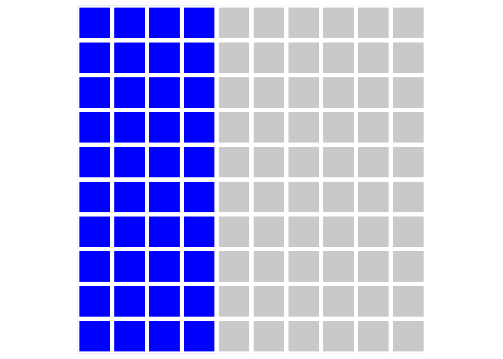
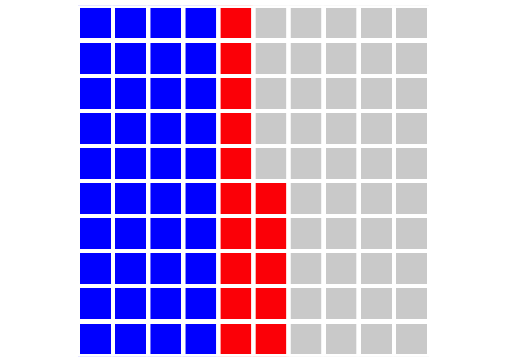
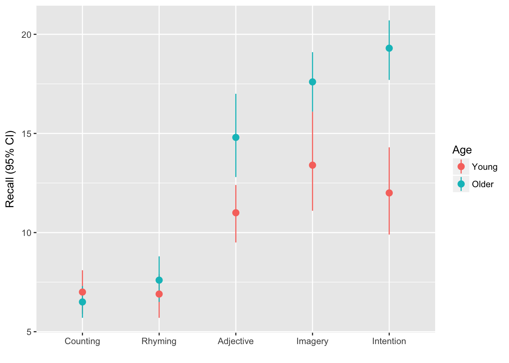
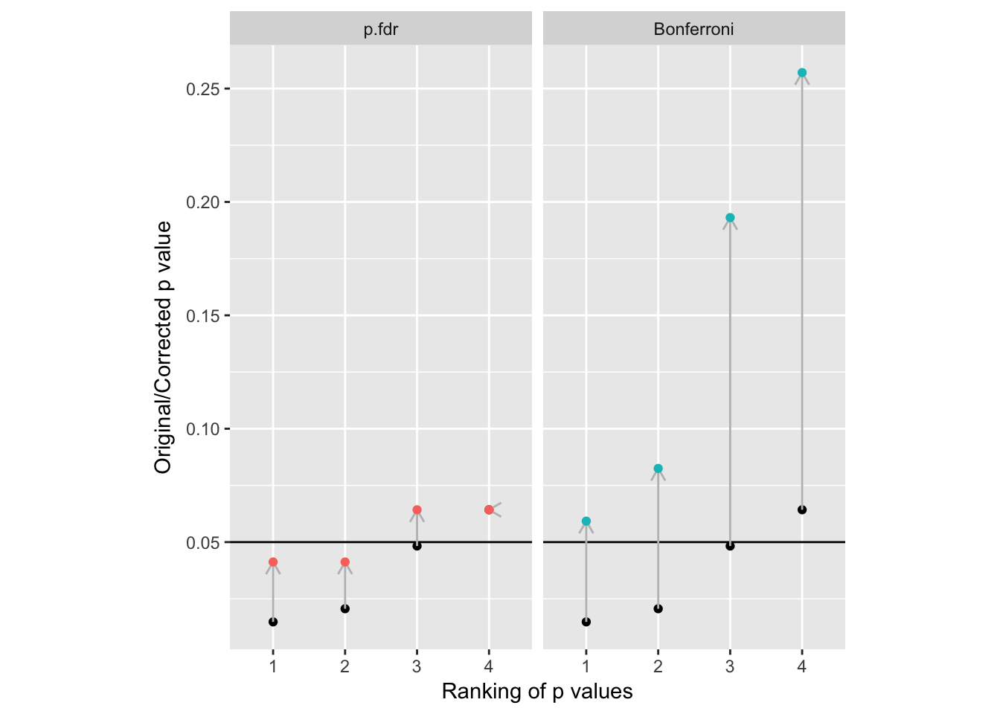

---
title: 'Multiple comparisons'

---


# Multiple comparisons {#multiple-comparisons}


People get confused about multiple comparisons and worry about 'doing things right'.

There are many different tests and procedures, and thousands of pages of tutorials and guides each of which recommends a slightly different approach. Textbooks typically describe the tests themselves in detail, and list the assumptions they make, but it sometimes feels like nobody will give a straight answer. 

The inconsistency arises because different researchers have different priorities. It might help to re-address what a *p* value is, and what it is *for*.


### *p* values and 'false discoveries' {-}

In frequentist statistics, *p* values are defined as *the probability of obtaining a test statistic at least as large as that observed, if the null hypothesis is true. That is, it's the chance that the data we have collected are atypical and will mislead us into thinking there is a difference, when the true effect is zero.

Let's pretend we are creative researchers and, over the course of our career, we will develop 100 hypotheses, each of which we test in an experiment, represented by squares in the plot below:


We are concientious and use [sample size calculations](#power) for our studies, setting our desired power = .8, and use *p* = .05 as our criterion for rejecting the null hypotheses. As is common, we report tests which reject the null hypothesis *as if our predictions had been supported, and the alternative hypotheses were true* (this is a bad idea, but run with it for the moment).

Let's be generous and say that, in reality, 50% of our hypotheses are true (the other 50% are nice ideas, but are not correct). Because we set our power to be .8 in our sample size calculation, this means that over the course of our career we will detect around 40 'true' effects, and publish them. These are shown in blue in the figure below:




Because we set our alpha level to 0.05, we will also have some false positives, shown in red:




But what that means is that *for the effects we publish as supporting our hypotheses* (i.e. the blue and red squares) then we will be making false claims 5/40 = 12.5% of the time. This is obviously much higher than the nominal alpha level implies. What's more, if we're not hotshot theorists (or work in an area where theories are less rigorously developed) and only 20% of our hypotheses are in fact true then we will make even more false claims: 5/20 = 25%.


### Multiple tests on the same data {-}

Another problem arises when we run multiple statistical tests on the same data. 

The most common case is that we have multiple experimental conditions and want to test whether any of the differences between them are significant. If we had experimental 3 groups, then there are 3 possible comparisons between them, for example (A-B, A-C, B-C). This can be compounded if we have multiple outcome measurements (for example, measuring depression *and* anxiety in a clincal trial; see @feise2002multiple).

<!-- TODO Add wonka ticket image -->


This works like a lucky dip or lottery: if you buy more tickets you have a larger change of winning a prize. In this case, with three comparisons between the groups (tickets) we have a 15% chance of winning a prize, rather than the 5% we intended.

Assuming each of our 100 experiments allows for 3 tests, any of which would be 'interesting' if significant (and we would therefore publish them), then our plot looks like this:


And our 'false discovery rate' (at the level of our published papers) is now over one third: 15/40 = 37.5%.


##### False discovery rates for single experiments {-}

We can also think about a false discovery rate for findings presented within a particular paper, or set of analyses. Imagine we have a 2x4 factorial design, and so we have 8 experimental groups, and 28 possible pairwise combinations:


-----------------
 Cell.No   A   B 
--------- --- ---
    1      1   0 

    2      2   0 

    3      3   0 

    4      4   0 

    5      1   1 

    6      2   1 

    7      3   1 

    8      4   1 
-----------------

Table: 8 cells in the 2x4 design


--------------------------------
 Comparison   Cells             
------------ ------- ----- -----
     1          1     vs.    2  

     2          1     vs.    3  

     3          1     vs.    4  

    ...        ...    ...   ... 

     26         6     vs.    7  

     27         6     vs.    8  

     28         7     vs.    8  
--------------------------------

Table: Pairwise comparisons

Assuming there are 'real' differences between only one-third of these pairings, then we have the same problem as we did when considering all the experiments in a researchers' career: Using *p* < .05 as our criterion, and power of .8 then we will report around 9 significant differences, but 1 or 2 of these will false discoveries (16%).


### What to do about it? {-}


There are two decisions you need to make: First, which technique do you want to use to mitigate the risks of multiple comparisons? Second, what is the 'family' of tests you are going to apply this to?


[If you find the whole language around null hypothesis testing and p values unhelpful, and the detail of multiple comparison adjustment confusing, there is another way: Multiple comparison problems are largely a non-issue for Bayesian analyses [@gelman2012we], and recent developments in the software make simple models like Anova and regression [easy to implement in a Bayesian framework in R](#bayes-mcmc).]{.explainer}


#### Which technique? {-}

Inevitably, it depends! 

- If your worry is ever making a type 1 error then you need to *control the familywise error rate*. The Bonferroni or Tukey correction are likely the best solutions (see details below). Both have the disadvantage of increasing the type 2 error rate: you will falsely accept the null more frequently, and so neglect findings which are 'true' and might be theoretically or clinically relevant.

- If your main concern is about the number of 'false discoveries' you make, and you think it's import to you to avoid rejecting 'good' hypotheses, then you need a technique to control the *false discovery rate*. The Benjamini and Hochberg method, often abbreviated as BH or FDR correction, is what you need.


Principled arguments can be made for both approaches; there is no 'correct choice'. Which you pick will depend on which concerns are most pressing to you, and  also (inevitably) what is conventional in your field.

[It's worth noting that in specific fields (for example neuroscience, where huge numbers of comparisons must be made between voxels or regions in brain imaging studies) more sophisticated methods to control for multiple comparisons are often commonplace and expected [@nichols2003controlling]. This guide only deals with some of the simpler but common cases.]{.explainer}


#### How big is the family? {-}


Whichever technique we employ we do need to determine how many tests we want to correct for having run; i.e. what size the 'family' of tests is. Unfortuntately, deciding which set of tests constitutes a 'family' is an unresolved problem, and reasonable people will come up with different solutions. As @feise2002multiple put it:

> It is unclear how wide the operative term "family" should be [...] Does "family" include tests that were performed, but not published? Does it include a meta-analysis upon those tests? Should future papers on the same data set be accounted for in the first publication? Should each researcher have a career-wise adjusted p-value, or should there be a discipline-wise adjusted p-value? Should we publish an issue-wise adjusted p-value and a year-end-journal-wise adjusted p-value? Should our studies examine only one association at a time, thereby wasting valuable resources? No statistical theory provides answers for these practical issues, because it is impossible to formally account for an infinite number of potential inferences.

The 'right' answer, then, will vary from case to case, and local conventions in particular disciplines will dictate what is normal and expected by supervisors and reviewers. However, there are a few common cases for which we can make some recommendations on what might constitue 'good practice'. We do not claim that these are the 'correct' answers, but if you deviate from these recommendations it would be worth having a reasonable justification to hand!


##### Multiple outcome variables {-}

In a clinical trial or other applied study you might want to measure more than one variable to detect changes across a variety of domains (e.g. both depression and anxiety).

Although no firm consensus exists, it is common practice to:

- Analyse multiple outcomes without correction (and indicate this in the text)
- Designate one outcome from the study to be 'primary', and report this both in pre-trial protocols and reports of the results.

See @feise2002multiple for more details.


##### Multiple 'timepoints' for the outcome {-}

Another common case is where the same outcome variable is measured on multiple occasions to track progress over time. For example, an RCT might measure outcome at baseline, at the end of treatment, and again 12 months later.

In the cases where there are only a few measurements of outcome made then you could choose between:

1. Bonferroni correction of *p* values for the between-group difference at each timepoint or
2. Designating one of the timepoints as the 'primary' outcome.

In practice option 2 is more common, and probably makes more sense in applied settings where it is the longer-term prognosis of participants wich matters most.


##### Pairwise comparisons in factorial designs {-}

Let's say you have a complex complex factorial design and so multiple pairwise comparisons and other contrasts are possible.

- If you are only interested in a small number of the possible pairwise comparisons or specific contrasts then specify this up front. Either report the comparisons without correction (noting this in the text) or use FDR/Bonferroni correction for this small family of tests. 

- If you are only interested in specific main effects or interactions from the full factorial model, then you should specify this in advance and report these F-tests or t-tests and associated *p* values without correction.

- It is perfectly reasonable to be interested only in specific pairwise comparisons contained within an Anova F-test. It is normal to report the F from the Anova, but it is *not* necessary for the F test to be significant before reporting the pairwise comparison of interest (with or without FDR/Bonferroni correction). 

- If you have not specified the comparisons of interest in advance, then use FDR or Tukey correction for the complete set of pairwise tests. If you feel able to claim that some of these pairwise comparisons would *never* have been of interest then you could reduce the family size for this correction accordingly, but you should make this justification in your report.


### Practical examples {- #contrasts-examples}


#### Factorial Anova and pairwise comparisons {-}


In the [Anova cookbook](#howell-factorial-example), we used a dataset from Howell's textbook which recorded `Recall` among young v.s. older adults (`Age`) for each of 5 conditions:



In an ideal world we would have published a trial protocol before collecting data, or at the least [specified which comparisons were of interest to us](#register-predictions). However for the purposes of this example I'll assume you didn't do this, and need to address the potential for mutliple comparisons accordingly.


The design of the study suggests that we were interested in the effect of the experimental conditions on recall, and we might have predicted that these experimental manipulations would affect older and younder adults differently. Because we didn't pre-specify our analyses, we should acknowledge that we would likly report any differences between any of the 5 experimental conditions (10 possible comparisons) and any differences between younger and older adults in any of those conditions (45 possible pairwise comparisons).

Because replicating this experiment is relatively cheap (testing might only take 30 minutes per participant), and we are confident that other labs would want to replicate any significant findings we report, we are less concerned with the absolute rate of type 1 errors, but would like to limit our 'false discovery rate' (we have a repututation to maintain). We set our acceptable false discovery rate to 5%.

We run an Anova model, including main effects for `Age` and `Condition` and their interaction:


```r
eysenck.model <- lm(Recall ~ Age * Condition, 
                    data=eysenck)

car::Anova(eysenck.model, type=3) %>% 
  pander()
```


-------------------------------------------------------
      &nbsp;         Sum Sq   Df   F value    Pr(>F)   
------------------- -------- ---- --------- -----------
  **(Intercept)**     490     1     61.05    9.85e-12  

      **Age**         1.25    1    0.1558      0.694   

   **Condition**     351.5    4     10.95     2.8e-07  

 **Age:Condition**   190.3    4     5.928    0.0002793 

   **Residuals**     722.3    90     NA         NA     
-------------------------------------------------------

Table: Anova Table (Type III tests)

We report that there is are significant main effects for Age, Condition, and a significant interaction for `Age:Condition`.  At this point, if we hadn't already plotted the raw data, we would certainly want to do that, or to [make predictions for each cell in the design and plot them](#understanding-interactions).

Because the plot of the raw data (see above) suggested that the counting and rhyming conditions produced lower recall rates than the other conditions, we might want to report the relevant pairwise tests. We can use the the `lsmeans()` function from the `lsmeans::` package to compute these:


```r
# use the lsmeans function which returns an lsm.list object.
eysenck.lsm <- lsmeans::lsmeans(eysenck.model, pairwise~Condition) 
NOTE: Results may be misleading due to involvement in interactions

# the `contrasts` element in this list is what we want for now
eysenck.lsm$contrasts 
 contrast              estimate        SE df t.ratio p.value
 Counting - Rhyming       -0.50 0.8958547 90  -0.558  0.9807
 Counting - Adjective     -6.15 0.8958547 90  -6.865  <.0001
 Counting - Imagery       -8.75 0.8958547 90  -9.767  <.0001
 Counting - Intention     -8.90 0.8958547 90  -9.935  <.0001
 Rhyming - Adjective      -5.65 0.8958547 90  -6.307  <.0001
 Rhyming - Imagery        -8.25 0.8958547 90  -9.209  <.0001
 Rhyming - Intention      -8.40 0.8958547 90  -9.377  <.0001
 Adjective - Imagery      -2.60 0.8958547 90  -2.902  0.0367
 Adjective - Intention    -2.75 0.8958547 90  -3.070  0.0231
 Imagery - Intention      -0.15 0.8958547 90  -0.167  0.9998

Results are averaged over the levels of: Age 
P value adjustment: tukey method for comparing a family of 5 estimates 
```

By default Tukey correction is applied for multiple comparisons, which is a reasonable choice. If you wanted to adjust for the false discovery rate instead, you can use the `adjust` argument:


```r
# not run, just shown as an example
lsmeans::lsmeans(eysenck.model, pairwise~Condition, adjust="fdr") 
```


The plot also suggested that older and younger adults appeared to differ for the 'adjective', 'imagery', and 'intention' conditions. We can compute these detailed pairwise comparisons by including the interaction term, `Age:Condition` in the call to `lsmeans()`:


```r
eysenck.age.condition.lsm <- 
  lsmeans::lsmeans(eysenck.model, 
                   pairwise~Age:Condition, 
                   adjust="fdr")

eysenck.age.condition.lsm$contrasts %>% 
  broom::tidy() %>% 
  snip.middle(., 4) %>% 
  pander(missing="...", caption="8 of the 45 possible contrasts, FDR corrected", split.tables=Inf)
```


----------------------------------------------------------------------------------------
     level1            level2        estimate   std.error   df    statistic    p.value  
----------------- ----------------- ---------- ----------- ----- ----------- -----------
 Young,Counting    Older,Counting      0.5        1.267     90     0.3947      0.7263   

 Young,Counting     Young,Rhyming      0.1        1.267     90     0.07893     0.9373   

 Young,Counting     Older,Rhyming      -0.6       1.267     90     -0.4736     0.6824   

 Young,Counting    Young,Adjective      -4        1.267     90     -3.157     0.003251  

       ...               ...           ...         ...      ...      ...         ...    

  Young,Imagery    Older,Intention     -5.9       1.267     90     -4.657     2.612e-05 

  Older,Imagery    Young,Intention     5.6        1.267     90      4.42      5.888e-05 

  Older,Imagery    Older,Intention     -1.7       1.267     90     -1.342      0.2288   

 Young,Intention   Older,Intention     -7.3       1.267     90     -5.762     3.972e-07 
----------------------------------------------------------------------------------------

Table: 8 of the 45 possible contrasts, FDR corrected

You should note that the FDR adjusted p values do not represent probabilities in the normal sense. Instead, the p value now indicates the *false discovery rate at which the p value should be considered statistically significant*. So, for example, if the adjusted p value = 0.09, then this indicates the contrast *would* be significant if the acceptable false discovery rate is 10%. Researchers often set their acceptable false discovery rate to be 5% out of habit or confusion with conventional levels for alpha, but it would be reasonable to set it to 10% or even higher in some circumstances. Whatever level you set, you need to be able to satisfy both yourself and a reviewer that the result is of interest: the particular values for alpha and FDR you agree on are arbitrary conventions, provided you both agree the finding is worthy of consideration!


###### Extracting pairwise comparisons to display in your report {- #extract-contrasts}

In the code above we request FDR-adjusted p values, and then use the `broom::tidy()` function to convert the table into a dataframe, and then use `pander` to display the results as a table. For more information on extracting results from models and other R objects and displaying them properly see the section: [models are data too](#models-are-data-too).


##### Adjusting for the FDR by hand {-}

If you have a set of tests for which you want to adjust for the FDR it's easy to use R's `p.adjust()` to do this for you.


```r
set.seed(5)
p.examples <- 
  data_frame(p = runif(4, min=.001, max=.07)) %>% 
  mutate(p.fdr = p.adjust(p, method="fdr"),
         p.sig = ifelse(p < .05, "*", ""),
         p.fdr.sig = ifelse(p.fdr < .05, "*", "")) 

p.examples %>% 
  arrange(p) %>% 
  pander(caption="Randomly generated 'p values', with and without FDR correction applied.")
```


---------------------------------------
    p       p.fdr    p.sig   p.fdr.sig 
--------- --------- ------- -----------
 0.01481   0.04125     *         *     

 0.02062   0.04125     *         *     

 0.04828   0.06426     *               

 0.06426   0.06426                     
---------------------------------------

Table: Randomly generated 'p values', with and without FDR correction applied.

We can plot these values to see the effect the adjustment has:

<div class="figure">

<p class="caption">(\#fig:unnamed-chunk-15)Example of the adjustments made to p values by FDR and Bonferroni methods. Unadjusted p values are shown in black. Note how conservative Bonferroni is with even this small number of comparisons to correct for.</p>
</div>


#### Other contrasts {- #contrasts}


The `lsmeans::` package provides tools to compute contrasts for Anova and other linear models:


```r
library(lsmeans)
```


We can see a number of these different contrasts below. First, we run a model model including the factor Days:


```r
slope.model <- lmer(Reaction ~ factor(Days) + (1|Subject),
                    data=lme4::sleepstudy)
```


And then we create the `lsmeans` object:

```r
slope.model.lsm <- lsmeans::lsmeans(slope.model, ~Days)
```

We can use this `lsm` object to calculate various contrasts we might want to see. First, consecutive contrasts where each level is compared with the next:


```r
lsmeans::contrast(slope.model.lsm, "consec")
 contrast   estimate       SE     df t.ratio p.value
 1 - 0     7.8439500 10.47531 152.99   0.749  0.9887
 2 - 1     0.8661444 10.47531 152.99   0.083  1.0000
 3 - 2    17.6301111 10.47531 152.99   1.683  0.5276
 4 - 3     5.6574111 10.47531 152.99   0.540  0.9988
 5 - 4    19.8690333 10.47531 152.99   1.897  0.3777
 6 - 5     3.6598000 10.47531 152.99   0.349  1.0000
 7 - 6     6.5723278 10.47531 152.99   0.627  0.9965
 8 - 7    17.8789222 10.47531 152.99   1.707  0.5102
 9 - 8    14.2217167 10.47531 152.99   1.358  0.7626

P value adjustment: mvt method for 9 tests 
```


Polynomial contrasts allow us to test whether the increase in RT's over the days is linear or curved:


```r
lsmeans::contrast(slope.model.lsm, "poly", adjust="fdr", max.degree=3)
 contrast    estimate       SE     df t.ratio p.value
 linear    1727.10218 134.5578 152.99  12.835  <.0001
 quadratic   88.97389  85.1018 152.99   1.045  0.4462
 cubic      -65.30289 686.1126 152.99  -0.095  0.9243

P value adjustment: fdr method for 3 tests 
```


If we don't specify a contrasts argument, or a type of correction, we will get Tukey contrasts for every pairwise comparison:


```r
# 45 tests - results not shown because similar to those shown above
lsmeans::contrast(slope.model.lsm, "tukey")
```


If we want to compare particular levels of `Days` with a specific reference level we can use the `trt.vs.ctrl` contrast type. In this example we are comparing each day with day 0, because day 0 is the first in the list of days and we specified `ref=1` (try running the comparisons against day 5).


```r
lsmeans::contrast(slope.model.lsm, "trt.vs.ctrl", ref=1, adjust="fdr")
 contrast  estimate       SE     df t.ratio p.value
 1 - 0     7.843950 10.47531 152.99   0.749  0.4551
 2 - 0     8.710094 10.47531 152.99   0.831  0.4551
 3 - 0    26.340206 10.47531 152.99   2.515  0.0167
 4 - 0    31.997617 10.47531 152.99   3.055  0.0040
 5 - 0    51.866650 10.47531 152.99   4.951  <.0001
 6 - 0    55.526450 10.47531 152.99   5.301  <.0001
 7 - 0    62.098778 10.47531 152.99   5.928  <.0001
 8 - 0    79.977700 10.47531 152.99   7.635  <.0001
 9 - 0    94.199417 10.47531 152.99   8.993  <.0001

P value adjustment: fdr method for 9 tests 
```


And if we want to compare each level against the grand mean of the sample, the `eff` contrast type is short for `effect`. A way of thinking of this (in English) is that we are asking 'what is the effect of being on a particular day, relative the other average of all days'. 


```r
lsmeans::contrast(slope.model.lsm, "eff", adjust="fdr")
 contrast   estimate       SE     df t.ratio p.value
 0 effect -41.856086 7.027049 152.99  -5.956  <.0001
 1 effect -34.012136 7.027049 152.99  -4.840  <.0001
 2 effect -33.145992 7.027049 152.99  -4.717  <.0001
 3 effect -15.515881 7.027049 152.99  -2.208  0.0410
 4 effect  -9.858469 7.027049 152.99  -1.403  0.1627
 5 effect  10.010564 7.027049 152.99   1.425  0.1627
 6 effect  13.670364 7.027049 152.99   1.945  0.0670
 7 effect  20.242692 7.027049 152.99   2.881  0.0076
 8 effect  38.121614 7.027049 152.99   5.425  <.0001
 9 effect  52.343331 7.027049 152.99   7.449  <.0001

P value adjustment: fdr method for 10 tests 
```

To list all the availble contrast types, or see the relevant help files, you can type:


```r
# help file describing all the contrasts families
help(pairwise.lsmc)
```


#### Contrasts for interactions {- #interaction-pairwise-contrasts}

Let's recall [our example of factorial Anova](#howell-factorial-example):


```r
car::Anova(eysenck.model, type=3) %>% 
  pander
```


-------------------------------------------------------
      &nbsp;         Sum Sq   Df   F value    Pr(>F)   
------------------- -------- ---- --------- -----------
  **(Intercept)**     490     1     61.05    9.85e-12  

      **Age**         1.25    1    0.1558      0.694   

   **Condition**     351.5    4     10.95     2.8e-07  

 **Age:Condition**   190.3    4     5.928    0.0002793 

   **Residuals**     722.3    90     NA         NA     
-------------------------------------------------------

Table: Anova Table (Type III tests)


We can compute pairwise comparisons within the interaction as follows:


```r
eysenck.lsm <- lsmeans::lsmeans(eysenck.model, ~Age:Condition)
```

And the various contrasts, here comparing each cell agains the grand mean:


```r
lsmeans::contrast(eysenck.lsm, "eff", adjust="fdr")
 contrast               estimate        SE df t.ratio p.value
 Young,Counting effect     -4.61 0.8498823 90  -5.424  <.0001
 Older,Counting effect     -5.11 0.8498823 90  -6.013  <.0001
 Young,Rhyming effect      -4.71 0.8498823 90  -5.542  <.0001
 Older,Rhyming effect      -4.01 0.8498823 90  -4.718  <.0001
 Young,Adjective effect    -0.61 0.8498823 90  -0.718  0.5275
 Older,Adjective effect     3.19 0.8498823 90   3.753  0.0004
 Young,Imagery effect       1.79 0.8498823 90   2.106  0.0475
 Older,Imagery effect       5.99 0.8498823 90   7.048  <.0001
 Young,Intention effect     0.39 0.8498823 90   0.459  0.6474
 Older,Intention effect     7.69 0.8498823 90   9.048  <.0001

P value adjustment: fdr method for 10 tests 
```


Or all of the pairwise tests with Tukey adjustment:


```r
lsmeans::contrast(eysenck.lsm, "tukey") %>% 
  broom::tidy() %>% 
  snip.middle(4) %>% 
  pander(missing="...", caption="Some of the Tukey corrected pairwise contrasts (table abbreviated)")
```


----------------------------------------------------------------------------------------
     level1            level2        estimate   std.error   df    statistic    p.value  
----------------- ----------------- ---------- ----------- ----- ----------- -----------
 Young,Counting    Older,Counting      0.5        1.267     90     0.3947         1     

 Young,Counting     Young,Rhyming      0.1        1.267     90     0.07893        1     

 Young,Counting     Older,Rhyming      -0.6       1.267     90     -0.4736        1     

 Young,Counting    Young,Adjective      -4        1.267     90     -3.157      0.06328  

       ...               ...           ...         ...      ...      ...         ...    

  Young,Imagery    Older,Intention     -5.9       1.267     90     -4.657     0.0004513 

  Older,Imagery    Young,Intention     5.6        1.267     90      4.42      0.001095  

  Older,Imagery    Older,Intention     -1.7       1.267     90     -1.342      0.9409   

 Young,Intention   Older,Intention     -7.3       1.267     90     -5.762     5.006e-06 
----------------------------------------------------------------------------------------

Table: Some of the Tukey corrected pairwise contrasts (table abbreviated)

