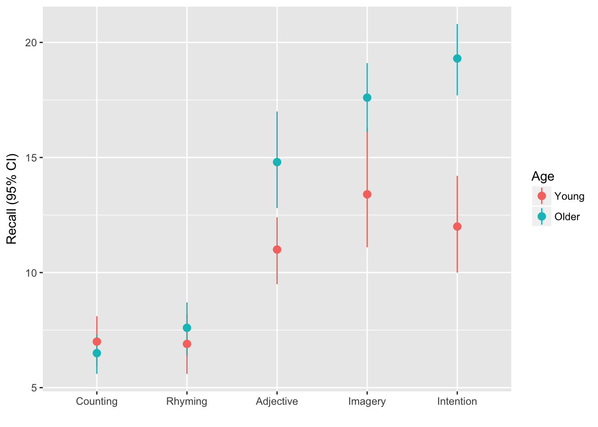
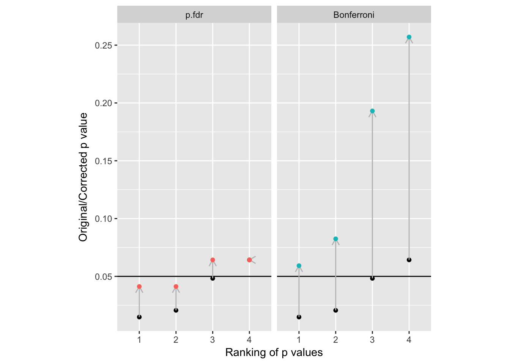
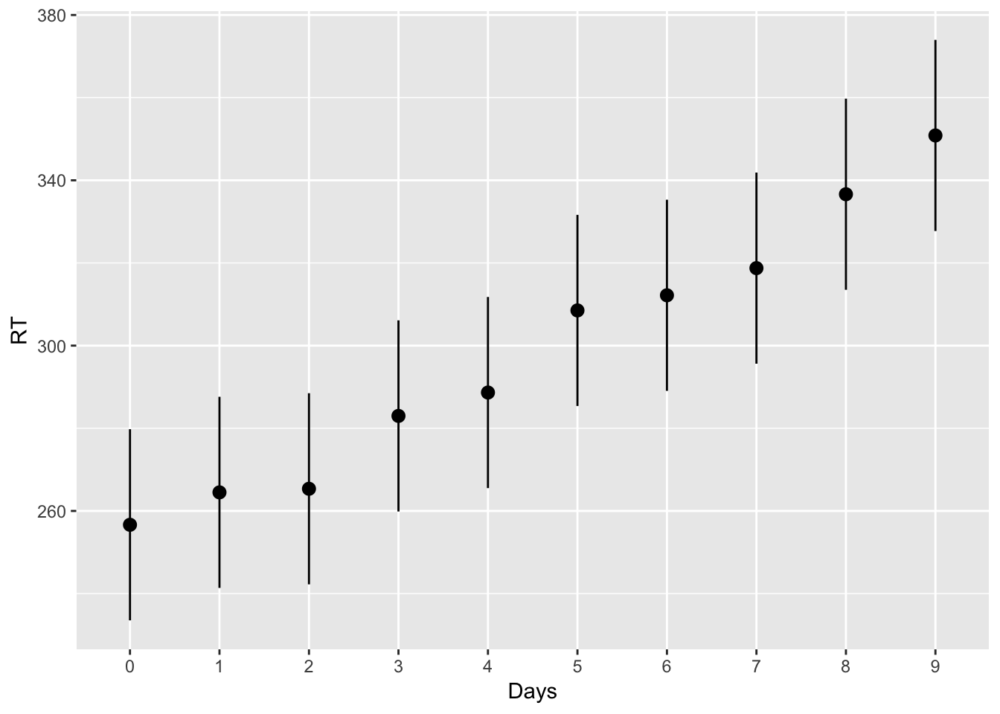

# Multiple comparisons {#multiple-comparisons}


People get very confused about multiple comparisons and 'doing things right™'. There are many different tests and procedures, and thousands of pages of tutorials and guides each of which recommends a slightly different approach. Textbooks typically describe the tests themselves in detail, and list the assumptions they make, but it sometimes feels like nobody will give a straight answer. 

The inconsistency arises because different researchers have different priorities. It will help to re-address what a p value is, and what it is for.


### *p* values and 'false discoveries'

In frequentist statistics, *p* values are defined as *the probability of obtaining a test statistic at least as large as that observed, if the null hypothesis is true. That is, it's the probability that the data we have will mislead us into thinking there is a difference, if the effect we test is, in fact, zero.

Let's pretend we are creative researchers and, over the course of our career, we will develop 100 hypotheses, each of which we test in an experiment, represented by squares in the plot below:


```r
x <- c(experiments=100)
waffle::waffle(x, colors=c("lightgrey"))
```



We are concientious and use [sample size calculations](#power) for our studies, setting our desired power = .8, and use *p* = .05 as our criterion for rejecting the null hypotheses. As is common, we report tests which reject the null hypothesis as if our predictions had been supported and the alternative hypotheses were true.

Let's be generous and say that, in reality, 50% of our hypotheses are true (the other 50% are nice ideas, but don't pan out). Because we set our power to be .8 in our sample size calculation, this means that over the course of our career we will detect around 40 'true' effects, and publish them. These are shown in blue in the figure below:


Because we set our alpha level to 0.05, we will also have some false positives, shown in red:


But what that means is that *for the effects we publish as supporting our hypotheses* (i.e. the blue and red squares) then we will be making false claims 5/40 = 12.5% of the time. This is obviously much higher than the nominal alpha level implies. What's more, if we're not such hotshot theorists and only 20% of our hypotheses are in fact true then we will make even more false claims: 5/20 = 25%.


### Multiple tests on the same data {-}

Another problem arises when we run multiple statistical tests on the same data. 

The most common case is that we have multiple experimental conditions and want to test whether any of the differences between them are significant. If we had experimental 3 groups, then there are 3 possible comparisons between them, for example (A-B, A-C, B-C). This can be compounded if we have multiple outcome measurements (for example, measuring depression *and* anxiety in a clincal trial; see @feise2002multiple).

This works like a lucky dip or lottery: if you buy more tickets you have a larger change of winning a prize. In this case, with three comparisons between the groups (tickets) we have a 15% chance of winning a prize, rather than the 5% we intended.

Assuming each of our 100 experiments allows for 3 tests, any of which would be 'interesting' if significant (and we would therefore publish them), then our plot looks like this:


And our 'false discovery rate' (at the level of our published papers) is now over one third: 15/40 = 37.5%.


##### False discovery rates for single experiments {-}

We can also think about a false discovery rate for findings presented within a particular paper, or set of analyses. Imagine we have a 2x4 factorial design, and so we have 8 experimental groups, and 28 possible pairwise combinations:


-------
 A   B 
--- ---
 1   1 

 2   1 

 1   2 

 2   2 

 1   3 

 2   3 

 1   4 

 2   4 
-------

Table: Cells in the 2x4 design


------------------------------
 Comparison   Cell.1   Cell.2 
------------ -------- --------
     1          1        2    

     2          1        3    

     3          1        4    

    ...        ...      ...   

     26         6        7    

     27         6        8    

     28         7        8    
------------------------------

Table: Pairwise comparisons

Assuming there are 'real' differences between one third of these pairings, then we have the same problem as we did when considering all the experiments in a researchers' career: Using *p* < .05 as our criterion, and power of .8 then we will report around 9 significant differences, but 1 or 2 of these will false discoveries (16%).


### What to do about it? {-}


There are two decisions you need to make: First, which technique do you want to use to mitigate the risks of multiple comparisons? Second, what is the 'family' of tests you are going to apply this to?


[If you find the whole language around null hypothesis testing and p values unhelpful, and the detail of multiple comparison adjustment confusing, there is another way: Multiple comparison problems are largely a non-issue for Bayesian analyses [@gelman2012we], and recent developments in the software make simple models like Anova and regression [easy to implement in a Bayesian framework in R](#bayes-mcmc).]{.explainer}


#### Which technique? {-}

Inevitably, it depends! 

- If your main worry is about ever making a type 1 error then you need to control the familywise error rate. The Bonferroni or Tukey correction are likely the best solutions (see details below). Both have the disadvantage of increasing the type 2 error rate: you will falsely accept the null, even when your alternative hypothesis is correct more often.

- If your main concern is about the number of 'false discoveries' you make, and it's import to you to avoid rejecting 'good' hypotheses, then you need to control the false discovery rate. The Benjamini and Hochberg method, often abbreviated as BH or FDR correction, is what you need.


Principled arguments can be made for both approaches, and which you pick will depend on which concerns are most pressing to you, and what is 'normal' in your field.

[It's worth noting that in specific fields (for example neuroscience, where huge numbers of comparisons must be made between voxels or regions in brain imaging studies) more sophisticated methods to control for multiple comparisons are often commonplace and expected [@nichols2003controlling]. This guide only deals with some of the simpler but common cases.]{.explainer}


#### How big is the family? {-}


Whichever technique we employ we do need to determine how many tests we want to correct for having run; i.e. what size the 'family' of tests is. Unfortuntately, deciding which set of tests constitutes a 'family' is an unresolved problem, and reasonable people will come up with different solutions. As @feise2002multiple put it:

> It is unclear how wide the operative term "family" should be [...] Does "family" include tests that were performed, but not published? Does it include a meta-analysis upon those tests? Should future papers on the same data set be accounted for in the first publication? Should each researcher have a career-wise adjusted p-value, or should there be a discipline-wise adjusted p-value? Should we publish an issue-wise adjusted p-value and a year-end-journal-wise adjusted p-value? Should our studies examine only one association at a time, thereby wasting valuable resources? No statistical theory provides answers for these practical issues, because it is impossible to formally account for an infinite number of potential inferences.

The 'right' answer, then, vary from case to case, and local conventions in particular disciplines will dictate what is normal and expected by supervisors and reviewers. However, there are a few common cases for which we can make some recommendations on what might constitue 'good practice'. We do not claim that these are the 'correct' answers, but if you deviate from these recommendations it would be worth having a reasonable justification to hand!


##### Multiple outcome variables {-}

In a clinical trial or other applied study you might want to measure more than one variable to detect changes across a variety of domains (e.g. both depression and anxiety).

Although no firm consensus exists, it is common practice to:

- Analyse multiple outcomes without correction (and indicate this in the text)
- Designate one outcome from the study to be 'primary', and report this both in pre-trial protocols and reports of the results.

See @feise2002multiple for more details.


#### Multiple 'timepoints' for the outcome {-}

Another common case is where the same outcome variable will be measured on multiple occasions to track progress over time. For example, an RCT might measure outcome at treatment end, and again 12 months later.

In the cases where there are only a few measurements of outcome made then you could choose between:

1. Bonferroni correction of *p* values for the between-group difference at each timepoint or
2. Designating one of the timepoints as the 'primary' outcome.

In practice option 2 is more common, and probably makes more sense in applied settings where it is the longer-term prognosis of participants wich matters most.


#### Pairwise comparisons in factorial designs {-}

Say you have a complex complex factorial design where multiple pairwise comparisons and other contrasts are possible.

- If you are only interested in specific main effects or interactions from the full factorial model then specify this in advance and report these F-tests and *p* values without correction.

- If you are only interested in a small number of the possible pairwise comparisons or specific contrasts then specify this up front. Either report the comparisons without correction (noting this in the text) or use FDR/Bonferroni correction for this small family of tests. 

- It is perfectly reasonable to be interested only in specific pairwise comparisons contained within an Anova F-test. It is normal to report the F from the Anova, but it is *not* necessary for the F test to be significant before reporting the pairwise comparison of interest (with or without FDR/Bonferroni correction). 

- If you have not specified the comparisons of interest in advance, then use FDR or Tukey correction for the complete set of pairwise tests. If you feel able to claim that some of these pairwise comparisons would *never* have been of interest then you could reduce the family size for this correction accordingly, but you should make this justification in your report.


### Practical examples {-}


#### Factorial Anova and pairwise comparisons {-}


In the [Anova cookbook](#howell-factorial-example), we used a dataset from Howell's textbook which recorded `Recall` among young v.s. older adults (`Age`) for each of 5 conditions:


In an ideal world we would have published a trial protocol before collecting data, and specified which comparisons were of interest to us. However for the purposes of this example I'll assume you didn't do this, and need to address the potential for mutliple comparisons accordingly.


The design of the study suggests that we were interested in the effect of the experimental conditions on recall, and we might have predicted that these experimental manipulations would affect older and younder adults differently. Because we didn't pre-specify our analyses, we should acknowledge that we would likly report any differences between any of the 5 experimental conditions (10 possible comparisons) and any differences between younger and older adults in any of those conditions (45 possible pairwise comparisons).

Because replicating this experiment is relatively cheap (testing might only take 30 minutes per participant), and we are confident that other labs would want to replicate any significant findings we report, we are less concerned with the absolute rate of type 1 errors, but would like to limit our 'false discovery rate'. We set our acceptable false discovery rate to 5%.

We run an Anova model, including main effects for `Age` and `Condition` and their interaction:


```r
eysenck.model <- lm(Recall~Age*Condition, data=eysenck)
car::Anova(eysenck.model, type=3)
## Anova Table (Type III tests)
## 
## Response: Recall
##               Sum Sq Df F value    Pr(>F)    
## (Intercept)   490.00  1 61.0550  9.85e-12 ***
## Age             1.25  1  0.1558 0.6940313    
## Condition     351.52  4 10.9500  2.80e-07 ***
## Age:Condition 190.30  4  5.9279 0.0002793 ***
## Residuals     722.30 90                      
## ---
## Signif. codes:  0 '***' 0.001 '**' 0.01 '*' 0.05 '.' 0.1 ' ' 1
```

We report that there is are significant main effects for Age, Condition, and a significant interaction for `Age:Condition`.  At this point, if we hadn't already plotted the raw data, we would certainly want to do that, or to [make predictions for each cell in the design and plot them](#understanding-interactions).

Because the plot of the raw data (see above) suggested that the counting and rhyming conditions produced lower recall rates than the other conditions, we might want to report the relevant pairwise tests. We can use the the `lsmeans()` function from the `lsmeans::` package to compute these:


```r
lsmeans::lsmeans(eysenck.model, pairwise~Condition)
## NOTE: Results may be misleading due to involvement in interactions
## $lsmeans
##  Condition lsmean        SE df  lower.CL  upper.CL
##  Counting    6.75 0.6334649 90  5.491511  8.008489
##  Rhyming     7.25 0.6334649 90  5.991511  8.508489
##  Adjective  12.90 0.6334649 90 11.641511 14.158489
##  Imagery    15.50 0.6334649 90 14.241511 16.758489
##  Intention  15.65 0.6334649 90 14.391511 16.908489
## 
## Results are averaged over the levels of: Age 
## Confidence level used: 0.95 
## 
## $contrasts
##  contrast              estimate        SE df t.ratio p.value
##  Counting - Rhyming       -0.50 0.8958547 90  -0.558  0.9807
##  Counting - Adjective     -6.15 0.8958547 90  -6.865  <.0001
##  Counting - Imagery       -8.75 0.8958547 90  -9.767  <.0001
##  Counting - Intention     -8.90 0.8958547 90  -9.935  <.0001
##  Rhyming - Adjective      -5.65 0.8958547 90  -6.307  <.0001
##  Rhyming - Imagery        -8.25 0.8958547 90  -9.209  <.0001
##  Rhyming - Intention      -8.40 0.8958547 90  -9.377  <.0001
##  Adjective - Imagery      -2.60 0.8958547 90  -2.902  0.0367
##  Adjective - Intention    -2.75 0.8958547 90  -3.070  0.0231
##  Imagery - Intention      -0.15 0.8958547 90  -0.167  0.9998
## 
## Results are averaged over the levels of: Age 
## P value adjustment: tukey method for comparing a family of 5 estimates
```

By default Tukey correction is applied for multiple comparisons, which is a reasonable choice. If you wanted to adjust for the false discovery rate instead, you can use the `adjust` argument:

The plot also suggested that older and younger adults appeared to differ for the 'adjective', 'imagery', and 'intention' conditions. We can compute these detailed pairwise comparisons by including the interaction term, `Age:Condition` in the call to `lsmeans()`:


```r
lsmeans::lsmeans(eysenck.model, pairwise~Age:Condition, adjust="fdr")
## $lsmeans
##  Age   Condition lsmean        SE df  lower.CL  upper.CL
##  Young Counting     7.0 0.8958547 90  5.220228  8.779772
##  Older Counting     6.5 0.8958547 90  4.720228  8.279772
##  Young Rhyming      6.9 0.8958547 90  5.120228  8.679772
##  Older Rhyming      7.6 0.8958547 90  5.820228  9.379772
##  Young Adjective   11.0 0.8958547 90  9.220228 12.779772
##  Older Adjective   14.8 0.8958547 90 13.020228 16.579772
##  Young Imagery     13.4 0.8958547 90 11.620228 15.179772
##  Older Imagery     17.6 0.8958547 90 15.820228 19.379772
##  Young Intention   12.0 0.8958547 90 10.220228 13.779772
##  Older Intention   19.3 0.8958547 90 17.520228 21.079772
## 
## Confidence level used: 0.95 
## 
## $contrasts
##  contrast                          estimate      SE df t.ratio p.value
##  Young,Counting - Older,Counting        0.5 1.26693 90   0.395  0.7263
##  Young,Counting - Young,Rhyming         0.1 1.26693 90   0.079  0.9373
##  Young,Counting - Older,Rhyming        -0.6 1.26693 90  -0.474  0.6824
##  Young,Counting - Young,Adjective      -4.0 1.26693 90  -3.157  0.0033
##  Young,Counting - Older,Adjective      -7.8 1.26693 90  -6.157  <.0001
##  Young,Counting - Young,Imagery        -6.4 1.26693 90  -5.052  <.0001
##  Young,Counting - Older,Imagery       -10.6 1.26693 90  -8.367  <.0001
##  Young,Counting - Young,Intention      -5.0 1.26693 90  -3.947  0.0003
##  Young,Counting - Older,Intention     -12.3 1.26693 90  -9.709  <.0001
##  Older,Counting - Young,Rhyming        -0.4 1.26693 90  -0.316  0.7701
##  Older,Counting - Older,Rhyming        -1.1 1.26693 90  -0.868  0.4472
##  Older,Counting - Young,Adjective      -4.5 1.26693 90  -3.552  0.0011
##  Older,Counting - Older,Adjective      -8.3 1.26693 90  -6.551  <.0001
##  Older,Counting - Young,Imagery        -6.9 1.26693 90  -5.446  <.0001
##  Older,Counting - Older,Imagery       -11.1 1.26693 90  -8.761  <.0001
##  Older,Counting - Young,Intention      -5.5 1.26693 90  -4.341  0.0001
##  Older,Counting - Older,Intention     -12.8 1.26693 90 -10.103  <.0001
##  Young,Rhyming - Older,Rhyming         -0.7 1.26693 90  -0.553  0.6387
##  Young,Rhyming - Young,Adjective       -4.1 1.26693 90  -3.236  0.0026
##  Young,Rhyming - Older,Adjective       -7.9 1.26693 90  -6.236  <.0001
##  Young,Rhyming - Young,Imagery         -6.5 1.26693 90  -5.131  <.0001
##  Young,Rhyming - Older,Imagery        -10.7 1.26693 90  -8.446  <.0001
##  Young,Rhyming - Young,Intention       -5.1 1.26693 90  -4.025  0.0002
##  Young,Rhyming - Older,Intention      -12.4 1.26693 90  -9.787  <.0001
##  Older,Rhyming - Young,Adjective       -3.4 1.26693 90  -2.684  0.0122
##  Older,Rhyming - Older,Adjective       -7.2 1.26693 90  -5.683  <.0001
##  Older,Rhyming - Young,Imagery         -5.8 1.26693 90  -4.578  <.0001
##  Older,Rhyming - Older,Imagery        -10.0 1.26693 90  -7.893  <.0001
##  Older,Rhyming - Young,Intention       -4.4 1.26693 90  -3.473  0.0013
##  Older,Rhyming - Older,Intention      -11.7 1.26693 90  -9.235  <.0001
##  Young,Adjective - Older,Adjective     -3.8 1.26693 90  -2.999  0.0051
##  Young,Adjective - Young,Imagery       -2.4 1.26693 90  -1.894  0.0789
##  Young,Adjective - Older,Imagery       -6.6 1.26693 90  -5.209  <.0001
##  Young,Adjective - Young,Intention     -1.0 1.26693 90  -0.789  0.4860
##  Young,Adjective - Older,Intention     -8.3 1.26693 90  -6.551  <.0001
##  Older,Adjective - Young,Imagery        1.4 1.26693 90   1.105  0.3222
##  Older,Adjective - Older,Imagery       -2.8 1.26693 90  -2.210  0.0392
##  Older,Adjective - Young,Intention      2.8 1.26693 90   2.210  0.0392
##  Older,Adjective - Older,Intention     -4.5 1.26693 90  -3.552  0.0011
##  Young,Imagery - Older,Imagery         -4.2 1.26693 90  -3.315  0.0021
##  Young,Imagery - Young,Intention        1.4 1.26693 90   1.105  0.3222
##  Young,Imagery - Older,Intention       -5.9 1.26693 90  -4.657  <.0001
##  Older,Imagery - Young,Intention        5.6 1.26693 90   4.420  0.0001
##  Older,Imagery - Older,Intention       -1.7 1.26693 90  -1.342  0.2288
##  Young,Intention - Older,Intention     -7.3 1.26693 90  -5.762  <.0001
## 
## P value adjustment: fdr method for 45 tests
```

You should note that the FDR adjusted p values do not represent probabilities in the normal sense. Instead, the p value now indicates the *false discovery rate at which the p value should be considered statistically significant*. So, for example, if the adjusted p value = 0.09, then this indicates the contrast *would* be significant if the acceptable false discovery rate is 10% (people often set their acceptable false discovery rate to be 5% out of habit, but this is not always appropriate).


###### Extracting pairwise comparisons to display in your report {- #extract-contrasts .explainer}

In the code below we request FDR-adjusted p values, and then use the `broom::tidy()` function to convert the table into a dataframe, and then show only the first 6 rows as a table in RMarkdown: 


```r

# calculate pairwise contrasts
eysenck.fdr <- lsmeans::lsmeans(eysenck.model, pairwise~Age:Condition, adjust="fdr")

# show the first 6 rows from this long table
eysenck.fdr$contrasts %>% 
  broom::tidy() %>% 
  head(6) %>% 
  pander(caption="First 6 rows of the pairwise contrasts with FDR-adjusted p values")
```


--------------------------------------------------------------------------
     level1           level2        estimate   std.error   df   statistic 
---------------- ----------------- ---------- ----------- ---- -----------
 Young,Counting   Older,Counting      0.5        1.267     90    0.3947   

 Young,Counting    Young,Rhyming      0.1        1.267     90    0.07893  

 Young,Counting    Older,Rhyming      -0.6       1.267     90    -0.4736  

 Young,Counting   Young,Adjective      -4        1.267     90    -3.157   

 Young,Counting   Older,Adjective     -7.8       1.267     90    -6.157   

 Young,Counting    Young,Imagery      -6.4       1.267     90    -5.052   
--------------------------------------------------------------------------

Table: First 6 rows of the pairwise contrasts with FDR-adjusted p values (continued below)

 
-----------
  p.value  
-----------
  0.7263   

  0.9373   

  0.6824   

 0.003251  

 7.626e-08 

 5.698e-06 
-----------


##### Adjusting for the FDR by hand {-}

If you have a set of tests for which you want to adjust for the FDR it's easy to use R's `p.adjust()` to do this for you.


```r
p.values <- runif(10, min=.001, max=.07)

p.values 
##  [1] 0.058450351 0.057388703 0.065677601 0.050283490 0.063641130
##  [6] 0.016050478 0.065551708 0.056473098 0.005825256 0.025059124
p.adjust(p.values, method="fdr")
##  [1] 0.06567760 0.06567760 0.06567760 0.06567760 0.06567760 0.06567760
##  [7] 0.06567760 0.06567760 0.05825256 0.06567760
```

We can plot these values to see the effect the adjustment has:


```
## geom_path: Each group consists of only one observation. Do you need to
## adjust the group aesthetic?
## geom_path: Each group consists of only one observation. Do you need to
## adjust the group aesthetic?
```

<div class="figure">

<p class="caption">(\#fig:unnamed-chunk-14)Example of the adjustments made to p values by FDR and Bonferroni methods. Unadjusted p values are shown in grey. Note these are the same p values adjusted by both methods, but each plot required a different scale: Bonferroni really is _very_ conservative with more than a small number of comparisons.</p>
</div>


#### Other contrasts {- #contrasts}


The `lsmeans::` package provides tools to compute contrasts for Anova and other linear models:


```r
library(lsmeans)
## Loading required package: estimability
## 
## Attaching package: 'lsmeans'
## The following object is masked from 'package:lmerTest':
## 
##     lsmeans
```


We can see a number of these different contrasts below. First, we run a model model including the factor Days:


```r
slope.model <- lmer(Reaction ~ factor(Days) + (1|Subject),
                    data=lme4::sleepstudy)
```


And then we create the `lsmeans` object:

```r
slope.model.lsm <- lsmeans::lsmeans(slope.model, ~Days)
```

Which  we can use to calculate the various contrasts. First, consecutive contrasts where each level is compared with the next:


```r
lsmeans::contrast(slope.model.lsm, "consec")
##  contrast   estimate       SE     df t.ratio p.value
##  1 - 0     7.8439500 10.47531 152.99   0.749  0.9887
##  2 - 1     0.8661444 10.47531 152.99   0.083  1.0000
##  3 - 2    17.6301111 10.47531 152.99   1.683  0.5278
##  4 - 3     5.6574111 10.47531 152.99   0.540  0.9988
##  5 - 4    19.8690333 10.47531 152.99   1.897  0.3777
##  6 - 5     3.6598000 10.47531 152.99   0.349  1.0000
##  7 - 6     6.5723278 10.47531 152.99   0.627  0.9965
##  8 - 7    17.8789222 10.47531 152.99   1.707  0.5103
##  9 - 8    14.2217167 10.47531 152.99   1.358  0.7627
## 
## P value adjustment: mvt method for 9 tests
```


Polynomial contrasts allow us to test whether the increase in RT's over the days is linear or curved:


```r
lsmeans::contrast(slope.model.lsm, "poly", adjust="fdr", max.degree=3)
##  contrast    estimate       SE     df t.ratio p.value
##  linear    1727.10218 134.5578 152.99  12.835  <.0001
##  quadratic   88.97389  85.1018 152.99   1.045  0.4462
##  cubic      -65.30289 686.1126 152.99  -0.095  0.9243
## 
## P value adjustment: fdr method for 3 tests
```


Tukey contrasts will provide Tukey's HSD test for every pairwise comparison:


```r
lsmeans::contrast(slope.model.lsm, "tukey", adjust="fdr")
##  contrast    estimate       SE     df t.ratio p.value
##  0 - 1     -7.8439500 10.47531 152.99  -0.749  0.4995
##  0 - 2     -8.7100944 10.47531 152.99  -0.831  0.4579
##  0 - 3    -26.3402056 10.47531 152.99  -2.515  0.0208
##  0 - 4    -31.9976167 10.47531 152.99  -3.055  0.0050
##  0 - 5    -51.8666500 10.47531 152.99  -4.951  <.0001
##  0 - 6    -55.5264500 10.47531 152.99  -5.301  <.0001
##  0 - 7    -62.0987778 10.47531 152.99  -5.928  <.0001
##  0 - 8    -79.9777000 10.47531 152.99  -7.635  <.0001
##  0 - 9    -94.1994167 10.47531 152.99  -8.993  <.0001
##  1 - 2     -0.8661444 10.47531 152.99  -0.083  0.9342
##  1 - 3    -18.4962556 10.47531 152.99  -1.766  0.1021
##  1 - 4    -24.1536667 10.47531 152.99  -2.306  0.0326
##  1 - 5    -44.0227000 10.47531 152.99  -4.203  0.0001
##  1 - 6    -47.6825000 10.47531 152.99  -4.552  <.0001
##  1 - 7    -54.2548278 10.47531 152.99  -5.179  <.0001
##  1 - 8    -72.1337500 10.47531 152.99  -6.886  <.0001
##  1 - 9    -86.3554667 10.47531 152.99  -8.244  <.0001
##  2 - 3    -17.6301111 10.47531 152.99  -1.683  0.1148
##  2 - 4    -23.2875222 10.47531 152.99  -2.223  0.0377
##  2 - 5    -43.1565556 10.47531 152.99  -4.120  0.0001
##  2 - 6    -46.8163556 10.47531 152.99  -4.469  <.0001
##  2 - 7    -53.3886833 10.47531 152.99  -5.097  <.0001
##  2 - 8    -71.2676056 10.47531 152.99  -6.803  <.0001
##  2 - 9    -85.4893222 10.47531 152.99  -8.161  <.0001
##  3 - 4     -5.6574111 10.47531 152.99  -0.540  0.6174
##  3 - 5    -25.5264444 10.47531 152.99  -2.437  0.0248
##  3 - 6    -29.1862444 10.47531 152.99  -2.786  0.0104
##  3 - 7    -35.7585722 10.47531 152.99  -3.414  0.0017
##  3 - 8    -53.6374944 10.47531 152.99  -5.120  <.0001
##  3 - 9    -67.8592111 10.47531 152.99  -6.478  <.0001
##  4 - 5    -19.8690333 10.47531 152.99  -1.897  0.0791
##  4 - 6    -23.5288333 10.47531 152.99  -2.246  0.0367
##  4 - 7    -30.1011611 10.47531 152.99  -2.874  0.0083
##  4 - 8    -47.9800833 10.47531 152.99  -4.580  <.0001
##  4 - 9    -62.2018000 10.47531 152.99  -5.938  <.0001
##  5 - 6     -3.6598000 10.47531 152.99  -0.349  0.7438
##  5 - 7    -10.2321278 10.47531 152.99  -0.977  0.3810
##  5 - 8    -28.1110500 10.47531 152.99  -2.684  0.0135
##  5 - 9    -42.3327667 10.47531 152.99  -4.041  0.0002
##  6 - 7     -6.5723278 10.47531 152.99  -0.627  0.5693
##  6 - 8    -24.4512500 10.47531 152.99  -2.334  0.0313
##  6 - 9    -38.6729667 10.47531 152.99  -3.692  0.0007
##  7 - 8    -17.8789222 10.47531 152.99  -1.707  0.1124
##  7 - 9    -32.1006389 10.47531 152.99  -3.064  0.0050
##  8 - 9    -14.2217167 10.47531 152.99  -1.358  0.2091
## 
## P value adjustment: fdr method for 45 tests
```


If we want to compare particular levels of `Days` with a specific reference level we can use the `trt.vs.ctrl` contrast type:


```r
lsmeans::contrast(slope.model.lsm, "trt.vs.ctrl", ref=1, adjust="fdr")
##  contrast  estimate       SE     df t.ratio p.value
##  1 - 0     7.843950 10.47531 152.99   0.749  0.4551
##  2 - 0     8.710094 10.47531 152.99   0.831  0.4551
##  3 - 0    26.340206 10.47531 152.99   2.515  0.0167
##  4 - 0    31.997617 10.47531 152.99   3.055  0.0040
##  5 - 0    51.866650 10.47531 152.99   4.951  <.0001
##  6 - 0    55.526450 10.47531 152.99   5.301  <.0001
##  7 - 0    62.098778 10.47531 152.99   5.928  <.0001
##  8 - 0    79.977700 10.47531 152.99   7.635  <.0001
##  9 - 0    94.199417 10.47531 152.99   8.993  <.0001
## 
## P value adjustment: fdr method for 9 tests
```


And if we want to compare each level against the grand mean, the `eff` contrast type is short for `effect`:


```r
lsmeans::contrast(slope.model.lsm, "eff", adjust="fdr")
##  contrast   estimate       SE     df t.ratio p.value
##  0 effect -41.856086 7.027049 152.99  -5.956  <.0001
##  1 effect -34.012136 7.027049 152.99  -4.840  <.0001
##  2 effect -33.145992 7.027049 152.99  -4.717  <.0001
##  3 effect -15.515881 7.027049 152.99  -2.208  0.0410
##  4 effect  -9.858469 7.027049 152.99  -1.403  0.1627
##  5 effect  10.010564 7.027049 152.99   1.425  0.1627
##  6 effect  13.670364 7.027049 152.99   1.945  0.0670
##  7 effect  20.242692 7.027049 152.99   2.881  0.0076
##  8 effect  38.121614 7.027049 152.99   5.425  <.0001
##  9 effect  52.343331 7.027049 152.99   7.449  <.0001
## 
## P value adjustment: fdr method for 10 tests
```

To list all the availble contrast types, or see the relevant help files, you can type:


```r
ls("package:lsmeans", pat=".lsmc")
##  [1] "consec.lsmc"       "del.eff.lsmc"      "dunnett.lsmc"     
##  [4] "eff.lsmc"          "mean_chg.lsmc"     "pairwise.lsmc"    
##  [7] "poly.lsmc"         "revpairwise.lsmc"  "trt.vs.ctrl.lsmc" 
## [10] "trt.vs.ctrl1.lsmc" "trt.vs.ctrlk.lsmc" "tukey.lsmc"
help(pairwise.lsmc)
```


#### Contrasts for interactions {- #interaction-pairwise-contrasts}

Let's recall [our example of factorial Anova](#howell-factorial-example):


```r
eysenck <- readRDS("data/eysenck.Rdata")
eysenck.model <- lm(Recall~Age*Condition, data=eysenck)
car::Anova(eysenck.model, type=3)
## Anova Table (Type III tests)
## 
## Response: Recall
##               Sum Sq Df F value    Pr(>F)    
## (Intercept)   490.00  1 61.0550  9.85e-12 ***
## Age             1.25  1  0.1558 0.6940313    
## Condition     351.52  4 10.9500  2.80e-07 ***
## Age:Condition 190.30  4  5.9279 0.0002793 ***
## Residuals     722.30 90                      
## ---
## Signif. codes:  0 '***' 0.001 '**' 0.01 '*' 0.05 '.' 0.1 ' ' 1
```


We can compute pairwise comparisons within the interaction as follows:


```r
eysenck.lsm <- lsmeans::lsmeans(eysenck.model, ~Age:Condition)
```

And the various contrasts, here comparing each cell agains the grand mean:


```r
lsmeans::contrast(eysenck.lsm, "eff", adjust="fdr")
##  contrast               estimate        SE df t.ratio p.value
##  Young,Counting effect     -4.61 0.8498823 90  -5.424  <.0001
##  Older,Counting effect     -5.11 0.8498823 90  -6.013  <.0001
##  Young,Rhyming effect      -4.71 0.8498823 90  -5.542  <.0001
##  Older,Rhyming effect      -4.01 0.8498823 90  -4.718  <.0001
##  Young,Adjective effect    -0.61 0.8498823 90  -0.718  0.5275
##  Older,Adjective effect     3.19 0.8498823 90   3.753  0.0004
##  Young,Imagery effect       1.79 0.8498823 90   2.106  0.0475
##  Older,Imagery effect       5.99 0.8498823 90   7.048  <.0001
##  Young,Intention effect     0.39 0.8498823 90   0.459  0.6474
##  Older,Intention effect     7.69 0.8498823 90   9.048  <.0001
## 
## P value adjustment: fdr method for 10 tests
```


Or all of the pairwise tests with Tukey adjustment:


```r
lsmeans::contrast(eysenck.lsm, "tukey")
##  contrast                          estimate      SE df t.ratio p.value
##  Young,Counting - Older,Counting        0.5 1.26693 90   0.395  1.0000
##  Young,Counting - Young,Rhyming         0.1 1.26693 90   0.079  1.0000
##  Young,Counting - Older,Rhyming        -0.6 1.26693 90  -0.474  1.0000
##  Young,Counting - Young,Adjective      -4.0 1.26693 90  -3.157  0.0633
##  Young,Counting - Older,Adjective      -7.8 1.26693 90  -6.157  <.0001
##  Young,Counting - Young,Imagery        -6.4 1.26693 90  -5.052  0.0001
##  Young,Counting - Older,Imagery       -10.6 1.26693 90  -8.367  <.0001
##  Young,Counting - Young,Intention      -5.0 1.26693 90  -3.947  0.0058
##  Young,Counting - Older,Intention     -12.3 1.26693 90  -9.709  <.0001
##  Older,Counting - Young,Rhyming        -0.4 1.26693 90  -0.316  1.0000
##  Older,Counting - Older,Rhyming        -1.1 1.26693 90  -0.868  0.9970
##  Older,Counting - Young,Adjective      -4.5 1.26693 90  -3.552  0.0205
##  Older,Counting - Older,Adjective      -8.3 1.26693 90  -6.551  <.0001
##  Older,Counting - Young,Imagery        -6.9 1.26693 90  -5.446  <.0001
##  Older,Counting - Older,Imagery       -11.1 1.26693 90  -8.761  <.0001
##  Older,Counting - Young,Intention      -5.5 1.26693 90  -4.341  0.0015
##  Older,Counting - Older,Intention     -12.8 1.26693 90 -10.103  <.0001
##  Young,Rhyming - Older,Rhyming         -0.7 1.26693 90  -0.553  0.9999
##  Young,Rhyming - Young,Adjective       -4.1 1.26693 90  -3.236  0.0511
##  Young,Rhyming - Older,Adjective       -7.9 1.26693 90  -6.236  <.0001
##  Young,Rhyming - Young,Imagery         -6.5 1.26693 90  -5.131  0.0001
##  Young,Rhyming - Older,Imagery        -10.7 1.26693 90  -8.446  <.0001
##  Young,Rhyming - Young,Intention       -5.1 1.26693 90  -4.025  0.0044
##  Young,Rhyming - Older,Intention      -12.4 1.26693 90  -9.787  <.0001
##  Older,Rhyming - Young,Adjective       -3.4 1.26693 90  -2.684  0.1963
##  Older,Rhyming - Older,Adjective       -7.2 1.26693 90  -5.683  <.0001
##  Older,Rhyming - Young,Imagery         -5.8 1.26693 90  -4.578  0.0006
##  Older,Rhyming - Older,Imagery        -10.0 1.26693 90  -7.893  <.0001
##  Older,Rhyming - Young,Intention       -4.4 1.26693 90  -3.473  0.0260
##  Older,Rhyming - Older,Intention      -11.7 1.26693 90  -9.235  <.0001
##  Young,Adjective - Older,Adjective     -3.8 1.26693 90  -2.999  0.0950
##  Young,Adjective - Young,Imagery       -2.4 1.26693 90  -1.894  0.6728
##  Young,Adjective - Older,Imagery       -6.6 1.26693 90  -5.209  0.0001
##  Young,Adjective - Young,Intention     -1.0 1.26693 90  -0.789  0.9986
##  Young,Adjective - Older,Intention     -8.3 1.26693 90  -6.551  <.0001
##  Older,Adjective - Young,Imagery        1.4 1.26693 90   1.105  0.9830
##  Older,Adjective - Older,Imagery       -2.8 1.26693 90  -2.210  0.4578
##  Older,Adjective - Young,Intention      2.8 1.26693 90   2.210  0.4578
##  Older,Adjective - Older,Intention     -4.5 1.26693 90  -3.552  0.0205
##  Young,Imagery - Older,Imagery         -4.2 1.26693 90  -3.315  0.0411
##  Young,Imagery - Young,Intention        1.4 1.26693 90   1.105  0.9830
##  Young,Imagery - Older,Intention       -5.9 1.26693 90  -4.657  0.0005
##  Older,Imagery - Young,Intention        5.6 1.26693 90   4.420  0.0011
##  Older,Imagery - Older,Intention       -1.7 1.26693 90  -1.342  0.9409
##  Young,Intention - Older,Intention     -7.3 1.26693 90  -5.762  <.0001
## 
## P value adjustment: tukey method for comparing a family of 10 estimates
```


### Followup tests using `lmer` {- #contrasts-lmer }

Many of the contrasts possible after lm and Anova models are also possible using `lmer` for [multilevel models](#multilevel-models).

Let's say we repeat one of the models from above, looking at the effect of `Days` of sleep deprivation on reaction times:


```r
sleep <- lme4::sleepstudy %>% mutate(Days=factor(Days))
m <- lmer(Reaction~Days+(1|Subject), data=sleep)
anova(m)
## Analysis of Variance Table of type III  with  Satterthwaite 
## approximation for degrees of freedom
##      Sum Sq Mean Sq NumDF DenDF F.value    Pr(>F)    
## Days 166235   18471     9   153  18.703 < 2.2e-16 ***
## ---
## Signif. codes:  0 '***' 0.001 '**' 0.01 '*' 0.05 '.' 0.1 ' ' 1
```

[One quirk of `lsmeansLT` is that you can't specify that a variable is a factor within a formula. So the model `lmer(Reaction~factor(Days)+(1|Subject), data=lme4::sleepstudy)` would be fine, and we could use it with `lsmeansLT` to get cell means, but this would later fail if we tried to calculate contrasts. This is why in the example we transform `Days` to be a factor in in a copy of the dataframe, and then run the model.]{.tip}


We can see a significant effect of `Days`, and so want to compute followup tests. 

To first estimate cell means and create an `lsmeans` object, you can use the `lsmeans()` function in the `lsmeans::` package:


```r
m.lsm <- lsmeans::lsmeans(m, "Days")
m.lsm
##  Days   lsmean       SE    df lower.CL upper.CL
##  0    256.6518 11.45778 41.98 233.5288 279.7748
##  1    264.4958 11.45778 41.98 241.3727 287.6188
##  2    265.3619 11.45778 41.98 242.2389 288.4849
##  3    282.9920 11.45778 41.98 259.8690 306.1150
##  4    288.6494 11.45778 41.98 265.5264 311.7724
##  5    308.5185 11.45778 41.98 285.3954 331.6415
##  6    312.1783 11.45778 41.98 289.0552 335.3013
##  7    318.7506 11.45778 41.98 295.6276 341.8736
##  8    336.6295 11.45778 41.98 313.5065 359.7525
##  9    350.8512 11.45778 41.98 327.7282 373.9742
## 
## Degrees-of-freedom method: satterthwaite 
## Confidence level used: 0.95
```


We could extract these estimates and plot them if required:


```r
m.lsm.df <- m.lsm %>% broom::tidy()
m.lsm.df %>% 
  ggplot(aes(Days, estimate, ymin=conf.low, ymax=conf.high)) + 
  geom_pointrange() + 
  ylab("RT")
```




If we wanted to compare each day against every other day we can use `contrast()`:


```r
m.tukey <- lsmeans::contrast(m.lsm, 'tukey') 
m.tukey
##  contrast    estimate       SE     df t.ratio p.value
##  0 - 1     -7.8439500 10.47531 152.99  -0.749  0.9991
##  0 - 2     -8.7100944 10.47531 152.99  -0.831  0.9980
##  0 - 3    -26.3402056 10.47531 152.99  -2.515  0.2692
##  0 - 4    -31.9976167 10.47531 152.99  -3.055  0.0770
##  0 - 5    -51.8666500 10.47531 152.99  -4.951  0.0001
##  0 - 6    -55.5264500 10.47531 152.99  -5.301  <.0001
##  0 - 7    -62.0987778 10.47531 152.99  -5.928  <.0001
##  0 - 8    -79.9777000 10.47531 152.99  -7.635  <.0001
##  0 - 9    -94.1994167 10.47531 152.99  -8.993  <.0001
##  1 - 2     -0.8661444 10.47531 152.99  -0.083  1.0000
##  1 - 3    -18.4962556 10.47531 152.99  -1.766  0.7554
##  1 - 4    -24.1536667 10.47531 152.99  -2.306  0.3914
##  1 - 5    -44.0227000 10.47531 152.99  -4.203  0.0018
##  1 - 6    -47.6825000 10.47531 152.99  -4.552  0.0004
##  1 - 7    -54.2548278 10.47531 152.99  -5.179  <.0001
##  1 - 8    -72.1337500 10.47531 152.99  -6.886  <.0001
##  1 - 9    -86.3554667 10.47531 152.99  -8.244  <.0001
##  2 - 3    -17.6301111 10.47531 152.99  -1.683  0.8033
##  2 - 4    -23.2875222 10.47531 152.99  -2.223  0.4457
##  2 - 5    -43.1565556 10.47531 152.99  -4.120  0.0024
##  2 - 6    -46.8163556 10.47531 152.99  -4.469  0.0006
##  2 - 7    -53.3886833 10.47531 152.99  -5.097  <.0001
##  2 - 8    -71.2676056 10.47531 152.99  -6.803  <.0001
##  2 - 9    -85.4893222 10.47531 152.99  -8.161  <.0001
##  3 - 4     -5.6574111 10.47531 152.99  -0.540  0.9999
##  3 - 5    -25.5264444 10.47531 152.99  -2.437  0.3118
##  3 - 6    -29.1862444 10.47531 152.99  -2.786  0.1506
##  3 - 7    -35.7585722 10.47531 152.99  -3.414  0.0274
##  3 - 8    -53.6374944 10.47531 152.99  -5.120  <.0001
##  3 - 9    -67.8592111 10.47531 152.99  -6.478  <.0001
##  4 - 5    -19.8690333 10.47531 152.99  -1.897  0.6712
##  4 - 6    -23.5288333 10.47531 152.99  -2.246  0.4303
##  4 - 7    -30.1011611 10.47531 152.99  -2.874  0.1223
##  4 - 8    -47.9800833 10.47531 152.99  -4.580  0.0004
##  4 - 9    -62.2018000 10.47531 152.99  -5.938  <.0001
##  5 - 6     -3.6598000 10.47531 152.99  -0.349  1.0000
##  5 - 7    -10.2321278 10.47531 152.99  -0.977  0.9932
##  5 - 8    -28.1110500 10.47531 152.99  -2.684  0.1898
##  5 - 9    -42.3327667 10.47531 152.99  -4.041  0.0033
##  6 - 7     -6.5723278 10.47531 152.99  -0.627  0.9998
##  6 - 8    -24.4512500 10.47531 152.99  -2.334  0.3734
##  6 - 9    -38.6729667 10.47531 152.99  -3.692  0.0112
##  7 - 8    -17.8789222 10.47531 152.99  -1.707  0.7901
##  7 - 9    -32.1006389 10.47531 152.99  -3.064  0.0750
##  8 - 9    -14.2217167 10.47531 152.99  -1.358  0.9379
## 
## P value adjustment: tukey method for comparing a family of 10 estimates
```

Or we might want to see if there was a significant change between any consecutive days (it doesn't look like there was):


```r
m.contrast.consecutive <- lsmeans::contrast(m.lsm, 'consec', method="fdr") 
m.contrast.consecutive
##  Days_consec   estimate       SE     df t.ratio p.value
##  1 - 0        7.8439500 10.47531 152.99   0.749  0.4551
##  2 - 1        0.8661444 10.47531 152.99   0.083  0.9342
##  3 - 2       17.6301111 10.47531 152.99   1.683  0.0944
##  4 - 3        5.6574111 10.47531 152.99   0.540  0.5899
##  5 - 4       19.8690333 10.47531 152.99   1.897  0.0597
##  6 - 5        3.6598000 10.47531 152.99   0.349  0.7273
##  7 - 6        6.5723278 10.47531 152.99   0.627  0.5313
##  8 - 7       17.8789222 10.47531 152.99   1.707  0.0899
##  9 - 8       14.2217167 10.47531 152.99   1.358  0.1766
```


<!-- 

###### The FDR Algorithm {- .explainer}


```r
# Set our acceptable false discovery rate to 10%
FDR <- .1
lsmeans::lsmeans(eysenck.model, pairwise~Age:Condition, adjust="none")$contrast %>%
  broom::tidy() %>%
  select(level1, level2, p.value) %>%
  arrange(p.value) %>%
  mutate(`q (10% FDR)` = (rank(p.value)/length(p.value))*FDR) %>%
  mutate(p.fdr.adjust=p.adjust(p.value, method="BH")) %>%
  mutate(significant = as.numeric(p.value < `q (10% FDR)`)) %>%
  # just show some of the results, at the break between sig and ns contrast
  filter(p.fdr.adjust > .01 & p.fdr.adjust < .4) %>%
  pander(caption="Subset of contrasts, showing the break between significant and ns results, as determined by an FDR of 10%.", split.tables=Inf)
```


-----------------------------------------------------------------------------------------
     level1            level2        p.value    q (10% FDR)   p.fdr.adjust   significant 
----------------- ----------------- ---------- ------------- -------------- -------------
  Older,Rhyming    Young,Adjective   0.008667     0.07111       0.01219           1      

 Older,Adjective   Young,Intention   0.02964      0.07333       0.03923           1      

 Older,Adjective    Older,Imagery    0.02964      0.07556       0.03923           1      

 Young,Adjective    Young,Imagery    0.06139      0.07778       0.07893           1      

  Older,Imagery    Older,Intention    0.183        0.08          0.2288           0      

 Older,Adjective    Young,Imagery     0.2721      0.08222        0.3222           0      

  Young,Imagery    Young,Intention    0.2721      0.08444        0.3222           0      
-----------------------------------------------------------------------------------------

Table: Subset of contrasts, showing the break between significant and ns results, as determined by an FDR of 10%.

-->


<!---
TO ADD? https://rawgit.com/geneticsMiNIng/FactorMerger/master/materials/vignette.html
--->
