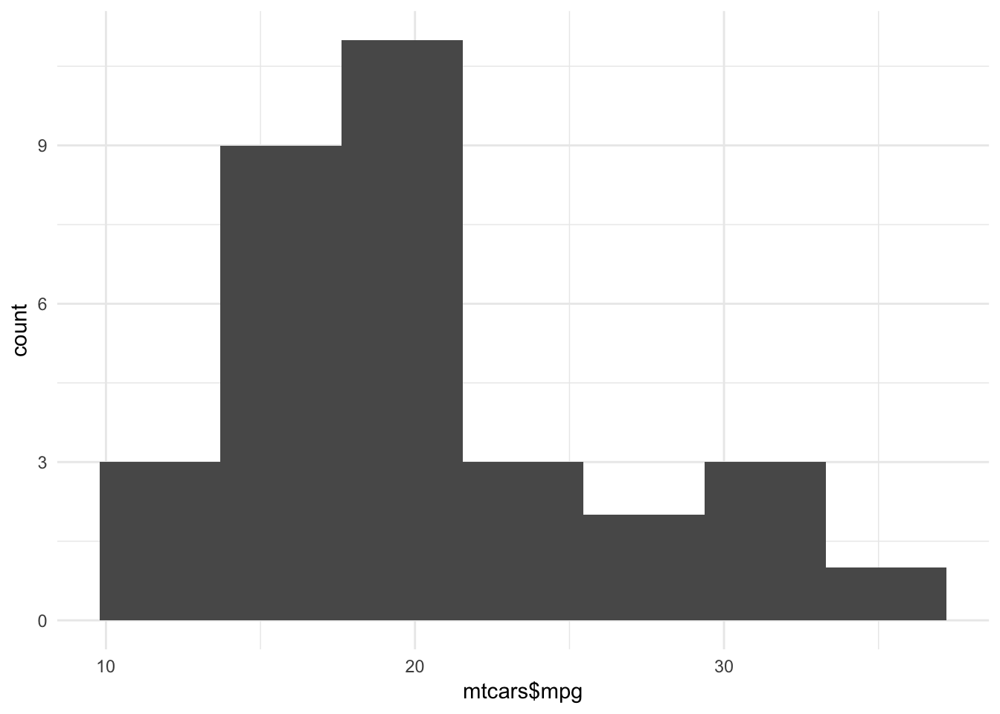

## Packages {- #packages}

R has been around for a very long time, but has remained popular because it is easy for people to add new functions to it. 

You can run almost any statistical model and produce a wide variety of graphics in R because people have contributed new functions and these extend the base language. These new features are distributed in bundles known as 'packages'. For now we'll assume someone has helped you install all the packages you need^[See the [installation guide](installation.html) if this isn't the case].

To *access* the features in packages, you normally load the package with the `library()` function. Running `library(<packagename>)` loads all the new functions within it, and it is then possible to call them from your code. For example, typing:


```r
library(ggplot2)
```

Will load the `ggplot2` package. You can then call the `qplot` function it provides:


```r
qplot(mtcars$mpg, bins=7)
```




#### {- #package-namespacing}

You don't strictly *need* to load packages to use the features within them though. If a package is installed on your system you can also call a function it provides directly. In the example below we call the `hist.data.frame` from the `Hmisc` package, and obtain histograms of all the variables in the `mtcars` dataset:


```r
Hmisc::hist.data.frame(mtcars)
```


The rule is to type `package::function(parameters)`, where `::` separates the package and function names. Parameters are just the inputs to the function.


There are two reasons not to load a package before using it:

1. Laziness: it can save typing if you just want to use one function from a package, and only once.

2. Explicitness: It's an unfortunate fact that some function names are repeated across a number of packages. This can be confusing if they work differently, and if you don't know which package the version you are using comes from. Using `package_name:function_name` can help make things explicit.


