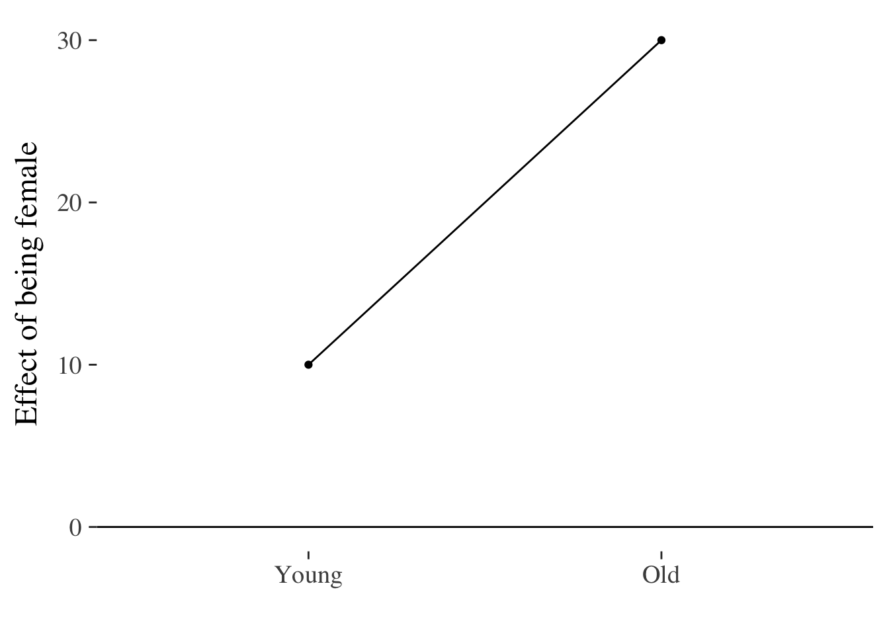
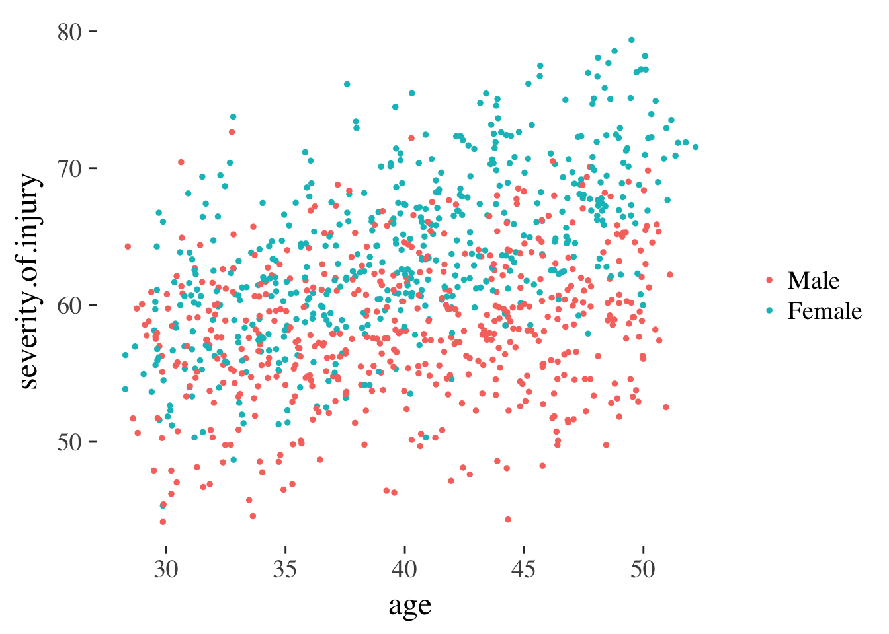
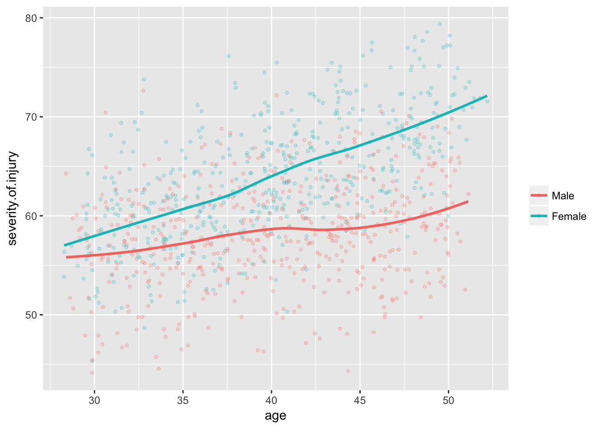
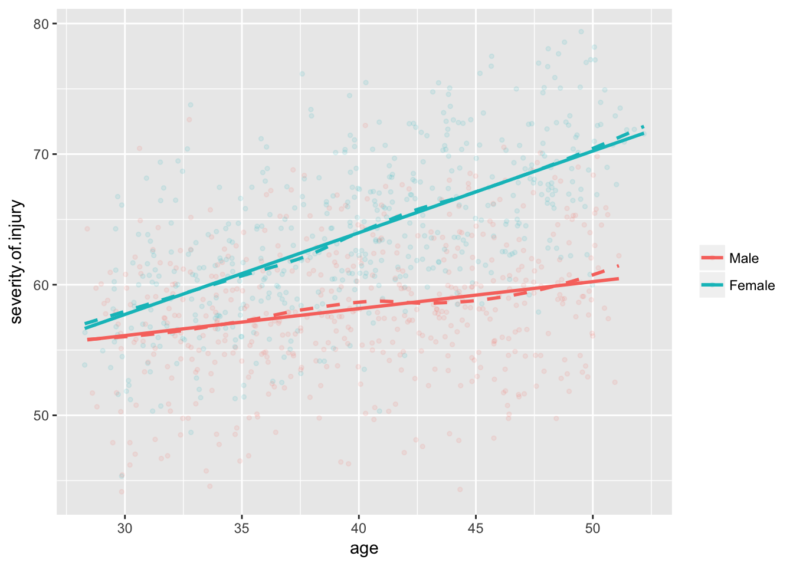
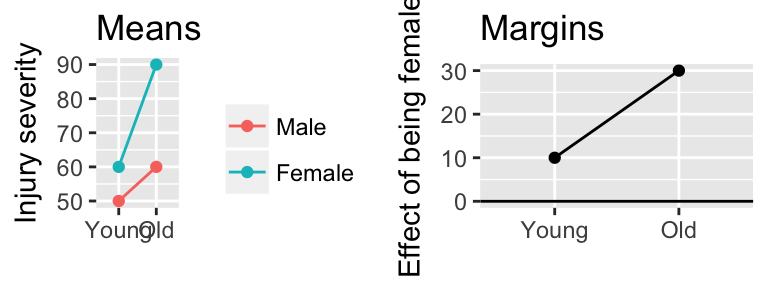
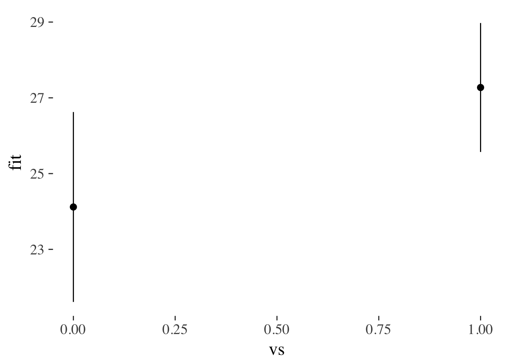
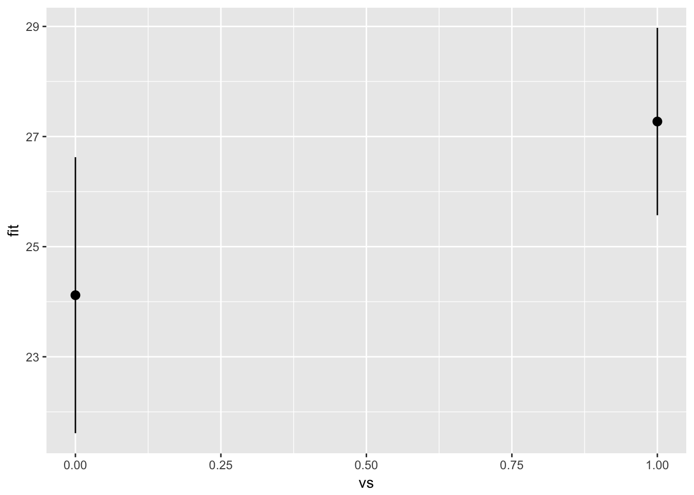
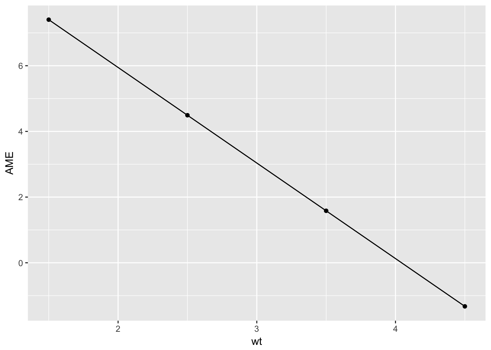

---
title: 'Making predictions from models'
bibliography: bibliography.bib
---


# Making predictions {#predictions-and-margins}


Objectives of this section:

- Distingish predicted means (predictions) from predicted effects ('margins')
- Calculate both predictions and marginal effects for a `lm()`
- Plot predictions and margins
- Think about how to plot effects in meaningful ways


### Predictions vs margins {-}

Before we start, let's consider what we're trying to achieve in making predictions from our models. We need to make a distinction between:

- Predicted means
- Predicted effects or *marginal effects*

Consider the example used in a previous section where we measured `injury.severity` after road accidents, plus two predictor variables: `gender` and `age`.


### Predicted means {-}

'Predicted means' (or predictions) refers to our best estimate for each category of person we're interested in. For example, if `age` were categorical (i.e. young vs. older people) then might have 4 predictions to calculate from our model:


-----------------------
  Age    Gender   mean 
------- -------- ------
 Young    Male     ?   

  Old     Male     ?   

 Young   Female    ?   

  Old    Female    ?   
-----------------------

And as before, we might plot these data:

<div class="figure">

<p class="caption">(\#fig:unnamed-chunk-4)Point and line plot of injury severity by age and gender.</p>
</div>


This plot uses the raw data, but these points could equally have been estimated from a statistical model which adjusted for other predictors.


### *Effects* (margins) {-}

Terms like: *predicted effects*, *margins* or *marginal effects* refer, instead, to the effect of one predictor.

There may be more than one marginal effect because *the effect of one predictor can change across the range of another predictor*.

Extending the example above, if we take the difference between men and women for each category of age, we can plot these differences. The steps we need to go through are:

- Reshape the data to be wide, including a separate column for injury scores for men and women
- Subtract the score for men from that of women, to calculate the effect of being female
- Plot this difference score


```r
margins.plot <- inter.df %>% 
  # reshape the data to a wider format
  reshape2::dcast(older~female) %>% 
  # calculate the difference between men and women for each age
  mutate(effect.of.female = Female - Male) %>% 
  # plot the difference
  ggplot(aes(older, effect.of.female, group=1)) + 
    geom_point() +
    geom_line() + 
    ylab("Effect of being female")  + xlab("") +
    geom_hline(yintercept = 0)
Using severity.of.injury as value column: use value.var to override.
margins.plot
```


As before, these differences use the raw data, but *could* have been calculated from a statistical model. In the section below we do this, making predictions for means and marginal effects from a `lm()`.


### Continuous predictors {-}

In the examples above, our data were all categorical, which mean that it was straightforward to identify categories of people for whom we might want to make a prediction (i.e. young men, young women, older men, older women).

However, `age` is typically measured as a continuous variable, and we would want to use a grouped scatter plot to see this:


```r
injuries %>% 
  ggplot(aes(age, severity.of.injury, group=gender, color=gender)) + 
  geom_point(size=1) + 
  scale_color_discrete(name="")
```




But to make predictions from this continuous data we need to fit a line through the points (i.e. run a model). We can do this graphically by calling `geom_smooth()` which attempts to fit a smooth line through the data we observe:


```r
injuries %>% 
  ggplot(aes(age, severity.of.injury, group=gender, color=gender)) + 
  geom_point(alpha=.2, size=1) + 
  geom_smooth(se=F)+
  scale_color_discrete(name="")
```

<div class="figure">

<p class="caption">(\#fig:unnamed-chunk-8)Scatter plot overlaid with smooth best-fit lines</p>
</div>


And if we are confident that the relationships between predictor and outcome are sufficiently *linear*, then we can ask ggplot to fit a straight line using linear regression:


```r
injuries %>% 
  ggplot(aes(age, severity.of.injury, group=gender, color=gender)) + 
  geom_point(alpha = .1, size = 1) + 
  geom_smooth(se = F, linetype="dashed") +
  geom_smooth(method = "lm", se = F) +
  scale_color_discrete(name="")
```

<div class="figure">

<p class="caption">(\#fig:unnamed-chunk-9)Scatter plot overlaid with smoothed lines (dotted) and linear predictions (coloured)</p>
</div>


What these plots illustrate is the steps a researcher might take *before* fitting a regression model. The straight lines in the final plot represent our best guess for a person of a given age and gender, assuming a linear regression. 

We can read from these lines to make a point prediction for men and women of a specific age, and use the information about our uncertainty in the prediction, captured by the model, to estimate the likely error.

To make our findings simpler to communicate, we might want to make estimates at specific ages and plot these. These ages could be:

- Values with biological or cultural meaning: for example 18 (new driver) v.s. 65 (retirement age)
- Statistical convention (e.g. median, 25th, and 75th centile, or mean +/- 1 SD) 

We'll see examples of both below.


## Predicted means and margins using `lm()` {-}

The section above details two types of predictions: predictions for means, and predictions for margins (effects). We can use the figure below as a way of visualising the difference:


```r
gridExtra::grid.arrange(means.plot+ggtitle("Means"), margins.plot+ggtitle("Margins"), ncol=2)
```

<div class="figure">

<p class="caption">(\#fig:unnamed-chunk-10)Example of predicted means vs. margins. Note, the margin plotted in the second panel is the difference between the coloured lines in the first. A horizontal line is added at zero in panel 2 by convention.</p>
</div>


### Running the model {-}

Lets say we want to run a linear model  predicts injury severity from gender and a categorical measurement of age (young v.s. old).

Our model formula would be: `severity.of.injury ~ age.category * gender`. Here we fit it an request the Anova table which enables us to test the main effects and interaction^[Because this is simulated data, the main effects and interactions all have tiny p values.]:


```r
injurymodel <- lm(severity.of.injury ~ age.category * gender,  data=injuries)
anova(injurymodel)
Analysis of Variance Table

Response: severity.of.injury
                     Df  Sum Sq Mean Sq F value    Pr(>F)    
age.category          1  4173.3  4173.3 154.573 < 2.2e-16 ***
gender                1  8488.5  8488.5 314.404 < 2.2e-16 ***
age.category:gender   1  1141.5  1141.5  42.279  1.25e-10 ***
Residuals           996 26890.8    27.0                      
---
Signif. codes:  0 '***' 0.001 '**' 0.01 '*' 0.05 '.' 0.1 ' ' 1
```

Having saved the regression model in the variable `injurymodel` we can use this to make predictions for means and estimate marginal effects:


### Making predictions for means {-}

When making predictions, they key question to bear in mind is 'predictions for what?' That is, what values of the predictor variables are we going to use to estimate the outcome?

It goes like this:

1. Create a new dataframe which contains the values of the predictors we want to make predictions at
2. Make the predictions using the `predict()` function.
3. Convert the output of `predict()` to a dataframe and plot the numbers.


#### Step 1: Make a new dataframe {-}


```r
prediction.data <- data_frame(
  age.category = c("young", "older", "young", "older"),
  gender = c("Male", "Male", "Female", "Female")
)
prediction.data
# A tibble: 4 x 2
  age.category gender
         <chr>  <chr>
1        young   Male
2        older   Male
3        young Female
4        older Female
```


#### Step 2: Make the predictions {-}

The R `predict()` function has two useful arguments:

- `newdata`, which we set to our new data frame containing the predictor values of interest
- `interval` which we here set to confidence^[This gives us the confidence interval for the prediction, which is the range within which we would expect the true value to fall, 95% of the time, if we replicated the study. We could ask instead for the `prediction` interval, which would be the range within which 95% of new observations with the same predictor values would fall. For more on this see the section on [confidence v.s. prediction intervals](confidence-vs-prediction-intervals.html)]


```r
injury.predictions <- predict(injurymodel, newdata=prediction.data, interval="confidence")
injury.predictions
       fit      lwr      upr
1 57.14239 56.49360 57.79117
2 59.19682 58.56688 59.82676
3 60.79554 60.14278 61.44830
4 67.12521 66.47642 67.77399
```


### Making prdictions for margins (*effects* of predictors) {-}


```r
library('tidyverse')
m <- lm(mpg~vs+wt, data=mtcars)
m.predictions <- predict(m, interval='confidence')

mtcars.plus.predictions <- bind_cols(
  mtcars,
  m.predictions %>% as_data_frame()
)

prediction.frame <- expand.grid(vs=0:1, wt=2) %>% 
  as_data_frame()

prediction.frame.plus.predictions <- bind_cols(
  prediction.frame,
  predict(m, newdata=prediction.frame, interval='confidence') %>% as_data_frame()
)


mtcars.plus.predictions %>% 
  ggplot(aes(vs, fit, ymin=lwr, ymax=upr)) +
  stat_summary(geom="pointrange")
No summary function supplied, defaulting to `mean_se()
```




```r
prediction.frame.plus.predictions %>% ggplot(aes(vs, fit, ymin=lwr, ymax=upr)) + geom_pointrange()
```




```r
prediction.frame.plus.predictions
# A tibble: 2 x 5
     vs    wt      fit      lwr      upr
  <int> <dbl>    <dbl>    <dbl>    <dbl>
1     0     2 24.11860 21.61207 26.62514
2     1     2 27.27297 25.57096 28.97499
mtcars.plus.predictions %>% group_by(vs) %>%
  summarise_each(funs(mean), fit, lwr, upr)
`summarise_each()` is deprecated.
Use `summarise_all()`, `summarise_at()` or `summarise_if()` instead.
To map `funs` over a selection of variables, use `summarise_at()`
# A tibble: 2 x 4
     vs      fit      lwr      upr
  <dbl>    <dbl>    <dbl>    <dbl>
1     0 16.61667 14.93766 18.29568
2     1 24.55714 22.81586 26.29843
```


### Marginal effects  {-}

What is the effect of being black or female on the chance of you getting diabetes?

Two ways of computing, depending on which of these two you hate least:

- Calculate the effect of being black for someone who is 50% female (marginal effect at the means, MEM)

- Calculate the effect first pretending someone is black, then pretending they are white, and taking the difference between these estimate (average marginal effect, AME)


```r
library(margins)
margins(m, at = list(wt = 1:2))
Warning in check_values(data, at): A 'at' value for 'wt' is outside
observed data range (1.513,5.424)!
Average marginal effects at specified values
lm(formula = mpg ~ vs + wt, data = mtcars)
 at(wt)    vs     wt
      1 3.154 -4.443
      2 3.154 -4.443

m2 <- lm(mpg~vs*wt, data=mtcars)
summary(m2)

Call:
lm(formula = mpg ~ vs * wt, data = mtcars)

Residuals:
    Min      1Q  Median      3Q     Max 
-3.9950 -1.7881 -0.3423  1.2935  5.2061 

Coefficients:
            Estimate Std. Error t value Pr(>|t|)    
(Intercept)  29.5314     2.6221  11.263 6.55e-12 ***
vs           11.7667     3.7638   3.126   0.0041 ** 
wt           -3.5013     0.6915  -5.063 2.33e-05 ***
vs:wt        -2.9097     1.2157  -2.393   0.0236 *  
---
Signif. codes:  0 '***' 0.001 '**' 0.01 '*' 0.05 '.' 0.1 ' ' 1

Residual standard error: 2.578 on 28 degrees of freedom
Multiple R-squared:  0.8348,	Adjusted R-squared:  0.8171 
F-statistic: 47.16 on 3 and 28 DF,  p-value: 4.497e-11
m2.margins <- margins(m2, at = list(wt = 1.5:4.5))
Warning in check_values(data, at): A 'at' value for 'wt' is outside
observed data range (1.513,5.424)!

summary(m2.margins)
 factor  wt     AME     SE       z      p   lower   upper
     vs 1.5  7.4021 2.0900  3.5417 0.0004  3.3058 11.4985
     vs 2.5  4.4924 1.2374  3.6305 0.0003  2.0671  6.9177
     vs 3.5  1.5827 1.2847  1.2320 0.2180 -0.9352  4.1007
     vs 4.5 -1.3270 2.1738 -0.6105 0.5416 -5.5875  2.9335
     wt 1.5 -4.7743 0.5854 -8.1560 0.0000 -5.9216 -3.6270
     wt 2.5 -4.7743 0.5854 -8.1560 0.0000 -5.9216 -3.6270
     wt 3.5 -4.7743 0.5854 -8.1560 0.0000 -5.9216 -3.6270
     wt 4.5 -4.7743 0.5854 -8.1561 0.0000 -5.9216 -3.6270

summary(m2.margins) %>% as_data_frame() %>%
  filter(factor=="vs") %>%
  ggplot(aes(wt, AME)) +
  geom_point() + geom_line()
```




## Predictions with continuous covariates {-}

- Run 2 x Continuous Anova
- Predict at different levels of X


## Visualising interactions {-}

<!-- check this:
  https://strengejacke.wordpress.com/2013/10/31/visual-interpretation-of-interaction-terms-in-linear-models-with-ggplot-rstats/

Also - you can interpret main effect when there are interactions

http://www.theanalysisfactor.com/interpret-main-effects-interaction/


Show them `granova`?

 -->

Steps this page will work through:

- Running the the model (first will be a 2x2 between Anova)
- Using `predict()`.
- Creating predictions at specific values
- Binding predictions and the original data together.
- Using GGplot to layer points, lines and error bars.


