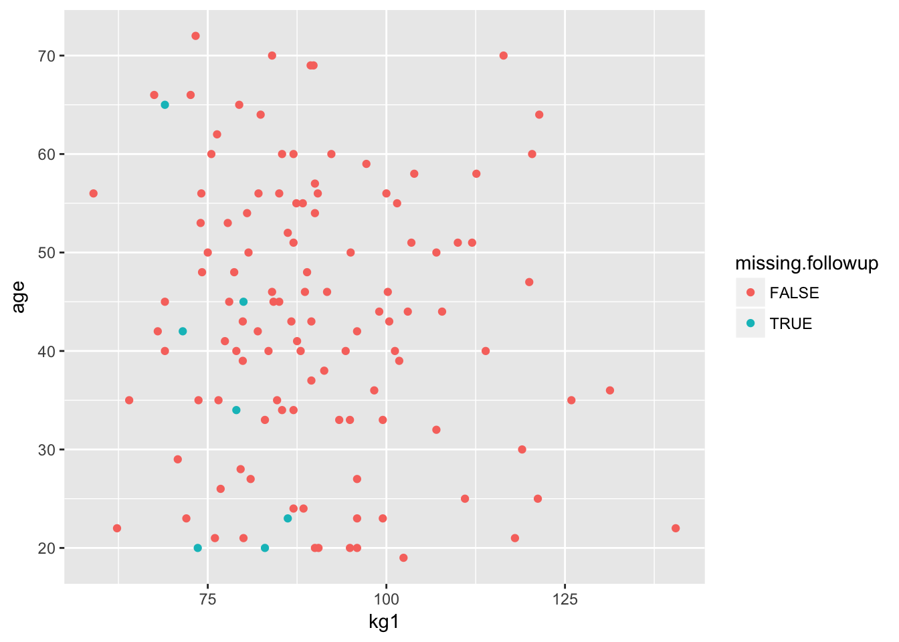
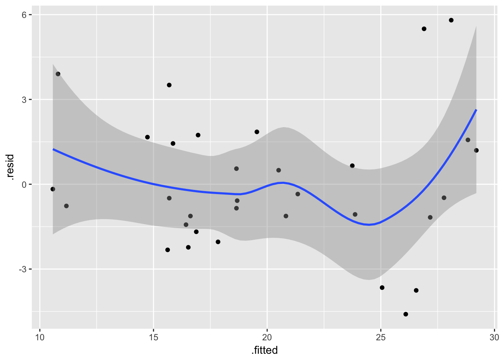
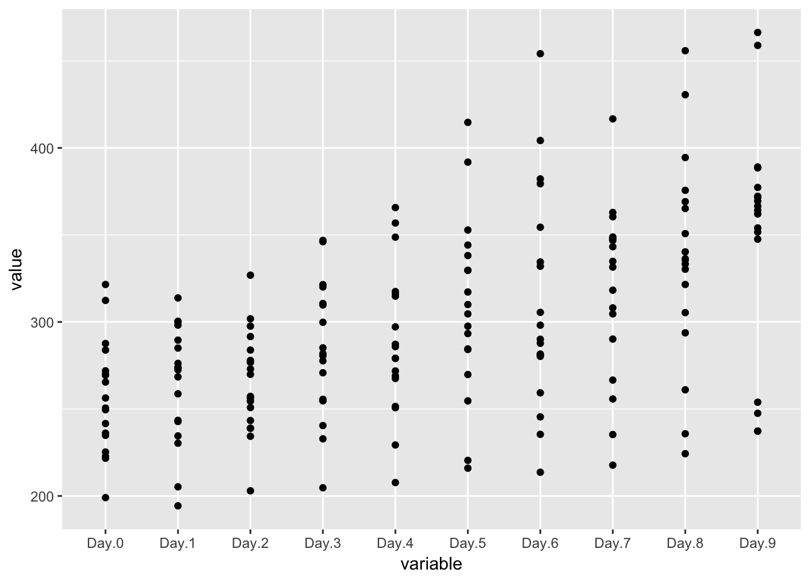

# Working with 'real' data {#real-data}

*Note: If you already lucky enough to have nicely formatted data, ready for use in R, then you could skip this section and revisit it later,* save for the section on [factors and other variable types](#factors-and-numerics).

Most tutorials and textbooks use neatly formatted example datasets to illustrate particular techniques. However in the real-world our data can be:

- In the wrong format
- Spread across multiple files
- Badly coded, or with errors
- Incomplete, with values missing for many different reasons


This chapter shows you how to address each of these problems.


## Storing your data {- #storing-data}


### CSV files are your friend {- #use-csv}

Comma-sepatated-values files are a plain text format which are idea for storing your data. Some advantages include:

- Understood by almost every piece of software on the planet
- Will remain readbale in future
- Easy to store 2D data (like data frames)
- Human readable (just open in Notepad)


Commercial formats like Excel, SPSS (.sav) and Stata (.dta) don't have these properties.

Although CSV has some disadvantages, they are all easily overcome if you [save the steps of your data processing and analysis in your R code](#save-intermediate-steps), see below.


### Save processes, not outcomes {- #save-intermediate-steps}

Many students (and academics) make errors in their analyses because they process data by hand (e.g. editing files in Excel) or use GUI tools to run analyses.

In both cases these errors are hard to identify or rectify because only the outputs of the analysis can be saved, and *no record has been made of how these outputs were produced*. 

In contrast, if you do your data processing and analysis in R/RMarkdown you benefit from a concrete, repeatable series of steps  which can be checked/verified by others. This can also save lots of time if you need to processing additional data later on (e.g. if you run more participants).


Some principles to follow when working:

- Save your raw data in the simplest possible format, in CSV

- Always include column names in the file

- Use descriptive names, but with a regular strucuture.

- Never include spaces or special characters in the column names. Use underscores (`_`) if you want to make things more readable.

- Make names <20 characters in length if possible


### RDS files can be useful to preserve R objects {- #rds-files}

If you have R objects which you'd like to save, for example because they took a long time to compute, the the RDS format is the best way of preserving them.

To save something:


```r
# create a huge df of random numbers... 
massive.df <- data_frame(nums = rnorm(1:1e8))
saveRDS(massive.df, file="massive.RDS")
```

Then later on you can load it like this:


```r
restored.massive.df  <-  readRDS('massive.RDS')
```

[If you do this in RMarkdown, by default the RDS files will be saved in the same directory as your .Rmd file.]{.tip}


## Types of variable {- #factors-and-numerics}

When working with data in Excel or other packages like SPSS you've probably become aware that different types of data get treated differently. For example, in Excel you can't set up a formula like `=SUM(...)` on cells which include letters (rather than just numbers). It does't make sense. However, Excel and many other programmes will sometimes make guesses about what to do if you combine different types of data. For example, if you add `28` to `1 Feb 2017` the result is `1 March 2017`. This is sometimes what you want, but can often lead to unexpected results and errors in data analyses.

R is much more strict about not mixing types of data. Vectors (and columns in dataframes) can only contain one type of thing. In general, there are probably 4 types of data you will encounter in data analysis problems:

- Numeric variables
- Character variables
- Factors
- Dates


The file `lakers.RDS` contains a dataset adapted from the `lubridate::lakers` dataset.

It contains four variables to illustrate the common variable types. From the original dataset which provides scores and other information from each Los Angeles Lakers basketball game in the 2008-2009 season we have the `date`, `opponent`, `team`, and  `points` variables.


```r
lakers <- readRDS("lakers.RDS")
lakers %>% 
  glimpse
## Observations: 34,624
## Variables: 4
## $ date     <date> 2008-10-28, 2008-10-28, 2008-10-28, 2008-10-28, 2008...
## $ opponent <chr> "POR", "POR", "POR", "POR", "POR", "POR", "POR", "POR...
## $ team     <fctr> OFF, LAL, LAL, LAL, LAL, LAL, POR, LAL, LAL, POR, LA...
## $ points   <int> 0, 0, 0, 0, 0, 2, 0, 1, 0, 2, 2, 0, 0, 2, 2, 0, 0, 2,...
```


One thing to note here is that the `glimpse()` command tells us the *type* of each variable. So we have 

- `points`: type `int`, short for integer (i.e. whole numbers). 
- `date`: type `date`
- `opponent`: type `chr`, short for 'character', or alaphanumeric data
- `team`: type `fctr`, short for factor and


[Other numeric variables might sometimes have type = `dbl`, which stands for 'double precision' floating point number (that is, a decimal fraction). But for most data analysis purposes we can treat all numeric variable types the same.]{.admonition}


### Numeric variables {-}

We've already seem numeric variables in the section on [vectors and lists](#vectors). These behave pretty much as you'd expect, and we won't expand on them here. 

#### {- .explainer}

One small aside is that you should be aware that there are limits to the precision with which R (and computers in general) can store decimal values. This only tends to matter when working with very large or very small numbers — but this can crop up when estimating regression coefficients that are very small for example, and is one reason why [scaling inputs to regression models can improve performance and accuracy of results](#scaling-regression-inputs).


### Characters, factors (and booleans) {- #character-and-factor}

In many cases variables will be used to identify cases which have *qualitative differences*: for example, where different groups or measurement occasions in an experimental study, or different genders.

It can sometimes cause confusion that these categorical variables can be stored in as numeric variables, or as 'character' types (strings of letters and numbers), or as a third type called factors.

For example, you will often come across data where groupings are stored in either one of these formats:


```r
data_frame(month = 1:12,
  month.name = format(ISOdatetime(2000,1:12,1,0,0,0),"%b"),
  group = c("Waiting", "Treatment", "Control", rep(NA, 9)),
  group.number = c(1:3, rep(NA, 9))
  ) %>% 
  pander(caption="Month and group as numeric and character variables")
```


---------------------------------------------
 month   month.name    group    group.number 
------- ------------ --------- --------------
   1        Jan       Waiting        1       

   2        Feb      Treatment       2       

   3        Mar       Control        3       

   4        Apr         NA           NA      

   5        May         NA           NA      

   6        Jun         NA           NA      

   7        Jul         NA           NA      

   8        Aug         NA           NA      

   9        Sep         NA           NA      

  10        Oct         NA           NA      

  11        Nov         NA           NA      

  12        Dec         NA           NA      
---------------------------------------------

Table: Month and group as numeric and character variables


One problem with storing categories as numeric variables is that we can end up with [confusing results when running regression models](#factors-vs-linear-inputs). 


For this reason, it's often best to store your categorical variables as strings of letters and numbers (e.g. "Group 1", "Group 2") and avoid simple numbers (e.g. 1, 2, 3).

*Factors* are R's answer to this problem of storing categorical data.
Factors assign one number for each unique value in a variable, and optionally allow you to attach a label to it.

For example:


```r
1:10
##  [1]  1  2  3  4  5  6  7  8  9 10

group.factor <- factor(1:10)
group.factor
##  [1] 1  2  3  4  5  6  7  8  9  10
## Levels: 1 2 3 4 5 6 7 8 9 10

group.labelled <- factor(1:10, labels = paste("Group", 1:10))
group.labelled
##  [1] Group 1  Group 2  Group 3  Group 4  Group 5  Group 6  Group 7 
##  [8] Group 8  Group 9  Group 10
## 10 Levels: Group 1 Group 2 Group 3 Group 4 Group 5 Group 6 ... Group 10
```

We can see this 'underlying' number which represents each category by using `as.numeric`:


```r
# note, there is no guarantee that "Group 1" == 1 (although it is here)
as.numeric(group.labelled)
##  [1]  1  2  3  4  5  6  7  8  9 10
```


These days, for simple analyses it's best to store everything as the `character` type (letters and numbers), but factors can still be useful for making tables or graphs where the list of categories is known and needs to be in a particular order. For more about factors, and lots of useful functions for working with them, see the `forcats::` package: <https://github.com/tidyverse/forcats>


### Dates {-}

Like  most computers, R stores dates as the number of days since January 1, 1970. This means that we can work with dates just like other numbers, and it makes sense to have the `min()`, or `max()` of a series of dates:


```r
# the first few dates in the sequence
head(lakers$date)
## [1] "2008-10-28" "2008-10-28" "2008-10-28" "2008-10-28" "2008-10-28"
## [6] "2008-10-28"

# first and last dates
min(lakers$date)
## [1] "2008-10-28"
max(lakers$date)
## [1] "2009-04-14"
```

Because dates are numbers we can also do arithmetic with them, and R will give us a difference (in this case, in days):


```r
max(lakers$date) - min(lakers$date)
## Time difference of 168 days
```

However, R does treat dates slightly differently from other numbers, and will format plot axes appropriately, which is helpful (see more on this in the [graphics section](#graphics)):


```r
hist(lakers$date, breaks=7)
```


### Missing values {-}

Missing values aren't a data type as such, but are an important concept in R; the way different functions handle missing values can be both helpful and frustrating in equal measure. [The next section covers the handling of missing data in more detail](#missing).


## Missing values {- #missing}

Missing values aren't a data type as such, but are an important concept in R; the way different functions handle missing values can be both helpful and frustrating in equal measure.

Missing values in a vector are denoted by the letters `NA`, but notice that these letters are unquoted. That is to say `NA` is not the same as `"NA"`!

To check for missing values in a vector (or dataframe column) we use the `is.na()` function:


```r
nums.with.missing <- c(1, 2, NA)
nums.with.missing
## [1]  1  2 NA

is.na(nums.with.missing)
## [1] FALSE FALSE  TRUE
```


Here the `is.na()` function has tested whether each item in our vector called `nums.with.missing` is missing. It returns a new vector with the results of each test: either `TRUE` or `FALSE`.

We can also use the negation operator, the `!` symbol to reverse the meaning of `is.na`. So we can read `!is.na(nums)` as "test whether the values in `nums` are NOT missing":


```r
# test if missing
is.na(nums.with.missing)
## [1] FALSE FALSE  TRUE

# test if NOT missing
!is.na(nums.with.missing)
## [1]  TRUE  TRUE FALSE
```


We can use the `is.na()` function as part of dplyr filters:


```r
airquality %>% 
  filter(is.na(Solar.R)) %>% 
  head(3) %>% 
  pander
```


---------------------------------------------
 Ozone   Solar.R   Wind   Temp   Month   Day 
------- --------- ------ ------ ------- -----
  NA       NA      14.3    56      5      5  

  28       NA      14.9    66      5      6  

   7       NA      6.9     74      5     11  
---------------------------------------------


Or to select only cases without missing values for a particular variable:


```r
airquality %>% 
  filter(!is.na(Solar.R)) %>% 
  head(3) %>% 
  pander
```


---------------------------------------------
 Ozone   Solar.R   Wind   Temp   Month   Day 
------- --------- ------ ------ ------- -----
  41       190     7.4     67      5      1  

  36       118      8      72      5      2  

  12       149     12.6    74      5      3  
---------------------------------------------

#### Complete cases {- #complete-cases}


Sometimes we want to select only rows which have no missing values --- i.e. *complete cases*. 

The `complete.cases` function accepts a dataframe (or matrix) and tests whether each *row* is complete. It returns a vector with a `TRUE/FALSE` result for each row:


```r
complete.cases(airquality) %>% 
  head
## [1]  TRUE  TRUE  TRUE  TRUE FALSE FALSE
```

This can also be useful in dplyr filters. Here we show all the rows which are *not* complete (note the exclamation mark):


```r
airquality %>% 
  filter(!complete.cases(airquality))
##    Ozone Solar.R Wind Temp Month Day
## 1     NA      NA 14.3   56     5   5
## 2     28      NA 14.9   66     5   6
## 3     NA     194  8.6   69     5  10
## 4      7      NA  6.9   74     5  11
## 5     NA      66 16.6   57     5  25
## 6     NA     266 14.9   58     5  26
## 7     NA      NA  8.0   57     5  27
## 8     NA     286  8.6   78     6   1
## 9     NA     287  9.7   74     6   2
## 10    NA     242 16.1   67     6   3
## 11    NA     186  9.2   84     6   4
## 12    NA     220  8.6   85     6   5
## 13    NA     264 14.3   79     6   6
## 14    NA     273  6.9   87     6   8
## 15    NA     259 10.9   93     6  11
## 16    NA     250  9.2   92     6  12
## 17    NA     332 13.8   80     6  14
## 18    NA     322 11.5   79     6  15
## 19    NA     150  6.3   77     6  21
## 20    NA      59  1.7   76     6  22
## 21    NA      91  4.6   76     6  23
## 22    NA     250  6.3   76     6  24
## 23    NA     135  8.0   75     6  25
## 24    NA     127  8.0   78     6  26
## 25    NA      47 10.3   73     6  27
## 26    NA      98 11.5   80     6  28
## 27    NA      31 14.9   77     6  29
## 28    NA     138  8.0   83     6  30
## 29    NA     101 10.9   84     7   4
## 30    NA     139  8.6   82     7  11
## 31    NA     291 14.9   91     7  14
## 32    NA     258  9.7   81     7  22
## 33    NA     295 11.5   82     7  23
## 34    78      NA  6.9   86     8   4
## 35    35      NA  7.4   85     8   5
## 36    66      NA  4.6   87     8   6
## 37    NA     222  8.6   92     8  10
## 38    NA     137 11.5   86     8  11
## 39    NA      64 11.5   79     8  15
## 40    NA     255 12.6   75     8  23
## 41    NA     153  5.7   88     8  27
## 42    NA     145 13.2   77     9  27
```


#### {- .tip}

Sometimes it's convenient to use the `.` (period) to represent the output from the previous pipe command. For example, we could rewrite the previous example as:


```r
airquality %>% 
  filter(!complete.cases(.))  # note the . (period) here in place of `airmiles`
##    Ozone Solar.R Wind Temp Month Day
## 1     NA      NA 14.3   56     5   5
## 2     28      NA 14.9   66     5   6
## 3     NA     194  8.6   69     5  10
## 4      7      NA  6.9   74     5  11
## 5     NA      66 16.6   57     5  25
## 6     NA     266 14.9   58     5  26
## 7     NA      NA  8.0   57     5  27
## 8     NA     286  8.6   78     6   1
## 9     NA     287  9.7   74     6   2
## 10    NA     242 16.1   67     6   3
## 11    NA     186  9.2   84     6   4
## 12    NA     220  8.6   85     6   5
## 13    NA     264 14.3   79     6   6
## 14    NA     273  6.9   87     6   8
## 15    NA     259 10.9   93     6  11
## 16    NA     250  9.2   92     6  12
## 17    NA     332 13.8   80     6  14
## 18    NA     322 11.5   79     6  15
## 19    NA     150  6.3   77     6  21
## 20    NA      59  1.7   76     6  22
## 21    NA      91  4.6   76     6  23
## 22    NA     250  6.3   76     6  24
## 23    NA     135  8.0   75     6  25
## 24    NA     127  8.0   78     6  26
## 25    NA      47 10.3   73     6  27
## 26    NA      98 11.5   80     6  28
## 27    NA      31 14.9   77     6  29
## 28    NA     138  8.0   83     6  30
## 29    NA     101 10.9   84     7   4
## 30    NA     139  8.6   82     7  11
## 31    NA     291 14.9   91     7  14
## 32    NA     258  9.7   81     7  22
## 33    NA     295 11.5   82     7  23
## 34    78      NA  6.9   86     8   4
## 35    35      NA  7.4   85     8   5
## 36    66      NA  4.6   87     8   6
## 37    NA     222  8.6   92     8  10
## 38    NA     137 11.5   86     8  11
## 39    NA      64 11.5   79     8  15
## 40    NA     255 12.6   75     8  23
## 41    NA     153  5.7   88     8  27
## 42    NA     145 13.2   77     9  27
```


This is nice because we can apply the `complete.cases` function to the output of the previous pipe. For example, if we wanted to select complete cases for a subset of the variables we could write:


```r
airquality %>% 
  select(Ozone, Solar.R) %>% 
  filter(!complete.cases(.))
##    Ozone Solar.R
## 1     NA      NA
## 2     28      NA
## 3     NA     194
## 4      7      NA
## 5     NA      66
## 6     NA     266
## 7     NA      NA
## 8     NA     286
## 9     NA     287
## 10    NA     242
## 11    NA     186
## 12    NA     220
## 13    NA     264
## 14    NA     273
## 15    NA     259
## 16    NA     250
## 17    NA     332
## 18    NA     322
## 19    NA     150
## 20    NA      59
## 21    NA      91
## 22    NA     250
## 23    NA     135
## 24    NA     127
## 25    NA      47
## 26    NA      98
## 27    NA      31
## 28    NA     138
## 29    NA     101
## 30    NA     139
## 31    NA     291
## 32    NA     258
## 33    NA     295
## 34    78      NA
## 35    35      NA
## 36    66      NA
## 37    NA     222
## 38    NA     137
## 39    NA      64
## 40    NA     255
## 41    NA     153
## 42    NA     145
```

Or alternatively:


```r
rows.to.keep <- !complete.cases(select(airquality, Ozone, Solar.R))
airquality %>% 
  filter(rows.to.keep) %>% 
  head(3) %>% 
  pander
```


---------------------------------------------
 Ozone   Solar.R   Wind   Temp   Month   Day 
------- --------- ------ ------ ------- -----
  NA       NA      14.3    56      5      5  

  28       NA      14.9    66      5      6  

  NA       194     8.6     69      5     10  
---------------------------------------------


#### Missing data and R functions {- #na.rm}

It's normally good practice to pre-process your data and select the rows you want to analyse *before* passing dataframes to R functions.

The reason for this is that different functions behave differently with missing data. 

For example:


```r
mean(airquality$Solar.R)
## [1] NA
```

Here the default for `mean()` is to return NA if any of the values are missing. We can explicitly tell R to ignore missing values by setting `na.rm=TRUE`


```r
mean(airquality$Solar.R, na.rm=TRUE)
## [1] 185.9315
```


In contrast some other functions, for example the `lm()` which runs a linear regression will ignore missing values by default. If we run `summary` on the call to `lm` then we can see the line near the bottom of the output which reads: "(7 observations deleted due to missingness)"


```r
lm(Solar.R ~ Temp, data=airquality) %>% 
  summary
## 
## Call:
## lm(formula = Solar.R ~ Temp, data = airquality)
## 
## Residuals:
##      Min       1Q   Median       3Q      Max 
## -169.697  -59.315    6.224   67.685  186.083 
## 
## Coefficients:
##             Estimate Std. Error t value Pr(>|t|)    
## (Intercept)  -24.431     61.508  -0.397 0.691809    
## Temp           2.693      0.782   3.444 0.000752 ***
## ---
## Signif. codes:  0 '***' 0.001 '**' 0.01 '*' 0.05 '.' 0.1 ' ' 1
## 
## Residual standard error: 86.86 on 144 degrees of freedom
##   (7 observations deleted due to missingness)
## Multiple R-squared:  0.07609,	Adjusted R-squared:  0.06967 
## F-statistic: 11.86 on 1 and 144 DF,  p-value: 0.0007518
```


[Normally R will do the 'sensible thing' when there are missing values, but it's always worth checking whether you do have any missing data, and addressing this explicitly in your code]{.tip}


#### Patterns of missingness {-}

The `mice` package has some nice functions to describe patterns of missingness in the data. These can be useful both at the exploratory stage, when you are checking and validating your data, but can also be used to create tables of missingness for publication:


```r
mice::md.pattern(airquality) 
##     Wind Temp Month Day Solar.R Ozone   
## 111    1    1     1   1       1     1  0
##  35    1    1     1   1       1     0  1
##   5    1    1     1   1       0     1  1
##   2    1    1     1   1       0     0  2
##        0    0     0   0       7    37 44
```


In this table, `md.pattern` list the number of cases with particular patterns of missing data.
- Each row describes a misisng data 'pattern'
- The first column indicates the number of cases
- The central columns indicate whether a particular variable is missing for the pattern (0=missing)
- The last column counts the number of values missing for the pattern
- The final row counts the number of missing values for each variable.


##### Visualising missingness

Graphics can also be useful to explore patterns in missingness.  

`rct.data` contains data from an RCT of functional imagery training (FIT) for weight loss, which measured outcome (weight in kg) at baseline and two followups (`kg1`, `kg2`, `kg3`). The trial also measured global quality of life (`gqol`).

As is common, there were some missing data at the follouwp:


```r
fit.data <- readRDS("data/fit-weight.RDS") %>% 
  select(kg1, kg2, kg3, age, gqol1)

mice::md.pattern(fit.data)
##     kg1 age gqol1 kg2 kg3   
## 112   1   1     1   1   1  0
##   2   1   1     1   1   0  1
##   7   1   1     1   0   0  2
##   8   0   0     0   0   0  5
##       8   8     8  15  17 56
```


We might be interested to explore patterns in which observations were missing. Here we use colour to identify missing observations as a function of the data recorded at baseline:


```r
fit.data %>% 
  mutate(missing.followup = is.na(kg2)) %>% 
  ggplot(aes(kg1, age, color=missing.followup)) +
  geom_point()
## Warning: Removed 8 rows containing missing values (geom_point).
```



There's a clear trend here for lighter patients (at baseline) to have more missing data at followup. There's also a suggestion that younger patients are more likely to have been lost to followup.

If needed, we could perform formal statistical tests for these differences:


```r
t.test(kg1 ~ is.na(kg2), data=fit.data)
## 
## 	Welch Two Sample t-test
## 
## data:  kg1 by is.na(kg2)
## t = 4.7153, df = 11.132, p-value = 0.000614
## alternative hypothesis: true difference in means is not equal to 0
## 95 percent confidence interval:
##   7.005116 19.236238
## sample estimates:
## mean in group FALSE  mean in group TRUE 
##            90.59211            77.47143
t.test(age ~ is.na(kg2), data=fit.data)
## 
## 	Welch Two Sample t-test
## 
## data:  age by is.na(kg2)
## t = 1.2418, df = 6.5246, p-value = 0.2571
## alternative hypothesis: true difference in means is not equal to 0
## 95 percent confidence interval:
##  -7.39455 23.25169
## sample estimates:
## mean in group FALSE  mean in group TRUE 
##            43.50000            35.57143
```


However, given the small number of missing values and the post-hoc nature of these analyses these tests are rather underpowered and we might prefer to report and comment on the plot and alone.


For some nice missing data visualisation techniques, including those for repeated measures data, see @zhang2015missing.


## Tidying data {-}


'Tidying' data means converting it into the format that is most useful for data analyses. 


This part of the guide is currently incomplete, but excellent tuturials exist here: 

- http://tidyr.tidyverse.org and 
- http://r4ds.had.co.nz/tidy-data.html


### Reshaping {-}

In R we almost always want to keep our data in long format and only convert to wid format when presenting in tables for publication.

In long format data:

  - each row of the dataframe corresponds to a single measurement occasion
  - each column corresponds to a variable which is measured


#### Wide to long format {- #wide-to-long}

This is the most common requirement. Often you will have several columns which actually measure the same thing, and you will need to convert these two two columns  - a 'key', and a value.

For example, let's say we measure patients on 10 days:


```r
head(sleep.wide) %>% 
  pander()
```


-----------------------------------------------------------------------------------------
 Subject   Day.0   Day.1   Day.2   Day.3   Day.4   Day.5   Day.6   Day.7   Day.8   Day.9 
--------- ------- ------- ------- ------- ------- ------- ------- ------- ------- -------
    1      249.6   258.7   250.8   321.4   356.9   414.7   382.2   290.1   430.6   466.4 

    2      222.7   205.3    203    204.7   207.7    216    213.6   217.7   224.3   237.3 

    3      199.1   194.3   234.3   232.8   229.3   220.5   235.4   255.8    261    247.5 

    4      321.5   300.4   283.9   285.1   285.8   297.6   280.2   318.3   305.3    354  

    5      287.6    285    301.8   320.1   316.3   293.3   290.1   334.8   293.7   371.6 

    6      234.9   242.8    273    309.8   317.5    310    454.2   346.8   330.3   253.9 
-----------------------------------------------------------------------------------------

This is useful for plotting a correlation matrix, but not much else:


```r
arm::corrplot(sleep.wide %>% select(-Subject))
```




We want to convert RT measurements on each Day to a single variable, and create a new variable to keep track of what `Day` the measurement was taken:

The `melt()` function in the `reshape2::` package does this for us:


```r
sleep.long <- sleep.wide %>% 
  reshape2::melt(id.var="Subject") %>%
  arrange(Subject, variable)  

sleep.long %>% head(12) %>% pander
```


----------------------------
 Subject   variable   value 
--------- ---------- -------
    1       Day.0     249.6 

    1       Day.1     258.7 

    1       Day.2     250.8 

    1       Day.3     321.4 

    1       Day.4     356.9 

    1       Day.5     414.7 

    1       Day.6     382.2 

    1       Day.7     290.1 

    1       Day.8     430.6 

    1       Day.9     466.4 

    2       Day.0     222.7 

    2       Day.1     205.3 
----------------------------

Here melt has created two new variable: `variable`, which keeps track of what was measured, and `value` which contains the score. This makes it much easier to use `ggplot` and other modelling functions, e.g. to plot time series:


```r
sleep.long %>% 
  ggplot(aes(variable, value)) + 
  geom_point()
```




##### Fixing-up index variables after 'melting' {-}

`melt()` creates a new column called `variable`, but in this instance we know that the values `Day.1`, `Day.2`... are not separate categories but actually form a linear sequence, 1:9.

We can use the `extract` or `separate` functions to split up this new variable and give us the numeric day:


```r
sleep.long %>% 
  separate(variable, c("variable", "Day")) %>% 
  mutate(Day=as.numeric(Day)) %>% 
  arrange(Subject) %>% 
  head %>% pander
```


----------------------------------
 Subject   variable   Day   value 
--------- ---------- ----- -------
    1        Day       0    249.6 

    1        Day       1    258.7 

    1        Day       2    250.8 

    1        Day       3    321.4 

    1        Day       4    356.9 

    1        Day       5    414.7 
----------------------------------


[If you are familiar with [regular expressions](https://code.tutsplus.com/tutorials/you-dont-know-anything-about-regular-expressions-a-complete-guide--net-7869) you will be happy to know that you can use regex to separate variables using `extract` and `separate`. [See this guide for more details on how `separate` and `extract` work](https://rpubs.com/bradleyboehmke/data_wrangling)]{.explainer}


#### Long to wide format {- #long-to-wide}

For an example:


These are long form data:

```r
lme4::sleepstudy %>% head %>% pander
```


---------------------------
 Reaction   Days   Subject 
---------- ------ ---------
  249.6      0       308   

  258.7      1       308   

  250.8      2       308   

  321.4      3       308   

  356.9      4       308   

  414.7      5       308   
---------------------------

Which I converted to wide format for the example above:


```r
lme4::sleepstudy %>%
	reshape2::dcast(Subject~Days,value.var = "Reaction") %>% 
  head %>% pander
```


---------------------------------------------------------------------
 Subject    0     1     2     3     4     5     6     7     8     9  
--------- ----- ----- ----- ----- ----- ----- ----- ----- ----- -----
   308    249.6 258.7 250.8 321.4 356.9 414.7 382.2 290.1 430.6 466.4

   309    222.7 205.3  203  204.7 207.7  216  213.6 217.7 224.3 237.3

   310    199.1 194.3 234.3 232.8 229.3 220.5 235.4 255.8  261  247.5

   330    321.5 300.4 283.9 285.1 285.8 297.6 280.2 318.3 305.3  354 

   331    287.6  285  301.8 320.1 316.3 293.3 290.1 334.8 293.7 371.6

   332    234.9 242.8  273  309.8 317.5  310  454.2 346.8 330.3 253.9
---------------------------------------------------------------------


For a more detailed explanation, see: http://r4ds.had.co.nz/tidy-data.html


## Dealing with multiple files {-}

Oftentimes you will have multiple data files files (hopefully .csv format) to import and process - for example, those produced by experimental software like [PsychoPy](http://www.psychopy.org). This is one of the few times when you might have to do something resembling 'real programming', but it's still fairly straightforward.

In the [repeated measures Anova example later on in this guide](#trad-rm-anova) we encounter some data from an experiment where reaction times were recorded in 25 trials (`Trial`) before and after (`Time`) one of 4 experimental manipulations (`Condition` = {1,2,3,4}). There were 48  participants in total:


Let's say all the files are in a single directory, and numbered sequentially. Using the `list.files()` function we can list the contents of a directory on the hard drive:


```r
list.files('data/multiple-file-example/')
##  [1] "person1.csv"  "person10.csv" "person11.csv" "person12.csv"
##  [5] "person13.csv" "person14.csv" "person15.csv" "person16.csv"
##  [9] "person17.csv" "person18.csv" "person19.csv" "person2.csv" 
## [13] "person20.csv" "person21.csv" "person22.csv" "person23.csv"
## [17] "person24.csv" "person25.csv" "person26.csv" "person27.csv"
## [21] "person28.csv" "person29.csv" "person3.csv"  "person30.csv"
## [25] "person31.csv" "person32.csv" "person33.csv" "person34.csv"
## [29] "person35.csv" "person36.csv" "person37.csv" "person38.csv"
## [33] "person39.csv" "person4.csv"  "person40.csv" "person41.csv"
## [37] "person42.csv" "person43.csv" "person44.csv" "person45.csv"
## [41] "person46.csv" "person47.csv" "person48.csv" "person5.csv" 
## [45] "person6.csv"  "person7.csv"  "person8.csv"  "person9.csv"
```


Helpfully, `list.files()` creates a [vector](#vectors) of the filenames in the directory. 

At this point, there are many, many ways of importing the contents of these files, but below we use a technique which is concise, reliable, and less error-prone than many others. It also continues to use the `dplyr` library.

This approach has 3 steps:

1. Put all the names of the .csv files into a dataframe.
2. For each row in the dataframe, run a function which imports the file as a dataframe.
3. Combine all these dataframes together.


###### Putting the filenames into a dataframe {-}

Because `list.files` produces a vector, we can make them a column in a new dataframe:


```r
raw.files <- data_frame(filename = list.files('data/multiple-file-example/'))
```


And we can make a new column with the complete path (i.e. including the directory holding the files), using the [`paste0`](#paste) which combines strings of text. We wouldn't have to do this if the raw files were in the same directory as our RMarkdown file, but that would get messy.


```r
raw.file.paths <- raw.files  %>% 
  mutate(filepath = paste0("data/multiple-file-example/", filename))

raw.file.paths %>% 
  head(3) %>% 
  pander
```


----------------------------------------------------
  filename                  filepath                
------------ ---------------------------------------
person1.csv  data/multiple-file-example/person1.csv 

person10.csv data/multiple-file-example/person10.csv

person11.csv data/multiple-file-example/person11.csv
----------------------------------------------------


###### Using `do()` {- #dplyr-do}

We can then use the `do()` function in `dplyr::` to import the data for each file and combine the results in a single dataframe.

The `do()` function allows us to run any R function for each group or row in a dataframe. 

The means that our original dataframe is broken up into chunks (either groups of rows, if we use `group_by()`, or individual rows if we use `rowwise()`) and each chunk is fed to the function we specify. This function must do it's work and return a new dataframe, and these are then combined into a single larger dataframe.

So in this example, we break our dataframe of filenames up into individual rows using `rowwise` and then specify the `read_csv` function which takes the name of a csv file, and returns the content as a dataframe ([see the importing data section](#importing-data)).

For example:


```r
raw.data <- raw.file.paths %>%
  # 'do' the function for each row in turn
  rowwise() %>% 
  do(., read_csv(file=.$filepath))
```


We can check these data look OK by sampling 10 rows at random:


```r
raw.data %>% 
  sample_n(10) %>% 
  pander
```


--------------------------------------------
 Condition   trial   time   person     RT   
----------- ------- ------ -------- --------
     4         4      1       39    206.6536

     3         7      2       25    415.8980

     3        19      2       31    283.9301

     1        15      1       11    275.7647

     4        14      1       37    297.0155

     2         2      2       24    213.8569

     1        15      1       6     192.1442

     2         1      1       18    224.0050

     2        21      1       15    191.2992

     2         2      2       19    196.1174
--------------------------------------------


##### Using custom functions with `do()` {-}

In this example, each of the raw data files included the participant number (the `person` variable). However, this isn't always the case.

This isn't a problem though, if we create our own [helper function](#helper-functions) to import the data. Writing small functions in R is very easy, and the example below wraps the `read.csv()` function and adds a new colum, `filename` to the imported data frame which would enable us to keep track of where each row in the final combined dataset came from.

This is the helper function: 


```r
read.csv.and.add.filename <- function(filepath){
  read_csv(filepath) %>% 
    mutate(filepath=filepath)
}
```

And we can use the helper function with `do()` like so:


```r
raw.data.with.paths <- raw.file.paths %>%
  rowwise() %>% 
  do(., read.csv.and.add.filename(.$filepath))

raw.data.with.paths %>% 
  head %>% 
  pander
```


-----------------------------------------------------------------------------------
 Condition   trial   time   person     RT                   filepath               
----------- ------- ------ -------- -------- --------------------------------------
     1         1      1       1     284.5491 data/multiple-file-example/person1.csv

     1         2      1       1     309.3162 data/multiple-file-example/person1.csv

     1         3      1       1     346.6588 data/multiple-file-example/person1.csv

     1         4      1       1     291.1182 data/multiple-file-example/person1.csv

     1         5      1       1     281.6240 data/multiple-file-example/person1.csv

     1         6      1       1     292.0952 data/multiple-file-example/person1.csv
-----------------------------------------------------------------------------------


At this point you might want to [use the `extract()` or `separate()` functions](#extract-to-split-column-names) to post-process the filename and re-create the `person` variable from this (although here that's already been done for us).


<!-- TODO1 -->
<!-- - File handling and import -->
<!-- - Writing a function for `do()` which returns a dataframe -->
<!-- - Joins and merges -->


<!-- ##  Error checking {-} -->

<!-- - `999`, `666` and `*`: the marks of the beast! -->


