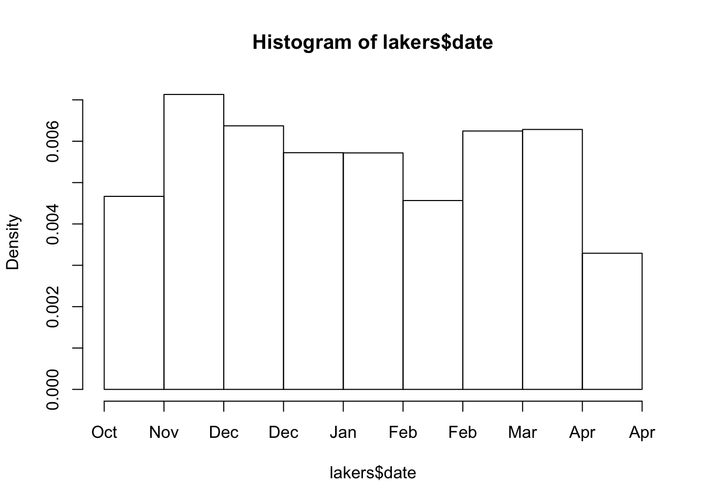

# Working with 'real' data


*Note: If you already have nicely formatted data ready for use in R then you could skip this section and revisit it later.*

Most tutorials and textbooks use neatly formatted example datasets to illustrate particular techniques. However in the real-world our data can be:

- In the wrong format
- Spread across multiple files
- Badly coded, or with errors
- Incomplete, with values missing for many different reasons


This chapter shows you how to address each of these problems.


## Types of variable: factor, character and numeric {- #factors-and-numerics}

When working with data in Excel or other packages like SPSS you've probably become aware that different types of data get treated differently. For example, in Excel you can't set up a formula like `=SUM(...)` on cells which include letters (rather than just numbers). It does't make sense. However, Excel and many other programmes will sometimes make guesses about what to do if you combine different types of data. For example, if you add `28` to `1 Feb 2017` the result is `1 March 2017`. This is sometimes what you want, but can often lead to unexpected results and errors in data analyses.

R is much more strict about not mixing types of data. Vectord (and columns in dataframes) can only contain one type of thing. In general, there are probably 4 types of data you will encounter in data analysis problems:

- Numeric variables
- Character variables
- Factors
- Dates


The `lakers.RDS` (adapted from the `lubridate::lakers` dataset) contains four variables to illustrate these points. From the original dataset which provides scores from  each Los Angeles Lakers basketball game in the 2008-2009 season. We have selected the `date`, `opponent`, `team`, and the `points` variables.


```r
lakers <- readRDS("lakers.RDS")
lakers %>% 
  glimpse
## Observations: 34,624
## Variables: 4
## $ date     <date> 2008-10-28, 2008-10-28, 2008-10-28, 2008-10-28, 2008...
## $ opponent <chr> "POR", "POR", "POR", "POR", "POR", "POR", "POR", "POR...
## $ team     <fctr> OFF, LAL, LAL, LAL, LAL, LAL, POR, LAL, LAL, POR, LA...
## $ points   <int> 0, 0, 0, 0, 0, 2, 0, 1, 0, 2, 2, 0, 0, 2, 2, 0, 0, 2,...
```


```r
hist(lakers$date, breaks=10)
```




## Missing values {-}

- `is.na()` and `is.finite`
- `expand()`


## Tidying data {- #tidying-data}

- Melt, spread
- ...


## Deal with multiple files {-}

- File handling and import
- Writing a function for `do()` which returns a dataframe
- Joins and merges


##  Error checking {-}

- `999`, `666` and `*`: the marks of the beast!


