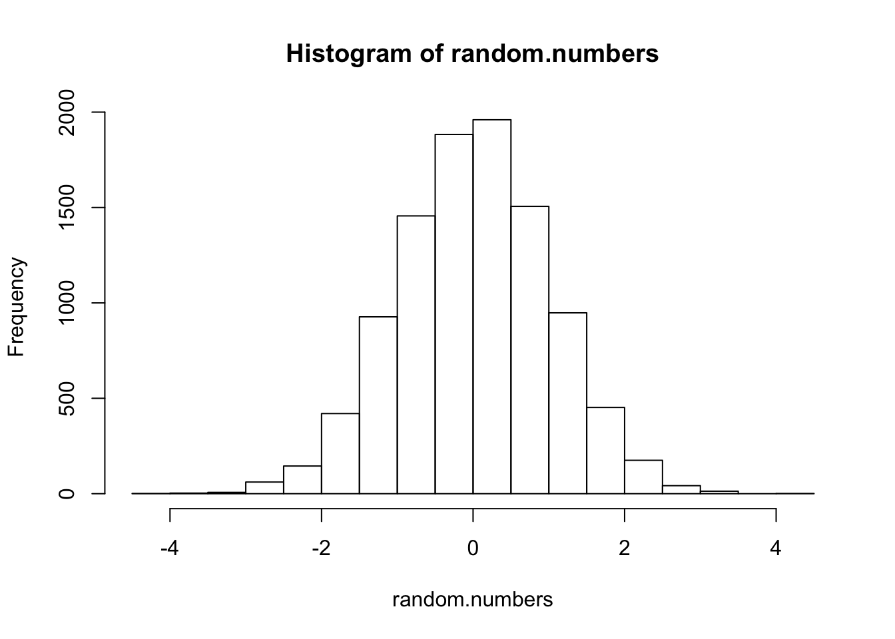

  


# Workflow {#start-here}

<iframe width="560" height="315" src="https://www.youtube-nocookie.com/embed/k56UXc4paIM?rel=0" frameborder="0" allowfullscreen></iframe>


One of the biggest adjustments people need to make when moving away from SPSS or other tools is to work out a 'way of working'. Good students often develop ways of working, saving and communicating their findings that become habitual. These habits are often attempts to work around limitations of these packages, but nevertheless habits are easier to replace than break, so here's one alternative solution:

1. Work in RStudio, and specifically use RMarkdown documents (see [next section](#rmarkdown))

2. Always keep your raw data in [.csv format](#use-csv). 

3. Avoid saving multiple 'processed' versions of your data, and never edit data by hand unless absolutely necessary. [Use R to process data and RMarkdown to document the steps taken](#save-intermediate-steps).

4. 'Knit' (run) your RMarkdown documents and save them as HTML files for sharing with colleagues.

5. 'Knit' your RMarkdown documents to Word .doc format to [produce tables and graphs for publication](#sharing-and-publication).


#### Using RMarkdown to record and share work {- #rmarkdown}

This it might seem an odd place to start: we haven't got anything to share yet! But the RStudio editor (see below) includes important features which help us record and organise our work, and share it with colleagues. For many people this ability to keep a detailed record of your work, and revisit and review it later, turns out to be *the* major advantages of R over traditional statistics packages.

You are currently reading the output of an 'RMarkdown' document. 

- 'R' is a computer language for working with data.
- Markdown is a simple text format which allows you to combine writing, images and code (see http://commonmark.org/help/).  

An RMarkdown document mixes R code with markdown. This means you can combine your analysis with text explaining and interpreting the results.

RMarkdown is easily converted to other formats like HTML, Word, or PDF to share with other people. When you click the **Knit** button (in the Rstudio interface), a document will be generated that combines your text with the results of your R code.


##### Writing and 'knitting' RMarkdown {-}

To include R code within a document we write 3 backticks (`` ``` ``), followed by `{r}`. We the include our R code, and close the block with 3 more backticks ([how to find the backtick on your keyboard](#backtick-location)).

<!-- ignore the fact that this has extra characters in the first line of the code block... this is to make the chunk display in the final compiled file as an example. You won't see this again. -->

    ```{r}
    2 + 2
    ```

When a document including this chunk is run or 'knitted', the final result will include the the line `2+2` followed by the number `4` on the next line. This means we can use RMarkdown to 'show our workings': our analysis can be interleaved with narrative text to explain or interpret the calculations.

You can see how this works in practice in the next section.


## RStudio {- #rstudio}

RStudio is a text editor which has been customised to make working with R easy. It can be installed on your own computer, or you can login to a shared RStudio server (for example, one run by your university) from a web browser. Either way the interface is largely the same.  


The figure above shows the main RStudio interface, comprising:

1. The main R-script or RMarkdown editor window. This is where you write commands, which can then be executed (to run the current line type ctrl-Enter or cmd-Enter on a Mac).

1. The R console, into which you can type R commands directly, and see the output of commands run in the script editor.

1. The 'environment' panel, which lists all the variables you have defined and currently available to use.

1. The files and help panel. Within this panel the 'files' tab enables you to open files stored on the server, in the current project, or elsewhere on your hard drive.


You can see a short video demonstrating the RStudio interface here: 

<iframe src="https://player.vimeo.com/video/221888958" width="640" height="480" frameborder="0" webkitallowfullscreen mozallowfullscreen allowfullscreen></iframe>

<!-- 

When you first open RStudio (in this case, it's the server version, so loaded in a web page) it should look something like this. 

There is a single window, intially split into three panels, which are:

1. The console, where you can type R commands and see the output produced by them
2. The help panel, which also has a bunch of other tabs for things like the Environment, your command history, packages you have installed, and some other stuff.
3. In the lower right corner is a panel for your plots, which also has a tab called 'files', where you can view and open analysis and data files you save on the server.


The first thing I'd suggest you do is to create a new RMarkdown file, by clicking on this icon here and selecting RMarkdown. The defaults are all fine, so just give it a name and click OK.

You should now see a 4th panel appear in the top left of the main window, which is the Script editor. This is where you can edit and run your analyses. You can type R commands directly into the console, but it's much better to type them here first, and then run them.

There is more information on RMarkdown in the guide, but you can think of it like a lab notebook: it lets you mix commands for analysis, graphs, tables and your explanatory notes all in the same document. This means it's really easy to keep track of your work, and collaborate with other people.

When we're finished working, we can press 'Knit' which runs all the code, and creates a finished document containing both the results and our notes. If you are using the server edition you might see a little warning message about a popup blocker, but this is OK to ignore.

In this example file we can see there is:

- Some introductory text,
- A summary of the 'cars' dataset and
- An embedded plot

This is all saved as a single html file which you can email to collaborators, put online, or submit to a journal to help reviewers understand your work.

If I close this window, you can also see that if I click the arrow next to the 'knit' button we could also have created a pdf or word document, although I'd recommend sticking to HTML to begin with.


At the top of the RMarkdown file itself, we have a title for the document, and a line which tells RStudio that we want to build and html file by default. 

Moving down, we have a 'code chunk', which is denoted by these three backticks, the curly brackets and the letter "R". This tells Rstduio that we're about to include some R code which it will need to run. Ignore the code in this chunk for the moment, and I'll come back to that later.

Next we have some text, which is formatted with Markdown. Markdown is a simple text format which makes it easy to create structured documents with some basic markup symbols. Here, the two ## symbols just mean that this is a "second level" heading. The double asterisk symbols here mean but this word in bold text... but again, don't worry too much about this for the moment. It's just text.

Next we have another code block, this time with some of the analysis we saw in the html file after we hit 'knit'. This function just produces a summary of the 'cars' dataset, which is an example file built into R and is already loaded, as soon as we start RStudio.

One of the nicest things about RMarkdown documents though is that we can write and run this code interactively. So if I put my cursor on this line here, and press run, then I can see the results dropped straight into the document. I could also have just pressed Ctrl-Enter and the same thing would happen.

So, if I edit the code here, I can change the analysis and see the results straight away. For example, if I add the line `pairs(cars)` we immediately see a pairs plot, which is just a bunch of scatterplots. Working interactively like this is really nice when you first start exploring a dataset and trying to make sense of it.


OK - so that's it for this video. Just quickly before I go though, it's worth knowing there are lots of keyboard shortcuts available, and you can see then all from this menu. Help is F-1!

-->


The video:

- Shows you how to type commands into the Console and view the results.
- Run a plotting function, and see the result.
- Create RMarkdown file, and 'Knit' it to produce a document containing the results of your code and explanatory text.

Once you have watched the video:

- Try creating a new RMarkdown document in RStudio.
- Edit some of the text, and press the Knit button to see the results.
- If you feel brave, edit one of the R blocks and see what happens!


# R Basics


### First commands {-}

You can type R commands directly into the console and see the result there, but you should make a habit of working in an RMarkdown file. This keeps a record of everything you try, and makes it easy to edit/amend commands which don't work as you expect.

Now would be a good time to open an RMarkdown document to see how it works. A good place to start would be to open the source to this document. The best way to do this is to download the source code for the 'Just Enough R' project, and then open the file `start_here.Rmd`.


#### {- .exercise}

The source for this RMarkdown file is available here: <https://raw.githubusercontent.com/benwhalley/just-enough-r/master/start_here.Rmd>.

Or you can download the whole project here: <https://github.com/benwhalley/just-enough-r/archive/master.zip>. This link downloads a 'zip' file, which is a compressed folder containing all the files in the project. To 'unzip' it on Mac or Windows just double-click the file in the Finder or Windows Explorer.


#### {-}

To run code in the RStudio interface put your cursor on a line within an R Block (or select the code you want to run), and press `Ctrl-Enter`. The result will appear below the code block.

The command in the R block below prints (shows on screen) the first few rows of the `mtcars` dataset, which is built in to R as an example. 

Place your cursor somewhere in the line the command is on and run it by typing `Ctrl-Enter`, shown in this brief video:


<iframe src="https://player.vimeo.com/video/225968925" width="640" height="480" frameborder="0"></iframe>
<p><a href="https://vimeo.com/225968925">Create an R block in RMarkdown, then run some simple commands.</a></p>


```r
head(mtcars)
##                    mpg cyl disp  hp drat    wt  qsec vs am gear carb
## Mazda RX4         21.0   6  160 110 3.90 2.620 16.46  0  1    4    4
## Mazda RX4 Wag     21.0   6  160 110 3.90 2.875 17.02  0  1    4    4
## Datsun 710        22.8   4  108  93 3.85 2.320 18.61  1  1    4    1
## Hornet 4 Drive    21.4   6  258 110 3.08 3.215 19.44  1  0    3    1
## Hornet Sportabout 18.7   8  360 175 3.15 3.440 17.02  0  0    3    2
## Valiant           18.1   6  225 105 2.76 3.460 20.22  1  0    3    1
```


If you are reading this from within RStudio, running `head(mtcars)` will have included an interactive table in the document, which you can use this to view the `mtcars` dataset. If you are still reading the compiled html or pdf document you will see a table containing the same data, included within the body of the document.

Hopefully at this point it's obvious that RStudio and RMarkdown give you:

- A nice place to work with R and explore your data
- A nice format to share your workings (e.g. with other researchers or your tutor)
- A mechanism to save reports of your analysis, to share with other people who don't use RStudio


## Naming things: *variable assignment* {- #variables}

One of the nice things about R is that we can assign labels to parts of our analysis to keep track of them. Using good, descriptive names is good practice and makes your code easier to read (e.g. when you or others need to revisit in future.

To assign labels to particular values we use the `<-` symbol. That is, we have a *value* and use the `<-` symbol to point to the *variable* we want to assign it to. For example:


```r
the.magic.number <- 3
```

This assigns the value `3` to the variable `the.magic.number`. This block wouldn't display anything because assigning a variable doesn't create any output. To both assign a variable *and* display it we would type:
  

```r
the.magic.number <- 3
the.magic.number
## [1] 3
```


Or if we want to be explicit:


```r
print(the.magic.number)
## [1] 3
```


Helpfully, we can also do simple calculations as we assign variables:


```r
one.score <- 20
four.score.years.and.ten <- one.score * 4 + 10
print(four.score.years.and.ten)
## [1] 90
```

As you will see below, we can give anything a label by assigning it to a variable. It doesn't have to be simple numbers: we can also assign words, graphics and plots, the results of a statistical model, or *lists* of any of these things.


## Vectors and lists {- #vectors-and-lists}

When working with data, we often have lists or sequences of 'things'. For example: a list of measurements we have made.

- When all the things are of the same type, R calls this a *vector*^[It's actually a matrix if has 2 dimensions, like a table, or an array if it has more than 2 dimensions.]).

- When there is a mix of different things R calls this a *list*.


### Vectors {- #vector}

We can create a vector of numbers and display it like this:


```r
# this creates a vector of heights, in cm
heights <- c(203, 148, 156, 158, 167, 
             162, 172, 164, 172, 187, 
             134, 182, 175)
```

The `c()` command is shorthand for *combine*, so the example above combines the individual elements (numbers) into a new vector.

We can create a vector of alphanumeric names just as easily:


```r
names <- c("Ben", "Joe", "Sue", "Rosa")
```

And we can check the values stored in these variables by printing them. You can either type `print(heights)`, or just write the name of the variable alone, which will print it by default. E.g.:


```r
heights 
##  [1] 203 148 156 158 167 162 172 164 172 187 134 182 175
```


#### {- .exercise}

Try creating your own vector of numbers in a new code block below^[i.e. edit the RMarkdown document] using the `c(...)` command. Then change the name of the variable you assign it to.


### Accessing elements {- #access-vector-elements}

Once we have created a vector, we often want to access the individual elements again. We do this based on their *position*. 

Let's say we have created a vector:
  

```r
my.vector <- c(10, 20, 30, 40)
```

We can display the whole vector by just typing its name, as we saw above. But if we want to show only the *first* element of this vector, we type:
  

```r
my.vector[1]
## [1] 10
```


Here, the square brackets specify a *subset* of the vector we want - in this case, just the first element.


### Selecting more than one element {-}

A neat feature of subsetting is that we can grab more than one element at a time. 

To do this, we need to tell R the *positions* of the elements we want, and so we provide a *vector of the positions of the elements we want*. 

It might seem obvious, but the first element has position 1, the second has position 2, and so on.  So, if we wanted to extract the 4th and 5th elements from the vector of heights we saw above we would type:


```r
elements.to.grab <- c(4, 5)
heights[elements.to.grab]
## [1] 158 167
```

We can also make a subset of the original vector and assign it to a *new* variable:


```r
first.two.elements <- heights[c(1, 2)]
first.two.elements
## [1] 203 148
```


<!-- There are lots of other neat tricks you can use when subsetting, but we don't need them all right now.  -->

<!-- If you want to know more see <http://www.statmethods.net/management/subset.html> -->


## Processing vectors {-}

Many of R's most useful functions process *vectors of numbers* in some way. For example, if we want to calculate the average of our vector of heights we just type:


```r
mean(heights)
## [1] 167.6923
```

R contains *lots* of built in functions which we can use to summarise a vector of numbers. For example:


```r
median(heights)
## [1] 167
sd(heights)
## [1] 17.59443
min(heights)
## [1] 134
max(heights)
## [1] 203
range(heights)
## [1] 134 203
IQR(heights)
## [1] 17
length(heights)
## [1] 13
```


All of these functions accept a vector as input, do some proccesing, and then return a *single number* which gets displayed by RStudio. 

But not all functions return a single number in the way that `mean` did above. Some return a new vector, or some other type of object instead.  For example, the `quantile` function returns the values at the 0, 25th, 50th, 75th and 100th percentiles (by default).


```r
height.quantiles <- quantile(heights)
height.quantiles
##   0%  25%  50%  75% 100% 
##  134  158  167  175  203
```


If a function returns a vector, we can use it just like any other vector:


```r
height.quantiles <- quantile(heights)

# grab the third element, which is the median
height.quantiles[3]
## 50% 
## 167

# assign the first element to a variable
min.height <- height.quantiles[1]
min.height
##  0% 
## 134
```

But other functions process a vector without returning any numbers. For example, the `hist` function returns a histogram:


```r
hist(heights)
```


We'll cover lots more plotting and visualisation later on.


### Making new vectors {-}

So far we've seen R functions which process a vector of numbers and produce a single number, a new vector of a different length (like `quantile` or `fivenum`), or some other object (like `hist` which makes a plot).
However many other functions accept a single input, do something to it, and return a single processed value. 

For example, the square root function, `sqrt`, accepts a single value and returns a single value: running `sqrt(10)` will return `3.1623`. 

In R, if a function accepts a single value as input and returns a single value as output (like `sqrt(10)`), then you can usually give a vector as input too. Some people find this surprising^[Mostly people who already know other programming languages like C. It's not that surprising if you read the R code as you would English.], but R assumes that if you're processing a vector of numbers, you want the function applied to each of them in the same way. 

This turns out to be very useful. For example, let's say we want the square root of each of the elements of our height data:


```r
# these are the raw values
heights
##  [1] 203 148 156 158 167 162 172 164 172 187 134 182 175

# takes the sqrt of each value and returns a vector of all the square roots
sqrt(heights)
##  [1] 14.24781 12.16553 12.49000 12.56981 12.92285 12.72792 13.11488
##  [8] 12.80625 13.11488 13.67479 11.57584 13.49074 13.22876
```

This also works with simple arithmetic So, if we wanted to convert all the heights from cm to meters we could just type:


```r
heights / 100
##  [1] 2.03 1.48 1.56 1.58 1.67 1.62 1.72 1.64 1.72 1.87 1.34 1.82 1.75
```


#### {- #paste}

This trick also works with other functions like `paste`, which combines the inputs you send it to produce an alphanumeric string:


```r
paste("Once", "upon", "a", "time")
## [1] "Once upon a time"
```

If we send a vector to `paste` it assumes we want a vector of results, with each element in the vector pasted next to each other:


```r
bottles <- c(100, 99, 98, "...")
paste(bottles, "green bottles hanging on the wall")
## [1] "100 green bottles hanging on the wall"
## [2] "99 green bottles hanging on the wall" 
## [3] "98 green bottles hanging on the wall" 
## [4] "... green bottles hanging on the wall"
```

In other programming languages we might have had to write a 'loop' to create each line of the song, but R lets us write short statements to summarise *what* needs to be done; we don't need to worry worrying about *how* it gets done.


#### {- #paste0 .tip}

The `paste0` function does much the same, but leaves no spaces in the combined strings, which can be useful:


```r
paste0("N=", 1:10)
##  [1] "N=1"  "N=2"  "N=3"  "N=4"  "N=5"  "N=6"  "N=7"  "N=8"  "N=9"  "N=10"
```


### Making up data (new vectors) {-}

Sometimes you'll need to create vectors containing regular sequences or randomly selected numbers.

To create regular sequences a convenient shortcut is the 'colon' operator. For example, if we type `1:10` then we get a vector of numbers from 1 to 10:


```r
1:10
##  [1]  1  2  3  4  5  6  7  8  9 10
```

The `seq` function allows you to create more specific sequences:


```r
# make a sequence, specifying the interval between them
seq(from=0.1, to=2, by=.1)
##  [1] 0.1 0.2 0.3 0.4 0.5 0.6 0.7 0.8 0.9 1.0 1.1 1.2 1.3 1.4 1.5 1.6 1.7
## [18] 1.8 1.9 2.0
```


We can also use random number-generating functions built into R to create vectors:


```r
# 10 uniformly distributed random numbers between 0 and 1
runif(10)
##  [1] 0.24286994 0.17523228 0.05899854 0.36021067 0.23732466 0.49818123
##  [7] 0.15009582 0.87234990 0.06308135 0.16701757

# 1,000 uniformly distributed random numbers between 1 and 100
my.numbers <- runif(1000, 1, 10)

# 10 random-normal numbers with mean 10 and SD=1
rnorm(10, mean=10)
##  [1]  9.123508  9.803758  8.528340  8.667840 11.115023  9.529525  8.384174
##  [8] 10.208620  9.170439 11.156358

# 10 random-normal numbers with mean 10 and SD=5
rnorm(10, 10, 5)
##  [1] 10.449631  8.899558  8.970688 24.198560  7.328819 15.203273 12.129459
##  [8]  9.480256  6.589127 11.159354
```

We can then use these numbers in our code, for example plotting them:


```r
random.numbers <- rnorm(10000)
hist(random.numbers)
```




## Functions to learn now {- }

There are *thousands* of functions built into R. Below are just a few examples which are likely to be useful as you work with your data:


###### Repetition {-}


```r
# repeat something N times
rep("Apple pie", 10)
##  [1] "Apple pie" "Apple pie" "Apple pie" "Apple pie" "Apple pie"
##  [6] "Apple pie" "Apple pie" "Apple pie" "Apple pie" "Apple pie"
```


```r
# repeat a short vector, combining into a single longer vector
rep(c("Custard", "Gravy"), 5)
##  [1] "Custard" "Gravy"   "Custard" "Gravy"   "Custard" "Gravy"   "Custard"
##  [8] "Gravy"   "Custard" "Gravy"
```


###### Sequences {-}


```r
# make a sequence and then sort it
countdown <- 100:1
sort(countdown)
##   [1]   1   2   3   4   5   6   7   8   9  10  11  12  13  14  15  16  17
##  [18]  18  19  20  21  22  23  24  25  26  27  28  29  30  31  32  33  34
##  [35]  35  36  37  38  39  40  41  42  43  44  45  46  47  48  49  50  51
##  [52]  52  53  54  55  56  57  58  59  60  61  62  63  64  65  66  67  68
##  [69]  69  70  71  72  73  74  75  76  77  78  79  80  81  82  83  84  85
##  [86]  86  87  88  89  90  91  92  93  94  95  96  97  98  99 100
```


Make sequences with steps of a particular size:


```r
seq(from=0, to=1, by=.1)
##  [1] 0.0 0.1 0.2 0.3 0.4 0.5 0.6 0.7 0.8 0.9 1.0

seq(from=0, to=10, length.out=12)
##  [1]  0.0000000  0.9090909  1.8181818  2.7272727  3.6363636  4.5454545
##  [7]  5.4545455  6.3636364  7.2727273  8.1818182  9.0909091 10.0000000
```


###### Ranking {-}


```r
# generate some random data (here, ages in years)
ages <- round(rnorm(10, mean=40, sd=10))

# get the rank order of elements (i.e. what their positions would be if the vector was sorted)
ages
##  [1] 50 57 45 38 39 42 52 40 38 40
rank(ages, ties.method="first")
##  [1]  8 10  7  1  3  6  9  4  2  5
```


###### Unique values {-}


```r
# return the unique values in a vector
unique(rep(1:10, 100))
##  [1]  1  2  3  4  5  6  7  8  9 10
```


###### Lengths {-}


```r
# return the unique values in a vector
length(seq(1,100, 2))
## [1] 50
```


###### {- .exercise}

Try and experiment with each of these functions. Check the output against what you expected to happen, and make sure you understand what they do.


## Lists {- #lists}

Try running the code below:


```r
confusing.vector <- c(1, 2, 3, "Wibble")
first.element <- confusing.vector[1]
sqrt(first.element)
## Error in sqrt(first.element): non-numeric argument to mathematical function
```


Take a minute to try and make a guess at what went wrong. Why does R complain that '`1`' is non-numeric?

When we built the vector we used `c` to combine the elements `1`, `2`, `3` and `"Wibble"`. Although our first and second elements are numbers, `"Wibble"` is not - it's made up of letters (this is called a character string).
Remember that vectors can only contain one *type* of thing. And so R automatically converts all the elements to the same type, if it can. 

Because R can't reliably convert `"Wibble"` to a number, everything in the vector was converted to the `character` type instead. We get an error because R can't mutiply words together.

If you're not sure what type of thing your vector contains, you can use the `typeof` command:


```r
typeof(1:10)
## [1] "integer"
typeof(runif(10))
## [1] "double"
typeof(c(1, 2, "Wibble"))
## [1] "character"
```

Here the meaning of *integer* should be self explanatory. The vector `runif(10)` has type *double*, because it contains 'double-precision' floating point numbers. For our purposes you can just think of `double` as meaning any number with decimal places.

The last vector has the type `character` because it includes the character string `Wibble`, and all the other numbers in it were coerced to become character strings too.

If we want to (safely) mix up different types of object without them being converted we need a proper `list`, rather than a vector. In R we would write:


```r
my.list <- list(2, 2, "Wibble")
```


We can still access elements from lists as we do for vectors, although now we need to use double square brackets, for example:


```r
my.list[[1]]
## [1] 2
```

But now our numbers haven't been converted to character strings, and we can still multiply them.


```r
my.list[[1]] * my.list[[2]]
## [1] 4
```

Square brackets are ugly and can be confusing though, so we often give names to the elements of our list when we create it:


```r
my.party <- list(number.guests=8, 
                 when="Friday", 
                 drinks = c("Juice", "Beer", "Whisky"))
```

Which means we can then access the elements *by name* later on. To do this, you write the name of the vector, then a `$` sign, and then the name of the element you want to access:


```r
my.party$when
## [1] "Friday"
```

You might have spotted that we included a vector inside the party list. This is not a problem, and we can still access individual elements of this vector too:


```r
my.party$drinks[1]
## [1] "Juice"
```


####  {- .exercise}

1. Create a vector containing 3 numbers then:

  - Access just the last number
  - Create a new list containing the first and last number

2. Create a list containing, your address and your age in years. Then:

  - Multiply your age in years by your flat or house number (by accessing the relevant elements in the list)

3. Run the following R code and explain what has happened:


```r
sqrt(1:10) * 10
##  [1] 10.00000 14.14214 17.32051 20.00000 22.36068 24.49490 26.45751
##  [8] 28.28427 30.00000 31.62278
```


#### {- .exercise}

Extended questions:

- What is the average of the 9 times table, up to and including 9 x 1000? 

- Use the `paste` and `c(...)` functions to create a vector which contains the sequence "1 elephant", "2 elephants", ...,  "1000 elephants". 


