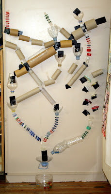

## Working with dataframes {- #working-with-dataframes}


### Introducing the `tidyverse` {- #tidyverse}

R includes hundreds of built-in ways to select individual elements, rows or columns from a dataframe.  This guide isn't going to teach you many of them.

The truth is that R can be overwhelming to new users, especially those new to programming. R is sometimes _too_ powerful and flexible: there are too many different to accomplish the same end, and this can lead to confusion.

Recently, a suite of packages has been developed for R which tries to provide a simple, consistent set of tools for working with data and graphics.

This suite of packages is called the *tidyverse*, and you can load all of these packages by calling:


```r
library(tidyverse)
```


In this guide we make much use of two components from the tidyverse:

- `dplyr`: to select, filter and summarise data
- `ggplot2`: to make plots

It's strongly recommended that you use these in your own code.


## Selecting columns {- #selecting-columns}


###### Selecting a single column {-}

Because dataframes act like lists of vectors, we can access columns from them using the `$` symbol. For example, here we select the `Ozone` column, which returns a vector of the observations made:


```r
airquality$Ozone
##   [1]  41  36  12  18  NA  28  23  19   8  NA   7  16  11  14  18  14  34
##  [18]   6  30  11   1  11   4  32  NA  NA  NA  23  45 115  37  NA  NA  NA
##  [35]  NA  NA  NA  29  NA  71  39  NA  NA  23  NA  NA  21  37  20  12  13
##  [52]  NA  NA  NA  NA  NA  NA  NA  NA  NA  NA 135  49  32  NA  64  40  77
##  [69]  97  97  85  NA  10  27  NA   7  48  35  61  79  63  16  NA  NA  80
##  [86] 108  20  52  82  50  64  59  39   9  16  78  35  66 122  89 110  NA
## [103]  NA  44  28  65  NA  22  59  23  31  44  21   9  NA  45 168  73  NA
## [120]  76 118  84  85  96  78  73  91  47  32  20  23  21  24  44  21  28
## [137]   9  13  46  18  13  24  16  13  23  36   7  14  30  NA  14  18  20
```


And we can pass this vector to functions, for example `summary()`:


```r
summary(airquality$Ozone)
##    Min. 1st Qu.  Median    Mean 3rd Qu.    Max.    NA's 
##    1.00   18.00   31.50   42.13   63.25  168.00      37
```


###### Selecting more than one column {-}

To select multiple columns the `select()` function from `dplyr` is the simplest solution. You give `select()` a dataframe plus the names of the columns you want, and it returns a new dataframe with just those columns, in the order you specified:


```r
head(
  select(mtcars, cyl, hp)
)
##                   cyl  hp
## Mazda RX4           6 110
## Mazda RX4 Wag       6 110
## Datsun 710          4  93
## Hornet 4 Drive      6 110
## Hornet Sportabout   8 175
## Valiant             6 105
```


Because all the main `dplyr` functions tend to return a new dataframe, we can assign the results to a variable, and use that as normal:


```r
cylandweight <- select(mtcars, cyl, wt)
summary(cylandweight)
##       cyl              wt       
##  Min.   :4.000   Min.   :1.513  
##  1st Qu.:4.000   1st Qu.:2.581  
##  Median :6.000   Median :3.325  
##  Mean   :6.188   Mean   :3.217  
##  3rd Qu.:8.000   3rd Qu.:3.610  
##  Max.   :8.000   Max.   :5.424
```


You can also put a minus (`-`) sign in front of the column name to indicate which columns you don't want:


```r
head(select(airquality, -Ozone, -Solar.R, -Wind))
##   Temp Month Day
## 1   67     5   1
## 2   72     5   2
## 3   74     5   3
## 4   62     5   4
## 5   56     5   5
## 6   66     5   6
```


You can use a patterns to match a subset of the columns you want. For example, here we select all the columns where the name contains the letter `d`:


```r
head(select(mtcars, contains("d")))
##                   disp drat
## Mazda RX4          160 3.90
## Mazda RX4 Wag      160 3.90
## Datsun 710         108 3.85
## Hornet 4 Drive     258 3.08
## Hornet Sportabout  360 3.15
## Valiant            225 2.76
```


And you can combine these techniques to make more complex selections:


```r
head(select(mtcars, contains("d"), -drat))
##                   disp
## Mazda RX4          160
## Mazda RX4 Wag      160
## Datsun 710         108
## Hornet 4 Drive     258
## Hornet Sportabout  360
## Valiant            225
```


As a quick reference, you can use the following 'verbs' to select columns in different ways:


- `starts_with()`
- `ends_with()`
- `contains()`
- `everything()`


There are other commands too, but these are probably the most useful to begin with. See the help files for more information.


## Selecting rows {- #selecting-rows}

To select particular rows from a dataframe, `dplyr` provides the `filter()` function. 

If we only want to see the 6-cylindered cars from the `mtcars` dataframe:


```r
filter(mtcars, cyl==6)
##    mpg cyl  disp  hp drat    wt  qsec vs am gear carb
## 1 21.0   6 160.0 110 3.90 2.620 16.46  0  1    4    4
## 2 21.0   6 160.0 110 3.90 2.875 17.02  0  1    4    4
## 3 21.4   6 258.0 110 3.08 3.215 19.44  1  0    3    1
## 4 18.1   6 225.0 105 2.76 3.460 20.22  1  0    3    1
## 5 19.2   6 167.6 123 3.92 3.440 18.30  1  0    4    4
## 6 17.8   6 167.6 123 3.92 3.440 18.90  1  0    4    4
## 7 19.7   6 145.0 175 3.62 2.770 15.50  0  1    5    6
```

The `filter` function selects rows matching criteria you set: in this case, that `cyl==6`. We can match two criteria at once if needed:


```r
filter(mtcars, cyl==6 & gear==3)
##    mpg cyl disp  hp drat    wt  qsec vs am gear carb
## 1 21.4   6  258 110 3.08 3.215 19.44  1  0    3    1
## 2 18.1   6  225 105 2.76 3.460 20.22  1  0    3    1
```


## 'Operators' {- #operators}

<!-- <iframe width="560" height="315" src="https://www.youtube-nocookie.com/embed/4TYv2PhG89A?rel=0" frameborder="0" allowfullscreen></iframe>
 -->

When selecting rows in the [example above](#selecting-rows) we used two equals signs `==` to compare values. 

However, there are other operators we can use to create filters. Rather than describe them, the examples below demonstrate what each of them do.


###### Equality and matching {-}

To compare a single value we use `==`


```r
2 == 2
## [1] TRUE
```

And in a filter:


```r
filter(mtcars, cyl==6)
##    mpg cyl  disp  hp drat    wt  qsec vs am gear carb
## 1 21.0   6 160.0 110 3.90 2.620 16.46  0  1    4    4
## 2 21.0   6 160.0 110 3.90 2.875 17.02  0  1    4    4
## 3 21.4   6 258.0 110 3.08 3.215 19.44  1  0    3    1
## 4 18.1   6 225.0 105 2.76 3.460 20.22  1  0    3    1
## 5 19.2   6 167.6 123 3.92 3.440 18.30  1  0    4    4
## 6 17.8   6 167.6 123 3.92 3.440 18.90  1  0    4    4
## 7 19.7   6 145.0 175 3.62 2.770 15.50  0  1    5    6
```


###### {- .explainer}

You might have noted above that we write `==` rather than just `=` to define the criteria. This is because most programming languages, including R, use two `=` symbols to distinguish: *comparison* from *assignment*.


###### Presence/absence {-}


To test if a value is in a vector of suitable matches we can use: `%in%`:


```r
2 %in% 1:10
## [1] TRUE
100 %in% 1:10
## [1] FALSE
```

And, perhaps less obviously, we can test whether each value in a vector is in a second vector. This returns a vector of `TRUE/FALSE` values as long as the first list:


```r
c(1, 2) %in% c(2, 3, 4)
## [1] FALSE  TRUE
```

And this is very useful in a dataframe filter:


```r
head(filter(mtcars, cyl %in% c(4, 6)))
##    mpg cyl  disp  hp drat    wt  qsec vs am gear carb
## 1 21.0   6 160.0 110 3.90 2.620 16.46  0  1    4    4
## 2 21.0   6 160.0 110 3.90 2.875 17.02  0  1    4    4
## 3 22.8   4 108.0  93 3.85 2.320 18.61  1  1    4    1
## 4 21.4   6 258.0 110 3.08 3.215 19.44  1  0    3    1
## 5 18.1   6 225.0 105 2.76 3.460 20.22  1  0    3    1
## 6 24.4   4 146.7  62 3.69 3.190 20.00  1  0    4    2
```


###### Greater/less than {-}

The `<` and `>` symbols work as you'd expect:


```r
head(filter(mtcars, cyl > 4))
head(filter(mtcars, cyl < 5))
```


You can also use `>=` and `<=`:


```r
filter(mtcars, cyl >= 6)
filter(mtcars, cyl <= 4)
```


###### Negation (opposite of) {-}

The `!` is very useful to tell R to reverse an expression; that is, take the opposite of the value. In the simplest example:


```r
!TRUE
## [1] FALSE
```

This is helpful because we can reverse the meaning of other expressions:


```r
is.na(NA)
## [1] TRUE
!is.na(NA)
## [1] FALSE
```

And we can use in filters. Here we select rows where `Ozone` is missing (`NA`):


```r
filter(airquality, is.na(Ozone))
```

And here we use `!` to reverse the expression and select rows which are not missing:


```r
filter(airquality, !is.na(Ozone))
```


[Try running these commands for yourself and experiment with changing the operators to make select different combinations of rows]{.exercise}


###### Other logical operators {-}


There are operators for 'and'/'or' which can combine other filters


```r
filter(mtcars, hp > 200 | wt > 4)
##    mpg cyl  disp  hp drat    wt  qsec vs am gear carb
## 1 14.3   8 360.0 245 3.21 3.570 15.84  0  0    3    4
## 2 16.4   8 275.8 180 3.07 4.070 17.40  0  0    3    3
## 3 10.4   8 472.0 205 2.93 5.250 17.98  0  0    3    4
## 4 10.4   8 460.0 215 3.00 5.424 17.82  0  0    3    4
## 5 14.7   8 440.0 230 3.23 5.345 17.42  0  0    3    4
## 6 13.3   8 350.0 245 3.73 3.840 15.41  0  0    3    4
## 7 15.8   8 351.0 264 4.22 3.170 14.50  0  1    5    4
## 8 15.0   8 301.0 335 3.54 3.570 14.60  0  1    5    8
```

Using `&` (and) makes the filter more restrictive:


```r
filter(mtcars, hp > 200 & wt > 4)
##    mpg cyl disp  hp drat    wt  qsec vs am gear carb
## 1 10.4   8  472 205 2.93 5.250 17.98  0  0    3    4
## 2 10.4   8  460 215 3.00 5.424 17.82  0  0    3    4
## 3 14.7   8  440 230 3.23 5.345 17.42  0  0    3    4
```


Finally, you can set the order in which operators are applied by using parentheses. This means these expressions are subtly different:


```r
# first
filter(mtcars, (hp > 200 & wt > 4) | cyl==8)
##     mpg cyl  disp  hp drat    wt  qsec vs am gear carb
## 1  18.7   8 360.0 175 3.15 3.440 17.02  0  0    3    2
## 2  14.3   8 360.0 245 3.21 3.570 15.84  0  0    3    4
## 3  16.4   8 275.8 180 3.07 4.070 17.40  0  0    3    3
## 4  17.3   8 275.8 180 3.07 3.730 17.60  0  0    3    3
## 5  15.2   8 275.8 180 3.07 3.780 18.00  0  0    3    3
## 6  10.4   8 472.0 205 2.93 5.250 17.98  0  0    3    4
## 7  10.4   8 460.0 215 3.00 5.424 17.82  0  0    3    4
## 8  14.7   8 440.0 230 3.23 5.345 17.42  0  0    3    4
## 9  15.5   8 318.0 150 2.76 3.520 16.87  0  0    3    2
## 10 15.2   8 304.0 150 3.15 3.435 17.30  0  0    3    2
## 11 13.3   8 350.0 245 3.73 3.840 15.41  0  0    3    4
## 12 19.2   8 400.0 175 3.08 3.845 17.05  0  0    3    2
## 13 15.8   8 351.0 264 4.22 3.170 14.50  0  1    5    4
## 14 15.0   8 301.0 335 3.54 3.570 14.60  0  1    5    8

# second reordered evaluation
filter(mtcars, hp > 200 & (wt > 4 | cyl==8))
##    mpg cyl disp  hp drat    wt  qsec vs am gear carb
## 1 14.3   8  360 245 3.21 3.570 15.84  0  0    3    4
## 2 10.4   8  472 205 2.93 5.250 17.98  0  0    3    4
## 3 10.4   8  460 215 3.00 5.424 17.82  0  0    3    4
## 4 14.7   8  440 230 3.23 5.345 17.42  0  0    3    4
## 5 13.3   8  350 245 3.73 3.840 15.41  0  0    3    4
## 6 15.8   8  351 264 4.22 3.170 14.50  0  1    5    4
## 7 15.0   8  301 335 3.54 3.570 14.60  0  1    5    8
```


[Try writing in plain English the meaning of the two filter expressions above]{.exercise}


## Sorting {- #sorting}

You can sort dataframes with `arrange()`:


```r
airquality %>% 
  arrange(Ozone) %>% 
  head
##   Ozone Solar.R Wind Temp Month Day
## 1     1       8  9.7   59     5  21
## 2     4      25  9.7   61     5  23
## 3     6      78 18.4   57     5  18
## 4     7      NA  6.9   74     5  11
## 5     7      48 14.3   80     7  15
## 6     7      49 10.3   69     9  24
```


By default sorting is ascending, but you can use a minus sign to reverse this:


```r
airquality %>% 
  arrange(-Ozone) %>% 
  head
##   Ozone Solar.R Wind Temp Month Day
## 1   168     238  3.4   81     8  25
## 2   135     269  4.1   84     7   1
## 3   122     255  4.0   89     8   7
## 4   118     225  2.3   94     8  29
## 5   115     223  5.7   79     5  30
## 6   110     207  8.0   90     8   9
```


You can sort on multiple columns too, but the order of the variables makes a difference:


```r
airquality %>% 
  select(Month, Ozone) %>% 
  arrange(Month, -Ozone) %>% 
  head
##   Month Ozone
## 1     5   115
## 2     5    45
## 3     5    41
## 4     5    37
## 5     5    36
## 6     5    34


airquality %>% 
  select(Month, Ozone) %>% 
  arrange(-Ozone, Month) %>% 
  head
##   Month Ozone
## 1     8   168
## 2     7   135
## 3     8   122
## 4     8   118
## 5     5   115
## 6     8   110
```


## Pipes {- #pipes}

We often want to combine `select` and `filter` (and other functions) to return a subset of our original data.

As you might have noticed above, we can 'nest' function calls in R. For example, we might want to select specific columns and filter out some rows.

Taking the `mtcars` data, we might want to select the weights of only those cars with low `mpg`:


```r
gas.guzzlers <- select(filter(mtcars, mpg < 15), wt)
summary(gas.guzzlers)
##        wt       
##  Min.   :3.570  
##  1st Qu.:3.840  
##  Median :5.250  
##  Mean   :4.686  
##  3rd Qu.:5.345  
##  Max.   :5.424
```


This is OK, but can get quite confusing to read, and the more deeply functions are nested the easier it is to make a mistake.


#### `dplyr` provides an alternative to nested function calls, called the pipe. {-}

Imagine your dataframe as a big bucket containing data. From this bucket, you can 'pour' your data down through a series of tubes and filters, until at the bottom of your screen you have a smaller bucket containing just the data you want.





To make data flow from one bucket to another, we use the 'pipe' operator: `%>%`


```r
# dataframes are just 'buckets' of data
big.bucket.of.data <- mtcars

big.bucket.of.data %>%
  filter(mpg <15) %>%
  select(wt) %>%
  summary
##        wt       
##  Min.   :3.570  
##  1st Qu.:3.840  
##  Median :5.250  
##  Mean   :4.686  
##  3rd Qu.:5.345  
##  Max.   :5.424
```


So we have achieved the same outcome, but the code reads as a series of operations which the data flows through, connected by our pipes (the `%>%`). At the end of the last pipe, our data gets dumped into the `summary()` function^[You might notice that when we write the `select` function we don't explicitly name the dataframe to be used. This is because R *implicitly* passes the output of the pipe to the first argument of the function. So here, the output of `filter(mpg<15)` is used as the dataframe in the `select` function.]

We could just as well have saved this smaller 'bucket' of data so we can use it later on:


```r
smaller.bucket <- big.bucket.of.data %>%
  filter(mpg <15) %>%
  select(wt)
```


This turns out to be an incredibly useful pattern when processing and working with data. We can pour data through a series of filters and other operations, saving intermediate states where necessary.


[You can insert the `%>%` symbol in RStdudio by typing `cmd-shift-M`, which saves a lot of typing.]{.explainer}


## Modifying and creating new columns {- #mutate}


Often when working with data we want to compute new values from columns we already have. 

Let's imagine we have collected data from patients using the [PHQ-9](http://www.nhs.uk/Tools/Documents/Mood%20self-assessment.htm) questionnaire, which [measures depression](http://onlinelibrary.wiley.com/doi/10.1046/j.1525-1497.2001.016009606.x/abstract):


```r
phq9.df <- readr::read_csv("phq.csv")
glimpse(phq9.df)
## Observations: 2,429
## Variables: 12
## $ patient <int> 1, 2, 2, 2, 2, 2, 2, 2, 2, 2, 2, 2, 2, 2, 2, 3, 3, 3, ...
## $ phq9_01 <int> 3, 1, 1, 2, 2, 2, 3, 2, 3, 3, 1, 3, 2, 1, 2, 3, 3, 3, ...
## $ phq9_02 <int> 3, 2, 2, 2, 3, 3, 3, 2, 3, 3, 1, 3, 2, 1, 3, 3, 3, 3, ...
## $ phq9_03 <int> 3, 3, 3, 3, 3, 3, 3, 3, 3, 3, 3, 3, 3, 1, 3, 2, 3, 3, ...
## $ phq9_04 <int> 3, 3, 2, 3, 3, 3, 3, 3, 3, 3, 3, 3, 3, 2, 3, 3, 3, 3, ...
## $ phq9_05 <int> 3, 3, 3, 3, 3, 3, 3, 3, 3, 3, 3, 3, 3, 2, 3, 2, 1, 2, ...
## $ phq9_06 <int> 3, 2, 2, 2, 3, 3, 2, 1, 2, 3, 3, 3, 2, 1, 3, 3, 3, 3, ...
## $ phq9_07 <int> 3, 3, 1, 1, 2, 1, 2, 2, 1, 3, 2, 2, 2, 2, 3, 2, 1, 1, ...
## $ phq9_08 <int> 0, 2, 2, 1, 1, 1, 1, 2, 1, 3, 1, 2, 1, 0, 2, 1, 0, 1, ...
## $ phq9_09 <int> 2, 2, 1, 1, 2, 2, 2, 1, 1, 3, 1, 2, 1, 1, 3, 3, 3, 3, ...
## $ month   <int> 0, 0, 1, 2, 3, 4, 5, 6, 7, 8, 9, 10, 11, 12, 18, 0, 1,...
## $ group   <int> 1, 0, 0, 0, 0, 0, 0, 0, 0, 0, 0, 0, 0, 0, 0, 1, 1, 1, ...
```


Each patients' PHQ-9 score is calculated by summing all of the individual item scores. So - we want to create a new column containing the sum of each row.  This is fairly easy with the `dplyr::mutate()` function:


```r
phq9.scored.df <- phq9.df %>%
mutate(phq9 = phq9_01 + phq9_02 + phq9_03 + phq9_04 +
         phq9_05 + phq9_06 + phq9_07 + phq9_08 + phq9_09)

phq9.scored.df %>%
  select(patient, group, month, phq9) %>%
  head
## # A tibble: 6 x 4
##   patient group month  phq9
##     <int> <int> <int> <int>
## 1       1     1     0    23
## 2       2     0     0    21
## 3       2     0     1    17
## 4       2     0     2    18
## 5       2     0     3    22
## 6       2     0     4    21
```

Notice that we first stored the computed scores in `phq9.scored.df` and then used `select()` to get rid of the raw data columns to display only what we needed.

See this section on [summarising and processing data](#split-apply-combine) for a [neater way to create summary scores](#mutate-with-rowmeans) in this sort of situation.


