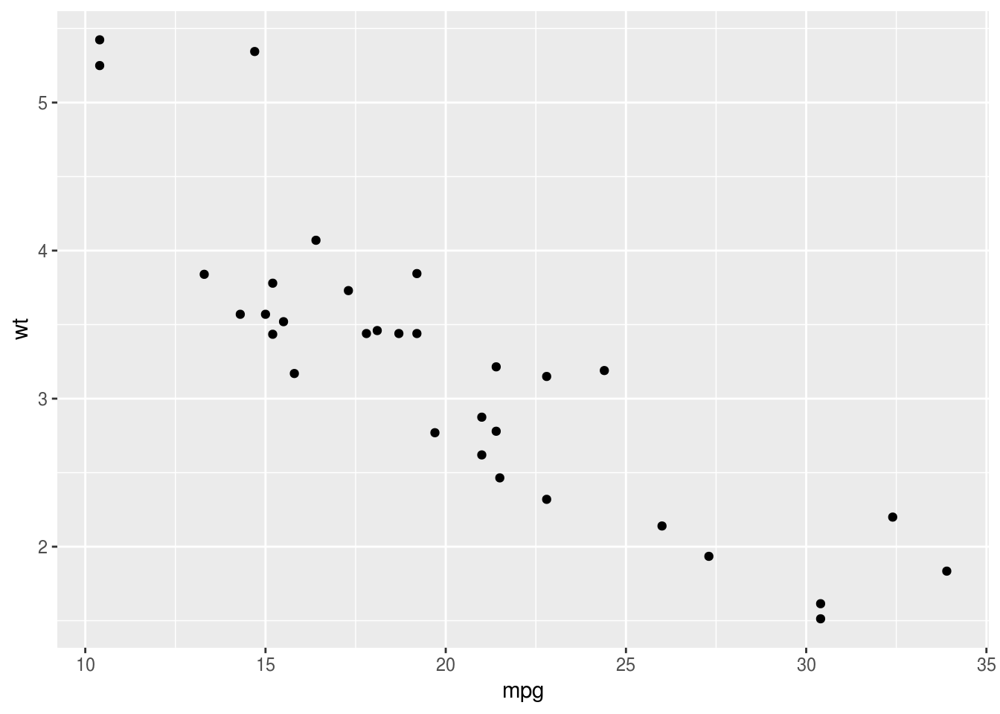
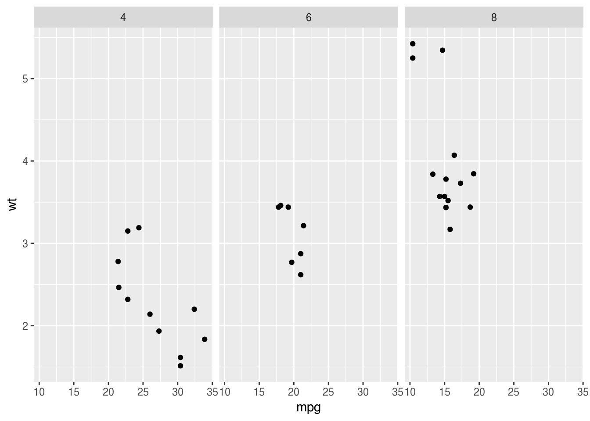
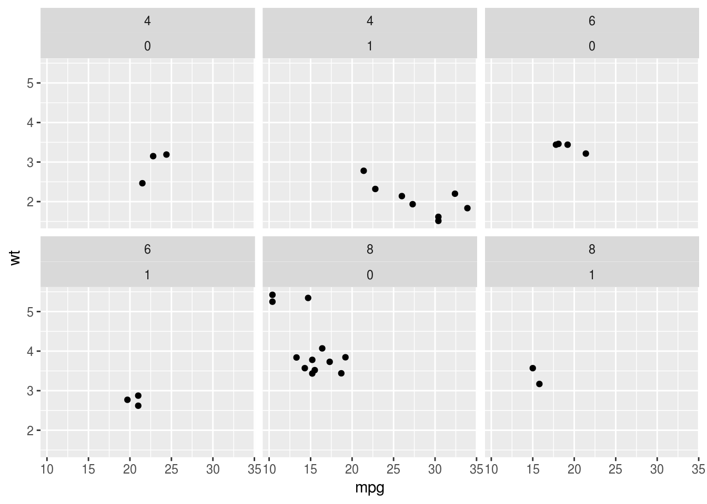
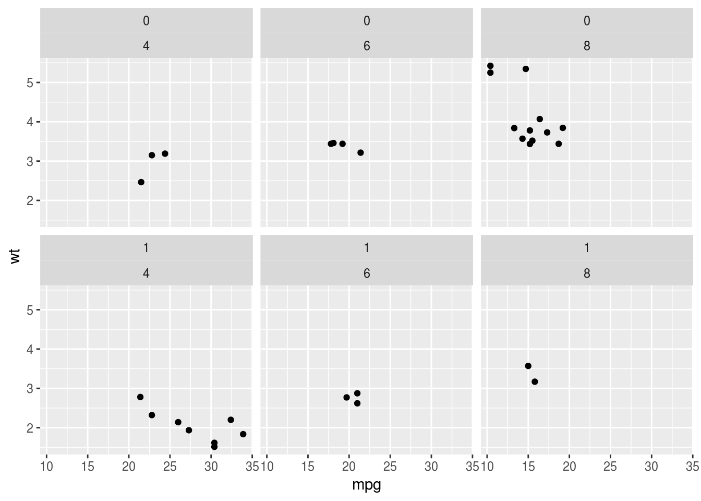
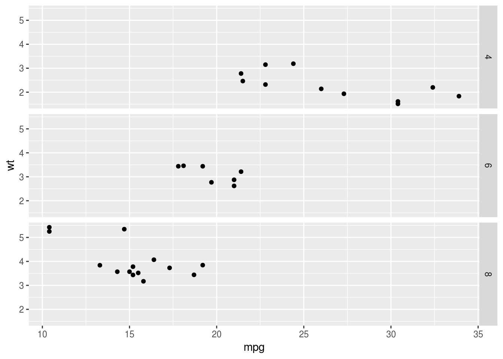
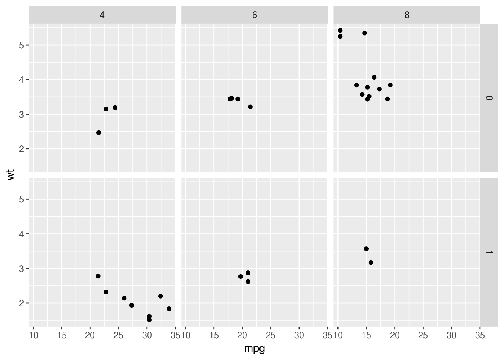
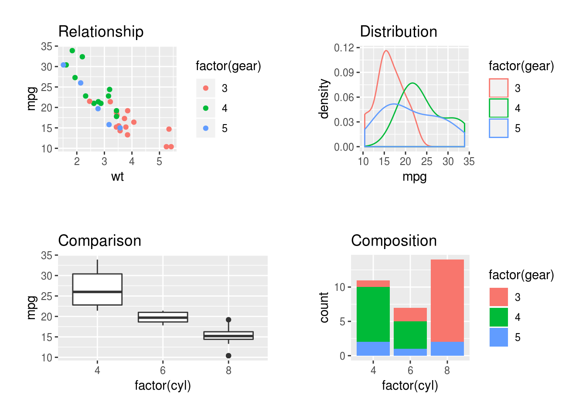

---
title: 'ggplot extras'
---


## Tricks with ggplot {- #ggplot-details}

### More ways to facet a plot {- #facetting-plots}

Facets are ways to repeat a plot for each level of another variable. `ggplot`
has two ways of defining and displaying facets:

-   As a list of plots, using `facet_wrap`.
-   As a grid or matrix of plots, using `facet_grid()`.

Examples of both are shown below, using the following plot as a starting point:


```r
base.plot <- ggplot(mtcars, aes(mpg, wt)) + geom_point()
base.plot
```



### `facet_wrap` {-}

If we want one facet we just type the tilde (`~`) symbol and then the name of
the variable. This is like typing the right hand side of a
[formula for a regression model](formulae):


```r
base.plot + facet_wrap(~cyl)
```



If we want two facets we extend the formula, using the `+` sign:


```r
base.plot + facet_wrap(~cyl+am)
```



Note, the order of variables in the formula makes a difference:


```r
base.plot + facet_wrap(~am+cyl)
```



### `facet_grid` {-}

With one variable `facet_grid` produces similar output. Note the `.` (period) on
the left hand side of the formula now to make explicit we only have one
variable, and we want it on the x axis:


```r
base.plot + facet_grid(.~cyl)
```


We can flip the facets around by putting the `cyl` variable on the left hand
side of the `~`:


```r
base.plot + facet_grid(cyl~.)
```



And `facet_grid` can also create facets for two or more variables:


```r
base.plot + facet_grid(am~cyl)
```



Here the labelling and the arrangement of plots is perhaps nicer because it is
clearer that plots for `cyl` are arrange left to right, and for `am` they are
top to bottom.

### Combining separate plots in a grid {- #combining-plots}

Note that combining separate plots in a grid is different from
[facetting](#facetting-plots), and it may be you want that instead.

If you really want to combine several plots, the `gridExtra` and `cowplot`
packages can be helpful. This is the code from the
[example in the graphics section](#layered-graphics), which may be a useful
starting point:


```r
comparison <- ggplot(mtcars, aes(factor(cyl), mpg)) + geom_boxplot() +  ggtitle("Comparison")
relationships <- ggplot(mtcars, aes(wt, mpg, color=factor(gear))) + geom_point() + ggtitle("Relationship")
distributions <- ggplot(mtcars, aes(mpg, color=factor(gear))) + geom_density() + ggtitle("Distribution")
composition <- ggplot(mtcars, aes(factor(cyl), fill = factor(gear))) + geom_bar() + ggtitle("Composition")
mm <- theme(plot.margin=unit(rep(1.5,4), "line"))
gridExtra::grid.arrange(relationships+mm, distributions+mm, comparison+mm, composition+mm, ncol=2)
```



## Exporting for print {- #exporting-graphics}

To export ggplot graphics you can use the `ggsave()` function:


```r

ggplot(mtcars, aes(wt, mpg)) + geom_point()
ggsave(filename = "myplot.pdf")

```

See the
[ggplot docs on exporting](http://ggplot2.tidyverse.org/reference/ggsave.html)
or page
[323 of the R Graphics Cookbook](https://ase.tufts.edu/bugs/guide/assets/R%20Graphics%20Cookbook.pdf)
for lots more detail.
