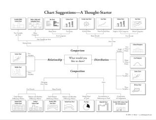

  
```{r, include=FALSE}
# ignore all this for the moment; it will be explained below
knitr::opts_chunk$set(echo = TRUE, collapse=TRUE, cache=TRUE, message=F)
library(tidyverse)
library(pander)
library(knitr)
```


# Graphics {#graphics}


```{r, echo=F}
set.seed(1234)
data_frame(pictures = abs(rnorm(100, 30, 10)), words = pictures*1000+rnorm(100, 0, 2000)+runif(100, -2000, 2000)) %>% 
  ggplot(aes(pictures, words)) + geom_point() + geom_smooth(se=F)
```

Graphics are the best thing about R. The base system alone provides lots of useful plotting functions, but the `ggplot2` package is exceptional in the consistent and powerful approach it takes to visualising data. This chapter focusses mostly on `ggplot`, but does include some pointers to other useful plotting functions.


It's also worth pointing out here that the O'Reilly [R Graphics cookbook is available as a pdf download](https://ase.tufts.edu/bugs/guide/assets/R%20Graphics%20Cookbook.pdf) and is a much more comprehensive source than this page. 

The examples below are more selective and show plots likely to be of particular use in reporting your studies.

The emphaisis on showing you how to make _good_ plots that help you explore data and communicate your findings, rather than simply reproduce the output of SPSS or Excel.


## Benefits of visualising data {- #graphics-benefits}

TODO  XXX

- Psychology and human factors of graphics + Tufte. 
- Importance of graphs to communicate.
- Motivating examples from RCTs.


## Which tool to use? {- #graphics-approaches}

Typically when setting out to plot data in R it pays to ask yourself whether you need:

1. A quick way to visualise something specific -- for example to check some feature of your data before you continue your analysis -- without worrying _too_ much about the detail of the graphic.

2. A plot that is specifically designed to communicate your data effectively, and where you do care about the details of the final output.
  
For the first case, where you already know what you want --- for example to visualise a distribution of a single variable or to check diagnostics from a linear model --- there are many useful built-in functions in base-R.

For the second case --- for example where you want to visualise the main outcomes of your study, or draw attention to specific aspects of your data --- there is `ggplot2`. We'll deal with the second case first, because using ggplot highlights many important aspects of plotting in general.


## Layered graphics with `ggplot` {- #layered-graphics}

If you've never given much thought to data visualisation before, you might be surprised at the sheer variety of graphs types available.

One way to cut through the multituyde of options is to determine what the purpose of your plot is. It your goal to show:


- Relationships
- Distributions
- Comparison
- Composition


```{r, fig.width=8, echo=F, fig.cap="Examples of charts showing comaprisons, relationships, distribution and composition. The comparison, distribution and composition plots show 2 variables, but the relationship plot includes 3, increasing the density of the information displayed. "}
comparison <- ggplot(mtcars, aes(factor(cyl), mpg)) + geom_boxplot() +  ggtitle("Comparison")
relationships <- ggplot(mtcars, aes(wt, mpg, color=factor(gear))) + geom_point() + ggtitle("Relationship")
distributions <- ggplot(mtcars, aes(mpg, color=factor(gear))) + geom_density() + ggtitle("Distribution")
composition <- ggplot(mtcars, aes(factor(cyl), fill = factor(gear))) + geom_bar() + ggtitle("Composition")
mm <- theme(plot.margin=unit(rep(1.5,4), "line"))
gridExtra::grid.arrange(relationships+mm, distributions+mm, comparison+mm, composition+mm, ncol=2)
```


### 'Chart chooser' guides {-}

There are various simple chart selection guides available online, of which these are quite nice examples:

- [Chart selection guide (pdf)](http://extremepresentation.typepad.com/blog/2006/09/choosing_a_good.html)]
- ['Show me the numbers' chart guide (pdf)](https://www.perceptualedge.com/articles/misc/Graph_Selection_Matrix.pdf)




*However*, guides which attempt to be comprehensive and show you a full range of plot types are perhaps not as useful as those which reflect our knowledge of which plots are the most effective forms of communication.

For example, almost all guides to plotting, and especially R textbooks, will show you how to plot a simple bar graph. But bar graphs have numerous disadvantages over other plots which can show the same information. Specifically, they are: low in information density (and so inefficient in use of space); they make comparisons between multiple series very difficult (for example in [interacion plots](#understanding-interactions)); and, perhaps most importantly, even when they include error bars, readers consistently misinterpret the quantitative information in bar graphs (specifically, when bar graphs are used to display estimates which contain error, readers assume points above the bar are less likely than points within the bar, even though this is typically not the case).

You should be guided in choosing plots not simply by mechanical rules based on the number or type of variables you want to display. Instead, you should be guided by the evidence from basic studies of human perception, and applied data on how different types of infromation displays are really used by readers.

This guide is restricted to examples likely to be useful to experiemental and applied psychologists. 


### Thinking like `ggplot` 

When using `ggplot` it helps to think of five separate steps to making a plot (2 are optional, but commonly used):

1. Choose the data you want to plot.
2. Map variables to axes or other features of the plot (e.g. sizes or colours).
3. (Optionally) use `ggplot` functions to summarise your data before the plot is drawn (e.g. to calulate means and standard errors for point-range plots).
4. Add visual display layers.
5. (Optionally) Split the plot up across multiple panels using groupings in the data.


You can then customise the plot labels and title, and tweak other presentation parameters, although this often isn't necessary unless sending a graphic for publication. You can also export graphics in multiple high quality formats.


The simplest way to demonstrate these steps is with an example, and we begin with a plot showing the relationship betwen variables:


### Relationships

Problem to be solved: You want to check/show whether variables are related in a linear fashion before running linear regression:

*Step 1* is to select our data. As is typical in R, `ggplot` works best with long-format data. In the examples below we will use the `mtcars` dataset for convenience, so our first line of code is to use the `dplyr` pipe symbol (operator) to send the `mtcars` dataset to the next line of code:

```{r, eval=F}
mtcars %>% 
  ...
```


*Step 2* is to map the variables we want to axes or other features of the plot (e.g. the colours of points, or the linetypes used in line plots). Here we tell `ggplot` to use `disp` (engine size) on the x axis, and `mpg` on the y axis. We also tell it to colour the points differently depending on the value of `hp` (engine horsepower). At this point `ggplot` will create and label the axes and plot area, but doesn't yet display any of our data. For this we need to add visual display layers (we skip step 3 in this example, but will cover it in other examples below):

  
```{r}
mtcars %>% 
  ggplot(aes(x = disp, y = mpg, colour=hp))
```


*Step 4* 

To display data, we have to add a visual layer to the plot. For example, let's say we want to make a scatter plot, and so draw points for each row of data:


```{r}
mtcars %>% 
  ggplot(aes(x = disp, y = mpg, colour=hp)) +
  geom_point()
```


And we have a pretty slick graph: `ggplot` has now added points for each pair of `disp` and `mpg` values, and coloured them according to the value of `hp` (see choosing colours below XXX).

[Use the `airquality` dataset and create your own scatterplot and try to colour the points using the `Month` variable. Should `Month` be used as a factor or a numeric variable when colouring the points?]{.exercise}


```{r, include=F, echo=F}
airquality %>% 
  ggplot(aes(Ozone, Temp, color=factor(Month))) + geom_point()
```


What's even neater about `ggplot` though is how easy it is to *layer* different visualisations of the same data. These visual layers are called `geom`'s and the functions which add them are all prefixed with `geom_`, so `geom_point()` for scatter plots, or `geom_line()` for line plots, or `geom_smooth()` for a smoothed line plot. We can add this to the scatter plot like so:


```{r}
mtcars %>% 
  ggplot(aes(x = disp, y = mpg, colour=hp)) +
  geom_point(size=2) + 
  geom_smooth(se=F, colour="grey") 
```


In the example above, I have also customised the smoothed line, making it grey to avoid over-intrusion into our perception of the points. Often less is more when plotting graphs: not everything can be emphasised at once, and *it's important to make decisions about what should be given visual priority*.


*Step 5* 'Splitting up' or repeating the plot. Very often, you will have drawn plot and think things like *I wonder what that would look like if I drew it for men and women separately?*. In `ggplot` this is called facetting, and is easy to achieve, provided your data are in a long format. 

Using the same `mtcars` example, let's say we wanted separate panels for American vs. Foreign cars (information held in the `am` variable). We simply add the `facet_wrap()`, and specify the `"am"` variable:


```{r}
mtcars %>% 
  ggplot(aes(x = disp, y = mpg, colour=hp)) +
  geom_point(size=2) + 
  geom_smooth(se=F, colour="grey") +
  facet_wrap("am")
```


One trick is to make sure factors are labelled nicely, because these labels appear on the final plot. Here the `mutate()` call [relabels the factor](real-data.html#factors-and-numerics) which makes the plot easier to read:

```{r}
mtcars %>% 
  mutate(american = factor(am, labels=c("American", "Foreign"))) %>% 
  ggplot(aes(x = disp, y = mpg, colour=hp)) +
  geom_point(size=2) + 
  geom_smooth(se=F, colour="grey") +
  facet_wrap("american")
```


### Distributions

```{r}
lme4::sleepstudy %>% 
  ggplot(aes(Reaction)) + geom_density()
```

Imagine we wanted to compare distributions for individuals. Simply overlaying the lines is confusing:

```{r}
lme4::sleepstudy %>% 
  ggplot(aes(Reaction, group=Subject)) + geom_density()
```


Facetting produces a nicer result:

```{r}
lme4::sleepstudy %>% 
  ggplot(aes(Reaction)) + geom_density() + facet_wrap("Subject")
```


But we could present the same information more compactly, and with better facility to compare between subjects, if we use a bottleplot:


```{r}
lme4::sleepstudy %>% 
  ggplot(aes(Subject, Reaction)) + 
  geom_violin() 
```


We might want to plot our Subjects in order of their mean RT:

```{r}
mean.ranked.sleep <- lme4::sleepstudy %>% 
  group_by(Subject) %>% 
  # calculate mean RT
  mutate(RTm = mean(Reaction)) %>% 
  # sort by mean RT
  arrange(RTm, Days) %>% 
  ungroup() %>% 
  # create a rank score but conert to factor right away 
  mutate(SubjectRank = factor(dense_rank(RTm)))

mean.ranked.sleep %>% 
  ggplot(aes(SubjectRank, Reaction)) + 
  geom_violin() + 
  theme(aspect.ratio = .33)  # change the aspect ratio to make long and wide

```


Or we might want to compare individuals against the combined distribution:

```{r}
# duplicate all the data, assigning one-replication to a single subject, "All"
sleep.repeat <- bind_rows(lme4::sleepstudy,
                          lme4::sleepstudy %>% mutate(Subject="All"))

sleep.repeat %>% 
  mutate(all = Subject=="All") %>% 
  ggplot(aes(Subject, Reaction, color=all)) + 
  geom_violin() +
  guides(colour=FALSE) + # turn off he legend because we don't really need it
  theme(aspect.ratio = .25)  # change the aspect ratio to make long and wide
```


Boxplots can also work well to show distributions, and have the advantage of showing the median explicitly:


```{r}
mean.ranked.sleep %>% 
  ggplot(aes(SubjectRank, Reaction)) + 
  geom_boxplot() 
```


If we plot the same data by-day, we can clearly see the effect of sleep deprivation, and the increase in variability between subjects as sime goes on: the lack of sleeps seems to be affecting some subjects more than others

```{r}
lme4::sleepstudy %>% 
  ggplot(aes(factor(Days), Reaction)) + 
  geom_boxplot() 
```


### Comparisons


TODO XXX


### Composition

```{r}
tribble
```


TODO XXX


## 'Quick and dirty' (utility) plots {- #utility-plotting-functions}

When exploring a dataset, often useful to use built in functions or helpers from other libraries. These help you quickly visualise relationships, but aren't always *exactly* what you need and can be hard to customise.


### Distributions

```{r}
hist(mtcars$mpg)
plot(density(mtcars$mpg))
boxplot(mpg~cyl, data=mtcars)
Hmisc::hist.data.frame(mtcars)
```


Even for simple plots, ggplot has some useful helper functions though:

```{r}
qplot(mpg, data=mtcars, geom="density") + xlab("Miles per gallon")
qplot(x=factor(cyl), y=mpg, data=mtcars, geom="boxplot") 
```


### Relationships

```{r}
with(mtcars, plot(mpg, wt))
pairs(select(mtcars, wt, disp, mpg))
```


Again, for quick plots ggplot also has useful shortcut functions:

```{r}
qplot(mpg, wt, color=factor(cyl), data = mtcars)
```


### Quantities

I don't think the base R plots are that convenient here. `ggplot2::` and the `stat_summary()` function makes life much simpler:

```{r}
ggplot(mtcars, aes(factor(cyl), mpg)) + 
  stat_summary(geom="bar")
```


And if you are plotting quantities, as disussed above, showing a range is sensible (a boxplot would also fill both definitions):

```{r}
ggplot(mtcars, aes(factor(cyl), mpg)) + 
  stat_summary(geom="pointrange")
```


