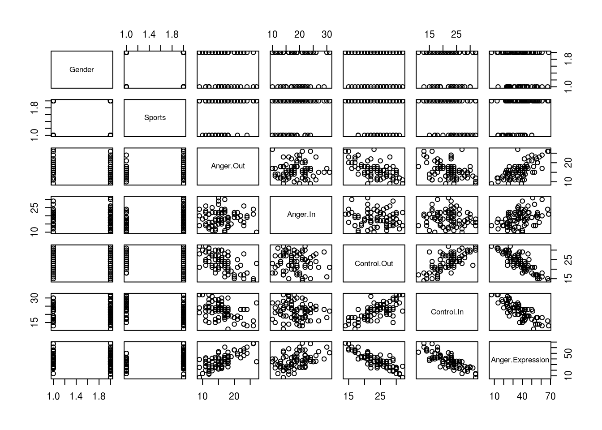

---
title: 'Import/export'
---


## Importing data {- #importing-data}

If you have data outside of R, _the simplest way to import it is to first save
it as a comma or tab-separated text file_, normally with the file extension
`.csv` or `.txt`^[This is easy to achieve in Excel and most other stats packages
using the `Save As...` menu item].

Let's say we have file called `angry_moods.csv` in the same directory as our
`.Rmd` file. We can read this data using the `read_csv()` function from the
`readr` package[^readr]:

[^readr]:

    There are also standard functions built into R, such as `read.csv()` or
    `read.table()` for importing data. These are fine if you can't install the
    `readr` package for some reason, but they are quite old and the default
    behaviour is sometimes counterintuitive. I recommend using the `readr`
    equivalents: `read_csv()` or `read_tsv()`.


```r
angry.moods <- readr::read_csv('data/angry_moods.csv')
head(angry.moods)
# A tibble: 6 x 7
  Gender Sports Anger.Out Anger.In Control.Out Control.In Anger.Expression
   <dbl>  <dbl>     <dbl>    <dbl>       <dbl>      <dbl>            <dbl>
1      2      1        18       13          23         20               36
2      2      1        14       17          25         24               30
3      2      1        13       14          28         28               19
4      2      1        17       24          23         23               43
5      1      1        16       17          26         28               27
6      1      1        16       22          25         23               38
```

As you can see, when loading the `.csv` file the `read_csv()` makes some
assumptions about the _type_ of data the file contains. In this case, all the
columns contain integer values. It's worth checking this message to make sure
that stray cells in the file you are importing don't cause problems when
importing. Excel won't complain about this sort of thing, but R is more strict
and won't mix text and numbers in the same column.

A common error is for stray notes or text values in a spreadsheet to cause a
column which should be numeric to be converted to the `character` type.

Once it's loaded, you can use this new dataset like any other:


```r
pairs(angry.moods)
```



### Importing data over the web {- #importing-data-from-the-web}

One neat feature of the `readr` package is that you can import data from the
web, using a URL rather than a filename on your local computer. This can be
really helpful when sharing data and code with colleagues. For example, we can
load the `angry_moods.csv` file from a URL:


```r
angry.moods.from.url <- readr::read_csv(
  "https://raw.githubusercontent.com/benwhalley/just-enough-r/master/angry_moods.csv")

head(angry.moods.from.url)
```

### Importing from SPSS and other packages {- #importing-proprietary-formats}

This is often more trouble than it's worth. If using Excel for example, it's
best just to save your data a csv file first and import that.

But if you really must use other formats see
<https://www.datacamp.com/community/tutorials/r-data-import-tutorial>.

## Saving and exporting {-}

Before you start saving data in csv or any other format, as yourself: "Do I need
to save _this_ dataset, or should I simply save my raw data and code?"

Oftentimes it's best to keep only your raw datafiles, with the R code you used
to process them. This keeps your disk tidier, and avoids confusion with multiple
versions of files.

If it takes a long time to process your data though you might want to save
interim steps. And if you share your data (which you should) you might also want
to save simplified or anonymised versions of it, in widely-accessible formats.

### Use CSV files {- #use-csv}

Comma-separated-values files are a plain text format which are idea for storing
and sharing your data. They are:

-   Understood by almost every piece of software, ever
-   Will be readable in future
-   Perfect for storing 2D data (like dataframes)
-   Readable by humans (just open them in Notepad)

Commercial formats like Excel, SPSS (.sav) and Stata (.dta) don't have these
properties.

Although CSV has some disadvantages, they are all easily overcome if you
[save the steps of your data processing and analysis in your R code](#save-intermediate-steps),
see below.

Saving a dataframe to .csv is as simple as:


```r
readr::write_csv(mtcars, 'mtcars.csv')
```

If you run this within an RMarkdown document, this will create the new csv file
in the same directory as your `.Rmd` file.

[You can also use the `write.csv()` function in base R, but this version from
`readr` is faster and has more sensible defalts (e.g. it doesn't write rownames,
but does save column names in the first row)]{.tip}

#### Save processes, not just outcomes {- #save-intermediate-steps}

Many students (and academics) make errors in their analyses because they process
data by hand (e.g. editing files in Excel) or use GUI tools to run analyses.

In both cases these errors are hard to identify or rectify because only the
outputs of the analysis can be saved, and _no record has been made of how these
outputs were produced_.

In contrast, if you do your data processing and analysis in R/RMarkdown you
benefit from a concrete, repeatable series of steps which can be
checked/verified by others. This can also save lots of time if you need to
processing additional data later on (e.g. if you run more participants).

Some principles to follow when working:

-   Save your raw data in the simplest possible format, in CSV

-   Always include column names in the file

-   Use descriptive names, but with a regular strucuture.

-   Never include spaces or special characters in the column names. Use
    underscores (`_`) if you want to make things more readable.

-   Make names <20 characters in length if possible

#### Saving interim steps {-}

If you are saving data to use again later in R, the best format is RDS. Saving
files to RDS [is covered in a later section (click to see)](#rds-files).

If you are saving interim steps but think you might possibly want to access it
from other programmes in future use csv though.

To save something using RDS:


```r
# create a huge df of random numbers...
massive.df <- data_frame(nums = rnorm(1:1e6))
saveRDS(massive.df, file="massive.RDS")
```

Then later on you can load it like this:


```r
restored.massive.df <-  readRDS('massive.RDS')
```

[If you do this in RMarkdown, by default the RDS files will be saved in the same
directory as your .Rmd file.]{.tip}

### Archiving, publication and sharing {-}

If you want to share data with someone else, or open it in a different software
package, using '.csv' format is strongly recommended unless some other format is
common in your field.

When archiving data, or sharing with others, you must document what each column
measures, and any processing steps used to create the file. RMarkdown is a good
way of doing this because it can combine the processing with narrative
explaining what is being done, and why.

## Dealing with multiple files {- #multiple-raw-data-files}

Often you will have multiple data files files - for example, those produced by
[experimental software](http://www.psychopy.org).

This is one of the few times when you might have to do something resembling
'real programming', but it's still fairly straightforward.

In the [repeated measures Anova example later on in this guide](#trad-rm-anova)
we encounter some data from an experiment where reaction times were recorded in
25 trials (`Trial`) before and after (`Time`) one of 4 experimental
manipulations (`Condition = {1,2,3,4}`). There were 48 participants in total:


Let's say that we have saved all the files are in a single directory, and these
are numbered sequentially: `person01.csv`, `person02.csv` and so on.

Using the `list.files()` function we can list the contents of a directory on the
hard drive:


```r
list.files('data/multiple-file-example/')
 [1] "person1.csv"  "person10.csv" "person11.csv" "person12.csv"
 [5] "person13.csv" "person14.csv" "person15.csv" "person16.csv"
 [9] "person17.csv" "person18.csv" "person19.csv" "person2.csv" 
[13] "person20.csv" "person21.csv" "person22.csv" "person23.csv"
[17] "person24.csv" "person25.csv" "person26.csv" "person27.csv"
[21] "person28.csv" "person29.csv" "person3.csv"  "person30.csv"
[25] "person31.csv" "person32.csv" "person33.csv" "person34.csv"
[29] "person35.csv" "person36.csv" "person37.csv" "person38.csv"
[33] "person39.csv" "person4.csv"  "person40.csv" "person41.csv"
[37] "person42.csv" "person43.csv" "person44.csv" "person45.csv"
[41] "person46.csv" "person47.csv" "person48.csv" "person5.csv" 
[45] "person6.csv"  "person7.csv"  "person8.csv"  "person9.csv" 
```

The `list.files()` function creates a [vector](#vectors) of the names of all the
files in the directory.

At this point, there are many, many ways of importing the contents of these
files, but below we use a technique which is concise, reliable, and less
error-prone than many others. It also continues to use the `dplyr` library.

This approach has 3 steps:

1. Put all the names of the .csv files into a dataframe.
2. For each row in the dataframe, run a function which imports the file as a
   dataframe.
3. Combine all these dataframes together.

###### Putting the filenames into a dataframe {-}

Because `list.files` produces a vector, we can make them a column in a new
dataframe:


```r
raw.files <- data_frame(filename = list.files('data/multiple-file-example/'))
```

And we can make a new column with the complete path (i.e. including the
directory holding the files), using the [`paste0`](#paste) which combines
strings of text. We wouldn't have to do this if the raw files were in the same
directory as our RMarkdown file, but that would get messy.


```r
raw.file.paths <- raw.files  %>%
  mutate(filepath = paste0("data/multiple-file-example/", filename))

raw.file.paths %>%
  head(3)
# A tibble: 3 x 2
  filename     filepath                               
  <chr>        <chr>                                  
1 person1.csv  data/multiple-file-example/person1.csv 
2 person10.csv data/multiple-file-example/person10.csv
3 person11.csv data/multiple-file-example/person11.csv
```

###### Using `do()` {- #dplyr-do}

We can then use the `do()` function in `dplyr::` to import the data for each
file and combine the results in a single dataframe.

The `do()` function allows us to run any R function for each group or row in a
dataframe.

The means that our original dataframe is broken up into chunks (either groups of
rows, if we use `group_by()`, or individual rows if we use `rowwise()`) and each
chunk is fed to the function we specify. This function must do it's work and
return a new dataframe, and these are then combined into a single larger
dataframe.

So in this example, we break our dataframe of filenames up into individual rows
using `rowwise` and then specify the `read_csv` function which takes the name of
a csv file, and returns the content as a dataframe
([see the importing data section](#importing-data)).

For example:


```r
raw.data <- raw.file.paths %>%
  # 'do' the function for each row in turn
  rowwise() %>%
  do(., read_csv(file=.$filepath))
```

We can check these data look OK by sampling 10 rows at random:


```r
raw.data %>%
  sample_n(10) %>%
  pander()
```


-------------------------------------------
 Condition   trial   time   person    RT   
----------- ------- ------ -------- -------
     3         6      1       28     249.4 

     1         2      2       3      371.5 

     1        19      2       10      199  

     3        21      2       28     307.3 

     1        20      1       6      304.9 

     1         7      1       10     183.2 

     1        20      2       4      271.3 

     2        11      1       13     262.9 

     3        15      1       33     224.7 

     2        10      1       20      214  
-------------------------------------------

##### Using custom functions with `do()` {-}

In this example, each of the raw data files included the participant number (the
`person` variable). However, this isn't always the case.

This isn't a problem though, if we create our own
[helper function](#helper-functions) to import the data. Writing small functions
in R is very easy, and the example below wraps the `read.csv()` function and
adds a new colum, `filename` to the imported data frame which would enable us to
keep track of where each row in the final combined dataset came from.

This is the helper function:


```r
read.csv.and.add.filename <- function(filepath){
  read_csv(filepath) %>%
    mutate(filepath=filepath)
}
```

In English, you should read this as:

> "Create a new R function called `read.csv.and.add.filename` which expects to
> be passed a path to a csv file as an input. This function reads the csv file
> at the path (converting it to a dataframe), and adds a new column containing
> the original file path it read from. It then returns this dataframe."

We can use our helper function with `do()` in place of the bare `read_csv`
function we used before:


```r
raw.data.with.paths <- raw.file.paths %>%
  rowwise() %>%
  do(., read.csv.and.add.filename(.$filepath))

raw.data.with.paths %>%
  sample_n(10) %>%
  pander()
```


-------------------------------------------
 Condition   trial   time   person    RT   
----------- ------- ------ -------- -------
     4        23      1       38     161.1 

     1        16      1       9       230  

     2        25      2       17     90.31 

     3         6      1       28     249.4 

     1         9      1       9      213.9 

     3        20      1       29     354.8 

     3        20      2       34      215  

     3        16      1       26     273.5 

     4         5      1       41     264.3 

     3        21      2       36     308.2 
-------------------------------------------

Table: Table continues below

 
-----------------------------------------
                filepath                 
-----------------------------------------
 data/multiple-file-example/person38.csv 

 data/multiple-file-example/person9.csv  

 data/multiple-file-example/person17.csv 

 data/multiple-file-example/person28.csv 

 data/multiple-file-example/person9.csv  

 data/multiple-file-example/person29.csv 

 data/multiple-file-example/person34.csv 

 data/multiple-file-example/person26.csv 

 data/multiple-file-example/person41.csv 

 data/multiple-file-example/person36.csv 
-----------------------------------------

At this point you might need to
[use the `extract()` or `separate()` functions](#extract-to-split-column-names)
to post-process the filename and re-create the `person` variable from this
(although in this case that's already been done for us).

<!-- TODO1 -->
<!-- - File handling and import -->
<!-- - Writing a function for `do()` which returns a dataframe -->
<!-- - Joins and merges -->

<!-- ##  Error checking {-} -->

<!-- - `999`, `666` and `*`: the marks of the beast! -->

## Joining different datasets {- #joining-data}

Many analyses combine data from different sources.

Even within a single study, you may find that you have different datafiles (e.g.
spreadsheets) for different sorts of information. For example you might have

1. Multiple csv files output by experimental software.

2. A spreadsheet of demographic characteristics of participants (e.g. their age,
   gender, handedness)

3. Questionnaire data, collected before the reaction time task.

Your main analysis might want to model individual RTs using predictors including
age, handedness or some personality variable. Thus, you probably want data which
look something like this:


```r
df %>%
  pander()
```


--------------------------------------------------------------------------------
 person   trial   condition   female   left.handed   age   extraversion    RT   
-------- ------- ----------- -------- ------------- ----- -------------- -------
   1        1         A        TRUE       FALSE      19         50        251.7 

   1        2         A        TRUE       FALSE      19         50        311.1 

   1        3         A        TRUE       FALSE      19         50        343.4 

   1       ...        A        TRUE       FALSE      19         50        206.2 

   2        1         B       FALSE       FALSE      24         34        317.2 

   2        2         B       FALSE       FALSE      24         34        320.2 

   2        3         B       FALSE       FALSE      24         34         277  

   2       ...        B       FALSE       FALSE      24         34        278.1 
--------------------------------------------------------------------------------

#### The raw data {-}

In this example, we could imagine our raw data files looking like this:


```r
rts %>%
  pander()
```


------------------------
 person   trial    RT   
-------- ------- -------
   1        1     251.7 

   1        2     311.1 

   1        3     343.4 

   1       ...    206.2 

   2        1     317.2 

   2        2     320.2 

   2        3      277  

   2       ...    278.1 
------------------------


```r
demographics %>%
  pander()
```


-------------------------------------
 person   age   left.handed   female 
-------- ----- ------------- --------
   1      19       FALSE       TRUE  

   2      24       FALSE      FALSE  

   3      33       TRUE       FALSE  
-------------------------------------

And:


```r
personality %>%
  pander()
```


-----------------------
 person   extraversion 
-------- --------------
   1           50      

   2           34      

   3           47      
-----------------------

#### Joining the parts {-}

To create the combined data file we want, we have to _join_ the different files
together.

As you might have noticed, though, the RT's file has many observations per
participant, whereas the demographics and personality data has one row per
person.

What we need is to smush this wide format data into the RTs file, such that
values get repeated for every row of each participants' data.

To do this, the simplest method is to use the `dplyr::left_join()` function:


```r
left_join(rts, demographics, by="person") %>%
  pander
```


-----------------------------------------------------
 person   trial    RT     age   left.handed   female 
-------- ------- ------- ----- ------------- --------
   1        1     251.7   19       FALSE       TRUE  

   1        2     311.1   19       FALSE       TRUE  

   1        3     343.4   19       FALSE       TRUE  

   1       ...    206.2   19       FALSE       TRUE  

   2        1     317.2   24       FALSE      FALSE  

   2        2     320.2   24       FALSE      FALSE  

   2        3      277    24       FALSE      FALSE  

   2       ...    278.1   24       FALSE      FALSE  
-----------------------------------------------------

In this example I explicitly set `id="person"` to let R know which variable to
use to match the rows of data, although you don't _have_ to, and `dplyr` can
normally guess. You _do_ have to use the same variable name in both files though
(so, `person` and `participant` couldn't be matched, for example).

##### Other types of joins {- .tip}

As the dplyr manual states: left joins return for two dataframes, x and y will
return all rows from x, and all columns from both x and y. Rows in x with no
match in y will have NA values in the new columns. If there are multiple matches
between x and y, all combinations of the matches are returned.

Left joins are probably the most useful, but there are other types which can be
useful. To see all of them look at the help files (`help('join', 'dplyr')`).

To show one common example, if we wanted to check whether we were missing RT
data for one of our participants, we could use an `anti_join`:


```r
anti_join(demographics, rts, by="person") %>%
  pander
```


-------------------------------------
 person   age   left.handed   female 
-------- ----- ------------- --------
   3      33       TRUE       FALSE  
-------------------------------------

This table lists the data for _all the people in the demographics file, for whom
we don't have RT data_. This can be a useful way of checking you haven't mislaid
a raw datafile (e.g. forgot to copy it from the lab machine!).
