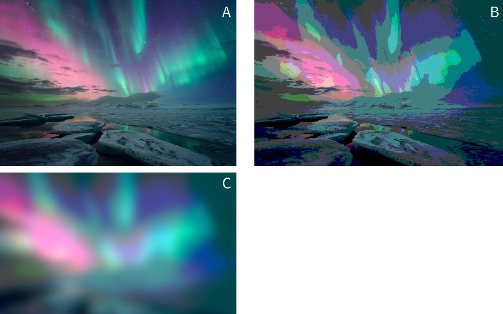

```{r include=FALSE, cache=FALSE}
knitr::opts_chunk$set(echo = TRUE, collapse=TRUE, cache=TRUE, comment=NA)
```
---
title: 'Regression in R'

---
  
```{r, include=FALSE}
knitr::opts_chunk$set(echo = TRUE, collapse=TRUE, cache=TRUE, message=FALSE)
library(tidyverse)
```


# Regression {#linear-models-simple}

#### {- .tip}
This section assumes most readers will have done an introductory statistics course and had some practice running multiple regression and or Anova in SPSS or a similar package. 


<!-- If you haven't, don't rush out to do that though XXX what should they do instead? Recommend some MOOC? XXX? -->


### Describing statistical models using formulae {- #formulae}

R requires that you are explicit about the statistical model you want to run but provides a neat, concise way of describing models, called a `formula`.  For multiple regression and simple Anova, the formulas we write map closely onto the underlying *linear model*. The formula syntax provides shortcuts to quickly describe all the models you are likely to need.

Formulas have two parts: the left hand side and the right hand side, which are separated by the tilde symbol: `~`. Here, the tilde just means 'is predicted by'. 

For example, this formula specifies a regression model where `height` is the *outcome*, and `age` and `gender` are the *predictor* variables.^[I avoid the terms dependent/independent variables because they are confusing to many students, and because they are misleading when discussing non-experimental data.]

```
height ~ age + gender
```  

There are lots more useful tricks to learn when writing formulas, which are covered below. But in the interests of instant gratification let's work through a simple example first:


### Running a linear model {-}

Linear models (including Anova and multiple regression) are run using the `lm(...)` function, short for 'linear model'.  We will use the `mtcars` dataset, which is built into R, for our first example.  

First, we have a quick look at the data. The pairs plot suggests that `mpg` might be related to a number of the other variables including `disp` (engine size) and `wt` (car weight):


```{r}
mtcars %>% 
	select(mpg, disp, wt) %>% 
	pairs
```

Before running any model, we should ask outselves: "what question we are trying to answer?" 

In this instance, we can see that both weight (`wt`) and engine size (`disp`) are related to `mpg`, but they are also correlated with one another. We might want to know, then, "are weight and engine size independent predictors of `mpg`?" That is, if we know a car's weight, do we gain additional information about it's `mpg` by measuring engine size?

To answer this, we could use multiple regression, including both `wt` and `disp` as predictors of `mpg`. The formula for this model would be `mpg ~ wt + disp`. The command below runs the model:

```{r}
lm(mpg ~ wt + disp, data=mtcars)
```

For readers used to wading through reams of SPSS output R might seem concise to the point of rudeness. By default, the `lm` commands displays very little, only repeating the formula and listing the coefficients for each predictor in the model.

So what next? Unlike SPSS, we must be explicit and tell R exactly what we want. The most convenient way to do this is to first store the results of the `lm()` function:


```{r}
m.1 <- lm(mpg ~ wt + disp, data=mtcars)
```


This stores the results of the `lm()` function in a variable named `m.1`. As an aside, this is a pretty terrible variable name — try to give descriptive names to your variables because this will prevent errors and make your code easier to read.

We can then use other functions to get more information about the model. For example:

```{r}
summary(m.1)
```

Although still compact, the `summary` function provides some familiar output, including the estimate, *SE*, and *p* value for each parameter.

Take a moment to find the following statistics in the output above:

- The coefficients and p values for each predictor
- The *R*^2^ for the overall model. What % of variance in `mpg` is explained?

Answer the original question: 'accounting for weight (`wt`), does engine size (`disp`) tell us anything extra about a car's `mpg`?'


### More on formulas {-}

Above we briefly introduced R's formula syntax. Formulas for linear models have the following structure:

```
left_hand_side ~ right_hand_side
```

For linear models *the left side is our outcome*, which is must be a continous variable. For categorical or binary outcomes you need to use `glm()` function, rather than `lm()`. See the section on [generalised linear models](glm.html)) for more details.


*The right hand side of the formula lists our predictors*. In the example above we used the `+` symbol to separate the predictors `wt` and `disp`.  This told R to simply add each predictor to the model. However, many times we want to specify relationships *between* our predictors, as well as between predictors and outcomes. 


For example, we might have an experiment with 2 categorical predictors, each with 2 levels --- that is, a 2x2 between-subjects design.

Below, we define and run a linear model with both `vs` and `am` as predictors, along with the interaction of `vs:am`. We save this model as `m.2`, and use the `summary` command to print the coefficients.


```{r}
m.2 <- lm(mpg ~ vs + am + vs:am, data=mtcars)
summary(m.2)
```


We'd normally want to see the Anova table for this model, including the F-tests:


```{r}
car::Anova(m.2)
```


But before you do too much with Anova in R [read this section](anova.html).


#### Other formula shortcuts {-}

In addition to the `+` symbol, we can use other shortcuts to create linear models.

As seen above, the colon (`:`) operator indicates the interaction between two terms. So `a:b` is equivalent to creating a new variable in the data frame where `a` is multiplied by `b`.

The `*` symbol indicates the expansion of other terms in the model. So, `a*b` is the equivalent of `a + b + a:b`.

Finally, it's good to know that other functions can be used within R formulas to save work. For example, if you wanted to transform your dependent variable then `log(y) ~ x` will do what you might expect, and saves creating temporary variables in your dataset.

The formula syntax is very powerful, and the above only shows the basics, but you can read the `formulae` help pages in RStudio for more details.


##### {- .exercise}

Run the following models using the mtcars dataset:

- With `mpg` as the outcome, and with `cyl` and `hp` as predictors

- As above, but adding the interaction of `cyl` and `hp`.

- Repeat the model above, but write the formula a different way (make the formula either more or less explicit, but retaining the same predictors in the model).


## Factors and variable codings {-}


#### {- #factors-vs-linear-inputs}

If you store categorical data as numbers (e.g. groups `1`, `2`, `3` ...) it's important to make sure your predictors are entered correctly into your models.

In general, R works in a 'regressiony' way and will assume variables in a formula are linear predictors. So, a `group` variable coded `1`...`4` will be entered as a single parameter where 4 is considered twice as large as 2, etc.

See below for example. In the first model `cyl` is entered as a 'linear slope'; in the second each value of `cyl` (4,5, or 6) is treated as a separate category. The predictions from each model could be very different:

```{r, eval=F}
linear.model <- lm(mpg ~ cyl, data=mtcars)
categorical.model <- lm(mpg ~ factor(cyl), data=mtcars)
```

In the case of different experimental groups what you would normally want is for `group` to be coded and entered as a number of categorical parameters in your model. The most common way of doing this is to use 'dummy coding', and this is what R will implement by default for [character or factor variables](#character-and-factor).

To make sure your categorical variables are entered into your model as categories (and not a slope) you can either:

- Convert the variable to a character or factor type in the dataframe or
- Specify that the variable is a factor when you run the model

For example, here we specify `cyl` is a factor within the model formula:

```{r}
lm(mpg ~ factor(cyl), data=mtcars)
```


Whereas here we convert to a factor in the original dataset:

```{r}
mtcars$cyl.factor <- factor(mtcars$cyl)
lm(mpg ~ cyl.factor, data=mtcars)
```


[Neither option is universally better, but if you have variables which are *definitely* factors (i.e. should never be used as slopes) it's probably better to convert them in the original dataframe, before you start modelling]{.admonition}


## Model specification {- #parameterisation}

It's helpful to think about regression and other statistical models as if they were machines that do work for us --- perhaps looms in a cloth factory. 
We feed the machines raw materials, and they busy themselves producing the finished cloth. The nature of the finished cloth is dependent on two factors: the raw material we feed it, and the setup and configuration of the machine itself. 

In regression (and Anova) the same is true: Our finished results are the parameter estimates the model weaves from our raw data. The pattern we see depends on the configuration of the machine, and it's important to realise the same data can provide very different outputs depending on the setup of the machine.


#### Equivalent models {-}

In some cases the 'setup' of the machine produces changes which, although they appear very different, are in fact equivalent in some sense. Let's say our weaving machine produces a lovely set of rugs, shown in the figure below:


Now imagine that we flip all the standard settings on the weaving machine. We feed the same raw materials to the loom, but the results _look_ very different:


The second set of rugs are inversions of the first, *but the patterns remain the same*. The same sort of thing happens when we recode variables before entering them in our regression models. For example:


```{r}
coef(lm(mpg ~ wt, data=mtcars))
```

We can run a completely equivalent model if we 'flip' the weight (`wt`) coefficient by multiplying by `-1`:


```{r}
mtcars$wt.reversed  <- -1 * mtcars$wt
coef(lm(mpg ~ wt.reversed, data=mtcars))
```

These models are equivalent in all the important ways: the test statistics, p values are all the same: only the sign of the coefficient for weight has changed. 


The same kind of thing happens when we choose a [different *coding scheme* for categorical variables (see section below)](#regression-coding): although the parameter estimates change when the coding format thcnages, the *underlying model is equivalent because it would make the same predictions for new data*.


#### Non-equivalent models {-}

In the case above we saw models which were equivalent in the sense that they produced identical predictions for new observations.

Now we need to stretch our rug analogy a little, but imagine the output of our machine is now an image of the northern lights, as in image A below, but that by changing some settings of the machine, we might instead produce image B:




You might reasonably ask why we would prefer image B or C to image A? The answer is that, when running statistical models, we must remember that they are always *simplifications* of reality that are (hopefully) *useful* to us. 

For example, our goal might be to use images of the northern lights to track the position of the aurora in the sky. If so, we might find that thresholding the picture in this way makes it easier to see where the centre of mass of the light is. By smoothing out many of the 'ripples' and suface level patterning in the light, the overall shape becomes clearer. And in fact this is one of the techniques computer vision systems do use to pre-process image inputs.

Likewise, we face similar problems when analysing psychological data. For example, when we measure an outcome repeatedly over a period of seconds, days or months we are probably interested in the overall *shape* of the change, rather than in the suface-level patterning of these changes. 

Let's stretch the images analogy again and simplify the image above by taking a single pixel high 'slice' through the centre of each image (A, B and C). In the figure below I've stretched these slices vertically so that you can see the banding in the colour, but each of these images is just a single pixel high:


Let's simplify this even further, and convert these images to greyscale:


We might think of these 3 images as follows:

- 'Raw' represents our raw data (image A above), and the greys represent the value of our 'outcome' (intensity of light). The x-axis in this case is position in the sky, but could just as well be time or some other continuous variable.

- 'Threshold' represents some kind of categorical model for these data (akin to image B above), in which we 'chunk' up the x-axis and make predictions for each chunk.

- 'Smooth' (akin to image C above) represents some kind of linear model with terms which represent the gradual changes in the outcome across the range of the x-axis (like [slopes or polynomial terms in regression](#polynomials)).


Because a digital image is just a list of `intensity` values for each pixel we can read the image into R and plot the raw values like any other:

```{r, fig.cap="Plot of the intensity of light in the single pixel slice from the Aurora image. Intensity of 1 corresponds to white, and 0 to black in the original image."}
intensity.vec <- as.vector(png::readPNG('media/aurora-1-px-raw.png'))

aurora.image <- data_frame(
  Intensity = intensity.vec) %>% 
  mutate(x = row_number())

aurora.image %>% 
  ggplot(aes(x, Intensity)) + 
  geom_point(size=.5)
```


We can fit linear models to these data, just like any other. So we migth start by predicting intensity with a simple slope:

```{r}
aurora.linear <- lm(Intensity ~ x, data=aurora.image)
```

And we could make predictions from this model and plot them against the original:

```{r}
aurora.image %>% 
  mutate(linear.prediction = predict(aurora.linear)) %>% 
  reshape2::melt(id.var='x') %>% 
  ggplot(aes(x, value, group=variable, color=variable)) + 
  geom_point(size=.5)
```

As we can see, our predictions are pretty terrible, because the linear model only allows for a simple slope over the range of `x`.

To improve the model, we can go in one of two ways: 

1. Fit slopes and curves for `x`
2. Break `x` up into chunks


#### Chunks {-}


```{r}
# Create a new chunked x variable (a factor)
x.in.chunks <- cut(aurora.image$x, breaks=8)

# Run a model with these chunks as a factor
aurora.chunks <- lm(Intensity ~ x.in.chunks, data=aurora.image)

# Plot the predictions again
aurora.image %>% 
  mutate(
    linear.prediction = predict(aurora.linear),
    chunked.prediction = predict(aurora.chunks)
  ) %>% 
  reshape2::melt(id.var='x') %>% 
  ggplot(aes(x, value, group=variable, color=variable)) + 
  geom_point(size=.5)
```

That's somewhat better, although we can still see that the extremes of our observed data are not well predicted by either the linear model (the flat line) or the chunked model.

[Try cutting the `x` variable into more chunks. What are the pros and cons of doing this? How many chunks would you need to reproduce the original data faithfully?]{.exercise}


#### Slopes and curves {-}

An alternative strategy at this point is to try and fit smooth curves through the data. One way of doing this ([explained in greater detail in the section on polynomials](#polynomials)) is to fit multiple parameters to represent the initial slope, and then changes in slope, across the values of `x`. In general, we need to fit one parameter for each change in 'direction' we want our cuve to take. 

For example, we can fit a curve with 3 changes of direction by fitting the 'third degree' polynomial:

```{r}
aurora.curve <- lm(Intensity ~ poly(x, 3), data=aurora.image)

aurora.image %>% 
  mutate(
    curve.prediction = predict(aurora.curve)
  ) %>% 
  reshape2::melt(id.var='x') %>% 
  ggplot(aes(x, value, group=variable, color=variable)) + 
  geom_point(size=.5)
```


Or we could increase the number of parameters in our curve to allow a tighter fit with the raw data and plot all the models together:


```{r}
aurora.curve <- lm(Intensity ~ poly(x, 7), data=aurora.image)

all.predictions <- aurora.image %>% 
  mutate(
    linear.prediction = predict(aurora.linear),
    chunked.prediction = predict(aurora.chunks),
    curve.prediction = predict(aurora.curve)
  ) %>% 
  reshape2::melt(id.var='x')

all.predictions %>% 
  ggplot(aes(x, value, group=variable, color=variable)) + 
  geom_point(size=.5)
```

We can see that this curved model is a better approximation to the raw data than our 'chunked' model in some places (e.g. x = 100), but worse in others (e.g. x = 625). Overall though, the R^2^ is much higher for the curves model here:


```{r}
summary(aurora.chunks)$r.squared
summary(aurora.curve)$r.squared
```

And this is the case even though our model contains only 8 parameters, and so is just as parsimonious as the chunked model above.

```{r}
# count the number of parameters in the chunked and curved models
length(coef(aurora.chunks))
length(coef(aurora.curve))
```

[Try to plot a curve that fits even more closely to the data. There are 1200 pixels in our original image. How many parameters would you need for the model to fit the image exactly? What happens in practice if you try and fit this model?]{.exercise}

For fun, we can even plot our data back in image form and see which is closest to matching the original:

```{r, echo=F}
all.predictions %>% 
  mutate(variable=stringr::str_replace_all(variable, "Intensity", "raw.image")) %>% 
  mutate(variable=forcats::fct_rev(variable)) %>% 
  rename(Intensity=value) %>% 
  ggplot(aes(x, factor(1), fill=Intensity)) + 
  geom_raster() + 
  facet_wrap(~variable, ncol=1) + 
  xlab("") + ylab("") + guides(fill=F) + 
  scale_x_continuous(breaks=NULL) + 
  scale_fill_gradient(low="black", high="white") + theme_minimal() +
  theme(axis.title.y=element_blank(),
        axis.text.y=element_blank(),
        axis.ticks.y=element_blank())
```

[There is no 'right answer' here: each model has pros and cons. You need to think about what the purpose of your model is, how you want to simplify your data, and then set up your models appropriately.]{.admonition}


### Effect/dummy coding and contrasts {- #regression-coding}

TODO: Explain this:

```{r}
options(contrasts = c("contr.treatment", "contr.poly"))
lm(mpg~factor(cyl), data=mtcars)

options(contrasts = c("contr.sum", "contr.poly"))
lm(mpg~factor(cyl), data=mtcars)
```


### Centering (is often helpful) {- #centering}

When interpreting regression coefficients, and especially when interactions are present in a model, it's often overlooked that the regression parameters are the effect on the outcome of a 1-unit change in the predictor, *when all the other predictors are zero*. This applies to the intercept too: it is the predicted value of the outcome when *all* of the predictors are zero. 

This is unhelpful because it makes the intercept mostly meaningless, and the other coefficients harder to interpret.

It's often a good idea to *center* your predictors so that you can interpret the intercept of the model as the average of your sample.

<!-- TODO FLESH THIS OUT -->


### Scaling inputs {- #scaling-regression-inputs}


Interpreting regression coefficients requires that we think in the *units* of the predictor.

For example, if we include 'age in years' in our model, then this `yob` coefficient gives us the change in the outcome for each additional year.

However, we're often not interested in the effect of a single year. If we are dealing with the effect of age in the general population, we're unlikely to care about the effect of 1 year, and it might be more useful and natural to think about 10-year differences in age. In contrast, if our research is on adolescence, then the changes of the course of a year might be too crude, and we may want to think about changes over months instead.


It's important to realise there is no general or 'correct' solution to this problem. Regression models don't care about the scale of our variables (within limits), but we do need to make choice about how we scale inputs. These choices should aim to 

- make regression coefficients easily interpretable and
- make results comparable across studies

These two goals will not always be 100% aligned, and there will be tradeoffs needed as you select your strategy, which will normally be one of:

1. Putting coefficients on a 'natural' scale or relate to meaningful quantities

2. Standardising coefficients.


##### Using a 'natural' scale {-}

This will often mean just leaving your predictors 'as-is', but it might also mean dividing your predictor by some number to put it into more convenient units. For example, dividing age in years by 10 would mean that you can interpret the coefficient as the change over a decade, which might be easier to think about. 


##### Standardising {-}

Gelman [@gelman2008scaling] recommends standardising coefficients by centering and dividing by two standard deviations. This can be useful because binary variables like sex (male/female) will then be on a *similar* scale to numeric inputs.

However, be cautious when standardising. You will sometimes see people interpret standardised coefficients in terms of 'relative importance' of the predictors.  For example, they might say that if $\beta^1 = .2$ and $\beta^2 = .4$ then $\beta^2$ is twice as important as $\beta^$. Although this is appealing, it's not always valid. 

The main problem is that you don't always know whether you have a full range of values of predictors in your sample. For example, imagine a case where the a regression coefficient for `age` was linear, and = .5 in a sample from the general population.

```{r, include=F}
set.seed(1234)
incomes <- data_frame(age = round(rnorm(1000, 40, 15)),
	gender = sample(0:1, 1000, replace=T), 
	income = round(rnorm(1000,  30000, 1000) + 30*age + 1000 * gender)) %>%
		mutate(gender=factor(gender, labels=c("F", "M")))
```

We can plot these data to show the effect of age, and gender:

```{r}
ggplot(incomes, aes(age, income, group=gender, color=gender)) + geom_point() + geom_smooth(se=F, method="lm")
```

Older people earn more than younger people, and men earn slighly more than women (in this simulated dataset), but this gender gap doesn't change with age.

We can model this and print the effects of `age` and `gender`:


```{r}
m1 <- lm(income~age+gender, data=incomes)
coef(m1)
```

And we can standardize these effects using the `stadardize` function:

```{r}
coef(arm::standardize(m1))
```

Based on these standardised coefficients we migth say that age and gender are of roughly equal importance in predicting income.

If we re-fit the model on a subset of the data, for example only individuals under 40, the regression coefficients won't change much because the effect was constant across the range of ages:


```{r}
younger.incomes <- incomes %>%
	filter(age<40)

m2 <- lm(income~age+gender, data=younger.incomes)
coef(m2)
```

But, the standardised coefficients *do* change, because we have restricted the range of ages in the sample:


```{r}
coef(arm::standardize(m2))
```

The standardised effect of `age` is now roughly half that of `gender`.


[The take home message here is that standardisation can be useful to put predictors on a similar scale, but it's not a panacea and can't be interpreted as a simple measure of 'importance'. You still need to think!]{.admonition}


### Alternatives to rescaling {-}

A nice alternative to scaling the inputs of your regression is to set aside the raw coefficients and instead make [predictions for values of the predictors that are of theoretical or practical interest](#predictions-and-margins). The section on [predictions and marginal effects](#predictions-and-margins) has lots more detail on this.


### What next {-}

***It is strongly recommended that you read the [section on Anova](anova.html) before doing anything else.***

As noted above, R has a number of important differences in it's default settings, as compared with packages like Stata or SPSS. These can make important differences to the way you interpret the output of linear models, especially Anova-type models with categorical predictors.


