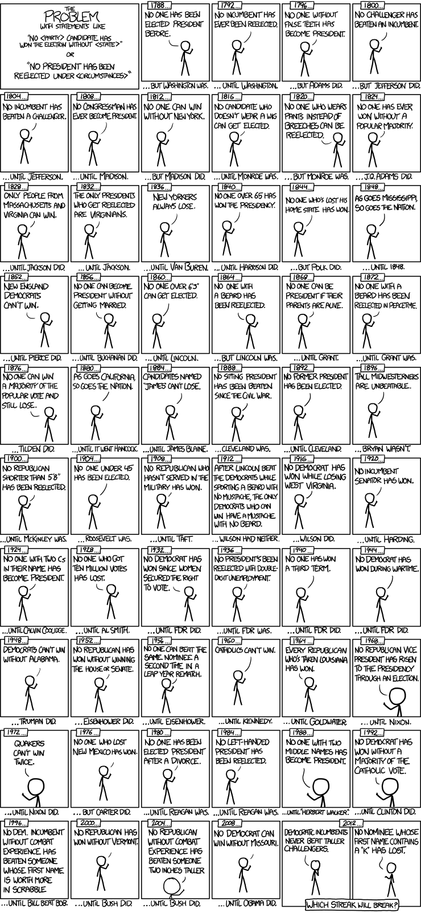

---
title: 'Model comparison and selection'
---

# Building and choosing models {#comparison-and-selection}

### Like maps, models are imperfect but useful {-}

Maps are always imperfect, and the decisons we make as we build them entail
different visions of how the world is.

For example, when making maps cartographers must decide at what size to print
it, and how much detail to include. The smaller the map the more convenient it
is to carry, but a smaller map can never represent reality as accurately.
Similarly, we must leave out details to make the map practical to use; but
_what_ we omit depends on the planned use of the map.

Stretching he analogy a little, we could evaluate maps according to their
performance: did the map help us navigate to a desired location, for example?
This is likely to be a function of two things:

-   _Veracity_: that is, how faithfully does the map represent the 'reality' of
    the terrain it covers?
-   _Simplicity_: does the map include details which are ephemeral, or irrelvant
    to the task in hand?

At one extreme, we might take an aerial photo of a city, which would accurately
represent the terrain, but would include many details which are ephemeral or
transient and not necessary to the task of, for example, finding the city's
railway station. Indeed the photo is literally a snapshot of the city on a given
day, and some elements might be unhelpful in navigating the city several months
later; the photo might include temporary roadworks, for example, which could
lead the reader to assume a street was blocked to traffic when this was not
normally the case. At the other extreme, we might consider a highly stylised
cartoon map of the same city, which includes onlu major roads and the station
itself, but none of the secondary roads or other landmarks. Here the map is so
lacking in detail that it may be hard to orient ourselves to the actual terrain.

Statistical models are not exactly like maps, but we can evaluate them using
similar criteria. A good model enables the user to make sense of the data they
collect (i.e. navigate the city) and this involves making reliable predictions.
Reliable predictions are possible when the model accurately represents the
underlying reality of a phenomena, but also when the model is simple enough to
ignore ephemeral or irrelevant information.

Evaluating and selecting statistical models involves just this kind of tradeoff
between _veracity_ and _simplicity_.

To stretch the analogy above, when we collect data, we are taking a photo of the
city, making a snapshot of a given process at a particular place and time. This
snapshot (hopefully) contains valuable information about how the process works
in general, but it also includes noise and irrelevant information which could
distract us, preventing us from using the data to accurately predict the future.

### Overfitting/underfitting {- #over-fitting}

To ~~steal~~use a different analogy, imagine you want to predict who will win
the next US presidential election:

In total there have only been 57 presidential elections and 44 presidents in the
US, which isn't a lot of data to learn from. The point of the cartoon is that if
we try and include ephemeral predictors like beards and false teeth then the
space of possible combinations becomes huge. This means that some of these
combinations will start to fit the data because of chance variations, and not
because they represent some fundamental aspect of the process generating the
outcome (election wins).

If you allow statistical models to expand in this way (that is, driven only by
patterns in the data you have) then you will find that, inevitably, the model
fits the data you have, but the you won't be able to predict _new_ data at all.

This is one of the reasons why we prefer simpler models, all other things being
equal. It also explains why practices like stepwise regression, where we add or
remove variables depending on whether they are 'statistically significant',
[are almost always a bad idea](http://www.stata.com/support/faqs/statistics/stepwise-regression-problems/).
We should only accept a complex model (e.g. one including false teeth as a
predictor of the presidency) if we have enough evidence to be confident this
will predict new data.

### Choosing the 'right variables' {- #variable-selection}

As an aside, if you do find yourself in a situation with a large number of
predictors and hope to build a simpler model --- either with the goal of
prediction or theory development --- then it's hopefully obvious from the
discussion above that simply dropping or selecting predictors based on _p_
values is unlikely to lead to good science. Not only will you tend to over-fit
the data you have, but you may also discount valid predictor variables because
of problems like multicollinearity (correlations between predictors).

In other disciplines where inference from observational data are more common
(e.g. ecology and biological anthropolgy) the concepts of model averaging or
multimodal inference have gained currency, and may be be useful to applied
psychologists. The core concept is that if we have several models, all of which
are approximately as good as each other, then we should make predictions and
inferences by averaging across the models, weighting each model by how well it
fits the data: that is, we give the most weight to the best fitting model, but
don't completely discount other models which fit almost as well.

See @mcelreath2016rethinking, chapter 6, for a good introduction.
[This video explains the concept well](https://www.youtube.com/watch?v=LQb7l5IfS0s).
The R package
[MuMln package](https://cran.r-project.org/web/packages/MuMIn/index.html)
implements most of the methods needed. See also this
[interesting post on model selection problems](https://www.r-bloggers.com/model-selection-and-multi-model-inference/).
