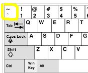

## Tips and tricks with RMarkdown {- #rmarkdown-tricks}

TODO, cover

- Using `pander::pandoc.table` to format tables nicely
- Rounding of values with `sprintf`

- Accessing `coefficients()`
- Using `broom` to tidy model results

- Using bibtex and citing in text

- Calculate VPC/ICC from an lmer models using `model %>% summary %>% as.data.frame()$varcor`
- Hint at things hidden in R objects (e.g. formula in the `lm` object). Using @ and $ to autocomplete and find things

## Finding the backtick on your keyboard {- #backtick-location}

