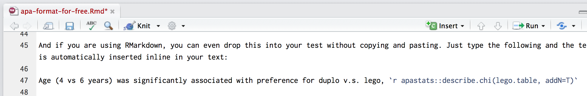

```{r, include=FALSE}
knitr::opts_chunk$set(echo = TRUE, collapse=TRUE, cache=TRUE)
library(tidyverse)
library(lmerTest)
library(apastats)
```


# (PART) Sharing {-}

# Sharing and publishing your work {#sharing-and-publication}

Have you ever manually copied hundres of numbers from SPSS tables to a MS Word document? If so, rejoice that you'll never have to again!

R and RMarkdown provide many useful features when formatting results for publication. The key steps in the process are to:

1. [Extract](#extract-results-from-models) results from models (normally into a dataframe)
2. Select/filter/summarise/combine or otherwise [process your results](#process-model-results)
3. Output to a [plot](#graphics), [table](#output-tables), or [inline in your text](#apa-output) (or save for later)


## Extracting results from models {- #extract-results-from-models}


One of the nice things about R is that the `summary()` function will almost always provide a concise output, showing the key features of an model you have run.

However, this text output isn't suitable for publication, and can even be too verbose for communicating with colleagues. Often, when communicating with others, you want to focus in on the important details from analyses and to do this you need to extract results from your models.

Thankfully, there is almost always a method to extract results to a [`dataframe`]( #datasets-dataframes). For example, if we run a linear model:


```{r}
model.fit <- lm(mpg~wt+disp, data=mtcars)
summary(model.fit)
```


We can extract the parameter table from this model by saving the `summary()` of it, and then using the `$` operator to access the `coefficients` table (actually a matrix), which is stored within the summary object. In the example below, we also convert this to a dataframe:


```{r}
model.fit.summary <- summary(model.fit)
as.data.frame(model.fit.summary$coefficients)
```


It's actually a useful trick to learn how to 'poke around' inside R objects using the `$` and `@` operators (if you want the gory details of how these operators work, [start with this guide](http://adv-r.had.co.nz/OO-essentials.html) to object systems in R).

In the video below, I use RStudio's autocomplete feature to find results buried within a `lm` object:


<iframe src="https://player.vimeo.com/video/225529842" width="862" height="892" frameborder="0"></iframe>


For example, we could write the follwing to extract a table of coefficients, test statistics and *p* values from an `lm()` object (this is shown in the video:

```{r}
model.fit.summary <- summary(model.fit)
model.fit.summary$coefficients %>% 
  as.data.frame()
```


```{r}
model.fit %>% broom::tidy()
```


- Use `broom`


- Hint at the other things hidden in R objects (e.g. the formula and rsquared value in the `lm` object). Using @ and $ to autocomplete and find things


## Process your results {- #process-model-results}

- Calculate VPC/ICC from an lmer models using `model %>% summary %>% as.data.frame()$varcor`


## Printing tables {- #output-tables}


## APA formatting for free {- #apa-output}


A neat trick to avoid [fat finger errors](https://en.wikipedia.org/wiki/Fat-finger_error) is to use functions to automatically display results in APA format. Unfortunately, there isn't a single package which works with all types of model, but it's not too hard switch  between them.


### Chi^2^ {-}

For basic stats the `apa::` package is simple to use. Below we use the `apa::chisq_apa()` function to properly format the results of our chi^2^ test ([see the full chi^2^ example]#crosstabs)):

```{r, include=F}
lego.duplo.df <- readRDS("lego.RDS")
lego.table <- with(lego.duplo.df, table(age, prefers))
```


```{r}
lego.test <- chisq.test(lego.table)
lego.test
```


And we can format in APA like so:

```{r}
apa::apa(lego.test, print_n=T)
```


or using `apastats::` we also get Cramer's V, a measure of effect size:

```{r}
apastats::describe.chi(lego.table, addN=T)
```


#### Inserting results into your text {#inline-apa-format}

If you are using RMarkdown, you can drop formatted results into your text without copying and pasting. Just type the following and the chi^2^ test result is automatically inserted inline in your text:



[Age (4 vs 6 years) was significantly associated with preference for duplo v.s. lego, `r apastats::describe.chi(lego.table, addN=T)`]{.apa-example}


### T-test {-}

```{r}
# run the t test
cars.test <- t.test(wt~am,data=mtcars, var.equal=T)
cars.test
```

And then we can format as APA
```{r}
apa::apa(cars.test)
```

[American cars were significantly heavier than foreign cars, 
mean difference=`r round((cars.test$estimate[1]-cars.test$estimate[2])*1000)`lbs; 
`r apa::apa(cars.test)`]{.apa-example}


### Anova {-}

```{r}
mpg.anova <- car::Anova(lm(mpg~am*cyl, data=mtcars))

library(apastats)
# extract and format main effect
describe.Anova(mpg.anova, term="am")

# and the interaction
describe.Anova(mpg.anova, term="am:cyl")
```

[There was no interaction between location of manufacture and number of cylinders, `r describe.Anova(mpg.anova, term="am:cyl")`, but there was a main effect of location of manufacture, `r describe.Anova(mpg.anova, term="am:cyl")`, such that US-made cars had significantly higher fuel consumption than European or Japanese brands (see [Figure X or Table X])]{.apa-example}


<!-- 
TODO add formatting of effect size estimates here

 -->


### Multilevel models {-}


If you have loaded the `lmerTest` package `apastats` can output either coefficients for single parameters, or F tests:

```{r}
sleep.model <- lmer(Reaction~factor(Days)+(1|Subject), data=lme4::sleepstudy)

#a single coefficient (this is a contrast from the reference category)
describe.glm(sleep.model, term="factor(Days)1")

# or describe the F test for the overall effect of Days
describe.lmtaov(anova(sleep.model), term='factor(Days)')
```


[There were significant differences in reaction times across the 10 days of the study, `r describe.lmtaov(anova(sleep.model), term='factor(Days)')` such that reaction latencies tended to increase in duration (see [Figure X]).]{.apa-example}


### Publication { #publication}


- Save graphics to .pdf format. 

- Use RMarkdown documents to create supplementary online files or appendices for published papers. 

- Wait until you're an expert to [try writing the whole paper in RMarkdown (e.g. with citeproc)](https://kieranhealy.org/blog/archives/2014/01/23/plain-text/).


