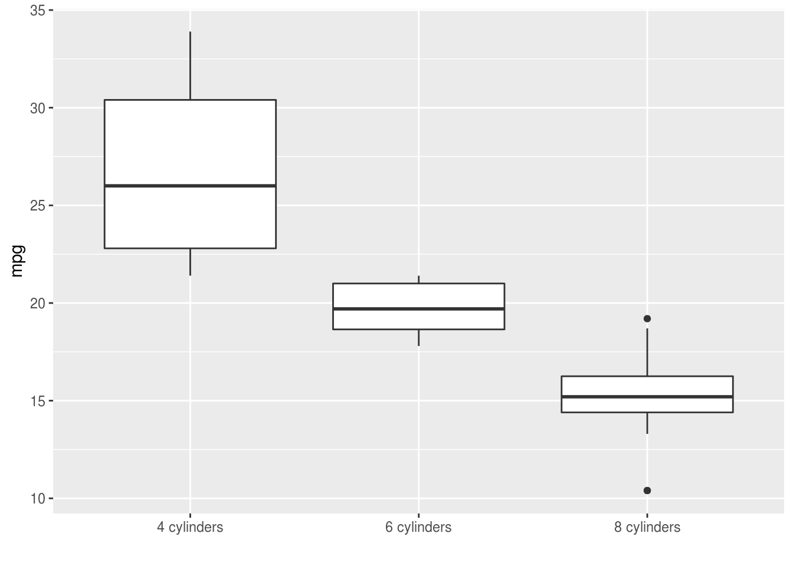

---
title: 'Working with character strings'
---

## Working with character strings {- #string-handling}


### Searching and replacing

If you want to search inside a string there are lots of useful functions in the
`stringr::` library. These replicate some functionality in base R, but like
other packages in the 'tidyverse' they tend to be more consistent and easier to
use. For example:


```r
cheese <- c("Stilton", "Brie", "Cheddar")
stringr::str_detect(cheese, "Br")
[1] FALSE  TRUE FALSE
stringr::str_locate(cheese, "i")
     start end
[1,]     3   3
[2,]     3   3
[3,]    NA  NA
stringr::str_replace(cheese, "Stil", "Mil")
[1] "Milton"  "Brie"    "Cheddar"
```

### Using `paste` to make labels {- #paste}

Paste can combine character strings with other types of variable to produce a
new vector:


```r
paste(mtcars$cyl, "cylinders")[1:10]
 [1] "6 cylinders" "6 cylinders" "4 cylinders" "6 cylinders" "8 cylinders"
 [6] "6 cylinders" "8 cylinders" "4 cylinders" "4 cylinders" "6 cylinders"
```

Which can be a useful way to label graphs:


```r
mtcars %>%
  ggplot(aes(paste(mtcars$cyl, "cylinders"), mpg)) +
  geom_boxplot() + xlab("")
```



### Fixing up `variable` after melting {- #separate-and-extract}

In this example `melt()` creates a new column called `variable`.


```r
sleep.wide %>%
  melt(id.var="Subject") %>%
  arrange(Subject, variable)  %>%
  head
  Subject variable    value
1       1    Day.0 249.5600
2       1    Day.1 258.7047
3       1    Day.2 250.8006
4       1    Day.3 321.4398
5       1    Day.4 356.8519
6       1    Day.5 414.6901
```

However the contents of `variable` are now a character string (i.e. a list of
letters and numbers) rather than numeric values (see
[column types](#factors-and-numerics)) but in this instance we know that the
values `Day.1`, `Day.2`... are not really separate categories but actually form
a linear sequence, from 1 to 9.

We can use the `extract` or `separate` functions to split up `variable` and
create a numeric column for `Day`:


```r
sleep.long %>%
  separate(variable, c("variable", "Day")) %>%
  mutate(Day=as.numeric(Day)) %>%
  arrange(Subject) %>%
  head %>% pander
```


----------------------------------
 Subject   variable   Day   value 
--------- ---------- ----- -------
    1        Day       0    249.6 

    1        Day       1    258.7 

    1        Day       2    250.8 

    1        Day       3    321.4 

    1        Day       4    356.9 

    1        Day       5    414.7 
----------------------------------

See the user guide for `separate` and `extract` for more details.

[If you are familiar with
[regular expressions](https://code.tutsplus.com/tutorials/you-dont-know-anything-about-regular-expressions-a-complete-guide--net-7869)
you will be happy to know that you can use regex to separate variables using
`extract` and `separate`.
[See this guide for more details on how `separate` and `extract` work](https://rpubs.com/bradleyboehmke/data_wrangling)]{.explainer}
